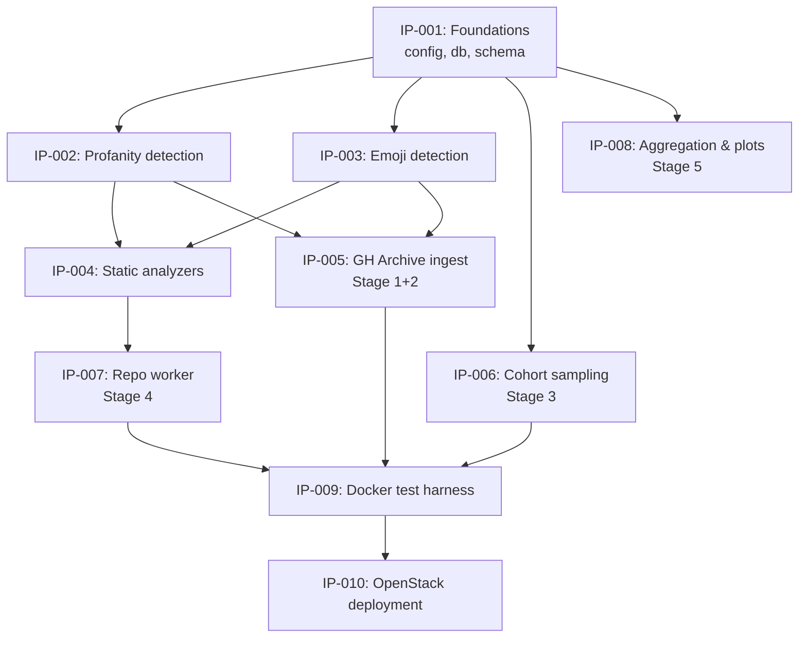

# Implementation Plan

This plan decomposes [`DRAFT.md`](DRAFT.md) into discrete implementation modules. Each module becomes its own implementation proposal under [`proposals/posts/`](proposals/) (template: [`proposals/.template.md`](proposals/.template.md)).

The split is driven by three constraints:

1. **Testability in isolation** — each module must be unit-testable without the others running
2. **Dependency layering** — foundations → signals → pipeline stages → harness → deployment
3. **Parallel work** — after foundations land, multiple modules proceed independently

## Package naming

The draft refers to the Python package as `lab/`. The actual package in this repository is `oss_profanity/`. All proposals use `oss_profanity/` as the root.

## Two first-class text signals

The pipeline measures **two independent text-level signals** on every commit message, source comment, and identifier: **profanity** (IP-002) and **emoji** (IP-003). They are designed as sibling modules with matching contracts:

- Both expose a scan/extract function that returns a list of hits from a string
- Both are consumed at the same two points — Stage 1+2 ingest (commit messages) and Stage 4 source-tree walk (comments + identifiers)
- Both write into **parallel schema fields** — `commit_stats.profanity_*` ↔ `commit_stats.emoji_*`, `code_analysis.comment_profanity_hits` ↔ `code_analysis.comment_emoji_hits`, and so on
- Both are correlated against quality metrics **independently** in Stage 5 — never combined into a single "affect score"

Treating them as siblings from the start means IP-004 (analyzers) and IP-005 (ingest) don't need special-case code for one vs the other, and IP-008 (aggregation) can produce profanity and emoji reports from the same code path.

## Module → proposal map

| IP  | Module                    | Draft §     | Depends on                 | Parallel with   |
|-----|---------------------------|-------------|----------------------------|-----------------|
| 001 | Foundations               | 4.2, 4.3    | —                          | —               |
| 002 | Profanity detection       | 5.5         | 001                        | 003             |
| 003 | Emoji detection           | 5.6         | 001                        | 002             |
| 004 | Static analyzers          | 5.4         | 001, 002, 003              | 005, 006        |
| 005 | GH Archive ingest         | 5.1         | 001, 002, 003              | 004, 006        |
| 006 | Cohort sampling           | 5.2         | 001                        | 004, 005        |
| 007 | Repo worker               | 5.3         | 001, 002, 003, 004         | —               |
| 008 | Aggregation & plots       | 9           | 001                        | 009, 010        |
| 009 | Docker test harness       | 6           | 002, 003, 004, 005, 007    | 010             |
| 010 | OpenStack deployment      | 7           | 009                        | 008             |

## Dependency graph

---

## IP-001: Foundations

**Modules:** `oss_profanity/config.py`, `oss_profanity/db.py`

The shared plumbing every other module imports.

**Scope:**

- Tunables: MongoDB URI, scratch path, ingest date range, worker concurrency, bot regex, repo size cap, per-repo timeout, top-N caps (`EMOJI_TOP_N=20`, `SAMPLE_PROFANE_N=5`)
- Env-var driven (`MONGO_URI`, `WORKER_CONCURRENCY`, `GHA_START`, `GHA_END`, …) with sane defaults for local Docker
- MongoDB client singleton + the `repos` collection accessor
- `claim_next_repo(worker_id)` — atomic `find_one_and_update` with sort by `profanity_rate` desc (interesting-first ordering)
- `reclaim_stale(ttl=20min)` — rescue claims whose worker died
- `mark_failed(repo_id, reason)` helper
- Index creation:
  - `(status, commit_stats.profanity_rate)` — primary claim index
  - `(status, commit_stats.emoji_rate)` — secondary, for emoji-cohort slicing in IP-008
- Typed document schema (dataclass or `TypedDict`) documenting **both signals in parallel**:
  - `commit_stats`: `total_commits_in_window`, `profanity_hits`, `profanity_rate`, `emoji_hits`, `emoji_rate`, `emoji_commits`, `emoji_top`, `sample_profane_messages`, …
  - `code_analysis`: `comment_profanity_hits`, `identifier_profanity_hits`, `comment_emoji_hits`, `identifier_emoji_hits`, `emoji_top`, linter counts, lizard metrics

**Deliverable test:** round-trip a fake repo doc through insert → claim → done, assert status transitions and that parallel profanity/emoji fields round-trip.

---

## IP-002: Profanity detection

**Module:** `oss_profanity/profanity.py`

One of two sibling text signals (with IP-003). Text-level profanity scoring used by ingest (commit messages) and the worker (source comments + identifiers).

**Scope:**

- Load LDNOOBW word lists from `ldnoobw/` (28 languages, one file per ISO code), lowercased sets
- Initialize `better-profanity` for English obfuscation handling
- `detect_language(text) -> str` via `langdetect` with deterministic seed; fallback to `"en"` for short / failing inputs
- `scan(text, lang="en") -> list[str]` — tokenize, check against English profanity and the language-specific set, return sorted unique hits
- Severity scoring TBD — DRAFT mentions `severity_sum` but doesn't define it (**open question for the proposal**)

**Contract alignment with IP-003:** both `profanity.scan()` and `emoji_scan.extract()` take a string, return a list of hits. Callers in IP-004 and IP-005 can invoke them uniformly.

**Deliverable test:** golden file of messages in en/ru/sk/de with expected hit lists.

---

## IP-003: Emoji detection

**Module:** `oss_profanity/emoji_scan.py`

The second first-class text signal. Parallels IP-002 in structure so that callers treat the two identically.

**Scope:**

- `extract(text) -> list[str]` — ordered list of emoji found, using the [`emoji`](https://pypi.org/project/emoji/) package's `emoji_list` (Unicode-correct, handles ZWJ compounds like 👨‍💻, strips skin-tone modifiers and VS-16 so tonal variants collapse to the base glyph for counting)
- `count(text) -> int` — convenience wrapper for `emoji.emoji_count`
- No shortcode expansion — `:rocket:` stays as text and is **not** counted. We count only rendered Unicode emoji because shortcode rendering is a platform artifact (GitHub, Slack) rather than developer intent. This is a design decision, not an oversight; document it in the proposal.
- No sentiment classification. Emoji are a **usage signal**, not an affect signal (🚀 usually means "release", 🐛 means "bugfix", 💩 is sarcasm; we don't try to decode intent)
- Identifier scanning is cheap and valid (PEP 3131, ECMAScript allow emoji in identifiers). Keep it — if real data shows consistently zero, IP-008 can drop the field from reports

**Contract alignment with IP-002:** `extract()` returns a list of hits just like `profanity.scan()`. Call sites treat them symmetrically.

**Open questions for the proposal:**

- Do we store both `emoji_commits` (count of commits containing ≥ 1 emoji) and `emoji_hits` (total occurrences)? DRAFT schema includes both — confirm both carry analytical weight
- `emoji_top` cap: DRAFT picks 20, but a repo with heavy emoji use may exceed this in commits alone. DRAFT already stores separate `emoji_top` under `commit_stats` (messages) and `code_analysis` (source) — confirm the split is sufficient

**Deliverable test:** golden file with plain text, single emoji, ZWJ compound, skin-tone variant, and emoji-in-identifier, with expected extraction results.

---

## IP-004: Static analyzers

**Module:** `oss_profanity/analyzers.py`

Language-dispatched code quality measurement. Runs on a checked-out repo; never builds. **Consumes both signals** (IP-002 and IP-003) through a single source-tree walk.

**Scope:**

- `detect_primary_language(repo_dir)` — file-extension histogram, pick the dominant language
- `scan_source_tree(repo_dir)` — walk files once, skip `node_modules/`, `vendor/`, `.git/`, `dist/`, `build/`, minified files, files > 1 MB. For each comment and identifier extracted:
  - Feed to `profanity.scan()` → `comment_profanity_hits`, `identifier_profanity_hits`
  - Feed to `emoji_scan.extract()` → `comment_emoji_hits`, `identifier_emoji_hits`, and accumulate per-glyph counts into a Counter, pruned to top 20 before return
  - Single pass; no repeated I/O per signal
- Lizard wrapper — always runs, parses XML output into `lizard_avg_ccn`, `lizard_max_ccn`, `lizard_functions`
- Ruff wrapper — Python only, parses JSON output, counts issues, normalizes per KLOC
- ESLint wrapper — JS/TS only, runs with a baseline config at `/opt/baseline-eslint.json`, parses JSON output, counts issues, normalizes per KLOC
- All subprocess calls wrapped with timeouts (120s for lizard/ruff, 180s for eslint)
- `run_all(repo_dir, primary_lang) -> dict` — single entrypoint returning the full `code_analysis` sub-document (both signals + linter counts + lizard metrics)

**Deliverable test:** fixture repos (tiny Python, tiny JS, tiny polyglot) with known expected outputs. Fixtures must include at least one comment that contains **both** a profane word and an emoji to confirm both signals land in their correct fields from a single walk.

---

## IP-005: GH Archive ingest (Stage 1+2)

**Module:** `oss_profanity/archive_ingest.py`

Downloads 744 hourly `.json.gz` files for the configured window and upserts per-repo commit statistics for **both signals**.

**Scope:**

- URL generation for the date range
- `multiprocessing.Pool(4)` download workers writing to `/data/archive_raw/` with HTTP GET + resume
- `multiprocessing.Pool(6)` parse workers — `orjson` line-streaming, filter to `PushEvent`, drop bots by regex
- Per-commit: language detection → `profanity.scan(message, lang)` + `emoji_scan.extract(message)` → single atomic upsert (see DRAFT §5.1 for the exact payload)
  - `$inc` accumulates both scalar counters (`profanity_hits`, `emoji_hits`, `emoji_commits`) and per-glyph counters on dotted paths (`commit_stats.emoji_top.<glyph>`)
  - `$setOnInsert` handles first-seen metadata
  - `$addToSet` tracks unique authors
  - Bounded sample storage: at most 5 profane messages per repo (capped via `sample_profane_messages.4.$exists` guard)
- `ingest_progress` collection — one doc per hourly file; reruns skip completed entries
- Final one-shot pass per doc:
  - Compute `profanity_rate = profanity_hits / total_commits_in_window`
  - Compute `emoji_rate = emoji_hits / total_commits_in_window`
  - Prune `emoji_top` to the 20 most-frequent glyphs (bounds per-doc size when heavy emoji users rack up hundreds of distinct glyphs)

**Deliverable test:** feed 1 hour of real archive data; assert repo count, at least one non-zero `profanity_hits`, and at least one non-zero `emoji_hits` (commit messages in 2020-06 are emoji-rich enough that this should always trip).

---

## IP-006: Cohort sampling (Stage 3)

**Module:** `oss_profanity/sampling.py`

One-shot script that flips a cohort from `status="skipped"` to `status="pending"` for the workers to pick up.

**Scope:**

- Default-skip everything with `status="seen"` (so the claim query doesn't see them)
- Cohort A: any profanity + ≥ 20 commits → top 750
- Cohort B: zero profanity + ≥ 20 commits → 750 matched on commit-count distribution
- Flip both cohorts to `status="pending"`
- Report cohort sizes and a histogram of commit-count distribution so skew is visible
- Idempotent — re-running does not double-promote

**Why emoji cohorts aren't sampled here:** sampling is the expensive step — it gates the entire 36-way worker run. Adding a third/fourth sample (high/low emoji) would either double the worker budget or halve the profanity cohort. Instead, IP-008 slices emoji cohorts **post-hoc** from the same done set. This is possible because emoji and profanity are reasonably independent distributions; every repo that gets deep-analyzed has full data for both signals.

---

## IP-007: Repo worker (Stage 4)

**Module:** `oss_profanity/repo_worker.py`

The main loop that runs 12× per worker host (36 concurrent repos across three hosts).

**Scope:**

- Worker ID = `{hostname}-pid-{pid}`
- Claim loop using primitives from IP-001
- Partial clone: `git clone --filter=blob:none --no-checkout` → `rev-list -1 --before=2020-07-01` → `checkout SHA`
- All git subprocess calls wrapped with `timeout=300`
- GitHub API size pre-check — skip repos reported > 2 GB (saves clone time)
- 10-minute hard cap per repo (`with timeout(600):`)
- Invokes `detect_primary_language` + `analyzers.run_all` (which already covers both signals — worker is signal-agnostic)
- Writes `code_analysis` + `status=done` + `processing_time_sec`
- `SkipRepo` / timeout / generic exception all flow to `mark_failed` with classified reason
- `finally: shutil.rmtree` on the clone dir, always
- Stale-claim reclamation when the pending queue drains (worker crashed mid-repo)

**Deliverable test:** run against 5 known-small repos; assert all reach `done` with populated `code_analysis` including non-null emoji fields and profanity fields.

---

## IP-008: Aggregation & plots (Stage 5)

**Module:** `oss_profanity/analyze_results.py`

Read-only consumer of the `repos` collection. Produces the talk's deliverables **symmetrically for both signals** so profanity and emoji each get the same treatment.

**Scope:**

- Distributions (one per signal):
  - `commit_profanity_distribution.csv` + `.png`
  - `commit_emoji_distribution.csv` + `.png`
- `language_breakdown.csv` + `.png` — profanity rate and emoji rate per detected human language, overlaid
- Quality correlations (one per signal):
  - `profanity_vs_quality.csv` + `.png` — scatter of `profanity_rate` vs `ruff_issues_per_kloc` + `lizard_avg_ccn`; Spearman correlation + 95% CI
  - `emoji_vs_quality.csv` + `.png` — same shape for `emoji_rate`
- `cohort_comparison.csv` — Mann-Whitney U between (a) profane vs clean cohorts (from IP-006) and (b) high-emoji vs low-emoji cohorts sliced **post-hoc** from the done set, on each quality metric
- `top_emoji.csv` + `.png` — global top 50 emoji in commit messages vs in source comments, side-by-side (expect very different distributions)
- `top_offenders.md` — 10 most profane commits, asterisk-redacted
- `sample_repos.md` — qualitative case studies across the 2×2×2 (profanity × emoji × quality)

Deliberately written last, after real data shape lands.

---

## IP-009: Docker test harness

**Files:** `docker-compose.yml`, `Dockerfile`, `oss_profanity/tests/test_smoke.py`

The gate that must be green before anything ships to OpenStack.

**Scope:**

- Single `Dockerfile` shared by ingest + worker roles (differs only by entrypoint / env)
- System deps: Python 3.11, git, Node.js + npm (for eslint), lizard, ruff; Python deps include `emoji` and `better-profanity`
- `docker-compose.yml` with three services: `mongo` (port 27017), `ingest` (2 hours of archive), `worker` (2 replicas, concurrency 2)
- Shared `scratch` named volume for clones
- Smoke test assertions — **both signals must land**:
  - ≥ 100 repos ingested from 2 hours of GHA
  - ≥ 1 repo with `profanity_hits > 0`
  - ≥ 1 repo with `emoji_hits > 0`
  - After sampling + worker run, ≥ 3 repos reach `status="done"`
  - On done repos: `code_analysis.loc_total > 0` and `comment_emoji_hits` is set (may be 0, but must not be missing)

**Deliverable test:** `docker-compose up` + `pytest tests/test_smoke.py` passes end-to-end on a laptop.

---

## IP-010: OpenStack deployment

**Files:** `scripts/setup_mongo.sh`, `scripts/setup_worker.sh`, `scripts/run_local.sh`

No Ansible, no Terraform. `scp` + `ssh bash <script>` is the whole deploy.

**Scope:**

- `setup_mongo.sh` — provisions `jd-profanity-mogo` (10.150.104.106): installs Python, Docker, clones repo, starts Mongo container bound to internal IP
- `setup_worker.sh` — provisions each worker: installs Python, git, Node, eslint, creates `/scratch`, wires `MONGO_URI` env
- `run_local.sh` — convenience wrapper to `docker-compose up` with smoke-test env vars
- Systemd unit (or `tmux` session) to supervise the worker loop so it restarts on crash
- Bot regex, repo-size cap, and timeout values configurable via env, not baked into the script

**Deliverable test:** provision one VM via the script from a clean image; ingest + worker come up healthy.

---

## What's deliberately not a proposal

Consistent with DRAFT §11 (Out of Scope):

- Manual repo curation
- Analysis outside June 2020
- Build-based static analysis (`cargo build`, `npm install`, type checkers)
- Commit-level storage (aggregates only)
- Developer-level identification (repo-level only)
- **Sentiment / semantic classification of emoji** (we count, we don't interpret)
- **Combined "affect score"** — profanity and emoji stay in separate columns end-to-end

These are not deferred — they are rejected.

## Authoring order

Matches the dependency graph:

1. **IP-001** foundations — nothing else can start without it
2. **IP-002** and **IP-003** in parallel — sibling text signals with matching contracts
3. **IP-004** (analyzers) and **IP-005** (ingest) in parallel — both consume the signals
4. **IP-006** (sampling) can land anytime after IP-001 (fine to do alongside IP-004/005)
5. **IP-007** (worker) — needs IP-004 to exist
6. **IP-009** (docker harness) — the green-gate before any deploy
7. **IP-010** (deployment) — last before data collection
8. **IP-008** (aggregation) — written after real data arrives, not before

Each IP above maps to one file in [`proposals/posts/`](proposals/posts/) named `ip-XXX-<slug>.md`, using [`proposals/.template.md`](proposals/.template.md). When an IP is opened, add its row to the index table in [`proposals/index.md`](proposals/index.md).
