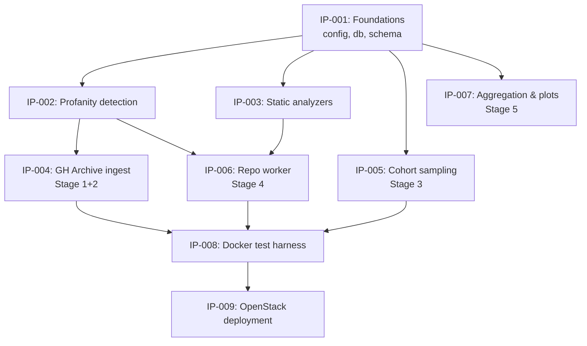

# Implementation Plan

This plan decomposes [`DRAFT.md`](DRAFT.md) into discrete implementation modules. Each module becomes its own implementation proposal under [`proposals/posts/`](proposals/) (template: [`proposals/.template.md`](proposals/.template.md)).

The split is driven by three constraints:

1. **Testability in isolation** — each module must be unit-testable without the others running
2. **Dependency layering** — foundations first, pipeline stages on top, deployment last
3. **Parallel work** — after the foundations land, multiple modules can proceed independently

## Package naming

The draft refers to the Python package as `lab/`. The actual package in this repository is `oss_profanity/`. All proposals use `oss_profanity/` as the root.

## Module → proposal map

| IP  | Module                    | Draft §     | Depends on            | Parallel with |
|-----|---------------------------|-------------|-----------------------|---------------|
| 001 | Foundations               | 4.2, 4.3    | —                     | —             |
| 002 | Profanity detection       | 5.5         | 001                   | 003           |
| 003 | Static analyzers          | 5.4         | 001                   | 002           |
| 004 | GH Archive ingest         | 5.1         | 001, 002              | 005, 006      |
| 005 | Cohort sampling           | 5.2         | 001                   | 004, 006      |
| 006 | Repo worker               | 5.3         | 001, 002, 003         | 004, 005      |
| 007 | Aggregation & plots       | 9           | 001                   | 008, 009      |
| 008 | Local Docker test harness | 6           | 002, 003, 004, 006    | 009           |
| 009 | OpenStack deployment      | 7           | 008                   | 007           |

## Dependency graph

---

## IP-001: Foundations

**Modules:** `oss_profanity/config.py`, `oss_profanity/db.py`

The shared plumbing every other module imports.

**Scope:**

- Tunables: MongoDB URI, scratch path, ingest date range, worker concurrency, bot regex, repo size cap, per-repo timeout
- Env-var driven (`MONGO_URI`, `WORKER_CONCURRENCY`, `GHA_START`, `GHA_END`, …) with sane defaults for local Docker
- MongoDB client singleton + the `repos` collection accessor
- `claim_next_repo(worker_id)` — atomic `find_one_and_update` with sort by `profanity_rate` desc
- `reclaim_stale(ttl=20min)` — rescue claims whose worker died
- `mark_failed(repo_id, reason)` helper
- Index creation: `(status, commit_stats.profanity_rate)`
- Document schema reference (not enforced — Mongo is schemaless — but documented as a typed dataclass or TypedDict for IDE support)

**Deliverable test:** round-trip a fake repo doc through insert → claim → done, assert status transitions.

---

## IP-002: Profanity detection

**Module:** `oss_profanity/profanity.py`

Text-level profanity scoring used by ingest (commit messages) and the worker (source comments).

**Scope:**

- Load LDNOOBW word lists from `ldnoobw/` (28 languages, one file per ISO code), lowercased sets
- Initialize `better-profanity` for English obfuscation handling
- `detect_language(text) -> str` via `langdetect` with deterministic seed; fallback to `"en"` for short / failing inputs
- `scan(text, lang="en") -> list[str]` — tokenize, check against English profanity and the language-specific set, return sorted unique hits
- Severity scoring TBD — DRAFT mentions `severity_sum` but doesn't define it (**open question for the proposal**)

**Deliverable test:** golden file of messages in en/ru/sk/de with expected hit lists.

---

## IP-003: Static analyzers

**Module:** `oss_profanity/analyzers.py`

Language-dispatched code quality measurement. Runs on a checked-out repo; never builds.

**Scope:**

- `detect_primary_language(repo_dir)` — file-extension histogram, pick the dominant language
- `scan_source_tree(repo_dir)` — walk files, skip `node_modules/`, `vendor/`, `.git/`, `dist/`, `build/`, minified files, files > 1 MB; extract comments and identifiers via regex; feed through `oss_profanity.profanity.scan`; return `loc_total`, `files_scanned`, `comment_profanity_hits`, `identifier_profanity_hits`
- Lizard wrapper — always runs, parses XML output into `lizard_avg_ccn`, `lizard_max_ccn`, `lizard_functions`
- Ruff wrapper — Python only, parses JSON output, counts issues, normalizes per KLOC
- ESLint wrapper — JS/TS only, runs with a baseline config at `/opt/baseline-eslint.json`, parses JSON output, counts issues, normalizes per KLOC
- All subprocess calls wrapped with timeouts (120s for lizard/ruff, 180s for eslint)
- `run_all(repo_dir, primary_lang) -> dict` — the single entrypoint returning the `code_analysis` sub-document

**Deliverable test:** fixture repos (tiny Python, tiny JS, tiny polyglot) with known expected outputs.

---

## IP-004: GH Archive ingest (Stage 1+2)

**Module:** `oss_profanity/archive_ingest.py`

Downloads the 744 hourly `.json.gz` files for the configured window and upserts per-repo commit statistics.

**Scope:**

- URL generation for the date range
- `multiprocessing.Pool(4)` download workers writing to `/data/archive_raw/` with HTTP GET + resume
- `multiprocessing.Pool(6)` parse workers — `orjson` line-streaming, filter to `PushEvent`, drop bots by regex
- Per-commit: language detection → `profanity.scan` → atomic `$inc` / `$addToSet` / `$setOnInsert` upsert (see DRAFT §5.1 for the exact payload)
- Bounded sample storage — keep at most 5 profane messages per repo (capped via `sample_profane_messages.4.$exists` guard)
- `ingest_progress` collection — one doc per hourly file; reruns skip completed entries
- Final one-shot pass: compute `profanity_rate = profanity_hits / total_commits_in_window` on every doc

**Deliverable test:** feed 1 hour of real archive data, assert repo count and at least one non-zero `profanity_hits`.

---

## IP-005: Cohort sampling (Stage 3)

**Module:** `oss_profanity/sampling.py`

One-shot script that flips a cohort from `status="skipped"` to `status="pending"` for the workers to pick up.

**Scope:**

- Default-skip everything with `status="seen"` (so the claim query doesn't see them)
- Cohort A: any profanity + ≥ 20 commits → top 750
- Cohort B: zero profanity + ≥ 20 commits → 750 matched on commit-count distribution
- Flip both cohorts to `status="pending"`
- Report cohort sizes and a histogram of commit-count distribution so skew is visible
- Idempotent — re-running does not double-promote

**Deliverable test:** seed Mongo with a synthetic distribution, run sampling, assert expected counts by cohort.

---

## IP-006: Repo worker (Stage 4)

**Module:** `oss_profanity/repo_worker.py`

The main loop that runs 12× per worker host (36 concurrent repos across three hosts).

**Scope:**

- Worker ID = `{hostname}-pid-{pid}`
- Claim loop using the primitives from IP-001
- Partial clone: `git clone --filter=blob:none --no-checkout` → `rev-list -1 --before=2020-07-01` → `checkout SHA`
- All git subprocess calls wrapped with `timeout=300`
- GitHub API size pre-check — skip repos reported > 2 GB (saves clone time)
- 10-minute hard cap per repo (`with timeout(600):`)
- Invokes `detect_primary_language` + `analyzers.run_all`
- Writes `code_analysis` + `status=done` + `processing_time_sec`
- `SkipRepo` / timeout / generic exception all flow to `mark_failed` with classified reason
- `finally: shutil.rmtree` on the clone dir, always
- Stale-claim reclamation when the pending queue drains (worker crashed mid-repo)

**Deliverable test:** run against 5 known-small repos, assert all reach `done` with populated `code_analysis`.

---

## IP-007: Aggregation & plots (Stage 5)

**Module:** `oss_profanity/analyze_results.py`

Read-only consumer of the `repos` collection. Produces the talk's deliverables.

**Scope:**

- `commit_profanity_distribution.csv` + `.png` — histogram over all ~500K repos
- `language_breakdown.csv` + `.png` — profanity rate per detected human language
- `profanity_vs_quality.csv` + `.png` — scatter of `profanity_rate` vs `ruff_issues_per_kloc`, vs `lizard_avg_ccn`; Spearman correlation + 95% CI
- `cohort_comparison.csv` — Mann-Whitney U between profane and clean cohorts on each quality metric
- `top_offenders.md` — the 10 most profane commits, asterisk-redacted
- `sample_repos.md` — qualitative case studies across the 2×2 (profanity × quality)

Deliberately written last so the code matches the actual shape of the data, not the draft's expected shape.

---

## IP-008: Local Docker test harness

**Files:** `docker-compose.yml`, `Dockerfile`, `oss_profanity/tests/test_smoke.py`

The gate that must be green before anything ships to OpenStack.

**Scope:**

- Single `Dockerfile` shared by ingest + worker roles (differs only by entrypoint / env)
- System deps: Python 3.11, git, Node.js + npm (for eslint), lizard, ruff
- `docker-compose.yml` with three services: `mongo` (port 27017), `ingest` (2 hours of archive), `worker` (2 replicas, concurrency 2)
- Shared `scratch` named volume for clones
- Smoke test assertions:
  - ≥ 100 repos ingested from 2 hours of GHA
  - ≥ 1 repo with `profanity_hits > 0`
  - After sampling + worker run, ≥ 3 repos reach `status="done"`
  - `code_analysis.loc_total > 0` on done repos

**Deliverable test:** `docker-compose up` + `pytest tests/test_smoke.py` passes end-to-end on a laptop.

---

## IP-009: OpenStack deployment

**Files:** `scripts/setup_mongo.sh`, `scripts/setup_worker.sh`, `scripts/run_local.sh`

No Ansible, no Terraform. `scp` + `ssh bash <script>` is the whole deploy.

**Scope:**

- `setup_mongo.sh` — provisions `jd-profanity-mogo` (10.150.104.106): installs Python, Docker, clones repo, starts Mongo container bound to internal IP
- `setup_worker.sh` — provisions each worker: installs Python, git, Node, eslint, creates `/scratch`, wires `MONGO_URI` env
- `run_local.sh` — convenience wrapper to `docker-compose up` with the smoke-test env vars
- Systemd unit (or `tmux` session) to supervise the worker loop so it restarts on crash
- Bot regex, repo-size cap, and timeout values configurable via env, not baked into the script

**Deliverable test:** provision one VM via the script from a clean image; ingest+worker come up healthy.

---

## What's deliberately not a proposal

Consistent with DRAFT §11 (Out of Scope):

- Manual repo curation
- Analysis outside June 2020
- Build-based static analysis (`cargo build`, `npm install`, type checkers)
- Commit-level storage (aggregates only)
- Developer-level identification (repo-level only)

These are not deferred — they are rejected.

## Writing the proposals

Each IP above maps to one file in [`proposals/posts/`](proposals/posts/) named `ip-XXX-<slug>.md`, using [`proposals/.template.md`](proposals/.template.md). When an IP is opened, add the row to the index table in [`proposals/index.md`](proposals/index.md).

Suggested authoring order matches the dependency graph: IP-001 first, then 002 and 003 in parallel, then the pipeline stages, then harness, then deployment. IP-007 (aggregation) is written last — after real data lands.