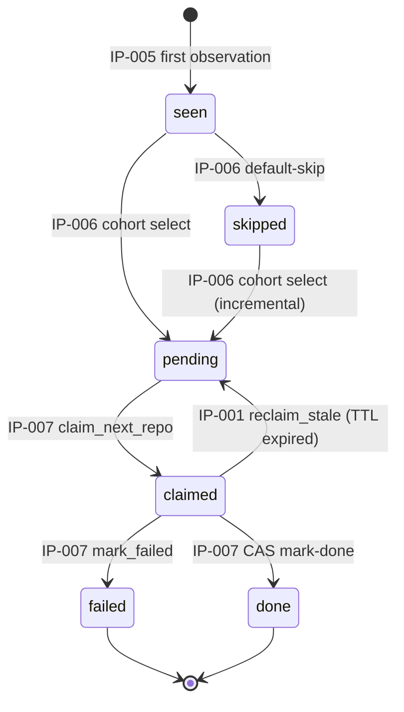

# Database Schema Reference

Source-of-truth reference for every field persisted by the oss-profanity pipeline. Each collection has one section; each sub-document has its own table with columns:

- **Field** — BSON key (dotted path inside the parent document)
- **Type** — BSON / Python type, nullable noted
- **Owner IP** — the proposal that writes this field
- **Consumers** — which later IPs read it (and what for)
- **Description** — one-line purpose; stable contract across IPs

Schemas are defined as Pydantic v2 models in [`oss_profanity/db.py`](../oss_profanity/db.py). Writes to Mongo use raw dotted-path `$inc` / `$set` / `$push` paths; reads hydrate through the Pydantic models so silent field drift fails loudly instead of quietly.

`ConfigDict(extra="allow")` is set on every model — unknown fields in a Mongo document are preserved on read rather than rejected, so a later IP can add fields without breaking reads from code that predates the addition.

---

## Databases

The pipeline uses a single logical database whose name comes from the path in `MONGO_URI`. Common names:

| Environment | Database name |
|---|---|
| Production (`jd-profanity-mogo`) | `profanity` |
| Local dev / docker-compose | `profanity` |
| Test (`TEST_MONGO_URI`) | `profanity_test` |

---

## Collection: `repos`

One document per GitHub repo. The central artifact of the pipeline — every stage either reads, writes, or filters on this collection.

### Top-level fields

| Field | Type | Owner IP | Consumers | Description |
|---|---|---|---|---|
| `_id` | int (BSON `Number`) | IP-005 | IP-006, IP-007, IP-008 | GitHub's numeric repo ID (stable across renames) |
| `full_name` | string | IP-005 | IP-007 (clone URL), IP-008 (display) | Canonical `owner/repo` slug |
| `first_seen_at` | datetime | IP-005 | — | Wall-clock timestamp of the first ingest observation |
| `status` | `"seen" \| "skipped" \| "pending" \| "claimed" \| "done" \| "failed"` | IP-005, IP-006, IP-007 | IP-006 (filters), IP-007 (claims), IP-008 (filters) | Lifecycle state machine (see [state diagram](#status-lifecycle)) |
| `claimed_by` | string \| null | IP-007 (via IP-001 primitive) | IP-007 (CAS writes) | Worker ID that currently holds the claim; unset on terminal states |
| `claimed_at` | datetime \| null | IP-007 (via IP-001 primitive) | IP-001 `reclaim_stale` | Timestamp of the current claim; older than TTL → reclaimed |
| `commit_stats` | sub-document | IP-005 | IP-006 (cohort filters), IP-008 | Stage 1+2 output — commit-message signals |
| `primary_language` | string \| null | IP-007 | IP-008 | `identify`-tag histogram result from IP-004's `detect_primary_language` |
| `code_analysis` | sub-document \| null | IP-007 (via IP-004 `run_all`) | IP-008 | Stage 4 static-analyzer output |
| `github_metadata` | sub-document \| null | IP-007 | IP-008 | REST-API enrichment (stars, license, topics, languages bytes, ...) |
| `cohort` | `"profane" \| "clean" \| null` | IP-006 | IP-008 (paired test) | Stratification label; `null` for repos not selected by sampling |
| `failure_reason` | string \| null | IP-007 (via IP-001 `mark_failed`) | IP-008 (failure histogram) | Classified error prefix: `"skip: ..."`, `"timeout"`, `"git: ..."`, `"<TypeName>: ..."` |
| `processing_time_sec` | float \| null | IP-007 | IP-008 | Wall-clock from claim to terminal state |

### Sub-document: `commit_stats` (IP-005)

Populated by the GH Archive ingest. Rates and `emoji_top` pruning are finalized by IP-005's post-ingest `_finalizer` pass once every hourly file has been processed.

| Field | Type | Description |
|---|---|---|
| `total_commits_in_window` | int | Commits observed in the ingest window after bot filtering |
| `unique_authors` | list[string] | Deduplicated commit-author emails (or names if email is missing) |
| `languages_detected` | dict[iso_code, int] | Per-commit language counts from `profanity.detect_language` (Lingua-py) |
| `profanity_hits` | int | Sum of all profanity-word matches across all commit messages in the window |
| `profanity_rate` | float | `profanity_hits / total_commits_in_window`, or 0.0 if no commits |
| `profanity_top` | dict[word, int] | Top-`EMOJI_TOP_N` profanity words by frequency (shares the top-N cap with emoji) |
| `sample_profane_messages` | list[string] | Up to `SAMPLE_PROFANE_N` (default 5) commit messages that contained profanity — qualitative material for the talk |
| `emoji_hits` | int | Sum of all emoji occurrences across all commit messages |
| `emoji_rate` | float | `emoji_hits / total_commits_in_window` |
| `emoji_commits` | int | Count of commits containing at least one emoji (denominator for "emoji adoption") |
| `emoji_top` | dict[glyph, int] | Top-`EMOJI_TOP_N` emoji glyphs by frequency; ties broken alphabetically (skin-tone + VS-16 stripped before counting) |

### Sub-document: `code_analysis` (IP-007, via IP-004 `run_all`)

Set when `status=done`. IP-004 is the source of truth for field semantics; IP-007 writes the dict verbatim without introspection.

**Source-walk fields** (single tree-sitter pass; IP-002 + IP-003 consumed together):

| Field | Type | Description |
|---|---|---|
| `loc_total` | int | Non-blank, non-comment source lines across all scanned files |
| `files_scanned` | int | Count of files that passed the walk's skip rules |
| `comment_nloc` | int | Sum of newlines inside `(comment)` nodes across all scanned files |
| `comment_to_code_ratio` | float \| null | `comment_nloc / loc_total`, or `null` if `loc_total == 0` |
| `comment_profanity_hits` | int | `profanity.scan` hits in comment nodes (IP-002) |
| `identifier_profanity_hits` | int | `profanity.scan` hits in identifier nodes (IP-002) |
| `comment_emoji_hits` | int | `emoji_scan.extract` hits in comment nodes (IP-003) |
| `identifier_emoji_hits` | int | `emoji_scan.extract` hits in identifier nodes (IP-003) |
| `emoji_top` | dict[glyph, int] | Per-glyph Counter pruned to `config.emoji_top_n`; disjoint from `commit_stats.emoji_top` |
| `tech_debt_markers` | int | TODO / FIXME / HACK / XXX occurrences inside comment text |

**Ruff fields** (Python repos only; `null` otherwise):

| Field | Type | Description |
|---|---|---|
| `ruff_issues` | int \| null | Total Ruff findings across the broad `--select` set |
| `ruff_bug_issues` | int \| null | Subset matching `F*`, `E9*`, `B*`, `S*`, `RUF*` rule codes |
| `ruff_style_issues` | int \| null | `ruff_issues - ruff_bug_issues` |
| `ruff_issues_per_kloc` | float \| null | `ruff_issues / (loc_total / 1000)` |
| `ruff_bug_issues_per_kloc` | float \| null | Same for bug subset |
| `ruff_style_issues_per_kloc` | float \| null | Same for style subset |

**Bandit fields** (Python repos only):

| Field | Type | Description |
|---|---|---|
| `bandit_issues` | int \| null | Total Bandit findings |
| `bandit_high_severity` | int \| null | Subset at severity `HIGH` |
| `bandit_issues_per_kloc` | float \| null | `bandit_issues / (loc_total / 1000)` |

**ESLint fields** (JS/TS repos only):

| Field | Type | Description |
|---|---|---|
| `eslint_issues` | int \| null | Sum of issue counts across all ESLint-reported files |
| `eslint_issues_per_kloc` | float \| null | `eslint_issues / (loc_total / 1000)` |

**jscpd fields** (polyglot; always runs):

| Field | Type | Description |
|---|---|---|
| `jscpd_duplicate_lines` | int \| null | Total lines reported as duplicated by jscpd |
| `jscpd_total_lines` | int \| null | Total line count seen by jscpd (its own scanner, not IP-004's) |
| `jscpd_duplicate_rate` | float \| null | `duplicate_lines / total_lines` |

**Lizard fields** (always runs):

| Field | Type | Description |
|---|---|---|
| `lizard_avg_ccn` | float \| null | Mean cyclomatic complexity across all functions |
| `lizard_max_ccn` | int \| null | Maximum CCN across all functions (the "ugliest" function) |
| `lizard_functions` | int \| null | Total function count |
| `lizard_ccn_p50` | float \| null | Median CCN |
| `lizard_ccn_p90` | float \| null | 90th-percentile CCN |
| `lizard_ccn_p99` | float \| null | 99th-percentile CCN |
| `lizard_nloc_p90` | float \| null | 90th-percentile function NLOC |

### Sub-document: `github_metadata` (IP-007)

Populated by a single `_processor.process_one` pipeline step before clone. Two REST endpoints, merged into one CAS write:

- `GET /repos/{full_name}` — top-level metadata
- `GET /repos/{full_name}/languages` — byte-counts per language

Fields are derived from the REST responses; `ConfigDict(extra="allow")` preserves any additional REST fields in the persisted document.

| Field | Type | Description |
|---|---|---|
| `fetched_at` | datetime | Wall-clock timestamp of the REST fetch (audit trail for staleness) |
| `stargazers_count` | int | Star count at fetch time |
| `forks_count` | int | Fork count |
| `watchers_count` | int | Watchers (API-equal to stars; kept for schema completeness) |
| `subscribers_count` | int | Actual subscriber count (distinct from watchers in REST vocabulary) |
| `open_issues_count` | int | Open issues + PRs |
| `topics` | list[string] | GitHub Topics; empty list if none set |
| `license_spdx` | string \| null | `license.spdx_id` from the REST response (e.g. `"MIT"`, `"Apache-2.0"`) |
| `language` | string \| null | GitHub's own primary-language guess (useful cross-reference with IP-004's `primary_language`) |
| `languages_bytes` | dict[lang, int] | Bytes per language from `/languages` endpoint; keys are GitHub Linguist names (capitalized, e.g. `"Python"`, `"JavaScript"`) |
| `size_kb` | int | Repo size in KB (roughly `.git` pack size; correlates with clone bandwidth) |
| `default_branch` | string \| null | Default branch name (typically `main` or `master`) |
| `fork` | bool | `true` if this repo is a fork of another |
| `parent_full_name` | string \| null | For forks: `owner/repo` slug of the parent; enables fork-dedup in IP-008 |
| `archived` | bool | `true` → repo accepts no writes; IP-007 raises `SkipRepo("archived")` |
| `disabled` | bool | `true` → repo is hidden by admin action; IP-007 raises `SkipRepo("disabled")` |
| `created_at` | datetime \| null | Repo creation timestamp |
| `pushed_at` | datetime \| null | Last push timestamp (freshness signal) |
| `updated_at` | datetime \| null | Last metadata update |
| `description` | string \| null | Repo tagline (free text) |

Stored before the `archived`/`disabled`/oversize skip check, so IP-008 can report on skip rates by license, stars, archived fraction, etc. without a separate join.

### Status lifecycle



### Indexes

Created idempotently by `oss_profanity/db.py::_ensure_indexes` on first `get_db()` call in each process.

| Key | Purpose |
|---|---|
| `(status, commit_stats.profanity_rate desc)` | Primary claim index; matches `claim_next_repo`'s filter + sort |
| `(status, commit_stats.emoji_rate desc)` | Secondary; supports IP-008's post-hoc emoji cohort slicing |

---

## Collection: `ingest_runs` (IP-005)

One document per hourly `.json.gz` file. Tracks the Stage 1+2 lifecycle so re-runs of `archive_ingest` skip completed files, and a stale-claim reaper can rescue files whose parser worker died mid-file.

| Field | Type | Description |
|---|---|---|
| `_id` | string | File ID like `"2020-06-15-12"` (YYYY-MM-DD-HH, no zero-padding on hour per GH Archive convention) |
| `status` | `"pending" \| "in_progress" \| "done" \| "failed"` | Lifecycle state |
| `worker_id` | string \| null | Ingest worker holding the claim; unset on terminal states |
| `attempts` | int | Increments on every re-claim; high values flag problem files |
| `started_at` | datetime \| null | First-claim timestamp; unset on re-claim |
| `heartbeat_at` | datetime \| null | Refreshed periodically by in-progress parser; stale-reaper threshold |
| `finished_at` | datetime \| null | Set on done / failed |
| `bytes` | int \| null | Compressed payload size (from `Content-Length`) |
| `rows` | int \| null | Total NDJSON lines in the file |
| `push_events` | int \| null | PushEvent subset count after JSON filter |
| `commits_observed` | int \| null | Commits scored after bot filter |
| `bots_filtered` | int \| null | Commits dropped by `_bot.is_bot` |
| `upserted` | int \| null | Per-run bulk-write upsert count (observability) |
| `modified` | int \| null | Per-run bulk-write modified count (observability) |
| `error` | string \| null | Last failure reason for failed runs |

### Indexes

| Key | Purpose |
|---|---|
| `(status, heartbeat_at)` | Primary claim index; stale-reaper and `claim_next_file` both filter on this pair |

---

## Field parity with live data

This document was verified against live `profanity` and `profanity_test` databases via the MongoDB MCP server. When a schema change lands, re-run:

```python
# Via the MongoDB MCP:
mcp__MongoDB__collection-schema(database="profanity", collection="repos", sampleSize=100)
mcp__MongoDB__collection-schema(database="profanity", collection="ingest_runs", sampleSize=50)
```

Any field present in the live schema but missing from this document is a drift signal — either the document is stale (fix it) or an IP forgot to amend it (raise an issue).

---

## Cross-references

- [IP-001](proposals/posts/ip-001-foundations.md) — `Repo`, `CommitStats`, `CodeAnalysis` models; status lifecycle; claim primitives
- [IP-004](proposals/posts/ip-004-static-analyzers.md) — `code_analysis` field semantics
- [IP-005](proposals/posts/ip-005-gh-archive-ingest.md) — `commit_stats` + `ingest_runs` populations
- [IP-006](proposals/posts/ip-006-cohort-sampling.md) — `cohort` field + `skipped` / `pending` transitions
- [IP-007](proposals/posts/ip-007-repo-worker.md) — `github_metadata` + `code_analysis` writes; `done`/`failed` transitions
- [CONFIGURATION.md](CONFIGURATION.md) — env vars that affect which fields get populated and with what caps
