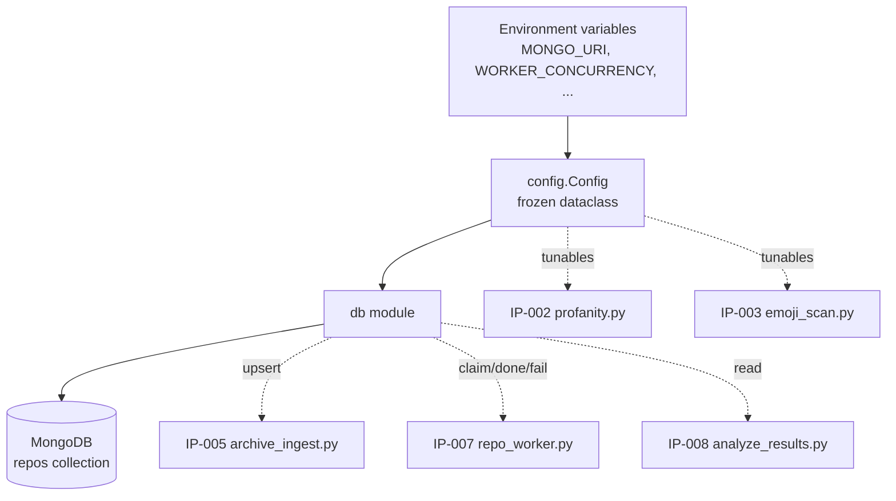
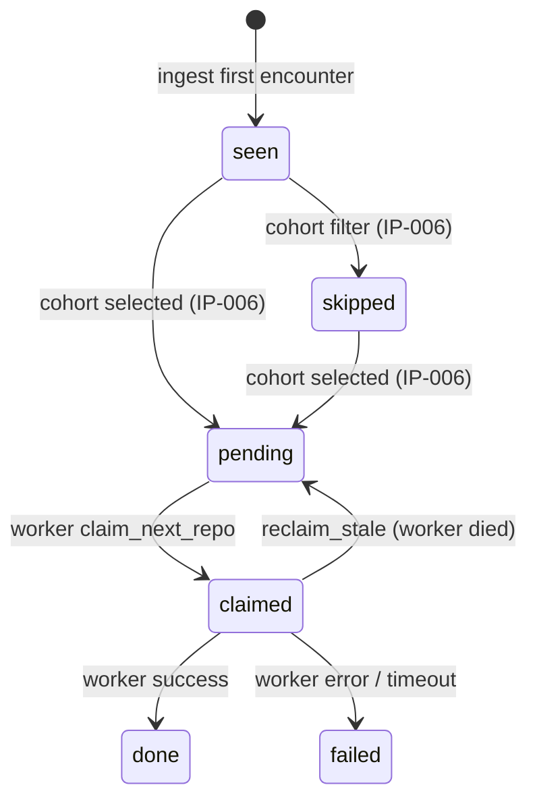

# IP-001: Foundations — config, MongoDB access, and document schema

Establishes the shared plumbing every other module imports: a single source of truth for tunables, a MongoDB client with atomic repo-claiming primitives, and a typed document schema that encodes the two-signal (profanity + emoji) design up front.

<!-- more -->

## Status

**Status**: Implemented
**Last Updated**: 2026-04-23
**Implementation**: Complete

## Problem Statement

The pipeline described in [`DRAFT.md`](../../DRAFT.md) has four processes running across four hosts — ingest on `jd-profanity-mogo`, and 36 concurrent worker processes across three worker VMs. They coordinate through one MongoDB collection (`repos`) using atomic `find_one_and_update` claims. Nothing else will work without:

- **Consistent configuration.** Every process needs the same Mongo URI, the same bot regex, the same per-repo timeout, the same top-N caps. Hard-coding these in four modules guarantees drift.
- **Safe concurrency primitives.** The "atomic claim" pattern must be implemented exactly once and reused — getting it wrong produces duplicate work or lost claims.
- **A typed schema that bakes in both signals from day one.** The two-signal (profanity + emoji) design from [`PLAN.md`](../../PLAN.md) only works if every downstream module sees the same field names in the same places. A drifting schema would mean IP-005 writes `emoji_hits` while IP-008 reads `emoji_count` — the kind of bug that's only discovered after the 6-hour ingest completes.
- **Reclaim logic.** Workers die. Containers get OOM-killed. A claim older than its TTL must become eligible for re-pickup, or the cohort will be permanently wedged at N-1.

**Who is affected:** every other proposal (IP-002 through IP-010) depends on this landing first.

**Consequences of not addressing this:** each downstream module reinvents its own Mongo helpers, the schema drifts, and the first real ingest run discovers the drift the expensive way.

## Proposed Solution

Two modules that together form the foundation layer:

- `oss_profanity/config.py` — all tunables, env-driven with sensible defaults for the Docker harness
- `oss_profanity/db.py` — MongoDB client, collection accessor, atomic claim primitives, and a typed schema

### Overview

- Config is **read once at import time** into a frozen dataclass. No function calls `os.getenv()` directly.
- The Mongo client is a **module-level singleton** returned by `get_db()` — PyMongo is thread-safe and fork-safe with standard settings.
- Claims use `find_one_and_update` with `sort=[("commit_stats.profanity_rate", -1)]` so interesting repos are processed first — matches DRAFT §5.3.
- Stale-claim recovery runs **inside the worker loop** (not as a separate process), so if all workers die the recovery dies with them — which is the correct behavior.
- The schema is a **Pydantic v2 `BaseModel`**. Claim/read primitives hydrate Mongo's raw `dict` through `Repo.model_validate(doc)` — small constructor cost, paid in exchange for runtime detection of silent schema drift (e.g. an ingest path writing `emoji_count` where the reader expects `emoji_hits`). Writes still use raw dict literals with dotted `$inc` paths — we do not attempt to round-trip partial documents through the model. (See Q1 resolution.)

### Key Components

1. **`Config` frozen dataclass** — every tunable, loaded from env at import time, with defaults sized for local Docker
2. **`get_db()` singleton** — returns the `profanity` database; creates indexes idempotently on first call
3. **`claim_next_repo(worker_id)` + `reclaim_stale()` + `mark_failed()`** — the only three mutation primitives any other module calls
4. **`Repo` TypedDict** — parallel profanity/emoji fields under `commit_stats` and `code_analysis`, documenting the lifecycle states

### Architecture



## Implementation Plan

### Phase 1: config module ✅

- [x] Define `Config` frozen dataclass with fields listed in "Configuration" below
- [x] Load env vars with `os.getenv` + typed coercion (no pydantic-settings — one extra dep for trivial parsing)
- [x] Module-level `config: Config = Config.from_env()`, loaded once
- [x] Unit test: patch env, re-import module, assert fields
- [x] Unit test: missing required vars → `ValueError` at import with the offending name

### Phase 2: db module ✅

- [x] `get_db()` returning a PyMongo `Database` with connection pooling defaults
- [x] `_ensure_indexes()` — idempotent; creates both `(status, profanity_rate)` and `(status, emoji_rate)`; called from `get_db()` once per process
- [x] `claim_next_repo(worker_id: str) -> Repo | None` — `find_one_and_update` with `{"status": "pending"}` filter, sort by profanity_rate desc, returns the Pydantic-hydrated post-update doc
- [x] `reclaim_stale() -> int` — flips `claimed` → `pending` where `claimed_at < now - stale_claim_ttl`; returns count for logging
- [x] `mark_failed(repo_id, reason, elapsed_sec=None)` — sets `status="failed"`, `failure_reason`, and optionally `processing_time_sec`

### Phase 3: schema module ✅

- [x] `Repo` as a Pydantic v2 `BaseModel` with full shape from DRAFT §4.2 (both signals in parallel); uses `Field(alias="_id")` + `ConfigDict(populate_by_name=True)` for Mongo's underscore-prefixed primary key
- [x] `CommitStats` and `CodeAnalysis` as nested `BaseModel`s with `ConfigDict(extra="allow")` so fields added by later IPs don't fail validation
- [x] `Status` Literal alias: `"seen" | "pending" | "claimed" | "done" | "failed" | "skipped"`
- [x] Read primitives (`claim_next_repo`) return `Repo | None` — docs pass through `Repo.model_validate(doc)` before return; write primitives stay raw-dict

### Phase 4: integration test ✅

- [x] End-to-end: insert a fake repo, claim it from two "workers" in sequence (second sees nothing), mark one done, mark another failed, assert final states
- [x] Stale-claim test: insert claimed repo with `claimed_at = now - 30min`, run `reclaim_stale()`, assert it goes back to `pending`

### Prerequisites

- MongoDB 7.x available (Docker container from IP-009 smoke harness works for local dev, but IP-001 can use any local Mongo)
- `pymongo >= 4.6`
- `pydantic >= 2.6` (Rust-backed v2; schema validation in `db.py`)
- Python 3.11+

## Technical Details

### Technology Stack

- **PyMongo** (sync) — DRAFT uses `multiprocessing.Pool`, so async buys nothing and adds complexity
- **Stdlib `dataclasses`** for Config — Q1 resolution keeps Config as plain stdlib (schema-only switch to Pydantic)
- **Pydantic v2** for the `Repo` / `CommitStats` / `CodeAnalysis` schema — runtime validation on reads, Rust-backed so the constructor cost is microseconds at 36 claims/sec peak
- **No pydantic-settings, no attrs** — Config and miscellaneous typing stay stdlib; Pydantic is scoped to the document schema

### Data Model

Single collection `repos`, one document per GitHub repo. Schema documented as `TypedDict` in code, matches DRAFT §4.2 verbatim.

Status lifecycle:



Indexes beyond default `_id` — created idempotently by `_ensure_indexes()` (see Module skeleton):

- `(status, commit_stats.profanity_rate desc)` — primary claim index; matches `claim_next_repo`'s sort and filter
- `(status, commit_stats.emoji_rate desc)` — secondary; supports IP-008's post-hoc emoji cohort slicing

Both are compound on `status` first so the selective filter narrows the working set before the sort runs.

### Module skeleton

```python
# oss_profanity/config.py
from dataclasses import dataclass, field
from datetime import timedelta
import os
import re

@dataclass(frozen=True)
class Config:
    mongo_uri: str
    worker_concurrency: int
    gha_start: str
    gha_end: str
    scratch_dir: str
    bot_regex: re.Pattern
    max_repo_size_mb: int
    per_repo_timeout: timedelta
    stale_claim_ttl: timedelta
    emoji_top_n: int
    sample_profane_n: int

    @classmethod
    def from_env(cls) -> "Config":
        return cls(
            mongo_uri=os.environ["MONGO_URI"],
            worker_concurrency=int(os.getenv("WORKER_CONCURRENCY", "12")),
            gha_start=os.getenv("GHA_START", "2020-06-01-00"),
            gha_end=os.getenv("GHA_END", "2020-06-30-23"),
            scratch_dir=os.getenv("SCRATCH_DIR", "/scratch"),
            bot_regex=re.compile(
                os.getenv("BOT_REGEX", r"(bot|dependabot|renovate|github-actions|greenkeeper)"),
                re.IGNORECASE,
            ),
            max_repo_size_mb=int(os.getenv("MAX_REPO_SIZE_MB", "2048")),
            per_repo_timeout=timedelta(seconds=int(os.getenv("PER_REPO_TIMEOUT_SEC", "600"))),
            stale_claim_ttl=timedelta(minutes=int(os.getenv("STALE_CLAIM_TTL_MIN", "20"))),
            emoji_top_n=int(os.getenv("EMOJI_TOP_N", "20")),
            sample_profane_n=int(os.getenv("SAMPLE_PROFANE_N", "5")),
        )

config = Config.from_env()
```

```python
# oss_profanity/db.py
import os
import secrets
import socket
from datetime import datetime, timezone
from typing import Literal

from pydantic import BaseModel, ConfigDict, Field
from pymongo import MongoClient, ReturnDocument
from pymongo.database import Database

from .config import config

Status = Literal["seen", "pending", "claimed", "done", "failed", "skipped"]


class CommitStats(BaseModel):
    model_config = ConfigDict(extra="allow")
    total_commits_in_window: int = 0
    unique_authors: list[str] = Field(default_factory=list)
    languages_detected: dict[str, int] = Field(default_factory=dict)
    profanity_hits: int = 0
    profanity_rate: float = 0.0
    sample_profane_messages: list[str] = Field(default_factory=list)
    emoji_hits: int = 0
    emoji_rate: float = 0.0
    emoji_commits: int = 0
    emoji_top: dict[str, int] = Field(default_factory=dict)


class CodeAnalysis(BaseModel):
    model_config = ConfigDict(extra="allow")
    loc_total: int = 0
    files_scanned: int = 0
    comment_profanity_hits: int = 0
    identifier_profanity_hits: int = 0
    comment_emoji_hits: int = 0
    identifier_emoji_hits: int = 0
    emoji_top: dict[str, int] = Field(default_factory=dict)
    ruff_issues: int | None = None
    ruff_issues_per_kloc: float | None = None
    eslint_issues: int | None = None
    eslint_issues_per_kloc: float | None = None
    lizard_avg_ccn: float | None = None
    lizard_max_ccn: int | None = None
    lizard_functions: int | None = None


class Repo(BaseModel):
    model_config = ConfigDict(extra="allow", populate_by_name=True)
    id: int = Field(alias="_id")
    full_name: str
    first_seen_at: datetime
    commit_stats: CommitStats = Field(default_factory=CommitStats)
    status: Status = "seen"
    claimed_by: str | None = None
    claimed_at: datetime | None = None
    primary_language: str | None = None
    code_analysis: CodeAnalysis | None = None
    failure_reason: str | None = None
    processing_time_sec: float | None = None


def make_worker_id() -> str:
    """Unique worker ID even under Docker replicas sharing hostname + PID namespace."""
    return f"{socket.gethostname()}-{os.getpid()}-{secrets.token_hex(2)}"


_client: MongoClient | None = None


def get_db() -> Database:
    global _client
    if _client is None:
        _client = MongoClient(config.mongo_uri)
        _ensure_indexes(_client.get_default_database())
    return _client.get_default_database()


def _ensure_indexes(db: Database) -> None:
    db.repos.create_index([("status", 1), ("commit_stats.profanity_rate", -1)])
    db.repos.create_index([("status", 1), ("commit_stats.emoji_rate", -1)])


def claim_next_repo(worker_id: str) -> Repo | None:
    doc = get_db().repos.find_one_and_update(
        {"status": "pending"},
        {"$set": {
            "status": "claimed",
            "claimed_by": worker_id,
            "claimed_at": datetime.now(timezone.utc),
        }},
        sort=[("commit_stats.profanity_rate", -1)],
        return_document=ReturnDocument.AFTER,
    )
    return Repo.model_validate(doc) if doc else None


def reclaim_stale() -> int:
    cutoff = datetime.now(timezone.utc) - config.stale_claim_ttl
    result = get_db().repos.update_many(
        {"status": "claimed", "claimed_at": {"$lt": cutoff}},
        {"$set": {"status": "pending"},
         "$unset": {"claimed_by": "", "claimed_at": ""}},
    )
    return result.modified_count


def mark_failed(repo_id: int, reason: str, elapsed_sec: float | None = None) -> None:
    update: dict = {"status": "failed", "failure_reason": reason}
    if elapsed_sec is not None:
        update["processing_time_sec"] = elapsed_sec
    get_db().repos.update_one({"_id": repo_id}, {"$set": update})
```

### Configuration

All tunables live in `config.py` with env-var names:

| Variable                 | Default                    | Purpose                            |
|--------------------------|----------------------------|------------------------------------|
| `MONGO_URI`              | *(required)*               | PyMongo connection string          |
| `WORKER_CONCURRENCY`     | `12`                       | Processes per worker host          |
| `GHA_START`              | `2020-06-01-00`            | First hourly archive file          |
| `GHA_END`                | `2020-06-30-23`            | Last hourly archive file           |
| `SCRATCH_DIR`            | `/scratch`                 | Where clones land                  |
| `BOT_REGEX`              | `(bot\|dependabot\|...)`   | Authors to exclude                 |
| `MAX_REPO_SIZE_MB`       | `2048`                     | Skip larger repos pre-clone        |
| `PER_REPO_TIMEOUT_SEC`   | `600`                      | Worker hard cap per repo           |
| `STALE_CLAIM_TTL_MIN`    | `20`                       | Reclaim abandoned claims after     |
| `EMOJI_TOP_N`            | `20`                       | Cap on `emoji_top` per doc         |
| `SAMPLE_PROFANE_N`       | `5`                        | Max retained profane commit msgs   |

## Alternatives Considered

### Alternative 1: Pydantic BaseSettings

**Description**: Use `pydantic-settings` for `Config` instead of a hand-rolled dataclass.

**Pros**:
- Automatic type coercion + validation
- `.env` file support built in
- Typed `BaseSettings` class is conventional

**Cons**:
- Adds pydantic as a transitive dep to every module (it's ~5 MB)
- Parsing a dozen scalar env vars is five lines of stdlib code
- IP-005 and IP-007 don't need validation; `int(os.getenv(..))` with a sane default is enough

**Why not chosen**: The value pydantic-settings adds here (validation, nested configs, secrets) is not needed. Plain dataclass + `from_env` classmethod covers every use case and keeps the dep graph minimal. If IP-009's Docker image grows to need `.env` loading, `python-dotenv` is a one-line addition without taking on pydantic.

### Alternative 2: `TypedDict` schema with IDE-only typing (originally recommended, rejected in Q1)

**Description**: Represent `Repo` as a `TypedDict` with `total=False`. No runtime validation — the schema is a mypy/IDE hint only.

**Pros**:
- Zero runtime cost; PyMongo's native `dict` passes through untouched
- Trivial partial-document modeling — every field optional by construction
- No extra dependency

**Cons**:
- No guardrail against a module writing a typo'd field name — a bug that only surfaces at aggregation time, 6 hours into the ingest
- `mypy --strict` is not enforced on every contributor path; CI coverage can lapse

**Why not chosen**: Q1 review feedback ("go with Pydantic — do not create wheel") selected runtime validation over developer-discipline-only enforcement. Pydantic v2's Rust core makes the constructor cost negligible at this throughput, and the silent-drift protection is worth the dependency.

### Alternative 3: Motor (async PyMongo)

**Description**: Use Motor for async MongoDB access.

**Pros**:
- Plays with `asyncio` ecosystem
- Higher throughput per process under I/O-bound loads

**Cons**:
- DRAFT §5.3 specifies `multiprocessing.Pool`, not asyncio
- Worker is CPU-heavy (lizard + ruff + source scan); async buys nothing there
- Mixing `multiprocessing` + `asyncio` is a known footgun

**Why not chosen**: The pipeline is process-parallel, not coroutine-parallel. Sync PyMongo matches the rest of the design.

## Trade-offs and Risks

### Trade-offs

- **Pydantic model on reads, raw dict on writes**: catches silent schema drift at read time (Q1-resolved), at the cost of a microsecond-scale Pydantic constructor per claim. Accepted because Pydantic v2's Rust core makes the overhead well below the `find_one_and_update` round-trip latency. Writes remain raw-dict so ingest-time `$inc` / `$addToSet` paths are unconstrained — we explicitly do not try to round-trip partial docs through the model.
- **Config loaded at import time**: simple, but fails loudly if env vars are missing — which is the right failure mode for batch jobs, annoying for an interactive REPL. Accepted.
- **`claim_next_repo` sorts by `profanity_rate`**: great for talk material (interesting repos done first), but means low-profanity repos in the clean cohort finish last. If a hard stop lands mid-run (DRAFT §8), the clean cohort will be under-represented. Mitigation: IP-008 should report sample sizes per cohort and gate correlation tests on minimum N.

### Risks

| Risk | Impact | Mitigation |
|------|--------|------------|
| Worker ID collision across Docker replicas on one host | Medium | `make_worker_id()` helper returns `{hostname}-{pid}-{token_hex(2)}`; all call sites must use it (Q2-resolved) |
| Stale-claim TTL too short → live worker's claim stolen | High | Default 20 min ≫ 10 min per-repo hard cap; `claimed_at` set once at claim time, not refreshed during work |
| Stale-claim TTL too long → wedged cohort if worker dies mid-run | Medium | 20 min is acceptable — 36 workers × 10 min worst case = 6 h, stale recovery only matters near the tail |
| Missing index → collscan during high-concurrency claim | High | `_ensure_indexes` runs on first `get_db()` call; idempotent, safe to call repeatedly |
| `find_one_and_update` without sort → FIFO on disk order | Low | Explicit `sort=[("commit_stats.profanity_rate", -1)]` in the primitive |

## Open Questions

None. Four review questions were resolved before acceptance; see the changelog and `git log` on this file for the original Q&A if needed.

## Success Criteria

- [x] `from oss_profanity.config import config` works with `MONGO_URI` in env; every tunable is addressable
- [x] `from oss_profanity.db import get_db, claim_next_repo, reclaim_stale, mark_failed` — these are the only public names (plus `make_worker_id` and the `Repo` / `CommitStats` / `CodeAnalysis` models)
- [x] Indexes present on a fresh collection after first `get_db()` call
- [x] Two concurrent `claim_next_repo` calls on the same pending doc yield exactly one claim (verified by `test_claim_next_repo_is_atomic`)
- [x] `reclaim_stale` moves a claim older than TTL back to `pending`, leaves younger claims alone
- [x] `mypy --strict oss_profanity/config.py oss_profanity/db.py` passes

## Future Considerations

- **Heartbeat-based distributed lease** (Q3 follow-up on "proper locking"): the current `claim + fixed TTL + reclaim_stale` is the simplest form of a distributed lease on a Mongo document. A more robust variant has each worker periodically `$set claimed_at` during long operations, shrinking the TTL to single-digit minutes and speeding recovery from real worker deaths. Not needed for a 2-day experiment with a 10-minute per-repo cap; worth adopting if this pipeline is ever reused for batches where individual units can take hours.
- **External lock service** (Redis Redlock, etcd, ZooKeeper): next tier after heartbeat lease, if scale ever demands cross-collection or cross-database coordination. Adds an infrastructure component this experiment does not have.
- **Sharding by repo_id prefix** if the collection grows past a single-node comfort zone — out of scope for the current experiment (~500K docs fits easily on one node).
- **Per-metric indexes for IP-008** (e.g. on `ruff_issues_per_kloc`) if aggregation queries turn out slow.
- **Config hot-reload** — not needed; processes are short-lived enough that restart-to-reconfigure is fine.

## References

- [`DRAFT.md`](../../DRAFT.md) §4.2 (schema), §5.3 (claim loop)
- [`PLAN.md`](../../PLAN.md) IP-001 row
- PyMongo [`find_one_and_update` docs](https://pymongo.readthedocs.io/en/stable/api/pymongo/collection.html#pymongo.collection.Collection.find_one_and_update)

## Changelog

| Date       | Author | Changes                                                                                               |
|------------|--------|-------------------------------------------------------------------------------------------------------|
| 2026-04-23 | jdubec | Initial draft                                                                                         |
| 2026-04-23 | jdubec | Resolved review questions and updated proposal accordingly (Pydantic schema, `make_worker_id` helper) |
| 2026-04-23 | jdubec | Accepted; removed Review Questions section; implementation started                                    |
| 2026-04-23 | jdubec | Implemented: `oss_profanity/{config,db}.py` + test suite (17/17 passing, mypy --strict clean)          |
| 2026-04-23 | jdubec | Post-acceptance amendment: removed `severity_sum` from `CommitStats` (IP-002 Q3 — no ground-truth source) |
