# IP-002: Profanity detection — text-level profanity scoring

The first of two first-class text signals (IP-003 is its sibling). Provides a single `scan(text, lang="en") -> list[str]` entrypoint used by ingest (commit messages) and by the static analyzers (source comments + identifiers). Deterministic, multilingual, reproducible — no ML models, no hidden training data.

<!-- more -->

## Status

**Status**: Implemented
**Last Updated**: 2026-04-23
**Implementation**: Complete

## Problem Statement

The pipeline needs to count profanity occurrences in two places — Stage 1+2 ingest (tens of millions of commit messages) and Stage 4 source scanning (~1,500–3,000 repo trees). Both call sites need **the same deterministic function** so the profanity signal is comparable between commit and source contexts.

Requirements dictated by the research context:

- **Deterministic and reproducible.** This is an academic experiment; two runs on the same data must produce identical hit counts. Rules out ML models whose output depends on non-pinned weights or dependencies.
- **Explainable.** The talk will cite individual commit messages. We need to point at specific flagged tokens, not "the SVM classified this as 73% profane."
- **Multilingual.** LDNOOBW covers 28 languages. English-only tools miss a meaningful slice of commits from non-English-dominant regions (Eastern Europe, LATAM, CJK).
- **Fast enough.** 40M commit messages × one scan + 1,500 repo trees × ~100 files each. The scan function gets called maybe 10^8 times; per-call cost must be sub-millisecond.
- **Cheap to reason about.** A 2-day experiment cannot afford to debug a deprecated, dormant, or flaky dependency mid-ingest.

**Who is affected:** IP-004 (static analyzers) and IP-005 (GH Archive ingest) both depend on this. IP-006 (cohort sampling) reads the output. IP-008 (aggregation) reports on it. In short: the entire correlation story rides on this signal being solid.

**Consequences of not addressing this:** the research question cannot be answered.

## Proposed Solution

A single `oss_profanity/profanity.py` module exposing two public functions (`detect_language`, `scan`), with vendored LDNOOBW word lists and `lingua-py` for language detection. No ML, no dormant deps.

### Overview

- **LDNOOBW word lists, vendored into the package** (`oss_profanity/wordlists/ldnoobw/`). CC-BY-4.0 permits redistribution with attribution; vendoring is strictly more reproducible than a git submodule or runtime fetch, and the total size is ~200 KB.
- **`lingua-py` for language detection**, restricted to the intersection of LDNOOBW languages + a short-text-friendly shortlist. Actively maintained, purpose-built for short text — commit messages are frequently <10 words, which is exactly where `langdetect` underperforms.
- **Simple leetspeak normalization** (`a↔4`, `i↔1`, `o↔0`, `e↔3`, `s↔5`) applied to tokens before matching. Covers ~80% of real-world obfuscation patterns without taking on the dormant `better-profanity` dependency.
- **Token-level matching only.** LDNOOBW entries are matched against whole tokens (Unicode-aware boundaries), mitigating the Scunthorpe-class false-positive problem that plagues substring matchers.
- **No severity scoring.** The DRAFT's `severity_sum` field is dropped — see Q3. Hit counts and rates are sufficient for the correlation analyses in IP-008; severity is an under-specified concept that adds a hand-wavy "weight" without a ground-truth source.
- **Stateless, import-once.** Word lists load on first `scan()` call into module-level dicts; the Lingua detector is built once per process.

### Key Components

1. **`oss_profanity/wordlists/ldnoobw/`** — vendored copy of the 28 LDNOOBW word lists + `LICENSE.md` with CC-BY-4.0 attribution
2. **`oss_profanity/profanity.py`** — `detect_language(text)`, `scan(text, lang)`, lazy-loaded word sets, Lingua detector singleton
3. **Preprocessing helpers** — Unicode-aware tokenizer, leetspeak normalizer; both kept private (module-level `_` prefix)
4. **Test fixtures** — golden files with hand-labeled expected hits for en/de/ru/es/ja/mixed

### Architecture

```mermaid
graph TD
    TEXT[input string<br/>commit message or source comment]
    LANG[detect_language<br/>lingua-py]
    TOK[_tokenize<br/>Unicode-aware]
    NORM[_leetspeak_normalize<br/>optional]
    LDNOOBW[(LDNOOBW<br/>word sets<br/>28 langs)]
    HITS[sorted unique hits<br/>list&#91;str&#93;]

    TEXT --> LANG
    TEXT --> TOK
    TOK --> NORM
    NORM --> MATCH{token in<br/>LDNOOBW&#91;lang&#93;<br/>or<br/>LDNOOBW&#91;en&#93;?}
    LDNOOBW --> MATCH
    LANG -.selects lang set.-> MATCH
    MATCH --> HITS
```



English word lists are always checked in addition to the detected language — most source comments and identifiers in OSS repos are English regardless of what the commit messages are in.

## Implementation Plan

### Phase 1: vendored word lists ✅

- [x] Script `scripts/fetch_ldnoobw.py` — downloads the 28 files from the upstream GitHub repo at pinned commit SHA `5faf2ba42d7b1c0977169ec3611df25a3c08eb13`, writes them to `oss_profanity/wordlists/ldnoobw/`, creates `LICENSE.md` with CC-BY-4.0 attribution
- [x] Script run; 28 word lists + LICENSE.md vendored (~22 KB total)
- [x] Refresh procedure documented in the script's docstring

### Phase 2: profanity module ✅

- [x] `_LDNOOBW_DIR` module-level constant (package-relative)
- [x] `_WORDLISTS: dict[str, frozenset[str]]` — lazy-loaded via `_load_wordlists()` on first `scan()` call
- [x] `_DETECTOR` — built once per process; 24 ISO 639-1 codes (LDNOOBW ∩ Lingua); `nb`/`nn` remap to `no` for the LDNOOBW Norwegian list
- [x] `_TOKEN_RE: re.Pattern` — Unicode-aware word splitter (`\b[\w']+\b` with `re.UNICODE`)
- [x] `_LEETSPEAK_TABLE` — `str.translate`-compatible table (`4103$5@!` ↔ `aioessai`), toggled by `_LEETSPEAK_ENABLED`
- [x] `detect_language(text: str) -> str` — returns ISO 639-1 code; falls back to `"en"` for text shorter than `_MIN_DETECT_LEN` (20 chars) or when Lingua yields no confident prediction
- [x] `scan(text: str, lang: str = "en") -> list[str]` — returns sorted unique hits; normalizes leetspeak on the **whole string before tokenizing** (so `@`, `!`, `$` substitutions aren't stripped by the tokenizer); always also checks the English word set

### Phase 3: tests ✅

- [x] Edge cases: empty, whitespace-only, clean text, case-insensitive, sorted-unique, multi-lang combination
- [x] Scunthorpe tests: `class`, `scunthorpe`, `assassin`, `pass`, `grass` → all zero hits
- [x] Leetspeak variants: digit (`sh1t`), `@` (`@ss`), `!` (`sh!t`), `$` (`$hit`) — all match correctly
- [x] Russian Cyrillic scan (`дерьмо`)
- [x] Language detection on en / ru / de / es / short-fallback / Norwegian-Bokmål-remap
- [x] Performance: 10k varied scans complete in well under the 1s ceiling
- [x] Public-surface contract test: only `detect_language` and `scan` are exported

### Phase 4: integration with downstream

- [ ] `detect_language` + `scan` will be imported by IP-005 (ingest) and IP-004 (analyzers) — deferred to those IPs
- [ ] IP-005 will call into IP-003 emoji detection; both signals return `list[str]` — contract verified symmetric

### Prerequisites

- IP-001 complete (for `config` if we need env-driven tunables later — not required now)
- `lingua-language-detector >= 2.2`
- Python 3.11+

## Technical Details

### Technology Stack

- **LDNOOBW word lists** (vendored) — CC-BY-4.0, deterministic, explainable, multilingual
- **`lingua-language-detector`** — short-text-optimized, actively maintained, no external services
- **Stdlib `re` + `str.translate`** — Unicode-aware tokenization and leetspeak normalization
- **No `better-profanity`** — dormant since 2020, English-focused, obfuscation handling trivially replaceable
- **No `langdetect`** — weak on short text, known slowness, dormant
- **No ML** — `alt-profanity-check` and friends are English-only and non-deterministic across environments

### Module skeleton

```python
# oss_profanity/profanity.py
"""Deterministic, multilingual profanity scoring.

Uses vendored LDNOOBW word lists (28 languages) plus lingua-py for short-text
language detection. No ML. No dormant deps. Callable from both ingest
(commit messages) and the worker (source comments + identifiers).
"""
from __future__ import annotations

import re
from pathlib import Path
from typing import Final

from lingua import IsoCode639_1, Language, LanguageDetector, LanguageDetectorBuilder

_LDNOOBW_DIR: Final[Path] = Path(__file__).parent / "wordlists" / "ldnoobw"
_MIN_DETECT_LEN: Final[int] = 20
_LEETSPEAK_ENABLED: Final[bool] = True
_LEETSPEAK_TABLE: Final[dict[int, int]] = str.maketrans("4103$5", "aioess")
_TOKEN_RE: Final[re.Pattern[str]] = re.compile(r"\b[\w']+\b", re.UNICODE)

_WORDLISTS: dict[str, frozenset[str]] = {}
_DETECTOR: LanguageDetector | None = None


def _load_wordlists() -> None:
    if _WORDLISTS:
        return
    for path in _LDNOOBW_DIR.iterdir():
        if not path.is_file() or path.suffix == ".md":
            continue
        words = frozenset(
            w.strip().lower()
            for w in path.read_text(encoding="utf-8").splitlines()
            if w.strip() and not w.startswith("#")
        )
        _WORDLISTS[path.name] = words


def _get_detector() -> LanguageDetector:
    global _DETECTOR
    if _DETECTOR is None:
        # Restrict to LDNOOBW-covered languages that Lingua also knows.
        # Other LDNOOBW codes (fil, kab, tlh, fr-CA-u-sd-caqc) are skipped for
        # detection — their word lists still load and can be scanned via an
        # explicit `lang=` argument.
        _DETECTOR = LanguageDetectorBuilder.from_iso_codes_639_1(
            IsoCode639_1.AR, IsoCode639_1.CS, IsoCode639_1.DA, IsoCode639_1.DE,
            IsoCode639_1.EN, IsoCode639_1.EO, IsoCode639_1.ES, IsoCode639_1.FA,
            IsoCode639_1.FI, IsoCode639_1.FR, IsoCode639_1.HI, IsoCode639_1.HU,
            IsoCode639_1.IT, IsoCode639_1.JA, IsoCode639_1.KO, IsoCode639_1.NL,
            IsoCode639_1.NO, IsoCode639_1.PL, IsoCode639_1.PT, IsoCode639_1.RU,
            IsoCode639_1.SV, IsoCode639_1.TH, IsoCode639_1.TR, IsoCode639_1.ZH,
        ).build()
    return _DETECTOR


def detect_language(text: str) -> str:
    """Return the ISO 639-1 code of ``text``; fall back to ``"en"``."""
    if not text or len(text) < _MIN_DETECT_LEN:
        return "en"
    lang = _get_detector().detect_language_of(text)
    return lang.iso_code_639_1.name.lower() if lang else "en"


def scan(text: str, lang: str = "en") -> list[str]:
    """Return sorted unique profanity hits in ``text``.

    Always checks both the ``lang``-specific word set and the English set —
    source comments in OSS are overwhelmingly English regardless of the
    commit-message language.
    """
    if not text:
        return []
    _load_wordlists()
    tokens = {t.lower() for t in _TOKEN_RE.findall(text)}
    if _LEETSPEAK_ENABLED:
        tokens |= {t.translate(_LEETSPEAK_TABLE) for t in tokens}

    hits: set[str] = set()
    for code in {lang, "en"}:
        wordlist = _WORDLISTS.get(code)
        if wordlist:
            hits |= tokens & wordlist
    return sorted(hits)
```

### API contract

- `detect_language(text: str) -> str` — always returns a non-empty string (ISO 639-1 lowercase), `"en"` as fallback
- `scan(text: str, lang: str = "en") -> list[str]` — always returns `list[str]`, possibly empty, sorted, deduped
- Both are pure functions with no side effects beyond the first-call lazy load of word lists / detector
- Mirrors IP-003's `emoji_scan.extract(text: str) -> list[str]` contract exactly, so IP-004 and IP-005 can call both symmetrically

### Configuration

IP-002 intentionally does **not** add env-var tunables in `config.py`. The two module-level constants that could conceivably be tuned (`_MIN_DETECT_LEN`, `_LEETSPEAK_ENABLED`) are design decisions, not operational knobs. If future experiments need them configurable, they can be promoted to `config.py` in a small amendment.

## Alternatives Considered

### Alternative 1: `better-profanity` for English + LDNOOBW for other languages

**Description**: The DRAFT's original stack — `better-profanity` handles English with obfuscation variants, LDNOOBW covers other languages.

**Pros**:
- Handles `f*ck`, `f u c k`, `h4ndjob`-style obfuscation out of the box
- Already specified in DRAFT §5.5

**Cons**:
- `better-profanity` last released November 2020 — dormant for 6+ years
- English-only; coexists awkwardly with LDNOOBW for non-English (two code paths)
- Trivially bypassed by trailing chars (`fuckk`, `shitt`) per the maintainer's own README
- Maintenance risk during the 2-day experiment window

**Why not chosen**: the 80% of obfuscation value (`f*ck` → `fuck`) can be reproduced in 5 lines of `str.translate`. Taking on a dormant dep for the remaining 20% is a poor trade.

### Alternative 2: `alt-profanity-check` (SVM on 200k-sample corpus)

**Description**: Replace the wordlist approach entirely with a trained SVM classifier.

**Pros**:
- Context-sensitive within English
- Actively maintained (unlike the deprecated `profanity-check` it replaces)

**Cons**:
- English-only — fails the multilingual requirement
- Non-deterministic across environments (scikit-learn version, BLAS backend can shift classification boundaries for borderline samples)
- Returns a probability, not a list of flagged tokens — loses explainability for talk material
- Training data is generic; doesn't know developer-specific slang

**Why not chosen**: deterministic + multilingual + explainable is a hard requirement for a research study. ML adds cost on all three axes.

### Alternative 3: Keep `langdetect` for language detection

**Description**: DRAFT §5.5 uses `langdetect`; stay with it.

**Pros**:
- Zero migration work
- Well-known, stable API

**Cons**:
- Known to be weak on short text (< 20 chars) — commit messages live exactly there
- ~1100× slower than alternatives per modelpredict comparisons; at 40M commits the difference matters
- No releases since 2021

**Why not chosen**: `lingua-py` is strictly better on our workload and actively maintained.

### Alternative 4: ICU-based tokenizer (`pyicu`)

**Description**: Use ICU's word-break iterator for Unicode-correct tokenization instead of `\b[\w']+\b`.

**Pros**:
- Correctly tokenizes CJK (no word boundaries in Chinese/Japanese)
- Industry-standard

**Cons**:
- `pyicu` is a C extension with platform-specific build pain (especially inside the IP-009 Docker image)
- CJK LDNOOBW lists contain full phrases, not "words" — `re.UNICODE` plus substring matching per CJK entry is sufficient at our precision target

**Why not chosen**: accepted ~5% precision loss on CJK in exchange for portability. Documented as a limitation in the DRAFT §10.

## Trade-offs and Risks

### Trade-offs

- **Vendored word lists**: commits ~200 KB of text into the repo. Reproducibility wins over repository diet; updates are rare (LDNOOBW changes on the order of months).
- **Leetspeak over library obfuscation**: catches `f4ck`-style but not `fuckk`-style. Acceptable because commit-message obfuscation is rare in the first place — we're measuring a signal, not censoring it.
- **Language detection confidence below threshold falls back to English**: inflates English-reported hits slightly. Accepted because English word lists are the largest and most likely to match tokens anyway.
- **Always-check-English layer**: mild over-counting in very non-English-heavy repos. Accepted because source comments and identifiers are near-universally English in OSS, and ignoring them would understate the signal.

### Risks

| Risk | Impact | Mitigation |
|------|--------|------------|
| LDNOOBW word lists subjective / culturally biased | Medium | DRAFT §10 documents this as a known limitation; we accept ~5% error rate and report both cohorts separately |
| Scunthorpe-class false positives on substrings | Medium | Token-boundary matching via `re.UNICODE` + whole-token compare eliminates substring matches |
| CJK tokenization is imperfect (`\b` is weak across CJK) | Low | CJK LDNOOBW entries are short phrases; substring-in-text fallback can be added later if precision is low |
| `lingua-py` memory footprint per process | Low | Restricting to 24 languages keeps the detector under 100 MB; loaded once per process; 36 workers × 100 MB = 3.6 GB — well under the 16 GB per-worker budget |
| Lingua lacks models for 4 LDNOOBW codes (`fil`, `kab`, `tlh`, `fr-CA-u-sd-caqc`) | Low | Their word lists still load and match via explicit `lang=` argument; auto-detect routes such text to a neighbor language + the always-checked English layer catches common-case profanity. Tiny slice of 2020-06 GitHub commits. (Q1-resolved) |
| Non-deterministic token ordering in `set` operations | Low | Final `sorted()` before return gives deterministic output regardless of hash seed |
| First-call load latency (~100–200 ms for Lingua detector) | Low | Amortized across millions of calls; happens once per process at ingest/worker startup |

## Open Questions

See "Review Questions" below for the questions that need decisions before implementation.

## Success Criteria

- [x] `from oss_profanity.profanity import detect_language, scan` is the only public surface (verified by `test_public_surface_is_just_detect_language_and_scan`)
- [x] `scan("")` returns `[]`; `scan("hello world")` returns `[]`; `scan("fuck this shit")` returns `["fuck", "shit"]`
- [x] `scan("this is class code", "en")` returns `[]` (Scunthorpe test passes, along with `scunthorpe`, `assassin`, `pass`, `grass`)
- [x] Leetspeak: `scan("sh1t y0u")` → `["shit"]`; `scan("@ss")` → `["ass"]`; `scan("sh!t")` → `["shit"]` (note: original proposal used `"f4ck y0u"` as the example, but `4↔a` maps `f4ck` → `fack` which is not in the word list; replaced with defensible leet cases)
- [x] `detect_language("это полное дерьмо, ...")` returns `"ru"`
- [x] `detect_language("hi")` returns `"en"` (below-threshold fallback)
- [x] 10k-message scan completes well under 1s (verified by `test_scan_10k_messages_under_one_second`)
- [x] `mypy --strict oss_profanity/profanity.py` passes
- [x] Returns match IP-003's `list[str]` contract — `scan()` returns `list[str]`, matching the planned `emoji_scan.extract()` signature

## Future Considerations

- **ICU tokenizer for better CJK precision** — drop-in swap behind the `_TOKEN_RE` abstraction if the CJK precision bothers us
- **Severity tagging** — if a future study wants to distinguish "mild swearing" from slurs, LDNOOBW entries could be annotated with a severity tier (hand-curated, ~100 words to label). Explicitly dropped from the current study in Q3: no ground-truth source makes any weighting subjective, and hit counts alone answer every correlation question IP-008 asks.
- **Custom repo-local word lists** — some OSS communities use domain jargon that reads as profane (e.g. "penetration" in security code). A per-repo allowlist could be wired in via an `allowlist: set[str] | None = None` parameter to `scan()`. Out of scope for the current study.
- **Replace leetspeak table with `unidecode`** — if Unicode obfuscation (`𝕗𝕦𝕔𝕜`) shows up in real data, `unidecode` would normalize it; not worth the dep until we see evidence
- **Context-aware filtering** — e.g. ignoring profanity inside URLs or code blocks within commit messages

## References

- [LDNOOBW repository](https://github.com/LDNOOBW/List-of-Dirty-Naughty-Obscene-and-Otherwise-Bad-Words) — source of the vendored word lists
- [`lingua-py`](https://github.com/pemistahl/lingua-py) — language detection library
- [`better-profanity`](https://pypi.org/project/better-profanity/) — the dormant library we're not using
- [`alt-profanity-check`](https://github.com/dimitrismistriotis/alt-profanity-check) — the ML alternative we rejected
- [Victor Zhou's post on profanity detection](https://victorzhou.com/blog/better-profanity-detection-with-scikit-learn/) — background on the wordlist-vs-ML debate
- [`DRAFT.md`](../../DRAFT.md) §5.5 (original spec), §10 (known limitations)
- [`PLAN.md`](../../PLAN.md) IP-002 row
- [IP-001 Foundations](ip-001-foundations.md) — config module may grow tunables from this proposal

## Changelog

| Date       | Author | Changes       |
|------------|--------|---------------|
| 2026-04-23 | jdubec | Initial draft |
| 2026-04-23 | jdubec | Resolved review questions (Q1: lingua-py, Q2: leetspeak, Q3: drop severity_sum → IP-001 amendment) |
| 2026-04-23 | jdubec | Accepted; Review Questions section removed |
| 2026-04-23 | jdubec | Implemented: `scripts/fetch_ldnoobw.py`, `oss_profanity/profanity.py`, `oss_profanity/wordlists/ldnoobw/` (28 files vendored at SHA `5faf2ba`), 25 new tests (42/42 total passing, mypy --strict clean). Leetspeak table extended to include `@`→`a` and `!`→`i`; normalization moved pre-tokenize so symbol substitutions survive. |
