# IP-003: Emoji detection — text-level emoji extraction

The second of two first-class text signals (sibling to IP-002). Provides `extract(text) -> list[str]` and `count(text) -> int`, used by ingest (commit messages) and by the static analyzers (source comments + identifiers). Unicode-correct, deterministic, no sentiment — we count glyphs, we don't interpret them.

<!-- more -->

## Status

**Status**: Implemented
**Last Updated**: 2026-04-23
**Implementation**: Complete

## Problem Statement

The pipeline needs to count emoji occurrences in the same two places IP-002 counts profanity — Stage 1+2 ingest and Stage 4 source scanning. Requirements largely mirror IP-002:

- **Deterministic** — reproducible across runs and across worker hosts
- **Explainable** — the talk will report top emoji per corpus; we need exact glyph strings, not probabilities
- **Unicode-correct** — ZWJ sequences (👨‍💻, 👩‍❤️‍👨, 🏳️‍🌈), skin-tone modifiers (👍🏽), and variation selectors must be handled without splitting compound glyphs into meaningless codepoint fragments
- **Fast** — called at the same rate as profanity scanning (~10^8 calls across the run)
- **Symmetric contract with IP-002** — same input type, same return type shape (`list[str]`), so downstream callers in IP-004 and IP-005 treat both signals uniformly

Emoji-specific wrinkles:

- **Variant collapsing** — `👍` and `👍🏽` are "the same emoji with different skin tones." For counting, we want them to collapse to one identity so the top-N list isn't dominated by skin-tone variants of the same thumbs-up. But `👨‍💻` (ZWJ compound) must stay one unit, not three
- **Shortcodes** — `:rocket:` is rendered as 🚀 by some platforms (GitHub web UI) but not by others (`git commit -m`). What the developer *typed* vs what the platform *rendered* diverges. For consistent counts across corpus-wide statistics, we have to pick one side of this cleanly

**Who is affected:** IP-004 (analyzers), IP-005 (ingest), IP-008 (aggregation). The correlation study reports on emoji rate as a standalone signal alongside profanity; IP-003 is the source of truth.

## Proposed Solution

A single `oss_profanity/emoji_scan.py` module exposing two public functions (`extract`, `count`), backed by the actively-maintained `emoji` package (v2.15.0, Sep 2025). Normalization collapses skin-tone and VS-16 variants; everything else is untouched.

### Overview

- **`emoji` package (PyPI)** — `emoji_list(text)` returns match objects with exact character spans, correctly handling ZWJ sequences, regional indicators, keycaps, and variation selectors. Actively maintained, Python 3.8+, fully typed. One dep, zero friction.
- **Normalization**: strip skin-tone codepoints (U+1F3FB..U+1F3FF) and VS-16 (U+FE0F) from each extracted match. ZWJ (U+200D) and every base glyph are preserved. This collapses `👍🏽` and `👍🏿` into `👍`, and lets `🏳️‍🌈` and `🏳🌈` count as the same glyph (rendering may differ but identity for counting is the same).
- **No shortcode expansion**. `:rocket:` is treated as text, not emoji. Rationale: shortcode-vs-Unicode is a client-side rendering artifact (GitHub web UI expands, `git commit -m` doesn't). Counting both inconsistently across the corpus would pollute the signal. Q3 revisits this if the team disagrees.
- **No sentiment classification**. 🚀 often means "release," 🐛 means "bug fix," 💩 is sarcasm, 👀 is "take a look" — we count occurrences, not intent. A future study could layer sentiment on top of these counts.
- **Module-level, stateless**. No class. Two pure functions. Matches the shape of `profanity.py`.
- **Duplicates preserved, ordering preserved** — returned list matches the order emoji appear in the source string, with duplicates kept. Callers (IP-005) use the order for span reasoning and the duplicates for count-per-glyph via `Counter`.

### Key Components

1. **`oss_profanity/emoji_scan.py`** — public `extract(text) -> list[str]` and `count(text) -> int`; private `_normalize(emoji)` helper
2. **Module-level constants** — `_SKIN_TONE_CODEPOINTS`, `_VS16` — the set of codepoints normalization filters out

### Architecture

```mermaid
graph TD
    TEXT[input string<br/>commit message or source comment]
    LIST[emoji.emoji_list<br/>Unicode-correct extraction<br/>ZWJ / RIS / keycap aware]
    STRIP[_normalize<br/>strip skin-tones + VS-16<br/>preserve ZWJ + base glyphs]
    OUT[list&#91;str&#93;<br/>ordered, duplicates preserved]

    TEXT --> LIST
    LIST --> STRIP
    STRIP --> OUT
```



### Symmetry with IP-002

| Aspect | IP-002 profanity | IP-003 emoji |
|---|---|---|
| Module | `profanity.py` | `emoji_scan.py` (avoids shadowing the `emoji` package) |
| Public API | `scan(text, lang="en") -> list[str]` | `extract(text) -> list[str]`, `count(text) -> int` |
| Return shape | Sorted unique | Ordered, duplicates preserved |
| Backing data | LDNOOBW word lists (vendored, 28 langs) | `emoji` package (Unicode tables) |
| Normalization | Leetspeak: `4103$5@!` ↔ `aioessai` | Strip skin-tone + VS-16, preserve ZWJ |
| Stateful init | Lazy load LDNOOBW + Lingua | None (emoji package is stateless) |

Different return shapes are deliberate: profanity callers want "was it profane and which tokens," emoji callers want "how many and which glyphs with what frequency." Both are `list[str]`; the contract shape is symmetric enough that IP-004 and IP-005 can call both in the same loop body.

## Implementation Plan

### Phase 1: emoji_scan module ✅

- [x] `_SKIN_TONE_CODEPOINTS: frozenset[str]` — `{chr(c) for c in range(0x1F3FB, 0x1F400)}`
- [x] `_VS16: str = "️"`
- [x] `_normalize(e: str) -> str` — private; filters skin-tone + VS-16; preserves ZWJ + everything else
- [x] `extract(text: str) -> list[str]` — `emoji.emoji_list(text)`, apply `_normalize`, return ordered list-with-duplicates (single list comprehension, no branching)
- [x] `count(text: str) -> int` — `len(extract(text))`

### Phase 2: tests ✅

- [x] Empty / whitespace / all-ASCII → zero hits
- [x] Single emoji, ordered-with-duplicates preservation
- [x] Skin-tone collapse: `👍`, `👍🏽`, `👍🏿` all normalize to `👍`
- [x] VS-16 stripping: `⚠️` → `⚠`
- [x] ZWJ compound preserved: `👨‍💻`, `👨‍👩‍👧‍👦` stay as single elements
- [x] Rainbow flag: `🏳️‍🌈` keeps ZWJ, strips VS-16
- [x] RIS flag pair: `🇺🇸`, two flags side-by-side (`🇺🇸🇩🇪`)
- [x] Keycap sequence: `1️⃣` keeps digit + combiner, strips VS-16
- [x] Shortcodes parametrized: `:rocket:`, `:bug:`, `:heart:`, `::double-colons::` → `[]`
- [x] `count` ↔ `len(extract)` parity across 7 parametrized cases
- [x] Performance: 10k extracts well under 1s
- [x] Public-surface contract test: only `extract` and `count` exported
- [x] IP-002 contract parity: returns `list[str]`

### Phase 3: dependency integration ✅

- [x] `emoji >= 2.15` added to `requirements.txt`
- [x] `mypy --strict oss_profanity/emoji_scan.py` passes (emoji ships py.typed in 2.x)

### Prerequisites

- IP-001 complete (no direct dep, but the schema already carries emoji fields)
- `emoji >= 2.15`
- Python 3.11+

## Technical Details

### Technology Stack

- **`emoji` (PyPI) — v2.15.0** — actively maintained, complete Unicode coverage through the Emoji 15.1 list, fully type-annotated. Only dep.
- **Stdlib only** for the normalization helper — no need for regex; pure `str.join` + codepoint filter.
- **No `regex` module** — even though an "Emoji" property class exists in Unicode, the `emoji` package already wraps the full correctness (RIS pairs, ZWJ continuation, keycap sequences) and is faster than rolling our own.

### Module skeleton

```python
# oss_profanity/emoji_scan.py
"""Unicode-correct emoji extraction.

Returns ordered list-with-duplicates so callers can compute both totals
and per-glyph counts from one scan. Normalization strips skin-tone and
VS-16 variants to collapse rendering variants into counting-equivalent
identities; ZWJ compounds and regional indicators are preserved.

Sibling module to ``profanity.py`` — same input type, same return type
shape (``list[str]``), different semantics: emoji callers want totals and
frequency, profanity callers want unique-hit membership.
"""
from __future__ import annotations

from typing import Final

from emoji import emoji_list

# U+1F3FB..U+1F3FF — Fitzpatrick skin-tone modifiers (5 shades)
_SKIN_TONE_CODEPOINTS: Final[frozenset[str]] = frozenset(
    chr(c) for c in range(0x1F3FB, 0x1F400)
)
# U+FE0F — Variation Selector-16, "display as emoji"
_VS16: Final[str] = "️"


def _normalize(e: str) -> str:
    """Return ``e`` with skin-tone modifiers and VS-16 stripped.

    ZWJ (U+200D), RIS codepoints, keycap combining characters, and every
    base glyph pass through untouched — the goal is to collapse tonal and
    presentation variants into a single counting identity, not to
    simplify the emoji's semantic shape.
    """
    return "".join(
        c for c in e if c not in _SKIN_TONE_CODEPOINTS and c != _VS16
    )


def extract(text: str) -> list[str]:
    """Return emoji in ``text`` in order of appearance, with duplicates.

    Each element is a normalized emoji string (see :func:`_normalize`
    for the normalization rules). ``":rocket:"`` and other shortcodes
    are not expanded; only rendered Unicode emoji are counted.
    """
    if not text:
        return []
    return [_normalize(m["emoji"]) for m in emoji_list(text)]


def count(text: str) -> int:
    """Return the total number of emoji occurrences in ``text``."""
    return len(extract(text))
```

### API contract

- `extract(text: str) -> list[str]` — ordered list of emoji occurrences; duplicates preserved; sensitive to order in the source string; normalization applied per-element
- `count(text: str) -> int` — convenience wrapper for `len(extract(text))`; the ingest hot path in IP-005 uses it for `emoji_commits` truthiness checks and `emoji_hits` totals
- Both are pure functions; no side effects
- Match IP-002's `list[str]` shape so IP-004/IP-005 treat both signals through matching-signature calls

### Edge cases handled natively by the `emoji` package

| Sequence | Example | Codepoints | Behavior |
|---|---|---|---|
| Single codepoint | 🚀 | U+1F680 | One match |
| Skin tone | 👍🏽 | U+1F44D U+1F3FD | One match, post-normalize → 👍 |
| VS-16 "emoji" | ⚠️ | U+26A0 U+FE0F | One match, post-normalize → ⚠ (strips VS-16) |
| ZWJ compound | 👨‍💻 | U+1F468 U+200D U+1F4BB | One match, preserved |
| Rainbow flag | 🏳️‍🌈 | U+1F3F3 U+FE0F U+200D U+1F308 | One match, post-normalize strips VS-16, keeps ZWJ |
| Country flag | 🇺🇸 | U+1F1FA U+1F1F8 | One match (RIS pair) |
| Keycap | 1️⃣ | U+0031 U+FE0F U+20E3 | One match, post-normalize keeps the digit+combiner |
| Family (multi-ZWJ) | 👨‍👩‍👧‍👦 | four base glyphs + three ZWJ | One match, preserved |

## Alternatives Considered

### Alternative 1: Roll our own emoji regex

**Description**: Use the Unicode property-based regex `\p{Emoji}` (via the `regex` PyPI package) to extract emoji directly, skip the `emoji` dep.

**Pros**:
- One fewer dep
- Faster micro-benchmarks on pure scan throughput

**Cons**:
- `\p{Emoji}` matches individual emoji *codepoints*, not sequences. A ZWJ compound would split into 3+ matches, destroying the identity we care about
- Correctly handling RIS pairs, keycap sequences, and ZWJ continuations requires rebuilding a significant slice of the `emoji` package's logic
- `regex` is a C extension; build parity with Docker images (IP-009) needs verifying

**Why not chosen**: Unicode-correct emoji extraction is hard. The `emoji` package is a battle-tested stable abstraction for this exact task; rolling our own re-implements a published standard badly.

### Alternative 2: Count skin-tone and VS-16 variants as distinct

**Description**: Skip the `_normalize` step — report `👍`, `👍🏽`, `👍🏾` as three separate entries.

**Pros**:
- Usage of skin-tone modifiers could itself be a research signal (e.g. do repos from certain regions use tonal variants more?)
- Simpler implementation

**Cons**:
- `emoji_top` map cardinality explodes — a thumbs-up heavy repo generates 6 distinct "thumbs-up" entries instead of 1
- The PLAN's top-20 cap truncates noisily when variants crowd out distinct base emoji
- The correlation question the study is asking (emoji rate vs code quality) treats emoji use as a single usage signal, not a nuanced style study

**Why not chosen**: collapsed variants make `emoji_top` more informative at the same size budget. A follow-up study can reload raw data and re-extract with a locally patched `_normalize` if the fine-grained question is worth asking later.

### Alternative 3: Expand shortcodes via `emoji.emojize()` before counting

**Description**: Run `emoji.emojize(text)` first to turn `:rocket:` into 🚀, then extract.

**Pros**:
- Catches developers who type shortcodes in their commit messages — some tools (Gitmoji) specifically encourage this
- Unifies "typed emoji" regardless of client rendering

**Cons**:
- Non-`:shortcode:` text containing colons (file paths, timestamps, emoji-like smileys in URLs) risks spurious expansion edge cases
- GitHub web UI already rendered shortcodes at commit time; the Unicode payload already has the emoji embedded if the user wanted emoji
- Inconsistent: `:rocket:` is GitHub-rendered to 🚀 but `:rocket_launching:` isn't a real shortcode, while typing 🚀 directly is always counted — so we'd have an asymmetric counting model

**Why not chosen**: Q3 revisits if the team disagrees, but the default keeps the signal consistent: we count only what's in the Unicode payload.

## Trade-offs and Risks

### Trade-offs

- **Collapsed variants lose skin-tone signal**: accepted per Alternative 2 reasoning. A future re-run with a no-op `_normalize` can recover this from the raw data if desired.
- **Unicode version dependency**: the `emoji` package's knowledge of which codepoints are emoji is pinned to the package version at install time. Upgrading Python in IP-009's Docker image could shift which brand-new glyphs get counted. Acceptable — we pin `emoji >= 2.15` and re-lockfile on any upgrade.
- **No shortcode expansion**: may under-count repos that intentionally use Gitmoji conventions. Documented as a scope limitation; IP-008 can cite the rate of `:shortcode:` patterns separately if it turns out to matter.

### Risks

| Risk | Impact | Mitigation |
|---|---|---|
| `emoji` package misses new-in-Unicode-16 glyphs | Low | Pin version; re-verify on any bump. Real 2020-06 data predates Unicode 16 emoji anyway |
| Keycap normalization strips the base digit accidentally | Low | `_normalize` only removes skin-tone range + VS-16 — digits and combining enclosing keycap (U+20E3) pass through. Tested. |
| Unicode 13+ emoji-as-text rendering (no VS-16) still triggers matches | Low | `emoji.emoji_list` follows the RGI standard; text-presentation-defaulting glyphs without VS-16 aren't matched as emoji. Documented by the library. |
| Large commit messages (>100 KB, rare) slow the scanner | Low | `emoji_list` is a linear-time scan; the 1 MB file skip in IP-004 already protects source scanning. Commit messages are capped by Git itself |
| Inconsistent normalization between IP-005 ingest and IP-008 aggregation | High | Both paths call the same module — `extract` / `count`. No re-implementation elsewhere. |

## Open Questions

See "Review Questions" below for the questions that need decisions before implementation.

## Success Criteria

- [x] `from oss_profanity.emoji_scan import extract, count` is the only public surface (verified by `test_public_surface_is_extract_and_count_only`)
- [x] `extract("")` returns `[]`; `extract("hello world")` returns `[]`
- [x] `extract("Release 🚀 and fix 🐛")` returns `["🚀", "🐛"]` in that order
- [x] `extract("👍🏽 looks good, 👍🏿 also")` collapses tones to `["👍", "👍"]`
- [x] `extract("👨‍💻 at work")` returns a single-element list containing the full ZWJ compound
- [x] `extract("🇺🇸🇩🇪")` returns two elements, one per RIS flag
- [x] `extract(":rocket: launch")` returns `[]` (no shortcode expansion)
- [x] `count(text)` equals `len(extract(text))` for arbitrary input
- [x] 10k-message scan completes under 1s on a laptop (well under the ceiling)
- [x] `mypy --strict oss_profanity/emoji_scan.py` passes
- [x] Contract matches IP-002: both functions return `list[str]` / `int` over a `str` input, callable from the same per-commit loop body

## Future Considerations

- **Sentiment annotation** — a small hand-labeled lookup (`positive`: 🚀 ✨ 🎉, `negative`: 🐛 💥 😡, `neutral`: 👀 📝, `sarcastic`: 💩 🫠) could enable an emoji-sentiment-vs-quality correlation. Out of scope; mentioned so IP-008 can note it as follow-up work.
- **Tone-sensitive mode** — replace `_normalize` with `lambda e: e` locally if a future study wants the tonal breakdown.
- **Shortcode companion signal** — `shortcode_hits` as a separate schema field if Q3 is revisited. Requires adding `emoji.emojize` to the hot path.
- **Emoji category reporting** — `emoji.EMOJI_DATA[glyph]['category']` exposes Unicode groups (Smileys & Emotion, People & Body, …). IP-008 could report top-3 categories per cohort. Cheap to add; not in scope now.
- **Promotion to config tunable** — if operational tuning ever needs env-driven behavior, the codepoint sets can be promoted to `config.py`. Not needed now.

## References

- [`emoji` package on PyPI](https://pypi.org/project/emoji/) — v2.15.0, September 2025
- [`emoji` API reference](https://carpedm20.github.io/emoji/docs/api.html)
- [Unicode Emoji specification](https://www.unicode.org/reports/tr51/) — authoritative source for ZWJ, RIS, VS-16 semantics
- [Emojipedia — Variation Selector-16](https://emojipedia.org/variation-selector-16)
- [Emojipedia — Emoji Modifier Sequence (skin tones)](https://emojipedia.org/emoji-modifier-sequence)
- [`DRAFT.md`](../../DRAFT.md) §5.6 (module spec), §9 (aggregation plots)
- [`PLAN.md`](../../PLAN.md) IP-003 row — sibling design with IP-002
- [IP-002 Profanity detection](ip-002-profanity-detection.md) — sibling text signal

## Changelog

| Date       | Author | Changes       |
|------------|--------|---------------|
| 2026-04-23 | jdubec | Initial draft |
| 2026-04-23 | jdubec | Resolved review questions (Q1: normalize + drop `_NORMALIZE_ENABLED` toggle per "keep it simple" steer, Q2: ordered-with-duplicates, Q3: ignore shortcodes) |
| 2026-04-23 | jdubec | Accepted; Review Questions section removed |
| 2026-04-23 | jdubec | Implemented: `oss_profanity/emoji_scan.py` + 31 tests (73/73 passing total, mypy --strict clean on 4 modules). `emoji>=2.15` added to requirements. |
