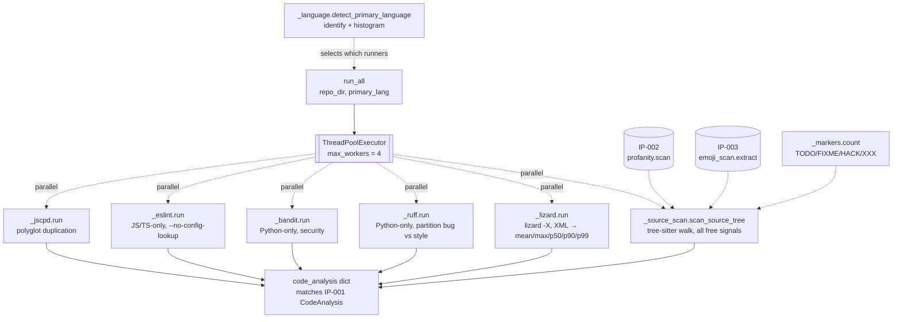

# IP-004: Static analyzers — single-walk source scanning + language-dispatched linters

Language-dispatched static analysis of a checked-out repo. Walks the source tree **once**, feeds every comment and identifier to both sibling text signals (IP-002 profanity, IP-003 emoji), and layers on external metric tools run **in parallel** — `lizard` (always), `ruff` + `bandit` (Python), `eslint` (JS/TS), `jscpd` (polyglot duplication). Produces the `code_analysis` sub-document defined by IP-001, with enough metric breadth to honestly underwrite the quality axis of the study.

<!-- more -->

## Status

**Status**: Implemented
**Last Updated**: 2026-04-24
**Implementation**: Complete

## Problem Statement

Stage 4 of the pipeline ([DRAFT §5.4](../../DRAFT.md)) is where per-repo quality metrics get produced. The worker (IP-007) hands over a clone directory + a primary-language guess; this module is expected to return a populated `code_analysis` object that fits [IP-001's `CodeAnalysis` schema](ip-001-foundations.md).

Two structural constraints shape the module:

- **One tree walk, both signals.** PLAN.md is explicit: profanity and emoji must be scanned in **one pass** over comments and identifiers. Scanning twice would double I/O on thousands of repos and — worse — diverge over time if the filtering rules (which extensions count, which files to skip) evolve in one path but not the other.
- **Signal-agnostic worker.** IP-007 must not know that "there are two text signals." It calls `analyzers.run_all(repo_dir, primary_lang)` and gets back a dict. Adding a third signal later (sentiment, complexity-of-language, etc.) must not force changes in the worker or in the DB schema reads.

Beyond those, the module has to contend with real-world static-analyzer ergonomics that have shifted since the DRAFT was written:

- **ESLint v10 (February 2026) removed `--no-eslintrc`** and the legacy `.eslintrc.*` config system entirely. The DRAFT's `eslint --no-eslintrc --config /opt/baseline-eslint.json` invocation will not run. The replacement is `--no-config-lookup` + a flat config file (`eslint.config.mjs`).
- **`lizard` has no JSON output.** v1.22.1 (April 2026) still ships `-X`/`-csv`/`--checkstyle`. The summary footer lizard prints to stdout isn't in the XML body — we have to aggregate per-function records ourselves. **Upside:** once we parse per-function XML, percentile metrics (p50/p90/p99 CCN, p90 NLOC) are a few `statistics.quantiles` calls away — they protect the quality axis against the known skew of `avg_ccn` on many-trivial-function repos.
- **Comment and identifier extraction via hand-rolled regex** is brittle for polyglot code. Triple-quoted Python strings, `//` inside JavaScript string literals, and nested `/* */` all trip naive regex. Tree-sitter grammars (via `tree-sitter-language-pack`) solve this at AST precision — 305+ compiled grammars, fast C/Rust parsers, UTF-8 native, and a clean `(comment)` / `(identifier)` node query surface. Investing in tree-sitter now also gives IP-008 an optional foothold for AST-level follow-ups (function signatures, call patterns) without swapping the extraction backend later.

And one orthogonal concern that shapes the orchestration: **is the DRAFT's tool set actually enough to call "code quality"?** Ruff-default is mostly style, `avg_ccn` is a weak aggregate, and duplication / security are entirely missing. The correlation story in IP-008 is only as strong as the metric breadth here. Adding low-cost axes — TODO/FIXME density, comment-to-code ratio, CCN percentiles, bug-vs-style split, duplication (`jscpd`), Python security (`bandit`) — is cheap if the tool runners execute **in parallel**; serialized, the extra tools push worst-case analyzer time past the 10-minute per-repo cap in IP-007.

**Who is affected:** IP-007 (depends on this), IP-008 (reads the output). The per-signal correlation plots downstream (`profanity_vs_quality`, `emoji_vs_quality`) only exist because this module produced the numbers in `code_analysis`.

**Consequences of not addressing this:** the worker can't run; no `code_analysis` rows are produced; Stage 5 has nothing to correlate; the whole right-hand side of the study is blank.

## Proposed Solution

A small `oss_profanity/analyzers/` subpackage that exposes exactly two public names — `detect_primary_language` and `run_all` — and internally decomposes into one module per responsibility. **Single source walk** feeds both signals; **per-tool subprocess wrappers** are independent and composed at the top.

### Overview

- **Subpackage, not a single 400-line file.** Small modules, one per responsibility. Public surface is two functions re-exported from `__init__`. Internal modules are `_`-prefixed at the file level (`_walk.py`, `_tokens.py`, …) because the package is cohesive but not intended as a reusable library outside this repo.
- **Tree-sitter for comment + identifier extraction.** `tree-sitter-language-pack` bundles 305+ compiled grammars behind a single PyPI install. Per file, `parser.parse(source_bytes)` returns a full AST; a cached `(comment) @c` / `(identifier) @n` query extracts exactly the nodes we want. C/Rust parsers run ~10× faster than Pygments and eliminate the string-literal / docstring / nested-comment edge cases regex would trip on. The DRAFT's regex approach is rejected — see Alternative 1.
- **`identify` for the language histogram** — tiny, pure-Python, extension→language mapping from the pre-commit maintainers. Used only for `detect_primary_language`; the source-scan path uses `identify` tags to pick the tree-sitter language (`python` → `get_parser("python")`) and skips extraction gracefully on files whose language has no grammar in the pack.
- **One-walk, multi-signal orchestration.** `_scan_source_tree` walks once; `_extract_tokens` returns `(comments, identifiers)` per file; each pair is fed to **all free-in-the-walk signals** before moving on: `profanity.scan`, `emoji_scan.extract`, `_markers.count` (TODO/FIXME/HACK/XXX), plus comment-NLOC accumulation. Adding a hypothetical fourth signal later means plugging into the same loop body, not adding a second walk.
- **Language-dispatched linters, parallel execution.** `lizard` is always invoked. `ruff` + `bandit` run when `primary_lang == "Python"`. `eslint` runs when `primary_lang in ("JavaScript", "TypeScript")`. `jscpd` always runs (polyglot). All applicable tools — plus the walk — fan out across a `ThreadPoolExecutor(max_workers=4)` so wall-time is bounded by the slowest single tool, not their sum. Each wrapper is self-contained and returns a typed result; `run_all` collects futures and composes the dict.
- **Lizard client-side aggregation with percentiles.** Parse the XML per-function records; compute `lizard_avg_ccn` (mean), `lizard_max_ccn`, `lizard_functions`, plus `lizard_ccn_p50` / `p90` / `p99` and `lizard_nloc_p90` via `statistics.quantiles`. Percentiles are free once the XML is parsed and are strictly more robust aggregates than the mean.
- **Ruff one-run, partition-after.** Run `ruff check` once with a broad selection (`--select=E,W,F,I,N,UP,B,A,C4,SIM,RUF,S`) and `--exit-zero --output-format=json`. Partition findings by rule-code prefix into `ruff_bug_issues` (`F*`, `E9*`, `B*`, `S*`, `RUF*`) and `ruff_style_issues` (everything else). Keep `ruff_issues` as the sum for IP-001 back-compat. One subprocess, two signals.
- **Bandit for Python security.** `bandit -r -f json --exit-zero <repo>` produces a JSON report with per-issue severity. Report total count + high-severity count.
- **jscpd for polyglot duplication.** `jscpd --silent --reporters json <repo>` produces a `report.json` with `duplicatedLines` + total lines. Report `jscpd_duplicate_lines` and `jscpd_duplicate_rate` (duplicated / total).
- **TODO/FIXME/HACK/XXX from the walk.** Regex on the already-extracted comment node text; single aggregate `tech_debt_markers` count. Free.
- **Comment-to-code ratio from the walk.** `comment_nloc` is the sum of newlines across every `(comment)` node's byte range (tree-sitter nodes carry `start_point` / `end_point` line numbers, so this is addition, not re-parsing); `comment_to_code_ratio = comment_nloc / loc_total` if `loc_total > 0`. Free.
- **ESLint v10 flat config.** Baseline config shipped at `/opt/baseline-eslint.config.mjs` by IP-009's Dockerfile; invoked with `--no-config-lookup --config <path>`. Legacy `--no-eslintrc` explicitly not used.
- **Ruff `--exit-zero`.** Distinguishes "tool crashed" (exit 2) from "findings exist" (would be exit 1 without the flag). Record findings count on exit 0; treat exit 2 as `None` + logged warning.
- **`subprocess.run` with `timeout=` + `check=False`.** Sufficient for single-process tools. Docker-level PID-1 reaping handled by IP-009 (`init: true` in `compose.yml`).
- **ThreadPoolExecutor, not `multiprocessing`.** Subprocess calls release the GIL while waiting on `Popen.communicate`; threads are the cheap right primitive. The tree-sitter walk spends most of its time inside C parser code (which releases the GIL) with short Python bursts between files, so it coexists with subprocess waits without GIL contention.

### Key Components

1. **`oss_profanity/analyzers/__init__.py`** — public surface: re-exports `detect_primary_language` and `run_all`. No logic.
2. **`_language.py`** — `detect_primary_language(repo_dir) -> str | None` via `identify` extension tags + histogram; returns the most common tag or `None` for empty/undetected trees.
3. **`_walk.py`** — `iter_source_files(repo_dir) -> Iterable[Path]`; applies the skip rules (dir blocklist, minified-name blocklist, size cap, binary guard). Single source of truth for "which files count."
4. **`_tokens.py`** — `extract(path, language_tag) -> ExtractedTokens`: looks up the tree-sitter grammar via `tree_sitter_language_pack.get_parser(language_tag)`; parses `path.read_bytes()`; runs two cached `Query` objects (`(comment) @c`, `(identifier) @n`) over the tree; returns `(comments, identifiers, comment_nloc)`. Parser is created fresh per file because tree-sitter `Parser` objects are not thread-safe. Unsupported language (no grammar in the pack) → empty tokens + zero NLOC; the file still counts in `files_scanned` + `loc_total`.
5. **`_markers.py`** — `count(comments: list[str]) -> int`: counts TODO / FIXME / HACK / XXX occurrences in comment text. Called from `_source_scan` on the already-extracted comments; single aggregate signal so we don't fan out into four near-useless scalar fields.
6. **`_source_scan.py`** — `scan_source_tree(repo_dir) -> SourceScanResult`: orchestrates walk + extract + all free-in-the-walk signals (profanity, emoji, markers, comment NLOC). Returns the subset of `CodeAnalysis` fields it owns (`loc_total`, `files_scanned`, `comment_nloc`, `comment_to_code_ratio`, `comment_profanity_hits`, `identifier_profanity_hits`, `comment_emoji_hits`, `identifier_emoji_hits`, `emoji_top`, `tech_debt_markers`).
7. **`_lizard.py`** — `run(repo_dir) -> LizardResult`: shells out, parses XML, aggregates mean + max + count + **percentiles** (`ccn_p50`, `ccn_p90`, `ccn_p99`, `nloc_p90`). Returns all-`None` on tool error or timeout.
8. **`_ruff.py`** — `run(repo_dir) -> RuffResult`: shells out once with a broad `--select` set; partitions findings by rule-code prefix into bug vs style; returns `(total, bug, style)` or all-`None` on tool error.
9. **`_bandit.py`** — `run(repo_dir) -> BanditResult`: shells out to `bandit -r -f json --exit-zero`; returns total issue count + high-severity count, or all-`None`.
10. **`_eslint.py`** — `run(repo_dir) -> int | None`: shells out to eslint with `--no-config-lookup --config /opt/baseline-eslint.config.mjs`, sums issues across files.
11. **`_jscpd.py`** — `run(repo_dir) -> JscpdResult`: shells out to jscpd with JSON reporter; returns `(duplicate_lines, total_lines)` or all-`None`.
12. **`_runner.py`** — `run_all(repo_dir, primary_lang) -> dict`: the **parallel orchestrator**. Submits the walk + all applicable tool runners to a `ThreadPoolExecutor(max_workers=4)`, collects results, computes KLOC-normalized ratios, and assembles the `CodeAnalysis`-shaped dict. The only module that knows which tools apply to which language.

### Architecture



`detect_primary_language` is shown once because IP-007 calls it **before** calling `run_all`; it is an independent public function, not a sub-step of `run_all`. The `ThreadPoolExecutor` fan-out is the core of the orchestration — every box under `POOL` runs concurrently; total wall-time for `run_all` is `max(task_times) + constant`, not `sum(task_times)`.

### Design principles applied

The module is the most complex in the project (~450–600 LOC projected with the expanded metric surface); SOLID/DRY is load-bearing here, not decorative.

- **Single Responsibility.** Each `_` module does one thing and returns a typed result. `_walk` decides what files exist; `_tokens` owns the tree-sitter parser lifecycle and extraction queries; `_markers` recognizes tech-debt markers; `_source_scan` is the only place that **combines** walk + extract + all free-in-the-walk signals; each `_<tool>.py` module owns one subprocess invocation; `_runner` is the only place that knows about parallelism and language dispatch.
- **Open/Closed.** Adding a sixth external tool (say `mypy` for type errors, or `semgrep`) adds a new `_<tool>.py` and one `submit()` line in `_runner`. It does not touch `_walk`, `_tokens`, `_source_scan`, or the existing runners. Same for a free-in-the-walk signal — it plugs into `_source_scan` at the `for file in files:` loop body, not into the walker. Adding a fourth text signal (e.g., sentiment) follows the same `_markers`-like pattern: a private module with a `count()`/`scan()` function, called from `_source_scan`.
- **DRY.** The single source walk parses each file once with tree-sitter and feeds profanity + emoji + markers + comment-NLOC in one pass — the two queries (`(comment)`, `(identifier)`) run against the same AST. Skip rules live in one place (`_walk`). Subprocess-run-with-timeout **does get factored** once there are five callers (`_lizard`, `_ruff`, `_bandit`, `_eslint`, `_jscpd`) — `_subprocess_util.run_tool(argv, timeout) -> CompletedProcess | None` in a small helper module, since the pattern is identical across all five and regressing between them would be annoying.
- **Interface Segregation.** IP-007 (the worker) calls two public functions and sees typed dicts. It never imports anything from `_walk`, `_tokens`, `_markers`, or the tool runners.
- **Dependency Inversion.** The signal modules (IP-002, IP-003) are imported by `_source_scan` by name; they are the stable contracts. The five tool runners are not inverted behind an interface — they are all internal, all known, all lightly-different-shaped. Introducing a `Runner` Protocol would be overengineering at N=5 when each runner's result shape differs (some return `int`, some return multi-field dataclasses).

## Implementation Plan

### Phase 1: subpackage skeleton

- [ ] Create `oss_profanity/analyzers/` with `__init__.py` exporting `detect_primary_language` and `run_all`
- [ ] Result value objects as frozen dataclasses in their owning modules: `ExtractedTokens`, `SourceScanResult`, `LizardResult`, `RuffResult`, `BanditResult`, `JscpdResult`
- [ ] `_subprocess_util.run_tool(argv, timeout) -> CompletedProcess | None` — shared helper; catches `TimeoutExpired` and `FileNotFoundError`, returns `None` on either, logs at WARNING
- [ ] `_walk.iter_source_files(repo_dir: Path) -> Iterable[Path]` — skip rules encoded as module-level frozensets of directory names and filename patterns; size check via `os.stat().st_size`
- [ ] `_language.detect_primary_language(repo_dir: Path) -> str | None` — `identify.tags_from_filename` histogram over files returned by `iter_source_files`

### Phase 2: token extraction + source scan

- [ ] `_tokens.LANGUAGE_TAG_TO_TS: dict[str, str]` — module-level mapping from `identify` tags (`python`, `javascript`, `typescript`, `go`, `rust`, `ruby`, `java`, `c`, `c++`, `c#`, `kotlin`, `swift`, `php`, `scala`, `shell`, …) to `tree-sitter-language-pack` parser names. Tags with no mapping → extraction skipped.
- [ ] `_tokens._get_queries(language_tag) -> tuple[Query, Query]` — lazy-cache module-level `dict[str, tuple[Query, Query]]` keyed by language tag; builds comment + identifier `Query` objects once per process per language (build is ~ms-level; query execution is ns-level)
- [ ] `_tokens.extract(path: Path, language_tag: str) -> ExtractedTokens` — `parser = get_parser(language_tag)` (fresh parser per file; tree-sitter `Parser` is not thread-safe); `tree = parser.parse(path.read_bytes())`; run comment + identifier queries against `tree.root_node`; decode each matched node's bytes as UTF-8 with `errors="replace"`; `comment_nloc` computed from each comment node's `end_point[0] - start_point[0] + 1`
- [ ] `_markers.count(comments: list[str]) -> int` — compiled regex `\b(TODO|FIXME|HACK|XXX)\b` (case-sensitive by convention); single aggregate count
- [ ] `_source_scan.scan_source_tree(repo_dir: Path) -> SourceScanResult` — single walk, resolves each file's language tag via `identify`, calls `_tokens.extract(path, tag)` (or skips extraction if tag unsupported while still counting `loc_total` + `files_scanned`), calls `profanity.scan` + `emoji_scan.extract` + `_markers.count` on joined comment/identifier text; accumulates counts + `Counter` for emoji_top; computes `comment_to_code_ratio = comment_nloc / loc_total` (or `None` if `loc_total == 0`); truncates emoji_top to `config.emoji_top_n`

### Phase 3: tool wrappers (each runs in its own thread)

- [ ] `_lizard.run(repo_dir, timeout=120) -> LizardResult` — `lizard -X <repo_dir>`; parse XML; compute `avg_ccn`, `max_ccn`, `functions`, `ccn_p50`, `ccn_p90`, `ccn_p99`, `nloc_p90` via `statistics.quantiles(data, n=100, method="inclusive")` on per-function CCN / NLOC lists. All-`None` on timeout or non-zero exit.
- [ ] `_ruff.run(repo_dir, timeout=120) -> RuffResult` — `ruff check --output-format=json --exit-zero --select=E,W,F,I,N,UP,B,A,C4,SIM,RUF,S <repo_dir>`; partition JSON items by `code` prefix into `bug_issues` (F, E9, B, S, RUF) and `style_issues` (everything else); `total = bug + style`. All-`None` on exit code 2 or timeout.
- [ ] `_bandit.run(repo_dir, timeout=120) -> BanditResult` — `bandit -r -f json --exit-zero --quiet <repo_dir>`; parse `results[]`; return total count + high-severity count; all-`None` on non-JSON output or timeout
- [ ] `_eslint.run(repo_dir, timeout=180, config_path="/opt/baseline-eslint.config.mjs") -> int | None` — `eslint --no-config-lookup --config <config> --format=json <repo_dir>`; sum `errorCount + warningCount` across the per-file JSON array; `None` on timeout or empty stdout with non-zero exit
- [ ] `_jscpd.run(repo_dir, timeout=180) -> JscpdResult` — `jscpd --silent --reporters json --output <tmpdir> <repo_dir>`; read `tmpdir/jscpd-report.json`; return `(duplicate_lines, total_lines)` from the `statistics.total` block; all-`None` on timeout or missing report

### Phase 4: parallel orchestrator

- [ ] `_runner.run_all(repo_dir, primary_lang) -> dict` — create `ThreadPoolExecutor(max_workers=4)`; submit `_source_scan.scan_source_tree` + `_lizard.run` + `_jscpd.run` unconditionally; conditionally submit `_ruff.run` + `_bandit.run` (Python) or `_eslint.run` (JS/TS); collect via `future.result()` with no extra timeout (each runner has its own); compose results into the `CodeAnalysis`-shaped dict; compute all `_per_kloc` normalizations when `loc_total > 0`
- [ ] Return dict uses the exact field names from [IP-001's `CodeAnalysis`](ip-001-foundations.md); the schema's `extra="allow"` absorbs the new fields on the read side, no IP-001 amendment strictly required (documented as optional in IP-001's Future Considerations on the next read)

### Phase 5: tests

- [ ] **Fixture repos** under `oss_profanity/tests/fixtures/`:
  - `tiny_py/` — one `.py` file with a profane comment, an emoji in a comment, an emoji in an identifier (e.g., `def 🚀_deploy(): pass`), a `# TODO: fix this` marker, bad-style lines for ruff, a bandit-flagged `eval(...)` call, and a duplicated 6-line block for jscpd
  - `tiny_js/` — one `.js` file with an emoji, a profane comment, a `// FIXME` marker, a `let foo = 1` without semicolon for eslint, and a duplicated block for jscpd
  - `tiny_polyglot/` — one `.py`, one `.js`, one `.rs`, one `README.md`; confirms language dispatch picks the one with the most files
  - `skip_me/` — `node_modules/`, `vendor/`, `.git/`, `dist/`, plus a `huge.bin` > 1 MB and a `bundle.min.js`; confirms the walker skips them
- [ ] **`_walk` tests** — parametrized per-rule: dir blocklist, filename substrings, size cap
- [ ] **`_language` tests** — empty → `None`; polyglot → majority; deterministic tie-break
- [ ] **`_tokens` tests** — Python docstring → matched by `(comment)` query; JS template literal containing `// not-a-comment` → **not** matched (AST-level correctness — regex would fail this); Rust doc comment `///` → matched; unsupported language tag → empty lists, no crash; `comment_nloc` counts `end_point - start_point + 1` lines, never double-counts across sibling comments
- [ ] **`_markers` tests** — `"TODO: foo"` counts; `"TODOS list"` does not (word-boundary); case-sensitive; all four markers recognized
- [ ] **`_source_scan` DRY contract test** — one comment containing a profane word, an emoji, AND a TODO marker: asserts `comment_profanity_hits == 1` AND `comment_emoji_hits == 1` AND `tech_debt_markers == 1` after one walk
- [ ] **`_lizard` tests** — populated result on fixture; percentiles present when `functions >= 2`; `functions == 1` or empty repo → mean/max set, percentiles `None` (`quantiles` needs n≥2); timeout path via `monkeypatch.setattr(subprocess, "run", _raises_TimeoutExpired)`
- [ ] **`_ruff` tests** — bug + style split adds up to total; a fixture with a clear `F401` (unused import) lands in `bug_issues`; a fixture with only `E501` (line too long) lands in `style_issues`; exit code 2 → all-`None`
- [ ] **`_bandit` tests** — `eval(...)` fixture produces non-zero high-severity count; missing bandit binary → all-`None`
- [ ] **`_eslint` tests** — missing binary / missing baseline config → `None`; document that real eslint runs only in the Docker harness (IP-009)
- [ ] **`_jscpd` tests** — duplicated-block fixture → non-zero `duplicate_lines`; missing binary → all-`None`
- [ ] **`_runner` parallelism test** — `monkeypatch` each `_<tool>.run` with a function that `time.sleep(0.2)` and records a wall-clock start; assert all observed start times fall inside a ~50 ms window (proves parallel dispatch, not serial)
- [ ] **`run_all` integration test** — returns a dict accepted by `Repo.model_validate` when merged under `code_analysis`; all new fields present; KLOC-normalized ratios set when `loc_total > 0`
- [ ] **Public surface test** — `oss_profanity.analyzers` exports exactly `detect_primary_language` and `run_all`

### Phase 6: dependencies

- [ ] `tree-sitter-language-pack >= 0.3` in `requirements.txt` (bundles 305+ grammars as compiled wheels; ships `py.typed`)
- [ ] `tree-sitter >= 0.23` pulled transitively — pin if transitive drift becomes a problem
- [ ] `identify >= 2.6` in `requirements.txt`
- [ ] `lizard >= 1.22` in `requirements.txt`
- [ ] `bandit >= 1.7` in `requirements.txt` (Python library + CLI; lightweight)
- [ ] `ruff >= 0.5` on PATH — IP-009 Dockerfile concern
- [ ] Node.js + `eslint >= 9.0` + `@eslint/js` + `typescript-eslint` + `jscpd >= 4` — IP-009 Dockerfile concern (versions pinned per Q2 resolution)
- [ ] Baseline ESLint config at `/opt/baseline-eslint.config.mjs` — IP-009

### Prerequisites

- IP-001 (provides `config.emoji_top_n`, the `CodeAnalysis` target shape)
- IP-002 (provides `profanity.scan`)
- IP-003 (provides `emoji_scan.extract`)
- Python 3.11+

## Technical Details

### Technology Stack

- **tree-sitter via `tree-sitter-language-pack`** — comment + identifier extraction. Chosen over hand-rolled regex (false positives on docstrings, nested comments, strings-with-comment-markers) and Pygments (~10× slower, no AST affordances for IP-008 follow-ups). Ships 305+ compiled grammars in a single wheel; a per-process cache of `Query` objects keeps extraction close to raw parser throughput.
- **identify** — extension-based language histogram and tree-sitter parser selector. Tiny, pure-Python, from the pre-commit maintainers. Chosen over GitHub Linguist (Ruby, heavy).
- **lizard (Python CLI)** — cyclomatic complexity + NLOC across ~20 languages. No JSON output; XML is the cleanest integration path. Per-function records carry enough detail that **mean + max + count + p50/p90/p99 percentiles are all free** once the XML is parsed.
- **ruff** — Python linter; `--output-format=json --exit-zero` produces a stable JSON array; exit code 2 signals tool error vs findings. Rule-code prefix allows bug-vs-style partitioning from a single run.
- **bandit** — Python security scanner. Focus is security anti-patterns (`eval`, hardcoded secrets, insecure deserialization). JSON output, per-issue severity. One extra subprocess, parallel with ruff.
- **ESLint v9+** — JS/TS linter; flat config (`eslint.config.mjs`) is the only supported format in v10. Use `--no-config-lookup --config /opt/baseline-eslint.config.mjs` for portable behavior.
- **jscpd** — polyglot copy-paste detector. Node-based; piggybacks on the ESLint Docker layer. Ships JSON reporter. Covers a quality axis (duplication) that nothing else in the stack reports.
- **Stdlib `concurrent.futures.ThreadPoolExecutor`** — thread-based parallelism. Subprocess calls release the GIL while blocked on I/O; tree-sitter parsing runs in C and also releases the GIL for the parse itself, leaving only short Python bursts between files. Threads are the right primitive here; `multiprocessing` would add fork overhead for no throughput gain.
- **Stdlib `subprocess`, `xml.etree.ElementTree`, `json`, `statistics`** — no third-party runners; `subprocess.run(timeout=..., capture_output=True, check=False)` is sufficient at this scale for all five tools. `statistics.quantiles` gives percentiles without numpy.
- **Stdlib `dataclasses`** for result value objects — frozen, explicit internal contracts, no Pydantic overhead (validation is at DB-read boundary).

### Data Model

The returned dict uses [IP-001's `CodeAnalysis`](ip-001-foundations.md) field names for fields that exist there, and adds new fields that IP-001's `ConfigDict(extra="allow")` absorbs without amendment. A small IP-001 changelog note is appropriate so the new fields are discoverable; promotion to typed fields on `CodeAnalysis` is optional and can be deferred to IP-008 when readers start consuming them by name.

**Existing IP-001 fields (populated as before):**

| Field | Source | Note |
|---|---|---|
| `loc_total` | `_source_scan` | Sum of non-blank lines across scanned files |
| `files_scanned` | `_source_scan` | Count of files not skipped |
| `comment_profanity_hits` | `_source_scan` via IP-002 | Total hit count across all comments |
| `identifier_profanity_hits` | `_source_scan` via IP-002 | Total hit count across all identifiers |
| `comment_emoji_hits` | `_source_scan` via IP-003 | Total emoji occurrences in comments |
| `identifier_emoji_hits` | `_source_scan` via IP-003 | Total emoji occurrences in identifiers |
| `emoji_top` | `_source_scan` | Top-N per-glyph counter, N = `config.emoji_top_n` |
| `ruff_issues` | `_ruff` | Sum of bug + style; `None` unless Python |
| `ruff_issues_per_kloc` | computed | `ruff_issues / (loc_total / 1000)` when both present |
| `eslint_issues` | `_eslint` | `None` unless JS/TS |
| `eslint_issues_per_kloc` | computed | `eslint_issues / (loc_total / 1000)` when both present |
| `lizard_avg_ccn` | `_lizard` | Arithmetic mean of per-function CCN |
| `lizard_max_ccn` | `_lizard` | Max per-function CCN |
| `lizard_functions` | `_lizard` | Count of functions |

**New fields added by IP-004 (absorbed via `extra="allow"`):**

| Field | Source | Note |
|---|---|---|
| `comment_nloc` | `_source_scan` | Non-blank comment lines across scanned files |
| `comment_to_code_ratio` | computed | `comment_nloc / loc_total` when `loc_total > 0`; else `None` |
| `tech_debt_markers` | `_source_scan` via `_markers` | TODO + FIXME + HACK + XXX aggregate count |
| `lizard_ccn_p50` | `_lizard` | P50 of per-function CCN; `None` with fewer than 2 functions |
| `lizard_ccn_p90` | `_lizard` | P90 — robust-to-outliers quality signal |
| `lizard_ccn_p99` | `_lizard` | P99 — catches "one monster" repos |
| `lizard_nloc_p90` | `_lizard` | P90 per-function NLOC |
| `ruff_bug_issues` | `_ruff` | Findings with codes in `{F, E9, B, S, RUF}` |
| `ruff_style_issues` | `_ruff` | Remaining findings |
| `ruff_bug_issues_per_kloc` | computed | Bug subset KLOC-normalized |
| `ruff_style_issues_per_kloc` | computed | Style subset KLOC-normalized |
| `bandit_issues` | `_bandit` | Total bandit findings |
| `bandit_high_severity` | `_bandit` | High-severity subset |
| `bandit_issues_per_kloc` | computed | `bandit_issues / (loc_total / 1000)` |
| `jscpd_duplicate_lines` | `_jscpd` | Lines inside detected duplicate blocks |
| `jscpd_total_lines` | `_jscpd` | Total lines jscpd considered |
| `jscpd_duplicate_rate` | computed | `jscpd_duplicate_lines / jscpd_total_lines` |

All new scalar fields default to `None` on tool error / timeout / inapplicable language so IP-008 can filter on "has this metric" cleanly.

### Subprocess invocations

```bash
# Always (polyglot)
lizard -X <repo_dir>
jscpd --silent --reporters json --output <tmpdir> <repo_dir>

# Python only
ruff check --output-format=json --exit-zero \
  --select=E,W,F,I,N,UP,B,A,C4,SIM,RUF,S <repo_dir>
bandit -r -f json --exit-zero --quiet <repo_dir>

# JavaScript / TypeScript only (ESLint v10)
eslint --no-config-lookup --config /opt/baseline-eslint.config.mjs \
  --format=json <repo_dir>
```

All wrapped via `_subprocess_util.run_tool(argv, timeout)`, which is `subprocess.run(..., capture_output=True, check=False, timeout=<t>)` with `TimeoutExpired` / `FileNotFoundError` caught and logged at WARNING. Timeouts: 120 s for lizard + ruff + bandit; 180 s for eslint + jscpd. On any failure mode (timeout, missing binary, non-parseable output, exit code 2), the wrapper returns `None`/all-`None` and IP-008 can count tool-failure rates per cohort.

### Parallel orchestration

`_runner.run_all` uses a bounded `ThreadPoolExecutor` to fan out the walk and all applicable tools. Threading (not multiprocessing) is correct here because the subprocess tools release the GIL while blocked on `Popen.communicate`, and the tree-sitter walk spends most of its time inside C parser code (also GIL-releasing).

```python
from concurrent.futures import ThreadPoolExecutor

def run_all(repo_dir: Path, primary_lang: str | None) -> dict:
    with ThreadPoolExecutor(max_workers=4) as pool:
        walk_fut   = pool.submit(_source_scan.scan_source_tree, repo_dir)
        lizard_fut = pool.submit(_lizard.run, repo_dir)
        jscpd_fut  = pool.submit(_jscpd.run, repo_dir)
        ruff_fut = bandit_fut = eslint_fut = None
        if primary_lang == "Python":
            ruff_fut   = pool.submit(_ruff.run, repo_dir)
            bandit_fut = pool.submit(_bandit.run, repo_dir)
        elif primary_lang in ("JavaScript", "TypeScript"):
            eslint_fut = pool.submit(_eslint.run, repo_dir)

        source = walk_fut.result()
        lizard = lizard_fut.result()
        jscpd  = jscpd_fut.result()
        ruff   = ruff_fut.result()   if ruff_fut   else None
        bandit = bandit_fut.result() if bandit_fut else None
        eslint = eslint_fut.result() if eslint_fut else None

    return _compose(source, lizard, jscpd, ruff, bandit, eslint)
```

Peak concurrent tasks: **5 for a Python repo** (walk + lizard + jscpd + ruff + bandit), capped at 4 by the pool. The fifth queues and starts as soon as any of the first four completes; ruff typically finishes first (Rust, sub-second), so the queue depth is effectively zero in practice.

**Wall-time estimate** (small repo, ~2 kLOC):

| Tool | Serial | Parallel (max_workers=4) |
|---|---|---|
| walk (tree-sitter) | ~0.3 s | |
| lizard | ~5 s | |
| ruff | ~1 s | |
| bandit | ~3 s | |
| jscpd | ~4 s | |
| **Python total** | **~15 s** | **~5 s** (≈ max of tools) |
| eslint | ~10 s | |
| **JS/TS total** | **~21 s** | **~10 s** (eslint dominates) |

Worst-case (large repo, all tools at their 120–180 s timeout): parallel wall-time ≈ 180 s vs serial ≈ 660 s. This keeps run-all comfortably under IP-007's 600 s per-repo cap even on pathological inputs.

**CPU oversubscription.** IP-007 runs 12 concurrent repos per worker host (16 vCPU). Per-repo average is ~1.3 vCPU; `max_workers=4` briefly reserves 4 threads, but only one (the tree-sitter walk) holds a Python stack at any moment — the rest are blocked on subprocess I/O, and the parser itself runs in C with the GIL released. Effective CPU use per repo stays close to 1 core. `max_workers=4` was picked (not 6, not 8) to keep this headroom intact; bumping it would not speed anything up given the task count and would risk thrashing the shared worker host.

### Walker skip rules (single source of truth)

```python
_SKIP_DIRS: Final[frozenset[str]] = frozenset({
    "node_modules", "vendor", ".git", "dist", "build",
    ".venv", "venv", "__pycache__", ".tox", ".mypy_cache",
})
_SKIP_NAME_SUBSTRINGS: Final[tuple[str, ...]] = (".min.", ".bundle.")
_MAX_FILE_BYTES: Final[int] = 1_048_576  # 1 MB
```

Tests exist specifically to pin these values (adding `".mypy_cache"` won't silently change production behavior).

### Configuration

Tunables that could plausibly become env-driven later, but stay as module constants for now (per the repo's "defer 'maybe later' parameters" principle):

| Constant | Default | Promote to `config.py` when |
|---|---|---|
| Lizard / Ruff / Bandit timeout | 120 s | A real run shows repos consistently hitting it |
| ESLint / jscpd timeout | 180 s | Same |
| `ThreadPoolExecutor(max_workers=...)` | 4 | Host CPU topology changes materially |
| ESLint baseline config path | `/opt/baseline-eslint.config.mjs` | IP-009 ships more than one baseline |
| Ruff `--select` list | `E,W,F,I,N,UP,B,A,C4,SIM,RUF,S` | Rule set needs to vary per-study |
| Ruff bug-code prefixes | `{F, E9, B, S, RUF}` | Bug-vs-style partition needs tuning |
| Marker regex | `\b(TODO|FIXME|HACK|XXX)\b` | Study wants to track additional markers |

The `emoji_top` cap is already in `config.emoji_top_n` (set in IP-001); this module reads from there rather than hardcoding 20.

### Baseline ESLint config

Shipped by IP-009 — documented here so the contract with this module is explicit:

```js
// /opt/baseline-eslint.config.mjs
import js from "@eslint/js";
import tseslint from "typescript-eslint";
export default [
  {
    files: ["**/*.{js,mjs,cjs,jsx,ts,tsx}"],
    ...js.configs.recommended,
  },
  ...tseslint.configs.recommended,
];
```

No project-specific plugins, no parser overrides — this is the "what does stock ESLint say about your code" baseline. Trade-off: under-counts issues on repos that use modern plugins (security, accessibility); the study compares **relative** rates across cohorts, so a uniformly-configured baseline is more important than a comprehensive one.

## Alternatives Considered

### Alternative 1: Pygments for comment + identifier extraction

**Description**: Use Pygments (`pip install Pygments`) with `get_lexer_for_filename` and filter `Token.Comment.*` / `Token.Name.*` out of the token stream.

**Pros**:
- ~10 MB wheel (vs ~100 MB for tree-sitter-language-pack)
- 500+ lexers covers a broader long tail than the tree-sitter grammar pack
- Pure Python — no C/Rust build surface, no grammar version drift
- Stateless lexers — trivially thread-safe

**Cons**:
- ~10× slower than tree-sitter in raw throughput; at 1500 repos × ~10 kLOC avg the difference is minutes of wall time across the study
- Lexer-level tokenization, not AST — no affordance for future IP-008 follow-ups that want node-level information (function signatures, call sites, nesting depth)
- Some lexers are under-maintained vs tree-sitter's GitHub/Zed-driven grammar churn

**Why not chosen**: Q1-resolved. Tree-sitter's speed advantage matters at the corpus scale the study operates at, and the AST optionality is a cheap strategic investment for later studies. The ~100 MB image-size delta is the only real cost and is absorbed by IP-009's already-sizable image (Node + eslint + jscpd).

### Alternative 2: Semgrep for cross-language static analysis

**Description**: Replace ruff + eslint + lizard with a single `semgrep --config=auto` run per repo.

**Pros**:
- One tool covers ~30 languages uniformly
- Rule set is configurable; could express the cyclomatic-complexity metric lizard provides
- Active upstream, good Docker story

**Cons**:
- Two distinct metric axes (lint issues vs cyclomatic complexity) would both collapse into "semgrep findings count" unless we split rule sets — at which point we're back to language dispatch
- `--config=auto` fetches rules from Semgrep's registry at runtime — adds network dependency + non-determinism across runs
- Community rules differ in strictness per language, so cross-language comparisons become apples-to-oranges unless we author a unified ruleset (big scope)

**Why not chosen**: the study needs **reproducible per-language metrics**. Three well-scoped tools with pinned flags beats one broad tool with variable rule sets.

### Alternative 3: Parse lizard's footer summary instead of aggregating per-function XML

**Description**: Run lizard without `-X`, regex-scrape the "Total nloc, Avg.NLOC, AvgCCN, Avg.token, function_cnt" footer from stdout.

**Pros**:
- No XML parser in the loop
- Footer is human-readable and stable

**Cons**:
- Regex-scraping human-readable stdout is exactly the kind of fragile integration this proposal is trying to avoid elsewhere
- Misses `lizard_max_ccn` — the footer doesn't include the max
- One lizard release away from breaking if upstream tweaks the summary wording

**Why not chosen**: XML parsing is a few lines with `xml.etree.ElementTree` and is version-stable.

### Alternative 4: Run ruff twice (once for bugs, once for style) instead of partitioning one run

**Description**: Run `ruff check --select=F,E9,B,S,RUF <repo>` and `ruff check --select=E,W,I,N,UP,A,C4,SIM <repo>` as two separate subprocesses; report `ruff_bug_issues` and `ruff_style_issues` from each.

**Pros**:
- Clearer mapping: each subprocess corresponds to one schema field
- No risk of mis-partitioning a rule code we didn't anticipate
- Trivially parallelizable (two more `submit()` calls)

**Cons**:
- Doubles the ruff subprocess cost (start-up, file-tree walk, caching) — ruff is fast (Rust), but ~2× is still measurable on large trees
- Every ruff release that adds a new rule family requires us to decide which bucket it goes in, **in two places** (both `--select` lists) — higher coupling than a single-list + post-hoc partition
- The post-hoc partition pattern is one `_BUG_PREFIXES = {"F", "E9", "B", "S", "RUF"}` set; it's the simpler moving part

**Why not chosen**: partition-after is cheaper, keeps one source of truth for the rule list, and lets us add a new bucket (e.g., "security-subset" for `S*` alone) without adding another subprocess. If real runs show partitioning miscategorizes a meaningful slice, we can revisit — it's a two-line change.

### Alternative 5: Use `multiprocessing.Pool` instead of `ThreadPoolExecutor`

**Description**: Fan out tool runners across processes, not threads.

**Pros**:
- Avoids any GIL concern
- Same API shape (`Pool.submit` / `apply_async`)

**Cons**:
- IP-007 is **already** a `multiprocessing.Pool` at the worker level (12 per host). Nesting pools is a known footgun — resource exhaustion, zombie children, fork-after-threads anomalies
- Process start-up is ~100 ms; for a 1–10 s subprocess that's meaningful overhead, 4× per repo
- Subprocess tasks spend ~all their time blocked on `Popen.communicate`, releasing the GIL already — threads capture the full parallel benefit with no fork cost
- Serialization of `SourceScanResult` across process boundaries would require pickling the Counter and token lists

**Why not chosen**: threads are strictly cheaper and correct here.

### Alternative 6: Skip duplication / security / markers — ship the DRAFT's minimum set

**Description**: Implement only the DRAFT's original ruff + eslint + lizard. Call it a day.

**Pros**:
- Smallest surface to build, test, and document
- Matches what the DRAFT already says the talk will report

**Cons**:
- `ruff_issues_per_kloc` on `recommended` is mostly style — a weak bug proxy
- `lizard_avg_ccn` is a known-skewed aggregate; without percentiles, one monster function dominates
- Duplication is a classic quality dimension the study would be visibly missing when questioned at the talk
- The additions are mostly **free-in-the-walk** (markers, comment ratio, CCN percentiles) or **one parallel subprocess** (bandit, jscpd); the talk gets a richer correlation story for sub-linear engineering cost

**Why not chosen**: the marginal build cost is small; the marginal signal gain is large.

### Alternative 7: One big `analyzers.py` file

**Description**: Keep everything in a single module, like `profanity.py` and `emoji_scan.py`.

**Pros**:
- Matches the established style of sibling signal modules
- Fewer import paths

**Cons**:
- This module has 5–7 distinct responsibilities (walk, tokenize, scan, three tool runners, compose); a single file would be ~400–500 lines with 7+ distinct sections
- Tests become harder to target — mocking `_run_lizard` when it lives as a private function inside a 500-line module adds friction
- Open/Closed benefit evaporates: adding a fourth linter means editing the big file, not adding a new module

**Why not chosen**: a subpackage scales with the domain complexity. The two-public-name surface keeps the external API just as simple as `profanity.py`'s.

## Trade-offs and Risks

### Trade-offs

- **tree-sitter-language-pack is a big dep (~100 MB wheel).** Accepted — it removes a larger maintenance burden (polyglot regex), is strictly faster than the Pygments alternative at corpus scale, and the image-size delta is absorbed by IP-009's already-sizable image (Node + eslint + jscpd). Memory cost (~30–60 MB per process for grammar cache) is negligible against the per-worker 1.1 GB budget.
- **Baseline ESLint config under-reports in modern codebases.** Accepted — cross-repo comparability requires a fixed config. IP-008 reports `eslint_issues_per_kloc` as a relative signal, not absolute code quality.
- **`--exit-zero` hides ruff's "findings exist" vs "tool error" distinction at the exit-code level.** Handled by checking exit code ourselves (`returncode == 2` → tool error → `None`); all other exits with valid JSON stdout → count the array.
- **Client-side lizard aggregation diverges from lizard's own footer.** Accepted and intentional — we compute our own mean, matching the per-function records we actually parse. Documented in the module docstring so later readers don't wonder why our avg differs from lizard's.
- **Ruff bug-vs-style partition by code prefix is heuristic.** Accepted — the prefix set (`F, E9, B, S, RUF` = bug) is conservative and encoded as a module constant so a new ruff rule family never silently lands on the wrong side: any unknown prefix maps to `style` by default. If that under-reports bugs, we see it in tests; the prefix set is one line to update.
- **ThreadPoolExecutor(max_workers=4) is a judgment call, not an optimum.** Accepted — sized for the 1.3 vCPU-per-repo budget on IP-007's worker hosts. Larger values would not speed up a 5-task workload; smaller values would partially serialize when all tools apply.
- **Adding `bandit` + `jscpd` + broader ruff `--select` materially expands what "code quality" means for the study.** Accepted, and IP-008 must own the framing: we report each metric separately and draw correlations per-metric, not via a combined "quality score."
- **Per-tool timeouts are module constants, not env-driven.** Accepted under "defer 'maybe later' parameters" — promote to `config.py` when a real run shows repos hitting them.

### Risks

| Risk | Impact | Mitigation |
|---|---|---|
| Tree-sitter grammar missing for a file's language (rare extension) | Low | `_tokens.extract` returns empty tokens + zero `comment_nloc` when the `identify` tag has no mapping into `LANGUAGE_TAG_TO_TS`. File still counts in `files_scanned` + `loc_total`. Documented as a scope limitation. |
| Tree-sitter grammar version drift between `tree-sitter-language-pack` releases | Medium | Pin the version in `requirements.txt`; IP-009 rebuilds the Docker image against that pin. A bump is an explicit re-lockfile + smoke-test step, not a silent behavior change. |
| Tree-sitter `Parser` objects are not thread-safe when reused | Medium | `_tokens.extract` creates a fresh `Parser` per file (init is sub-ms once the grammar is loaded); `Query` objects are thread-safe once built and live in the module-level cache. |
| A pathological single file takes all of the per-tool timeout | Medium | Size cap (1 MB) + 120–180 s tool timeout; beyond that the whole repo is abandoned by the 10-minute cap in IP-007 |
| ESLint baseline deps (`@eslint/js`, `typescript-eslint`) drift vs the pinned Dockerfile | Medium | IP-009 pins versions; this module asserts only that `eslint --version` runs, not specific versions |
| Lizard XML has no `<function>` elements for empty/no-source repos | Low | `LizardResult` returns all-`None`; `run_all` propagates `None` into `code_analysis` — Pydantic model on read allows `None` |
| `statistics.quantiles` raises `StatisticsError` on `n < 2` samples | Low | `_lizard.run` guards on `len(ccn_values) >= 2` before computing percentiles; sets them to `None` otherwise |
| jscpd JSON report schema changes between versions | Medium | `_jscpd.run` reads `statistics.total.duplicatedLines` / `.lines` with `.get()` chains; unexpected shape → all-`None`; IP-009 pins jscpd version |
| bandit false-positive rate varies across Python versions (parser differences) | Low | IP-009 pins bandit + Python; accepted uniform-bias across the cohort |
| Tree-sitter TSX grammar may disagree with tree-sitter JS on edge-case JSX | Low | Tag `.tsx` → `tsx` parser, `.jsx` → `javascript` parser (tree-sitter-language-pack supports both); accepted precision loss on pathological JSX inside JS files |
| Thread-pool task raises an unexpected exception | Medium | `future.result()` re-raises in the orchestrator; wrapped in a try/except that logs the failing tool, sets its fields to `None`, and continues — one tool's failure must not take down `run_all` |
| CPU oversubscription when 4 threads + 5 subprocesses run concurrently per repo × 12 repos per host | Medium | Only one thread (walk) is CPU-bound at a time; subprocesses are I/O-blocked on filesystem reads. Monitored in the IP-009 smoke test; if load average exceeds `vCPU × 2`, drop `max_workers` to 2 |
| `subprocess.run` on a Python tool hits the timeout and leaves file descriptors open | Low | Python 3.3+ `run()` internally kills the child and drains pipes on `TimeoutExpired`; IP-009 compose service uses `init: true` to reap any orphaned grandchildren |
| ESLint v10 removal of `.eslintrc` invalidates sample scripts users have cached from online tutorials | Low | `_eslint.run` hardcodes the modern flags; no user-facing flag surface to get wrong |
| `--exit-zero` silently suppresses real ruff bugs exiting non-zero-non-2 | Low | Unknown non-zero exit codes → treat as tool error → `None`; logged at WARNING |
| `tech_debt_markers` misses non-English conventions (e.g., German `// TODO: ...` is fine, but Japanese team tags like `// 要修正`) | Low | Accepted — study's error budget on text signals absorbs it; rare at scale |

## Open Questions

See "Review Questions" below for the questions that need decisions before implementation.

## Success Criteria

- [ ] `from oss_profanity.analyzers import detect_primary_language, run_all` — the only public surface (verified by a `test_public_surface` assertion)
- [ ] `run_all(repo_dir, "Python")` on the `tiny_py/` fixture returns a dict with `loc_total > 0`, `files_scanned >= 1`, `ruff_issues is not None`, `ruff_bug_issues is not None`, `ruff_style_issues is not None`, `bandit_issues is not None`, `jscpd_duplicate_lines is not None`, `lizard_functions is not None`, `lizard_ccn_p90 is not None`, `comment_emoji_hits >= 1`, `comment_profanity_hits >= 1`, `tech_debt_markers >= 1`, `comment_to_code_ratio is not None`
- [ ] **One-walk DRY contract:** a single comment containing a profane word, an emoji, and a `TODO` marker increments `comment_profanity_hits`, `comment_emoji_hits`, and `tech_debt_markers` from one call to `scan_source_tree` — asserted via fixture
- [ ] **Parallel dispatch contract:** `run_all` dispatches all applicable runners within a ~50 ms window (measured in a test that `monkeypatch`es each `_<tool>.run` to record its start time)
- [ ] **Ruff partition parity:** `ruff_bug_issues + ruff_style_issues == ruff_issues` for every test fixture
- [ ] `detect_primary_language(tiny_polyglot/)` returns the tag with the most files; ties are deterministic
- [ ] `detect_primary_language` on an empty dir returns `None`
- [ ] `_walk.iter_source_files` skips every directory in `_SKIP_DIRS`, every name containing `_SKIP_NAME_SUBSTRINGS`, every file over 1 MB — asserted per-rule in isolation
- [ ] `_tokens.extract` on a Python file extracts docstrings as `(comment)` nodes; `_tokens.extract` on a JS file with `"// not-a-comment"` inside a template literal does **not** extract it as a comment (AST-correctness assertion); `_tokens.extract` with an unsupported language tag returns empty tokens without raising
- [ ] `_lizard.run` on a path with no parseable source returns a `LizardResult` with all fields `None`; on a single-function fixture, mean/max are set but percentiles are `None`
- [ ] `_ruff.run` on a non-Python repo returns `RuffResult(total=0, bug=0, style=0)` or all-`None`; never raises
- [ ] `_bandit.run` flags an `eval(...)` fixture with `high_severity >= 1`
- [ ] `_jscpd.run` on a fixture with a duplicated 6-line block returns `duplicate_lines >= 6`
- [ ] `_eslint.run` without the baseline config present returns `None` and logs a warning
- [ ] All five tool runners return `None`/all-`None` on `subprocess.TimeoutExpired` and `FileNotFoundError` (mocked in tests)
- [ ] A deliberately-raising runner does not take down `run_all` — orchestrator logs the failure, sets the tool's fields to `None`, and returns a valid `CodeAnalysis`-shaped dict
- [ ] `run_all` output is accepted by `Repo.model_validate({"code_analysis": result, ...})` (extra fields absorbed via `extra="allow"`)
- [ ] `mypy --strict oss_profanity/analyzers/` passes
- [ ] Test run completes in under 10 seconds (fixture repos are tiny; real binaries are stubbed where absent)

## Future Considerations

- **Language-aware identifier splitting.** Tree-sitter returns raw identifier nodes; a follow-up could split `CamelCase` / `snake_case` / `kebab-case` into their word parts before feeding to profanity scan. Would catch things like `assHat` where `asshat` is in LDNOOBW but `assHat` is not.
- **Per-language signal correlation.** IP-008 is framed as language-agnostic; a future analysis could report profanity vs quality **per primary language**, which only works if this module preserves enough per-file language information. Easy extension: return `languages_scanned: dict[str, int]` alongside `files_scanned`.
- **AST-level metrics.** With tree-sitter already in the hot path, follow-up studies can query for function signatures, nesting depth, call-site counts, or control-flow structure without swapping the extraction backend. Each new metric is a new `Query` against the already-parsed tree — zero additional parsing cost.
- **Semgrep as a cross-language lint layer.** Could augment the current stack, not replace it. Runs alongside ruff/eslint/bandit and reports as a separate metric. Out of scope for the 2-day experiment; clean `_<tool>.py` slot-in if added later.
- **Halstead metrics from lizard.** Lizard's `--extensions halstead` plugin exposes volume / difficulty / effort. Free extension of `_lizard.run` if IP-008 wants another complexity axis.
- **Split markers by type.** The current aggregate `tech_debt_markers` drops which marker fired; if the talk ever needs "repos with many TODOs vs many FIXMEs," we can restore `todo_count` / `fixme_count` / `hack_count` / `xxx_count` as a cheap widening.
- **Promote new fields to typed IP-001 schema.** Currently absorbed via `extra="allow"`. An IP-001 amendment after the first real run can promote the most-used fields to typed defaults on `CodeAnalysis` for safer IP-008 reads.
- **Network-off verification.** Wrap subprocess calls in a check that the tool didn't fetch anything (ruff, lizard, bandit don't; ESLint plugins / jscpd's registry fetch can) for audit purposes.
- **Adaptive `max_workers`.** A `_runner` that reads `os.cpu_count()` and scales with worker-host concurrency. Deferred until IP-009 surfaces a sensible mechanism for the worker to know its host-level concurrency.

## References

- [`DRAFT.md`](../../DRAFT.md) §5.4 (analyzers spec)
- [`PLAN.md`](../../PLAN.md) IP-004 row (sibling-signal single-walk requirement)
- [IP-001 Foundations](ip-001-foundations.md) — source of `CodeAnalysis` schema and `config.emoji_top_n`
- [IP-002 Profanity detection](ip-002-profanity-detection.md) — consumed via `profanity.scan`
- [IP-003 Emoji detection](ip-003-emoji-detection.md) — consumed via `emoji_scan.extract`
- [tree-sitter-language-pack](https://pypi.org/project/tree-sitter-language-pack/) — 305+ bundled tree-sitter grammars, single-wheel install
- [tree-sitter Python bindings](https://tree-sitter.github.io/py-tree-sitter/) — `Parser`, `Query`, `Tree` API
- [tree-sitter query syntax](https://tree-sitter.github.io/tree-sitter/using-parsers/queries/1-syntax.html) — `(comment) @c` / `(identifier) @n` node selection
- [Pygments](https://pygments.org/) — rejected alternative (see Alternative 1)
- [pre-commit/identify](https://github.com/pre-commit/identify) — file-type tag mapping
- [lizard on PyPI](https://pypi.org/project/lizard/) — cyclomatic complexity tool
- [Ruff: Linter docs](https://docs.astral.sh/ruff/linter/) — `--output-format=json`, `--exit-zero`, exit codes, `--select` taxonomy
- [Bandit](https://bandit.readthedocs.io/) — Python security scanner, JSON output
- [jscpd](https://github.com/kucherenko/jscpd) — polyglot copy-paste detector, JSON reporter
- [ESLint v10.0.0 release post](https://eslint.org/blog/2026/02/eslint-v10.0.0-released/) — removal of `.eslintrc`, `--no-eslintrc`
- [ESLint CLI reference](https://eslint.org/docs/latest/use/command-line-interface) — `--no-config-lookup`, `--config`
- [Python `subprocess.run` docs](https://docs.python.org/3/library/subprocess.html#subprocess.run) — `timeout` behavior
- [Python `concurrent.futures.ThreadPoolExecutor`](https://docs.python.org/3/library/concurrent.futures.html#threadpoolexecutor) — thread-based parallel dispatch
- [Python `statistics.quantiles`](https://docs.python.org/3/library/statistics.html#statistics.quantiles) — stdlib percentile computation

## Changelog

| Date       | Author | Changes       |
|------------|--------|---------------|
| 2026-04-24 | jdubec | Initial draft |
| 2026-04-24 | jdubec | Expanded quality axis: added TODO/FIXME markers, comment-to-code ratio, CCN percentiles (p50/p90/p99), ruff bug-vs-style split via single-run partition, `bandit` (Python security), `jscpd` (polyglot duplication). Introduced `ThreadPoolExecutor(max_workers=4)` parallel orchestrator so the expanded tool set does not balloon per-repo wall time. Added Q4–Q6 review questions; renumbered old Q4 (subpackage vs single file) to Q7. |
| 2026-04-24 | jdubec | Resolved review questions and updated proposal accordingly. Q1 flipped from recommended Pygments to tree-sitter-language-pack (user chose Option C); `_tokens.py`, Technology Stack, Alternatives, Risks, Dependencies, Future Considerations, and References updated to reflect tree-sitter as the chosen extraction backend. Q2 ESLint pin note added to `PLAN.md`. Q3–Q7 confirmed the recommended options; no body changes required beyond resolution text. |
| 2026-04-24 | jdubec | Accepted. Status flipped to Accepted, frontmatter `draft` → `false`, tags updated (pygments → tree-sitter; added bandit, jscpd). Review Questions section removed per template. Implementation pending. |
| 2026-04-24 | jdubec | Implemented: `oss_profanity/analyzers/` subpackage (13 modules, 1,089 LOC) with two public names (`detect_primary_language`, `run_all`). Tree-sitter via `tree-sitter-language-pack` 0.13 `_native` API (low-level `parse_string` + `find_nodes_by_type` — 1.x high-level `process()` doesn't expose enough for all-identifier extraction). `ThreadPoolExecutor(max_workers=4)` parallel orchestrator with per-tool exception isolation. Five tool wrappers (lizard XML + percentiles, ruff bug-vs-style single-run partition, bandit, eslint v10 flat-config, jscpd). 75 new tests across 7 files — 147/147 passing; `mypy --strict` clean on all 17 production modules. Added to `requirements.txt`: tree-sitter, tree-sitter-language-pack, identify, lizard, bandit. Configuration guide added at `docs/CONFIGURATION.md`. |