# IP-005: GH Archive ingest — Stage 1+2 streaming + scoring pipeline

Downloads 744 hourly `.json.gz` files for the configured window and writes per-repo commit statistics (profanity + emoji, in parallel) into MongoDB. Resumable, checkpointed per hourly file, and bounded in memory regardless of repo cardinality. Produces the `commit_stats` sub-document IP-006 (sampling) and IP-008 (aggregation) read.

<!-- more -->

## Status

**Status**: Implemented
**Last Updated**: 2026-04-24
**Implementation**: Complete

## Problem Statement

Stage 1+2 of the pipeline ([DRAFT §5.1](../../DRAFT.md)) runs on `jd-profanity-mogo` (8 vCPU, 16 GB RAM) — the same host that runs MongoDB, per DRAFT §3 and PLAN.md IP-005. It is **not** deployed on the three `fei-16-16-30` worker hosts; those are reserved for Stage 4 (IP-007) and do not share storage. This matters for the pool topology below: the ingest host must leave CPU and RAM headroom for the colocated Mongo server.

Everything downstream reads the `repos` collection this module populates. It has three hard constraints:

- **Throughput at scale.** June 2020 is 744 hourly files, ~50 GB compressed, ~370M JSON-Lines rows. Of those, roughly ~20M are `PushEvent` records covering ~40M commits across ~500K distinct repos. Per-commit `update_one` round-trips would dominate wall-time; the design has to batch MongoDB writes and avoid keeping the world in memory.
- **Resumability.** A 5–7 hour ingest run that crashes at hour 5 must not restart from zero. Progress tracking at per-file granularity is the minimum; per-commit is overkill and adds storage with no recovery benefit.
- **Sibling-signal parity.** Profanity ([IP-002](ip-002-profanity-detection.md)) and emoji ([IP-003](ip-003-emoji-detection.md)) must land in **parallel schema fields** on the same code path. The whole study depends on the two signals being computed from the same commit-message text by the same process — no special case for one vs the other.

Beyond those, the module has to contend with decisions DRAFT punted on or didn't revisit:

- **Pool topology.** DRAFT §5.1 specs two `multiprocessing.Pool` instances (4 downloaders + 6 parsers) coordinating through disk. That works, but uses disk as an IPC medium, keeps two Python process trees, and has no natural backpressure — a fast network fills `/scratch` before parsers catch up. A 2026-era stack gets cleaner with `asyncio` for downloads plus `concurrent.futures.ProcessPoolExecutor` for parses and a bounded `asyncio.Queue` between them.
- **Per-commit upserts vs per-(repo-in-file) batching.** DRAFT shows a per-commit `db.repos.update_one(...)` with `$inc`/`$addToSet`. At ~54K commits per hour × 744 hours = 40M round-trips. In-memory aggregation **within a single hourly file** — collapsing `N` commits for the same repo into one `UpdateOne` — cuts DB ops by 2–10× and preserves the same atomic semantics (both `$inc` and `$addToSet` are additive).
- **Bot detection precision.** DRAFT's `(bot|dependabot|renovate|github-actions|greenkeeper)` regex is a 2019-era starter. June 2020 had a richer bot ecosystem — Dey et al.'s BIMAN study (MSR 2020) catalogs ~13 named bots plus the GitHub Apps convention of a literal `[bot]` suffix. Extending the filter is cheap and catches a meaningful slice of noise.
- **JSON parsing.** DRAFT says `orjson`. At 370M lines, the choice matters: orjson is ~2–5× faster than stdlib `json`. `msgspec.json` is comparable at decode and uses much less memory but needs a declared Struct. Since we only pick a handful of fields per row and discard the rest, the memory angle doesn't dominate.
- **A new collection.** `ingest_runs` tracks per-file lifecycle state (pending / in_progress / done / failed) with atomic claims and a stale-claim reaper. It's a minor [IP-001](ip-001-foundations.md) follow-up; index creation lives in this IP's module to keep IP-001 stable.

**Who is affected:** IP-006 (sampling reads `commit_stats.profanity_hits` / `commit_stats.total_commits_in_window`), IP-007 (worker claims `pending` repos), IP-008 (aggregation reads everything). If this module lands with wrong totals or drifted field names, the whole downstream ships corrupt numbers.

**Consequences of not addressing this:** no pipeline. Every other IP is downstream of this one; a naive implementation of DRAFT §5.1 would likely finish the ingest but take 12+ hours instead of 5–7 and leave no resume surface.

## Proposed Solution

An `oss_profanity/archive_ingest/` subpackage that streams files from GH Archive **directly into memory** with `asyncio` + `httpx`, decodes them in a `ProcessPoolExecutor(max_workers=4)`, and writes to MongoDB via `bulk_write` with per-repo-in-file aggregation. An `ingest_runs` collection tracks per-file lifecycle; restart is free. No `/scratch` footprint — the ingest host's 10 GB root disk is not a dependency.

### Overview

- **Subpackage, not a single file.** Seven small modules, two public names. Matches the IP-004 decomposition that has proved maintainable — each internal module does one thing and returns a typed result.
- **asyncio downloader + ProcessPoolExecutor(4) parser, bounded queue.** `httpx.AsyncClient` with a semaphore of 4 concurrent downloads → bounded `asyncio.Queue(maxsize=8)` → `loop.run_in_executor(parser_pool, parse_bytes, gz_bytes)` for each completed download. Natural backpressure: if parsers fall behind, the queue fills and the semaphore blocks new downloads. Parse pool is **4 workers, not 6**, because the ingest host runs MongoDB — leaving ~2 cores for the server + 1 for the asyncio loop + 1 margin.
- **Streaming through memory, no disk.** The response body is consumed by `httpx.stream()` into a `bytearray` / `bytes` handed directly to the parser. No `/scratch` writes; no `.part` files; no post-processing cleanup. A crashed parse marks the `ingest_runs` row as `failed`, and the next run re-downloads from scratch — which is cheap compared to the complexity of mid-file resume.
- **orjson per-line decode against an in-memory gunzip.** `gzip.GzipFile(fileobj=io.BytesIO(gz_bytes))` yields lines; `orjson.loads(line)` per line. Pre-declared Struct via `msgspec` is a future optimization; dict-based access keeps the code readable at the 370M-row scale and forgiving against GH Archive schema drift.
- **httpx.AsyncClient with HTTP/2, explicit User-Agent, and retry discipline.** Concurrency semaphore of 4, exponential backoff on 5xx/429/network errors (honoring `Retry-After` when present), User-Agent set so Cloudflare analytics can identify us. Single long-lived client for connection multiplexing.
- **Per-file per-repo aggregation, then `bulk_write`.** The parser accumulates a `dict[repo_id, _RepoUpdate]` in memory for the duration of one hourly file (roughly ~54K commits → ~5–20K distinct repos; bounded by the file). At end-of-file, flush one `UpdateOne` per repo via `bulk_write(ordered=False)` in batches of 1,000.
- **Bot filter: regex + `[bot]` suffix + payload actor type.** Extended frozenset covers BIMAN's bot catalog; the literal `[bot]` suffix catches every GitHub App; `event["actor"]["type"] == "Bot"` is a third check when the field is present. Commits are dropped if any of the three matches. The fuller BIMAN content-heuristic classifier is tracked as a future enhancement in [`docs/IDEAS.md`](../../IDEAS.md).
- **`ingest_runs` checkpointing, atomic claim, stale reaper.** One document per hourly file: `{_id: "2020-06-15-12", status, worker_id, attempts, bytes, rows, started_at, heartbeat_at, finished_at}`. `find_one_and_update({status: "pending"})` claim pattern (the same one IP-001 uses for `repos`). A stale-claim sweep on startup reclaims `in_progress` rows whose `heartbeat_at` is older than TTL.
- **Finalizer pass computes rates and prunes `emoji_top`.** After every file is `done`, a one-shot pass computes `profanity_rate`, `emoji_rate` from accumulated totals and truncates `commit_stats.emoji_top` to `config.emoji_top_n` entries. Kept as a separate step because it's a stable, one-off operation that's easy to rerun if the ingest is incremental.
- **Typed result objects throughout.** `frozen` dataclasses for `_RepoUpdate`, `_FileResult`, `_IngestRun` keep the internal contracts explicit without Pydantic overhead (validation happens at DB-read boundaries, not here).

### Key Components

1. **`oss_profanity/archive_ingest/__init__.py`** — public surface: re-exports `run` (and `run_one_file` for tests / partial reruns). No logic.
2. **`_urls.py`** — `iter_file_ids(start, end) -> Iterator[str]` / `url_for(file_id)`. Pure date-range arithmetic; no I/O.
3. **`_http.py`** — `stream_file(client, file_id, max_retries=5) -> bytes`: streams the compressed body into an in-memory `bytes` with retries + exponential backoff. No disk; no `.part` files; the caller gets the complete gzipped payload or an exception.
4. **`_parser.py`** — `parse_bytes(gz_bytes: bytes) -> _FileResult`: in-memory `gzip.GzipFile(fileobj=BytesIO(gz_bytes))` + `orjson.loads` per line + PushEvent filter + bot filter; drives the accumulator. Called inside a process-pool worker.
5. **`_bot.py`** — `is_bot(author_login, actor_type) -> bool`: regex + `[bot]` suffix + actor-type check. Pure function; used by the parser.
6. **`_accumulator.py`** — `class _PerFileAggregator`: mutable `dict[repo_id, _RepoUpdate]`; exposes `.observe(commit)` and `.to_bulk_ops()`.
7. **`_upserter.py`** — `flush(mongo_client, ops, batch_size=1000) -> _UpserterStats`: wraps `bulk_write(ordered=False)`; automatically splits into 1,000-op batches.
8. **`_progress.py`** — `claim_next_file`, `mark_done`, `mark_failed`, `reclaim_stale`, `heartbeat` for the `ingest_runs` collection. Ensures its own compound index on first call.
9. **`_finalizer.py`** — `finalize() -> _FinalizerStats`: iterates `repos`, computes rates, prunes `emoji_top`. Idempotent. Runs after all files are `done`.
10. **`_runner.py`** — the asyncio orchestrator. Opens `httpx.AsyncClient` (HTTP/2, descriptive User-Agent), opens `ProcessPoolExecutor(max_workers=4)`, drives the queue of `(file_id, gz_bytes)` tuples, logs per-file progress, handles SIGTERM for graceful shutdown.
11. **`__main__.py`** — `python -m oss_profanity.archive_ingest`.

### Architecture

```mermaid
graph TD
    URLS[_urls.iter_file_ids<br/>2020-06-DD-HH]
    PROG[(ingest_runs<br/>claim pending file)]
    DL[asyncio: httpx.AsyncClient<br/>Sem=4, HTTP/2<br/>streams .json.gz into bytes]
    Q[[bounded asyncio.Queue<br/>maxsize=8<br/>file_id, gz_bytes]]
    POOL[ProcessPoolExecutor<br/>4 parse workers]
    PAR[_parser.parse_bytes<br/>gzip + orjson + filter + score]
    PROF[(IP-002 profanity.scan)]
    EMO[(IP-003 emoji_scan.extract)]
    BOT[_bot.is_bot<br/>regex + &#91;bot&#93; + actor.type]
    AGG[_accumulator<br/>dict&#91;repo_id, _RepoUpdate&#93;]
    UPS[_upserter.flush<br/>bulk_write ordered=False<br/>batches of 1000]
    MDB[(MongoDB: repos<br/>colocated on ingest host)]
    FIN[_finalizer<br/>rates + emoji_top prune]

    URLS --> PROG
    PROG --> DL
    DL --> Q
    Q --> POOL
    POOL --> PAR
    PAR --> BOT
    PAR --> PROF
    PAR --> EMO
    BOT --> AGG
    PROF --> AGG
    EMO --> AGG
    AGG --> UPS
    UPS --> MDB
    PROG -. mark done/failed .-> POOL
    MDB --> FIN
```



The queue is the only coupling between the download side (async, I/O-bound) and the parse side (process pool, CPU-bound). Backpressure flows naturally: if the parser pool saturates, the queue fills, the download semaphore holds new requests, and memory pressure stays bounded.

### Design principles applied

- **Single Responsibility.** Each `_` module does one thing. `_http` owns the network. `_parser` owns the gzip + JSON + filter path. `_accumulator` owns the in-memory aggregation shape. `_upserter` owns the Mongo write ergonomics. `_progress` owns the lifecycle document. `_finalizer` is the post-hoc pass.
- **Open/Closed.** Adding a third text signal plugs into `_accumulator.observe` — no changes to downloader, parser, or upserter. Adding a fifth bot-detection heuristic adds a predicate to `_bot.is_bot` without touching anything else.
- **DRY.** The per-commit scoring code path (language → profanity → emoji) lives in `_parser.parse_file` and nowhere else. The bulk-write batching rule (1,000 ops, unordered) lives in `_upserter.flush` and nowhere else. Retry backoff lives in `_http.download`.
- **Interface Segregation.** External callers of this module see `run()` and `run_one_file(file_id)`. The seven internal modules have no contract with anything outside this package.
- **Dependency Inversion.** `_parser` imports `profanity` and `emoji_scan` by name — the stable IP-002 / IP-003 contracts. `_progress` imports `db.get_db()` — the IP-001 boundary. Nothing inside this module inverts behind a Protocol; at N=7 internal modules with one consumer, a Protocol layer would be overengineering (see IP-004 for the same reasoning at N=5 tool runners).

## Implementation Plan

### Phase 1: scaffolding + pure helpers

- [ ] Create `oss_profanity/archive_ingest/` with `__init__.py` exporting `run` and `run_one_file`
- [ ] `_urls.iter_file_ids(start: str, end: str) -> Iterator[str]` — parse `YYYY-MM-DD-HH` format, inclusive range, deterministic order
- [ ] `_urls.url_for(file_id: str) -> str` — `f"https://data.gharchive.org/{file_id}.json.gz"`
- [ ] `_bot.is_bot(actor_login: str, actor_type: str | None) -> bool` — regex from `config.bot_regex` ∪ extended bot list, literal `[bot]` suffix, actor-type check

### Phase 2: download layer (streaming into memory)

- [ ] `_http.stream_file(client, file_id, max_retries=5) -> bytes` — async streams the compressed payload into a `bytearray` via `client.stream()` + `aiter_bytes()`; returns `bytes` on success; exponential backoff on 5xx/429 (honors `Retry-After`) / `httpx.TransportError`
- [ ] User-Agent header set to `oss-profanity/0.1 (+https://github.com/.../oss-profanity)` so Cloudflare analytics can identify us
- [ ] `_http.stream_file` tests: monkeypatched `httpx.AsyncClient` simulating 5xx retry with backoff, 429 with `Retry-After`, connection reset mid-stream, content-length mismatch

### Phase 3: parse + accumulate (in-memory gunzip)

- [ ] `_accumulator._RepoUpdate` frozen dataclass + `_PerFileAggregator` with `.observe(commit_event)` and `.to_bulk_ops() -> list[UpdateOne]`
- [ ] `_parser.parse_bytes(gz_bytes: bytes) -> _FileResult` — `gzip.GzipFile(fileobj=io.BytesIO(gz_bytes))` for streaming decompression, `orjson.loads` per line, `type == "PushEvent"` filter, iterate `payload.commits`, bot filter, `profanity.detect_language` + `profanity.scan` + `emoji_scan.extract`, `.observe(...)` into the aggregator, return `.to_bulk_ops()` + `_FileResult(rows, push_events, bots_filtered, commits_observed, bytes)`
- [ ] Unit tests with crafted ndjson.gz fixtures (created in-memory, not on disk) covering: PushEvent shape, missing `commits` field, bot author (all three detection paths), missing author login, empty commit message, non-UTF-8 message (decode with `errors="replace"`)

### Phase 4: bulk write

- [ ] `_upserter.flush(db, ops: list[UpdateOne], batch_size=1000) -> _UpserterStats` — splits into 1,000-op batches, `bulk_write(ordered=False)`, logs per-batch `upsertedCount` / `modifiedCount`, raises on `BulkWriteError` (outer caller decides retry)
- [ ] PyMongo fork-safety: clients are created **inside** parse workers (after the fork), never before. `ProcessPoolExecutor` initializer opens one client per worker.
- [ ] Integration test with a real local Mongo (gated behind `TEST_MONGO_URI`, like IP-001's tests)

### Phase 5: progress + atomic claim

- [ ] `_progress.ensure_index()` — compound `(status, heartbeat_at)` idempotent
- [ ] `_progress.claim_next_file(worker_id) -> str | None` — atomic `find_one_and_update` mirroring IP-001's `claim_next_repo`
- [ ] `_progress.mark_done`, `mark_failed`, `reclaim_stale(ttl)` 
- [ ] Stale-claim reaper runs once at `run()` startup (before any claims) — recovers from crashed prior runs

### Phase 6: orchestrator

- [ ] `_runner.run()` — main asyncio entrypoint:
  - Ensure indexes (repos + ingest_runs)
  - Seed `ingest_runs` with `status="pending"` docs for every file ID in the window (upsert-if-absent)
  - Reclaim stale claims
  - Open `httpx.AsyncClient(http2=True, headers={"User-Agent": ...})` + `ProcessPoolExecutor(max_workers=4)` + `asyncio.Queue(maxsize=8)`
  - Semaphore(4)-gated coroutine per file ID: `claim_next_file` → `stream_file` → enqueue `(file_id, gz_bytes)`
  - Consumer coroutine: dequeue → `loop.run_in_executor(pool, parse_and_upsert, file_id, gz_bytes)` → `mark_done` / `mark_failed` (bytes drop out of scope and are garbage-collected)
  - Heartbeat task: updates `ingest_runs.heartbeat_at` for in-progress claims every 5 min
  - SIGTERM handler sets a cancellation event; in-flight files drain before shutdown
- [ ] `_runner.run_one_file(file_id)` — single-file path for tests / ad-hoc reruns
- [ ] `__main__.py` wires `run()` into `asyncio.run()` with logging config

### Phase 7: finalizer

- [ ] `_finalizer.finalize(db) -> _FinalizerStats` — iterates `repos` with a cursor, computes `profanity_rate = profanity_hits / total_commits_in_window` (0.0 when total is 0), same for `emoji_rate`, truncates `commit_stats.emoji_top` to the top `config.emoji_top_n` entries; writes with `bulk_write` in 1,000-doc batches. Idempotent.
- [ ] Unit test: insert three fake repo docs with various totals, run `finalize`, assert rate values and top-N truncation

### Phase 8: integration smoke

- [ ] One-hour end-to-end test with real 2020-06-01-00 data (gated by `TEST_GHA_LIVE=1`): asserts ≥100 repos written, ≥1 with `profanity_hits>0`, ≥1 with `emoji_hits>0`
- [ ] Fixture-based test using a canned 100-line ndjson.gz (checked into `oss_profanity/tests/fixtures/ingest/`) — no network, deterministic
- [ ] `mypy --strict oss_profanity/archive_ingest/` passes

### Prerequisites

- [IP-001](ip-001-foundations.md) — `config`, `db`, `Repo` schema
- [IP-002](ip-002-profanity-detection.md) — `profanity.scan`, `profanity.detect_language`
- [IP-003](ip-003-emoji-detection.md) — `emoji_scan.extract`
- `httpx >= 0.28` in `requirements.txt`
- `orjson >= 3.11` in `requirements.txt`
- MongoDB 7.x (already a project prerequisite)

## Technical Details

### Technology Stack

- **asyncio (stdlib)** — download coordination. Chosen over `multiprocessing.Pool` for the downloader because downloads are I/O-bound; threads/processes buy nothing over async at this concurrency (4–8 in flight).
- **httpx 0.28+ (sync client inside the async loop via `AsyncClient`)** — HTTP/2, connection reuse, Range-header ergonomics, type-annotated. Chosen over `urllib.request` (no session reuse, no HTTP/2, manual Range plumbing) and `requests` (no HTTP/2, less ergonomic async story).
- **orjson 3.11+** — per-line JSON decode. ~2–5× stdlib `json`; ships `py.typed`; `loads` returns plain `dict`/`list` matching our access pattern.
- **`concurrent.futures.ProcessPoolExecutor`** — parse-side CPU workers (**4 by default**, sized for the 8-vCPU Mongo-colocated ingest host — ~2 cores for MongoDB server + 1 for the asyncio loop + 1 margin). Fork-safe with PyMongo when clients are opened inside worker init.
- **PyMongo 4.17+ `bulk_write`** — already a project dep. Auto-splits at MongoDB's 48 MB message cap and 100K-op server cap; `ordered=False` parallelizes server-side.
- **`gzip` (stdlib)** — line-mode streaming of `.json.gz`. No third-party compression lib needed.
- **Stdlib `dataclasses`** for internal result types. Matches IP-004's pattern.

### Data Model

Two collections touched:

**`repos`** (from IP-001; reused) — one document per GitHub repo. Writes from this module use dotted-path `$inc` + `$addToSet` + `$setOnInsert` + `$push` against the `commit_stats` sub-document, exactly as DRAFT §5.1 specifies. `extra="allow"` on the Pydantic model absorbs any field additions without schema amendment.

**`ingest_runs`** (new) — one document per hourly file:

| Field | Type | Note |
|---|---|---|
| `_id` | `str` | File ID like `"2020-06-15-12"` |
| `status` | `Literal["pending", "in_progress", "done", "failed"]` | Lifecycle |
| `worker_id` | `str \| None` | From `db.make_worker_id()` while claimed |
| `attempts` | `int` | Increments on every re-claim |
| `started_at` | `datetime \| None` | First claim time; unset on re-claim |
| `heartbeat_at` | `datetime \| None` | Updated periodically during long parse; stale-reaper threshold |
| `finished_at` | `datetime \| None` | Set on done/failed |
| `bytes` | `int \| None` | Compressed file size from `Content-Length` |
| `rows` | `int \| None` | Total lines in file |
| `push_events` | `int \| None` | PushEvent subset count |
| `commits_observed` | `int \| None` | Commits after bot filter |
| `bots_filtered` | `int \| None` | Commits dropped by bot filter |
| `error` | `str \| None` | Last failure reason |

Indexes:

- `(status, heartbeat_at)` — primary claim index; matches `claim_next_file`'s filter

### Atomic upsert payload (per repo, per file)

After per-file aggregation, each `_RepoUpdate` emits one `UpdateOne` with:

```python
UpdateOne(
    {"_id": repo_id},
    {
        "$setOnInsert": {
            "full_name": repo_name,
            "first_seen_at": first_seen_this_file,
            "status": "seen",
        },
        "$inc": {
            "commit_stats.total_commits_in_window": n_commits,
            "commit_stats.profanity_hits": n_profanity_hits,
            "commit_stats.emoji_hits": n_emoji_hits,
            "commit_stats.emoji_commits": n_emoji_commits,
            **{f"commit_stats.languages_detected.{lang}": c
               for lang, c in lang_counter.items()},
            **{f"commit_stats.emoji_top.{glyph}": c
               for glyph, c in emoji_counter.items()},
        },
        "$addToSet": {
            "commit_stats.unique_authors": {"$each": sorted(authors)},
        },
    },
    upsert=True,
)
```

A second `UpdateOne` per repo enforces the sample cap (DRAFT §5.1 pattern, unchanged):

```python
UpdateOne(
    {"_id": repo_id,
     f"commit_stats.sample_profane_messages.{N-1}": {"$exists": False}},
    {"$push": {"commit_stats.sample_profane_messages": {
        "$each": sample_messages,
        "$slice": N,
    }}},
)
```

Where `N = config.sample_profane_n`. The guard prevents unbounded growth; the `$slice` is belt-and-braces truncation.

### HTTP streaming idiom

```python
_USER_AGENT = "oss-profanity/0.1 (+https://github.com/.../oss-profanity)"

async def stream_file(client, file_id, max_retries=5):
    url = url_for(file_id)
    for attempt in range(max_retries):
        try:
            async with client.stream("GET", url, headers={
                "User-Agent": _USER_AGENT,
            }) as resp:
                if resp.status_code == 429 and "retry-after" in resp.headers:
                    await asyncio.sleep(int(resp.headers["retry-after"]))
                    continue
                resp.raise_for_status()
                buf = bytearray()
                async for chunk in resp.aiter_bytes(chunk_size=1 << 16):
                    buf.extend(chunk)
                return bytes(buf)
        except (httpx.HTTPError, asyncio.TimeoutError):
            if attempt == max_retries - 1:
                raise
            await asyncio.sleep(min(2 ** attempt, 30))
```

Retries always start from zero bytes — the `ingest_runs` checkpoint is per-file, so a mid-stream failure re-downloads the whole hour on the next attempt. This is the **explicit tradeoff**: ~30 s re-download cost per retry, in exchange for dropping the `.part` file machinery and `/scratch` dependency entirely. The operational win (zero disk footprint, no orphan cleanup paths) is worth the retry cost at 744 files with low expected failure rates.

### Bot detection

```python
# _bot.py
_EXTENDED_BOTS: Final[frozenset[str]] = frozenset({
    "dependabot", "dependabot-preview", "renovate", "renovate-bot",
    "github-actions", "greenkeeper", "pyup-bot", "whitesource-bolt",
    "whitesource-bolt-for-github", "scala-steward", "snyk-bot",
    "depfu", "imgbot", "allcontributors", "stale", "codecov",
    "codecov-io", "mergify", "semantic-release-bot", "fossabot",
    "houndci-bot",
})

def is_bot(actor_login: str, actor_type: str | None = None) -> bool:
    if actor_type == "Bot":
        return True
    login = actor_login.lower()
    if login.endswith("[bot]"):
        return True
    if login in _EXTENDED_BOTS:
        return True
    return bool(config.bot_regex.search(actor_login))
```

`config.bot_regex` stays the env-driven knob for operational overrides; `_EXTENDED_BOTS` is the baked-in literal list. The `[bot]` suffix is the catch-all for every GitHub App, which is how `dependabot[bot]` and dozens of others actually appear in the actor field.

### Configuration

No new env vars for this IP. Everything it needs is already in `config.py` from IP-001. A few **module-level constants** that could become env-driven later (per the repo's "defer 'maybe later' parameters" principle):

| Constant | Default | Promote to `config.py` when |
|---|---|---|
| `_DOWNLOAD_CONCURRENCY` | `4` | Chosen to stay under Cloudflare 5xx-burst thresholds; do not raise without observing `Retry-After` frequency |
| `_PARSE_POOL_SIZE` | `4` | 8-vCPU Mongo-colocated host; leaves ~2 cores for MongoDB server + 1 for asyncio + 1 margin. Raise on a dedicated ingest host. |
| `_QUEUE_MAXSIZE` | `8` | Caps both backpressure and peak in-memory download buffer (~520 MB at 8 × 65 MB) |
| `_BULK_WRITE_BATCH_SIZE` | `1000` | Mongo monitoring shows batches are undersized/oversized |
| `_HTTP_RETRIES` | `5` | GH Archive reliability regresses |
| `_STALE_CLAIM_TTL_MIN` | `30` | Individual file parses routinely exceed this |

Note: `config.scratch_dir` is **not** read by this module — ingest streams through memory. `scratch_dir` stays in `config.py` for IP-007 worker use.

## Alternatives Considered

### Alternative 1: Keep DRAFT's two `multiprocessing.Pool` design

**Description**: `Pool(4)` downloaders writing to `/scratch`; `Pool(6)` parsers reading from `/scratch`. Inter-pool coordination via a sentinel file or a shared `Queue`.

**Pros**:
- Matches DRAFT verbatim
- No asyncio to learn

**Cons**:
- Disk is a poor IPC medium — parsers poll-scan a directory for new files, or we layer a `multiprocessing.Queue` on top (two queues total)
- No natural backpressure: fast downloads can fill `/scratch` past the worker disk budget before parsers drain
- Two Python process trees instead of one; more moving parts during debugging
- Graceful shutdown requires coordinating two pools, each with its own SIGTERM semantics

**Why not chosen**: the asyncio + ProcessPoolExecutor topology is a single process tree with a real queue, natural backpressure, and one shutdown path. Downloads are pure I/O — keeping them out of a `multiprocessing.Pool` saves the fork overhead on the I/O side entirely.

### Alternative 2: `msgspec.json.Decoder(PushEvent)` instead of `orjson.loads`

**Description**: Declare a typed `Struct` for `PushEvent` (and nested `Commit`) and let `msgspec` validate + decode in one pass.

**Pros**:
- Faster at decode: msgspec edges orjson by ~20–30% when you know the schema
- Lower memory: msgspec peaks ~6–9× lower than orjson's intermediate dict allocation
- Decode + validate in one pass

**Cons**:
- We only read a handful of fields (`type`, `actor.login`, `actor.type`, `payload.commits[].message`, `payload.commits[].author.email`) — Struct declaration churn for a single-use schema
- `PushEvent.payload.commits` field shapes vary subtly across archive years; dict access is forgiving, Struct is strict
- At 370M lines the memory delta on a well-written loop that discards dicts immediately is small

**Why not chosen**: dict-based access is the least-code path and the decode speed gap is not load-bearing (parse is not the bottleneck; Mongo bulk_write is). Left as a follow-up optimization (see Future Considerations).

### Alternative 3: Per-commit `update_one` instead of per-(repo-in-file) batching

**Description**: DRAFT's pattern — one `update_one` per commit as the parser walks the file.

**Pros**:
- Trivially correct (no in-memory state)
- Matches DRAFT verbatim

**Cons**:
- ~40M round-trips vs ~5–8M with in-file aggregation and 1,000-op bulk batches (2–10× slower depending on per-file repo count)
- No batching hook for retry: a failed update_one is an isolated retry; a failed bulk batch can be subdivided

**Why not chosen**: per-file aggregation is O(file) in memory (~5–20K repos per file, well under 100 MB), gives identical semantics (both `$inc` and `$addToSet` are associative), and unlocks the ~5× write speedup that moves the ingest wall-time from ~12 h to ~5–7 h.

### Alternative 4: `aiohttp` instead of `httpx`

**Description**: Use `aiohttp.ClientSession` for the async download side.

**Pros**:
- Battle-tested in async-only codebases
- Marginally faster in raw throughput benchmarks

**Cons**:
- Sync `httpx.Client` is also usable as a fallback; `aiohttp` is async-only
- `httpx` is newer and cleaner for Range headers and connection reuse at 744 sequential files
- `httpx` has a stable type-annotated API; `aiohttp`'s type story is thinner

**Why not chosen**: httpx covers this workload cleanly with a single type-safe API. The micro-benchmark gap doesn't matter when downloads are gated by the GCS CDN's output rate, not the client's input rate.

### Alternative 5: TTL-indexed progress collection

**Description**: Put a TTL index on `ingest_runs.finished_at` so completed/failed rows auto-delete after N days.

**Pros**:
- Keeps the collection small
- No manual pruning

**Cons**:
- We **want** history: knowing "this file was re-ingested 3 times before it landed" is debugging gold
- The collection is 744 rows per ingest window — size bounds itself
- TTL eviction is the wrong semantic for run history

**Why not chosen**: plain collection, no TTL. Rotate or archive if we ever run multiple months.

### Alternative 6: Single `archive_ingest.py` file (DRAFT / PLAN verbatim)

**Description**: Keep everything in one module, as PLAN.md lists `oss_profanity/archive_ingest.py`.

**Pros**:
- Matches the PLAN module name
- Simpler imports

**Cons**:
- This module has ~10 distinct concerns (URLs, HTTP, gzip+JSON, bot filter, accumulator, bulk writer, progress, finalizer, orchestrator, entrypoint); a single file is ~800–1000 LOC with 10+ sections
- Testing becomes harder: mocking `_http.download` when it lives as a private function inside a 1000-line module adds friction
- Open/Closed benefit disappears: adding a second signal source or a new upsert shape means editing the big file

**Why not chosen**: IP-004 established a precedent — when a module has more than ~4 distinct responsibilities, a subpackage with one public entrypoint pays off in maintainability. PLAN.md is a planning document, not a prescription — the logical name `archive_ingest` survives as a subpackage.

## Trade-offs and Risks

### Trade-offs

- **In-file aggregation trades memory for DB round-trips.** Accepted — per-file aggregator ceiling is ~20K `_RepoUpdate` objects × ~3 KB each ≈ 60 MB; 4 parse workers × 60 MB = 240 MB peak, well under the 16 GB budget.
- **Streaming through memory instead of disk.** Accepted — zero `/scratch` footprint; the 10 GB root disk on `jd-profanity-mogo` is not a dependency. Peak memory for queued downloads: 8 files × ~65 MB = ~520 MB. Combined with aggregator overhead and MongoDB residency, total peak is ~3 GB against 16 GB. Retry cost is one re-download (~30 s) per mid-stream failure, which is cheap.
- **asyncio + ProcessPoolExecutor introduces a bridge that DRAFT's two-pool design avoids.** Accepted — the bridge is `loop.run_in_executor`, stdlib, well-understood; the backpressure + one-process-tree wins outweigh the ~20 lines of orchestration code.
- **`msgspec.json` performance is left on the table.** Accepted — dict-based decode is the readable path and Mongo writes dominate, not JSON parsing. See Future Considerations for the profile-driven upgrade path.
- **Parse pool sized for the Mongo-colocated host.** 4 workers (not 6) to keep ~2 cores free for the server. Accepted — the bottleneck is network I/O and Mongo write throughput, not parse CPU, so the extra parallelism would be wasted anyway.
- **Bot filter extensions are baked into code, not config.** Accepted — the `[bot]` suffix and BIMAN's catalog are stable over the 2020-06 window; a future monthly run would re-examine. `config.bot_regex` stays the env knob for operational overrides.
- **Crashed parses re-download the whole hour.** Accepted — idempotent re-download is cheaper than mid-file resume protocols; per-file granularity is the right checkpoint level for 744 files of ~30-60 s each.

### Risks

| Risk | Impact | Mitigation |
|---|---|---|
| Cloudflare rate-limits a burst of 4 concurrent downloads (429) | Low | Exponential backoff on 429/5xx honoring `Retry-After`; concurrency capped at 4; descriptive User-Agent for analytics identification |
| Peak memory under 8-in-flight streaming queue exceeds budget | Low | ~520 MB queued bytes + ~240 MB aggregators + MongoDB residency = ~3 GB, vs 16 GB host RAM. `_QUEUE_MAXSIZE=8` is the cap |
| CPU-starving the colocated MongoDB server | Medium | Parse pool = 4 (not 6), leaves ~2 cores for MongoDB + 1 for asyncio loop + 1 margin on the 8-vCPU host |
| PyMongo fork-safety violation (client opened before fork) | High | `ProcessPoolExecutor` initializer opens the client **inside** the worker; no top-level `get_db()` call in `_parser` / `_upserter` |
| Stale-claim reaper races with a slow-but-alive worker | Medium | TTL defaults to 30 min; heartbeat task updates `ingest_runs.heartbeat_at` every 5 min to keep live workers out of the reaper's window |
| `bulk_write` hits a genuinely bad doc that breaks the whole batch | Medium | `ordered=False` means other ops complete; caller catches `BulkWriteError` and retries the failed ops individually |
| orjson encounters a pathological line (not valid UTF-8 or truncated) | Low | Per-line try/except logs and skips — one bad line does not abort the whole file |
| Commit-message text leaks into logs via exception traceback | Medium | Log messages use `repo_id` + `error_class`, never raw commit text |
| Sample-profane-message `$push` grows unbounded under race | Low | DRAFT's `.N-1.$exists` guard + `$slice: N` belt-and-braces ensures at most `N` messages even if two workers `$push` concurrently (we don't have two, but the guard is cheap) |
| `profanity.scan` first-call load (~100 ms Lingua init) × 4 workers | Low | Amortized over the 5–7 hour run; happens once per worker at startup |
| Mid-stream network failure requires re-download of the whole hour | Low | ~30 s re-download cost per retry × small expected failure rate; cheaper than mid-file resume bookkeeping |

## Open Questions

See "Review Questions" below for the questions that need decisions before implementation.

## Success Criteria

- [ ] `from oss_profanity.archive_ingest import run, run_one_file` — the only public surface (verified by `test_public_surface`)
- [ ] `run_one_file("2020-06-01-00")` against an in-memory 100-line ndjson.gz fixture asserts exact expected repo count, profanity_hits, emoji_hits (no disk touched)
- [ ] **Both-signals contract:** after the fixture run, at least one repo doc has non-zero `commit_stats.profanity_hits` **and** at least one has non-zero `commit_stats.emoji_hits` (deliberate overlap in the fixture)
- [ ] Resume contract: simulated crash mid-file (kill parser before `mark_done`) → rerun completes the file exactly once, no double-counting (verified by counting a stable repo_id across one-shot run and crash-and-resume run)
- [ ] `ingest_runs` has exactly one doc per file ID in the window, all `status="done"` at the end
- [ ] `finalize()` idempotence: running it twice produces identical `profanity_rate`, `emoji_rate`, and `emoji_top` values
- [ ] Bot filter: a `PushEvent` whose `actor.login` is `dependabot[bot]` increments `bots_filtered` and does not appear in any `commit_stats.unique_authors`
- [ ] Per-file wall-time: ~30–60 s for a 65 MB compressed file on a 4-vCPU laptop (informational, not a hard gate)
- [ ] Total ingest wall-time: ≤7 h on IP-003's `jd-profanity-mogo` VM (8 vCPU, 16 GB)
- [ ] `mypy --strict oss_profanity/archive_ingest/` passes
- [ ] Test suite completes in under 10 seconds for the non-live tests (fixture-based; no network)

## Future Considerations

- **Switch to `msgspec.json.Decoder(PushEvent)`** if profiling ever flags JSON decode as the bottleneck. The switch is contained in `_parser.parse_bytes`. Adds the memory win at scale (msgspec peaks ~6–9× lower than orjson's intermediate dict allocation) at the cost of a declared Struct for the PushEvent shape.
- **BIMAN content-heuristic bot classifier** — the full Dey et al. (MSR 2020) approach uses commit-content patterns, not just author login. Tracked as a seeded idea in [`docs/IDEAS.md`](../../IDEAS.md); would catch bots whose login doesn't match any known pattern at the cost of commit-content analysis in the ingest hot path.
- **Per-repo-within-file heartbeat** — emit aggregator state to `ingest_runs.rows` every N thousand rows so crash recovery can resume mid-file. Currently crash re-downloads and re-parses the whole hour. Worth it only if individual files routinely exceed 5 minutes to process.
- **Language detection caching** — for June 2020 commit messages, `profanity.detect_language` is called ~40M times. Many short messages would hit the `len < _MIN_DETECT_LEN` short-circuit anyway. A modest LRU cache keyed by the first 200 chars could help; measure first.
- **Commit-message dedup** — some repos have many identical merge-commit messages ("Merge branch 'main'"). Counting them all inflates totals; measuring them could inform a dedup pass, but is out of scope for the current study.
- **`ProcessPoolExecutor` with `mp_context="forkserver"`** on Linux for faster worker startup (fork is default on Linux but copies more memory than forkserver). Laptop tests on macOS don't show a difference; revisit when deploying.
- **Shardable ingest** — if the window ever expanded to a year, horizontal scale-out would need work-stealing across multiple `jd-profanity-mogo`-sized nodes. Currently out of scope; IP-010 pins the deploy to one ingest host.
- **Observability** — emit Prometheus counters for `ingest_files_done`, `ingest_bots_filtered`, `ingest_write_batch_ms`. Not in the 2-day experiment budget; would be the first thing for a long-lived deploy.

## References

- [`DRAFT.md`](../../DRAFT.md) §5.1 — original ingest spec
- [`PLAN.md`](../../PLAN.md) IP-005 row
- [IP-001 Foundations](ip-001-foundations.md) — config, db primitives, `Repo` / `CommitStats` schema
- [IP-002 Profanity detection](ip-002-profanity-detection.md) — `scan(text, lang)`, `detect_language(text)`
- [IP-003 Emoji detection](ip-003-emoji-detection.md) — `extract(text)`
- [IP-004 Static analyzers](ip-004-static-analyzers.md) — subpackage decomposition precedent
- [GH Archive](https://www.gharchive.org/) — `https://data.gharchive.org/YYYY-MM-DD-H.json.gz`
- [Dey et al., "Detecting and Characterizing Bots that Commit Code" (BIMAN, MSR 2020)](https://cmustrudel.github.io/papers/msr20bots.pdf) — canonical bot author list for the 2020 era
- [`docs/IDEAS.md`](../../IDEAS.md) — seeded with the BIMAN full classifier as a potential future enhancement
- [orjson on PyPI](https://pypi.org/project/orjson/) — 3.11.8 (2026-03-31)
- [httpx](https://www.python-httpx.org/) — 0.28.x, stable async + sync HTTP client
- [`msgspec` benchmarks](https://jcristharif.com/msgspec/benchmarks.html) — JSON decode speed/memory comparison
- [PyMongo `bulk_write`](https://pymongo.readthedocs.io/en/stable/examples/bulk.html) — batching best-practices
- [HTTP Range requests (MDN)](https://developer.mozilla.org/en-US/docs/Web/HTTP/Guides/Range_requests)

## Changelog

| Date       | Author | Changes       |
|------------|--------|---------------|
| 2026-04-24 | jdubec | Initial draft |
| 2026-04-24 | jdubec | Resolved review questions and updated proposal accordingly. Q1 confirmed asyncio + ProcessPoolExecutor; proposal body updated to clarify ingest runs on `jd-profanity-mogo` (Mongo-colocated host, 8 vCPU, 16 GB) with parse pool sized to 4 (was 6) to leave CPU headroom for MongoDB. Q2 confirmed `orjson.loads` per line; plus design upgrade — **streaming through memory** instead of download-to-disk, eliminating `/scratch` dependency entirely (the `_http.stream_file(...) -> bytes` and `_parser.parse_bytes(gz_bytes)` signatures replace `download(...) -> Path` / `parse_file(path)`). Q3 confirmed httpx; rate-limit discipline codified (semaphore 4, backoff, `Retry-After` honored, descriptive User-Agent). Q4 confirmed per-(repo-in-file) bulk_write aggregation with RAM cost numbers documented. Q5 confirmed extended bot filter; BIMAN full classifier deferred to new `docs/IDEAS.md`. Q6 confirmed subpackage with SOLID/DRY commitments codified. |
| 2026-04-24 | jdubec | Accepted. Frontmatter `draft` → `false`, Status flipped to Accepted. Review Questions section removed per template. Implementation pending. |
| 2026-04-24 | jdubec | Implemented: `oss_profanity/archive_ingest/` subpackage (11 modules, 1,120 LOC) with two public names (`run`, `run_one_file`). asyncio + `ProcessPoolExecutor(max_workers=4)` + bounded `asyncio.Queue(maxsize=8)` orchestrator; `httpx.AsyncClient(http2=True)` streaming into memory (no `/scratch`) with exponential-backoff retries + `Retry-After` honoring; `orjson.loads` per line over in-memory `gzip.GzipFile`; per-(repo-in-file) aggregation → `bulk_write(ordered=False)` in 1,000-op batches; new `ingest_runs` collection with atomic-claim + stale-claim reaper. Bot filter: regex + `[bot]` suffix + `actor.type=="Bot"` + BIMAN-era frozenset. 70 new tests across 7 files — 230/230 passing (live Mongo, 3.64 s); `mypy --strict` clean on all 28 production modules. Added to `requirements.txt`: `httpx[http2]>=0.28`, `orjson>=3.11`; removed erroneous `<1` pin on `tree-sitter-language-pack`. Collateral fix: `test_config.py` + `test_db.py::db_module` switched from `importlib.reload` to in-place config mutation so singleton-held references in `_runner` / `db` stay consistent across the suite. URL format verified empirically: GH Archive serves non-zero-padded hour (`2020-06-01-0.json.gz`). |
