# IP-006: Cohort sampling — Stage 3 stratified cohort promotion

One-shot script that flips a stratified cohort of repos from the post-ingest `seen` state into `pending` so [IP-007](ip-007-repo-worker.md) workers can pick them up. Implements [DRAFT §5.2](../../DRAFT.md) with the [PLAN.md IP-006](../../PLAN.md) refinement that cohort B ("clean") is **matched on commit-count distribution** rather than taken as a flat `.limit(750)`. Records per-repo cohort membership so [IP-008](ip-008-aggregation-and-plots.md) can run the downstream Mann-Whitney U test without reconstructing it.

<!-- more -->

## Status

**Status**: Draft
**Last Updated**: 2026-04-24
**Implementation**: Not started

## Problem Statement

Stage 3 of the pipeline sits between the ingest that [IP-005](ip-005-gh-archive-ingest.md) produced (~500K repo documents with `status="seen"` and fully populated `commit_stats`) and the 36-way worker pool of [IP-007](ip-007-repo-worker.md) that claims `status="pending"` documents one at a time. Its job is a single atomic question: **which subset of the ingested repos do we deep-analyse?**

The [`Repo` status lifecycle](ip-001-foundations.md) already reserves a transition for this module:

```
seen --> skipped   (default — not picked for deep analysis)
seen --> pending   (selected into a cohort)
skipped --> pending (selected on a re-run when new data arrived)
```

Three hard constraints frame the design:

- **Cohort validity.** The talk's central plot is a Mann-Whitney U test between a "profane" and a "clean" cohort on each quality metric (DRAFT §9, IP-008). The test is only sound if the two cohorts are **comparable on confounders**. The biggest confounder we can see at sampling time is repo size — a commit-heavy project has more surface area for both profanity and code-quality issues, so if we draw the clean cohort with its natural (smaller) commit-count distribution, we will measure "size bias" and call it "profanity effect." Commit-count matching at the bin level fixes this cheaply. DRAFT §5.2 shows a flat `.limit(750)` that does *not* match; PLAN.md IP-006 explicitly upgrades it to "750 matched on commit-count distribution," and this proposal operationalises that upgrade.
- **Idempotence.** Sampling is re-run as the dataset grows — for example, if a failed hour gets re-ingested and contributes a handful of new `seen` repos. A second run must not double-promote repos already claimed, done, or in flight; it must treat `pending` / `claimed` / `done` / `failed` as terminal from its perspective and only consider `seen` / `skipped`. Getting this wrong means duplicate work at best and corrupted cohort labels at worst.
- **Cohort provenance.** The sampling decision is ephemeral unless we persist it. DRAFT §5.2 flips `status → pending` and forgets which cohort each repo came from. IP-008 then has to reverse-engineer cohort membership from `profanity_hits > 0` vs `== 0` on the done set — which is *almost* the same query, except repos ingested after sampling (or selected pre-sampling but failed) pollute the reconstruction. The clean fix is to stamp each promoted repo with its `cohort` at selection time.

Beyond those, the module has to deal with decisions DRAFT punted on or didn't revisit:

- **How "top 750" profane is ordered.** DRAFT's `db.repos.find({…}).limit(750)` takes disk order — whatever the storage engine returns first. With [IP-001's `(status, commit_stats.profanity_rate)` compound index](ip-001-foundations.md) in place, sorting by `profanity_rate` descending is nearly free at query time and gives the talk the juiciest examples first. The same "interesting-first" ordering already governs [IP-007's claim loop](ip-001-foundations.md); using it here keeps the two decisions consistent.
- **Minimum commit threshold.** DRAFT fixes `>= 20`. That's a per-repo signal-to-noise floor, identical for both cohorts. Keeping it as a named constant (not a flag) avoids bikeshedding while making the value obvious in code review.
- **Emoji cohorts.** PLAN.md IP-006 answers this one explicitly: emoji cohorts are **not** sampled here. The rationale is operational — a third/fourth cohort would either double the worker budget or halve the profanity cohort. Emoji cohorts are instead sliced post-hoc in IP-008 from the same done set, which is valid because profanity and emoji rates are reasonably independent distributions and every deep-analysed repo carries full data for both signals. The proposal needs to surface this as a design decision, not a silent omission, so downstream readers don't wonder why there's no `emoji-cohort` knob.

**Who is affected:** [IP-007](ip-007-repo-worker.md) (reads `status="pending"` repos and processes whatever this module selects), [IP-008](ip-008-aggregation-and-plots.md) (uses `cohort` labels for the paired-cohort comparison). If this module under-selects, IP-007 idles. If it over-selects, IP-007 blows past its time budget. If it selects without matching, the IP-008 Mann-Whitney plot is statistically meaningless.

**Consequences of not addressing this:** naive DRAFT reproduction gives us ~1500 repos in two unmatched cohorts where the clean side is dominated by tiny repos. The correlation in IP-008 then reports a size effect dressed up as a profanity effect.

## Proposed Solution

A single module `oss_profanity/sampling.py` with one public entrypoint — `run()` — plus a `python -m oss_profanity.sampling` CLI. Internal helpers are module-private (`_`-prefixed) and stay in the same file because the total surface is small (~250 LOC): one query per cohort, one stratification helper, one promotion step, one histogram report.

### Overview

- **Single file, not a subpackage.** Scope is three narrow responsibilities (default-skip, select, promote) and does not cross the threshold that drove IP-004 / IP-005 to subpackages. Per the project's simplicity guidance, sampling stays a flat module until a second consumer exists.
- **Two-phase, read-only then write-only.** Phase 1 reads candidate cursors from Mongo and computes cohort A + cohort B entirely in memory as lists of `(repo_id, commit_count, profanity_hits)` tuples. Phase 2 writes two `update_many`s and one `bulk_write` of `UpdateOne`. No interleaving of reads and writes against the same collection — makes the whole thing trivially idempotent to reason about.
- **Default-skip as the opening move.** `update_many({"status": "seen"}, {"$set": {"status": "skipped"}})`. Makes the rest of the query surface clean: any candidate below is already at `skipped`, so the filters don't need to think about mixed-state rows.
- **Cohort A: top 750 by `profanity_rate` desc.** `status in ["skipped", "seen"]` ∩ `commit_stats.total_commits_in_window >= 20` ∩ `commit_stats.profanity_hits >= 1`, sorted by `commit_stats.profanity_rate` descending, limited to `PROFANE_COHORT_SIZE`. The `(status, profanity_rate)` compound index from IP-001 covers the sort; no collection scan.
- **Cohort B: 750 stratified to match A's commit-count distribution.** Bin cohort A's `total_commits_in_window` into log-spaced buckets (`[20, 50)`, `[50, 200)`, `[200, 1000)`, `[1000, ∞)` — the four bins are hardcoded because picking them dynamically adds a knob we don't need); count A's membership per bin; for each bin, draw the same count of clean repos (`profanity_hits == 0`, same commit-count predicate, same minimum) using `$sample` within the bin. If a bin runs dry (fewer clean repos than requested), log a warning and continue — we record the shortfall rather than silently drawing from a larger bin, because that would reintroduce the confounder we're trying to neutralise.
- **Stamp cohort at promotion time.** The final `bulk_write` emits `UpdateOne({"_id": rid}, {"$set": {"status": "pending", "cohort": "profane"}})` for cohort A repos and `…"cohort": "clean"` for cohort B. `cohort` is a new optional field on `Repo`; absorbed by IP-001's `extra="allow"` without schema amendment. IP-008 reads `cohort` directly for its paired comparison.
- **Idempotent by construction.** Every filter in this module narrows to `status in ["seen", "skipped"]`. Repos already in `pending` / `claimed` / `done` / `failed` are invisible. Running twice with no new ingest data gives an identical second run that selects a disjoint fresh cohort from whatever `skipped` repos remain; running twice after a fresh ingest promotes the new `seen` repos on the second call. Both are the intended behaviours.
- **Histogram report to stdout.** After promotion, log one line per bin showing `(commits_bin, profane_count, clean_count)` so skew is visible. Also log the per-cohort total and a warning per under-filled bin. This is the operator's only visibility into how well the match worked — cheap to produce, invaluable at run time.
- **No config changes.** Module-level constants (`PROFANE_COHORT_SIZE = 750`, `CLEAN_COHORT_SIZE = 750`, `MIN_COMMITS = 20`, `COMMIT_BINS = (20, 50, 200, 1000)`) are declared at the top of the file with a comment noting when to promote them to `config.py`. DRAFT fixes these numbers; we honour them.

### Key Components

1. **`run(db: Database | None = None) -> _SamplingReport`** — the single public function. Orchestrates the four steps (default-skip → select A → select B → promote) and returns a typed report. Accepts an injectable `db` argument for tests; defaults to `get_db()` in production.
2. **`_default_skip(db) -> int`** — flips all `status="seen"` rows to `"skipped"`; returns the modified count.
3. **`_select_profane(db, n) -> list[_Candidate]`** — reads cohort A candidates as `_Candidate(id, commits)` tuples. No writes.
4. **`_bin_candidates(candidates, bins) -> dict[int, list[_Candidate]]`** — pure function: bucket candidates by `total_commits_in_window`. Unit-tested without Mongo.
5. **`_select_clean_matched(db, bin_counts) -> tuple[list[_Candidate], dict[int, int]]`** — per-bin `$sample` against the clean predicate; returns both the drawn candidates and a `{bin: shortfall}` dict for reporting.
6. **`_promote(db, profane, clean) -> int`** — one `bulk_write(ordered=False)` of `UpdateOne` stamping `status="pending"` + `cohort`. Returns modified count.
7. **`_report(db, profane, clean, shortfalls) -> _SamplingReport`** — builds the typed report dataclass (cohort sizes, bin histogram, shortfalls) and logs a human-readable summary.
8. **`if __name__ == "__main__": ...`** — wires `run()` into stdout with `logging.basicConfig(level=INFO)`.

### Architecture

```mermaid
graph TD
    ING[(IP-005 ingest<br/>populates repos<br/>all status=seen)]
    START[run]
    SKIP[_default_skip<br/>seen → skipped]
    SELA[_select_profane<br/>sort by profanity_rate desc<br/>limit 750]
    BIN[_bin_candidates<br/>log-spaced bins 20/50/200/1000]
    SELB[_select_clean_matched<br/>per-bin $sample<br/>same commit-count distribution]
    PRO[_promote<br/>bulk_write UpdateOne<br/>status=pending, cohort=profane&#124;clean]
    REP[_report<br/>histogram + shortfalls]
    MDB[(repos<br/>status=pending for workers)]
    WORK[IP-007 workers<br/>claim_next_repo]

    ING --> START
    START --> SKIP
    SKIP --> SELA
    SELA --> BIN
    BIN --> SELB
    SELA --> PRO
    SELB --> PRO
    PRO --> MDB
    PRO --> REP
    MDB --> WORK
```



Read-then-write discipline means the only mutation points are `_default_skip` and `_promote`. The stratifier (`_bin_candidates`) is pure and testable without Mongo; the selectors are thin queries with explicit sort + limit + index coverage.

### Design principles applied

- **Single Responsibility.** Five internal functions, each with one job: default-skip, select A, bin, select B, promote. The public `run()` composes them.
- **Open/Closed.** Adding a third cohort (for a hypothetical emoji-first study) means adding a `_select_...` function and extending the promote step — no edits to the existing selectors or binner. Not expected, but the shape supports it.
- **DRY.** The minimum-commits predicate and the status filter live in exactly one place per cohort (each as a single `dict` constant referenced by the two query sites). Bin boundaries live in a single `COMMIT_BINS` tuple.
- **Interface Segregation.** External callers see `run()` only. The `_Candidate`, `_SamplingReport` dataclasses are internal types; IP-008 reads the persisted `cohort` field on `Repo`, not our report.
- **Dependency Inversion.** `_select_*` take a `Database` argument; tests inject a test database without monkey-patching the module-level singleton. Matches the injectable-`db` pattern adopted in IP-005's `_finalizer`.
- **No Protocols, no plugin registry.** At N=2 cohorts with one consumer, a `CohortSelector` Protocol would be overengineering (same reasoning as IP-004 at N=5 tool runners and IP-005 at N=7 internal modules).

## Implementation Plan

### Phase 1: scaffolding + pure helpers

- [ ] Create `oss_profanity/sampling.py` with module-level constants (`PROFANE_COHORT_SIZE`, `CLEAN_COHORT_SIZE`, `MIN_COMMITS`, `COMMIT_BINS`) and a docstring note on when to promote them to `config.py`
- [ ] Frozen dataclass `_Candidate(id: int, commits: int)` — internal type
- [ ] Frozen dataclass `_SamplingReport` with fields `profane_selected: int`, `clean_selected: int`, `bin_histogram: dict[int, tuple[int, int]]`, `shortfalls: dict[int, int]`, `default_skipped: int`, `total_promoted: int`
- [ ] `_bin_candidates(candidates, bins) -> dict[int, list[_Candidate]]` — pure `bisect`-based bucketing
- [ ] Unit tests for `_bin_candidates`: empty input, all-in-one-bin, cross-bin distribution, boundary conditions (exactly 20, exactly 50, etc.)

### Phase 2: selectors

- [ ] `_default_skip(db) -> int` — `update_many({"status": "seen"}, {"$set": {"status": "skipped"}})`; returns `result.modified_count`
- [ ] `_select_profane(db, n) -> list[_Candidate]` — `find({"status": {"$in": ["skipped", "seen"]}, "commit_stats.total_commits_in_window": {"$gte": MIN_COMMITS}, "commit_stats.profanity_hits": {"$gte": 1}}).sort([("commit_stats.profanity_rate", -1)]).limit(n)`; project only `_id` + `commit_stats.total_commits_in_window`
- [ ] `_select_clean_matched(db, bin_counts, bins) -> tuple[list[_Candidate], dict[int, int]]` — for each `(bin_low, target_count)`, run an aggregation: `$match` on the clean predicate + commit-count range, `$sample: {size: target_count}`, `$project: {_id: 1, commit_stats.total_commits_in_window: 1}`; record `shortfall = target - actual` when the bin runs dry; never cross-draw
- [ ] Integration tests gated by `TEST_MONGO_URI`: seed a fixture of 5K fake repos spanning all bins, assert cohort A size + cohort B bin match

### Phase 3: promotion

- [ ] `_promote(db, profane: list[_Candidate], clean: list[_Candidate]) -> int` — one `bulk_write([UpdateOne(...) for each]+ [UpdateOne(...) for each], ordered=False)` stamping `status="pending"` and `cohort` in a single `$set`. Batched at 1,000 ops per IP-005's precedent
- [ ] Idempotence test: run the full pipeline twice back-to-back on a seeded dataset; assert the second run's `_SamplingReport.total_promoted == 0` (all previously-selected repos are now `pending`, invisible to selectors)

### Phase 4: reporting + CLI

- [ ] `_report(...)` composes the `_SamplingReport` and logs a formatted summary (cohort totals, per-bin `(profane, clean)` line, any shortfalls as warnings)
- [ ] `if __name__ == "__main__":` — `logging.basicConfig(level=logging.INFO)` + `run()`
- [ ] `python -m oss_profanity.sampling` smoke test against a local Mongo fixture

### Phase 5: schema + docs

- [ ] Add `cohort: Literal["profane", "clean"] | None = None` to `Repo` in `db.py` as a formal field (complements the `extra="allow"` escape hatch for IP-008 readability)
- [ ] Update `docs/CONFIGURATION.md` with the new module-level constants table (documentation only — no env vars)
- [ ] `mypy --strict oss_profanity/sampling.py` passes

### Phase 6: integration smoke

- [ ] End-to-end against a seeded `repos` collection: 1000 fake repos, 200 with profanity, distributed across all four commit-count bins; assert cohort A == 200 (cap not hit), cohort B matches bin distribution, `bin_histogram` is printed, zero shortfalls
- [ ] Edge case: zero-profanity dataset (no ingest data yet) — `run()` returns a report with `profane_selected=0`, `clean_selected=0`, logs "nothing to promote", exits cleanly
- [ ] Edge case: clean cohort bin runs dry — seed a dataset where bin `[1000, ∞)` has 50 profane but only 20 clean; assert `shortfalls[1000] == 30` and the promoted clean cohort is `total_profane - 30`

### Prerequisites

- [IP-001](ip-001-foundations.md) — `config`, `db.get_db()`, `Repo` schema, `(status, profanity_rate)` index
- [IP-005](ip-005-gh-archive-ingest.md) — populates `commit_stats.profanity_hits`, `profanity_rate`, `total_commits_in_window` with `status="seen"`
- No new third-party dependencies

## Technical Details

### Technology Stack

- **PyMongo `$sample` aggregation** — unbiased random draw on the server side, avoids pulling the full clean candidate set over the wire. Documented server behaviour is "pseudo-random without replacement" within a pipeline stage, which is exactly what we want for a per-bin draw.
- **Stdlib `bisect`** for bin lookup — `_bin_candidates` is O(n log k) where k is the number of bins (4). No need for `numpy` or `pandas` at this scale.
- **Stdlib `dataclasses`** for internal types — matches IP-004 / IP-005 precedent.

### Algorithm

```python
def run(db: Database | None = None) -> _SamplingReport:
    db = db or get_db()

    # 1. Default-skip: everything 'seen' becomes 'skipped'.
    default_skipped = _default_skip(db)

    # 2. Select cohort A (profane): top-N by profanity_rate desc.
    profane = _select_profane(db, PROFANE_COHORT_SIZE)

    # 3. Bin A by commit-count; derive target counts per bin.
    binned_a = _bin_candidates(profane, COMMIT_BINS)
    bin_counts = {lo: len(c) for lo, c in binned_a.items()}

    # 4. Select cohort B (clean): matched per-bin via $sample.
    clean, shortfalls = _select_clean_matched(db, bin_counts, COMMIT_BINS)

    # 5. Promote both cohorts with cohort labels.
    promoted = _promote(db, profane, clean)

    # 6. Report histogram + shortfalls.
    return _report(db, profane, clean, shortfalls, default_skipped, promoted)
```

Five sequential Mongo round-trips for the read side (one per bin for clean, plus profane + default-skip), one `bulk_write` for the write side. On a 500K-repo dataset with IP-001's indexes in place, total wall-time is under 10 seconds — sampling is genuinely one-shot.

### Query payloads

Default-skip:
```python
db.repos.update_many(
    {"status": "seen"},
    {"$set": {"status": "skipped"}},
)
```

Cohort A selection (single query, index-covered):
```python
cursor = db.repos.find(
    {
        "status": {"$in": ["skipped", "seen"]},
        "commit_stats.total_commits_in_window": {"$gte": MIN_COMMITS},
        "commit_stats.profanity_hits": {"$gte": 1},
    },
    projection={"_id": 1, "commit_stats.total_commits_in_window": 1},
).sort([("commit_stats.profanity_rate", -1)]).limit(PROFANE_COHORT_SIZE)
```

Cohort B per-bin selection (one aggregation per bin):
```python
db.repos.aggregate([
    {"$match": {
        "status": {"$in": ["skipped", "seen"]},
        "commit_stats.profanity_hits": 0,
        "commit_stats.total_commits_in_window": {"$gte": bin_low, "$lt": bin_high},
    }},
    {"$sample": {"size": target_count}},
    {"$project": {"_id": 1, "commit_stats.total_commits_in_window": 1}},
])
```

Promotion (one `bulk_write`):
```python
ops = [
    UpdateOne({"_id": r.id}, {"$set": {"status": "pending", "cohort": "profane"}})
    for r in profane
] + [
    UpdateOne({"_id": r.id}, {"$set": {"status": "pending", "cohort": "clean"}})
    for r in clean
]
db.repos.bulk_write(ops, ordered=False)
```

### Data Model Changes

Extends the `Repo` Pydantic model from [IP-001](ip-001-foundations.md) with one new optional field:

| Field    | Type                                     | Default | Set by                |
|----------|------------------------------------------|---------|-----------------------|
| `cohort` | `Literal["profane", "clean"] \| None`    | `None`  | IP-006 at promotion   |

No new collections. No new indexes — the existing `(status, commit_stats.profanity_rate)` compound index covers cohort A's sort, and the per-bin `$sample` aggregation is fast enough without a dedicated index on `(status, profanity_hits, total_commits_in_window)` because each bin's candidate set is bounded and Mongo's `$sample` is server-efficient on collections of our size.

### Configuration

No new env vars. Module-level constants at the top of `sampling.py`:

| Constant               | Default             | Promote to `config.py` when |
|------------------------|---------------------|-----------------------------|
| `PROFANE_COHORT_SIZE`  | `750`               | Cohort sizes are tuned per-study |
| `CLEAN_COHORT_SIZE`    | `750`               | Cohort sizes are tuned per-study |
| `MIN_COMMITS`          | `20`                | Signal-to-noise floor is reconsidered (DRAFT §2 fixes 20) |
| `COMMIT_BINS`          | `(20, 50, 200, 1000)` | A different stratification is proven better empirically |

Per the repo's "defer 'maybe later' parameters" principle, constants stay local until there is an operational reason to externalise them.

## Alternatives Considered

### Alternative 1: DRAFT verbatim — flat `.limit(750)` for both cohorts

**Description**: Port DRAFT §5.2's exact code. No commit-count matching, no cohort stamp, no shortfall reporting.

**Pros**:
- Matches DRAFT verbatim
- Trivially simple — ~15 lines of Python

**Cons**:
- Cohort B's commit-count distribution is *not* matched to A's. Because clean repos are on average smaller (lower commit counts correlate with lower profanity at the population level), the unmatched clean cohort is a very different beast than the profane cohort
- IP-008's Mann-Whitney U on `ruff_issues_per_kloc` or `lizard_avg_ccn` then reports a size-confounded statistic dressed as a profanity effect
- No `cohort` field — IP-008 has to reverse-engineer membership

**Why not chosen**: PLAN.md IP-006 already flagged this as insufficient ("matched on commit-count distribution"). Honouring that upgrade is the main reason this IP exists.

### Alternative 2: Full propensity-score / caliper matching

**Description**: Treat cohort A as the treatment group, fit a logistic regression over repo features (commits, authors, language mix, account age), compute propensity scores, and draw cohort B via nearest-neighbour caliper matching.

**Pros**:
- Standard in observational-study methodology
- Controls for multiple confounders at once

**Cons**:
- Needs a feature set we don't have readily at sampling time (account age, language mix) — we'd have to compute them in this module or rerun ingest
- `scikit-learn` dependency added for one use site
- Complexity explodes: propensity model, caliper width, nearest-neighbour matching, quality-of-match diagnostics

**Why not chosen**: bin-level commit-count matching captures the single dominant confounder (repo size) with ~20 lines of Python and zero new dependencies. The cost/benefit of full propensity matching is wrong at the scale of a two-day conference talk; revisit only if IP-008 reveals residual confounding in the paired comparison.

### Alternative 3: Draw cohort B uniformly at random, then reject out-of-distribution

**Description**: Pull a random sample of 5000 clean repos, compare their commit-count histogram to cohort A's, reject the sample if KS test fails, resample.

**Pros**:
- Statistically grounded rejection-sampling approach
- No per-bin sizing needed

**Cons**:
- Server round-trips multiply unpredictably; at 500K candidates the rejection-rate behaviour is fragile
- KS is the wrong test for bin-matched matching (it checks CDF shape, not per-stratum support)
- Reporting "how well did we match" becomes a statistical exercise rather than a table

**Why not chosen**: per-bin `$sample` is deterministic in its target sizes and trivially auditable. The report lists exact bin counts; anyone can see whether the match held.

### Alternative 4: Sample emoji cohorts in this module too

**Description**: Add two more cohorts — high-emoji (`emoji_rate` top 750) and low-emoji (`emoji_rate == 0`, matched) — and flip all four to pending.

**Pros**:
- Single sampling pass for both signals
- Symmetric with the two-signal design

**Cons**:
- Either doubles the worker budget (4 × 750 = 3000 vs 1500) or halves the profanity cohort. Neither is acceptable under DRAFT's time budget
- Emoji and profanity distributions are reasonably independent — the same deep-analysed repo carries full emoji data, so IP-008 can slice high/low-emoji *post-hoc* from the `done` set at zero extra cost

**Why not chosen**: PLAN.md IP-006 rules this out explicitly. The economics are the driver: sampling is the step that gates the worker run, so doubling it doubles the whole pipeline's runtime. IP-008's post-hoc slice is both cheaper and equally valid.

### Alternative 5: Subpackage (match IP-004 / IP-005 decomposition)

**Description**: Create `oss_profanity/sampling/` with `_selectors.py`, `_binner.py`, `_promoter.py`, `_report.py`.

**Pros**:
- Consistent with IP-004 and IP-005
- Smaller files are easier to navigate

**Cons**:
- Total LOC is ~250; five-file subpackages at this size add import noise without readability gain
- Only one consumer (the `__main__` CLI) — no external reuse

**Why not chosen**: the scope-to-structure threshold that motivated the IP-004 / IP-005 subpackages (~10 distinct concerns, ~1000 LOC) is not reached here. Per the repo's "no overengineering" guidance, a flat module with `_`-prefixed helpers is the right fit.

### Alternative 6: TTL-based rolling cohort

**Description**: Promote cohorts with a `selected_at` timestamp; periodically expire old promotions back to `skipped` so the pipeline rotates through fresh repos over time.

**Pros**:
- Would be useful if the pipeline ran continuously

**Cons**:
- This is a 2-day experiment; rotation has no use case
- Adds a TTL index + background task — both out of scope

**Why not chosen**: the pipeline runs once. Rotation is a solution to a problem we do not have.

## Trade-offs and Risks

### Trade-offs

- **Cohort-count matching via bins vs continuous matching.** Accepted — four log-spaced bins capture the dominant shape of the commit-count distribution; continuous matching (caliper / nearest-neighbour) buys rounding-error precision at the cost of a scikit-learn dep. Revisit if IP-008 shows residual confounding within a bin.
- **Static bin boundaries `(20, 50, 200, 1000)`.** Accepted — picked empirically from the GH Archive 2020-06 commit-count distribution's natural quantile breakpoints; hardcoding them avoids an env knob and a calibration step. If the window ever moves, rebuild the bins against the new data.
- **Cohort B draw is uniform within a bin.** Accepted — every bin is wide enough that uniform sampling inside the bin does not re-introduce meaningful size bias. If a bin is too wide (e.g. `[1000, ∞)`), split it.
- **`$sample` is pseudo-random without replacement.** Accepted — documented Mongo behaviour is sufficient for our use case; we aren't trying to prove sampling-theoretic properties.
- **Cohort stamping writes `cohort` as a new field, not into `commit_stats`.** Accepted — cohort is a *sampling decision* about the repo, not a property of its commit stats; it lives on `Repo` top-level alongside `status` and `primary_language`.
- **Four serial Mongo queries for clean cohort.** Accepted — four round-trips against a well-indexed collection take milliseconds; fan-out parallelism is not worth the complexity at this scale.
- **Re-running mutates `skipped` → `pending` for newly-ingested repos.** Accepted — this is intentional incremental behaviour. If incremental promotion is ever unwanted, gate by an env flag.

### Risks

| Risk | Impact | Mitigation |
|---|---|---|
| A clean bin has fewer candidates than requested, silently skewing the match | High | `_select_clean_matched` explicitly records and logs per-bin shortfalls; IP-008's paired comparison uses actual promoted sizes, not requested ones |
| Re-running on an already-sampled dataset double-promotes | High | Every filter narrows to `status in ["seen", "skipped"]`; promoted repos (`pending` / `claimed` / `done` / `failed`) are invisible. Integration test verifies this |
| Default-skip flips `seen` → `skipped` even for repos IP-005 hasn't finished writing | Low | IP-005's `_finalizer` is run-to-completion before IP-006; operationally they are serial, not concurrent. A README note enforces this ordering |
| `$sample` performance degrades on very large collections | Low | At ~500K repos with bin-size predicates narrowing to ~50-200K per bin, `$sample` is milliseconds. If the dataset ever grows 10×, revisit with a sample-then-match aggregation |
| `MIN_COMMITS = 20` excludes micro-projects where profanity-density might be high | Medium | Acknowledged per DRAFT §2. The exclusion is deliberate; alternative is to lower the floor, which is a study-design change outside this proposal |
| Commit-count bin boundaries misalign with the real distribution | Medium | Histogram output makes the match (or mismatch) visible at run time; boundaries are trivial to re-tune before the next run |
| A repo ingested after sampling is `seen` without a cohort assignment | Low | Re-run sampling; the second run picks it up. If late repos are rare, skip the re-run — IP-008 filters on `cohort` so un-cohorted repos are invisible |
| Cohort sizes smaller than PLAN targets (insufficient profane repos in window) | Medium | `_select_profane` returns whatever exists; if it's < 750, cohort B matches to that smaller size and the report logs the shortfall. IP-008 gates correlation tests on minimum N (see IP-001 risk table) |

## Open Questions

See "Review Questions" below for the questions that need decisions before implementation.

## Success Criteria

- [ ] `from oss_profanity.sampling import run` — the only public name (verified by `test_public_surface`)
- [ ] `python -m oss_profanity.sampling` against a seeded fixture of 1000 repos (200 profane across all four bins) promotes exactly 200 profane + ≤200 clean (matched bin-by-bin)
- [ ] `cohort` field on every promoted repo — `"profane"` or `"clean"`
- [ ] **Bin match contract:** for every bin, the number of promoted clean repos is `min(profane_in_bin, clean_available_in_bin)`; shortfalls logged
- [ ] Idempotence: running `run()` twice back-to-back on the same dataset yields `total_promoted == 0` on the second call (verified by `test_run_is_idempotent`)
- [ ] Histogram output: per-bin `(profane, clean)` line logged to stdout with cohort totals and shortfalls
- [ ] Zero-profanity dataset: `run()` exits cleanly with `profane_selected=0`, `clean_selected=0`, logs a warning
- [ ] `mypy --strict oss_profanity/sampling.py` passes
- [ ] Wall-time: < 30 seconds on the full 500K-repo ingest (informational; not a hard gate)

## Future Considerations

- **Propensity-score matching** if IP-008 reveals residual confounders inside bins (authors per repo, dominant-language mix). Adds a scikit-learn dep and a feature-extraction pass. Worth the complexity only if bin-match alone is insufficient.
- **Additional cohorts** (e.g., "mixed-language vs single-language") if a follow-up study widens the research question. The current shape takes well to a new `_select_*` + `cohort` label.
- **Per-language sampling strata** — instead of global top-N, take top-N per `primary_language` to prevent any one language from dominating the profane cohort. Would require ingest to populate `primary_language` at Stage 1+2 (currently set by IP-007 at Stage 4), so deferred.
- **Continuous-score cohorts** for regression (not paired test) analysis — skip binary cohort labels and feed all of `done` into a Spearman correlation. IP-008 already does this alongside the cohort test; noting here so readers don't think the two are alternatives.
- **Shortfall-driven re-sampling** — if bin `[1000, ∞)` runs dry on the clean side, trim cohort A to match so the paired test stays balanced. Current design accepts the asymmetry and records it; revisit if the shortfall dominates.
- **Cohort-size env knobs** — promote `PROFANE_COHORT_SIZE` / `CLEAN_COHORT_SIZE` / `MIN_COMMITS` to `config.py` if they start varying per run. No urgency: DRAFT fixes them.

## References

- [`DRAFT.md`](../../DRAFT.md) §5.2 — original sampling snippet (flat `.limit(750)`)
- [`PLAN.md`](../../PLAN.md) IP-006 row — matched-distribution upgrade + rationale for not sampling emoji cohorts here
- [IP-001 Foundations](ip-001-foundations.md) — `Repo` schema, status lifecycle, `(status, profanity_rate)` compound index
- [IP-005 GH Archive ingest](ip-005-gh-archive-ingest.md) — populates `commit_stats` that this module filters on
- [IP-007 Repo worker](ip-007-repo-worker.md) — consumes `status="pending"` repos produced here *(forthcoming)*
- [IP-008 Aggregation & plots](ip-008-aggregation-and-plots.md) — reads `cohort` labels for Mann-Whitney U *(forthcoming)*
- [MongoDB `$sample`](https://www.mongodb.com/docs/manual/reference/operator/aggregation/sample/) — server-side pseudo-random without replacement
- Stuart (2010), "Matching methods for causal inference: A review" — background on bin / caliper / propensity matching choices
- [PyMongo `bulk_write`](https://pymongo.readthedocs.io/en/stable/examples/bulk.html) — batch promotion pattern (precedent in IP-005)


## Review Questions

**Note**: This section is REQUIRED for AI-created proposals.

**Status**: ⏳ Awaiting Answers
**Review Date**: 2026-04-24
**Reviewer**: Claude AI

The following questions must be answered before implementation:

---

### Q1: Flat module or subpackage?

**Issue**: IP-004 and IP-005 both decomposed into subpackages once their scope crossed ~5 concerns. IP-006 has three
narrow responsibilities (default-skip, select, promote) and ~250 LOC estimated.

**Context**: Consistency with the two most recent IPs argues for a subpackage; the repo's "no overengineering" memory 
argues for a flat file until scope demands otherwise. The decision shapes the `Key Components` list, test layout, and
import paths for [IP-008](ip-008-aggregation-and-plots.md).

**Question**: Should `sampling` be a flat `oss_profanity/sampling.py` or an `oss_profanity/sampling/` subpackage?

**Options**:
- [X] **A**: Flat `oss_profanity/sampling.py` with `_`-prefixed internal functions (recommended)
- [ ] **B**: Subpackage `oss_profanity/sampling/` matching IP-004 / IP-005 shape for consistency
- [ ] **C**: Flat file now, split on first pain (either structural or when a second consumer appears)

**Answer**:
```
I guess we do not need a complicated module for this.
```

**Resolution**:
```
[AI writes this — describes how proposal will be updated based on the user's answer]
```

---

### Q2: Cohort B stratification — bin matching vs continuous matching vs flat limit?

**Issue**: DRAFT §5.2 specifies a flat `.limit(750)`. PLAN.md IP-006 upgrades to "matched on commit-count distribution" without prescribing the method.

**Context**: The Mann-Whitney U test in IP-008 is only valid if cohort B is comparable to cohort A on confounders. Bin matching on commit-count is the cheapest non-trivial solution; propensity matching is the textbook-complete solution but adds complexity and a dependency.

**Question**: Which stratification method should cohort B use?

**Options**:
- [X] **A**: Bin matching with four log-spaced bins `(20, 50, 200, 1000)` (recommended — proposal body)
- [ ] **B**: Continuous propensity-score matching via logistic regression + caliper NN matching (scikit-learn dep)
- [ ] **C**: Flat `.limit(750)` per DRAFT verbatim; accept the size confounder
- [ ] **D**: Bin matching with dynamically-computed bin boundaries (e.g. profane cohort's quartiles)

**Answer**:
```
Not sure if I am properly u
```

**Resolution**:
```
[AI writes this — describes how proposal will be updated based on the user's answer]
```

---

### Q3: Clean-cohort draw method — Mongo `$sample` vs client-side reservoir?

**Issue**: Within each commit-count bin, we need a random draw of N clean repos from a candidate pool that may be 10-50× larger than N.

**Context**: `$sample` is server-side, documented as pseudo-random without replacement, and needs no client-side memory. A client-side reservoir sampler is more portable if the project ever leaves Mongo, but trades a round-trip of every candidate for no benefit at current scale.

**Question**: Which draw mechanism do we use?

**Options**:
- [ ] **A**: Per-bin `$sample` aggregation on the server (recommended)
- [ ] **B**: Client-side reservoir sampling over `db.repos.find(...)` cursor per bin
- [ ] **C**: Hybrid — server-side shuffle via `$sort + $rand` then `$limit` (controllable seed if we ever need repeatable samples)

**Answer**:
```
[User fills this in with chosen option and reasoning]
```

**Resolution**:
```
[AI writes this — describes how proposal will be updated based on the user's answer]
```

---

### Q4: Cohort provenance — new `cohort` field on `Repo` vs reconstruct from `profanity_hits`?

**Issue**: IP-008 needs to know which repos belong to which cohort to run Mann-Whitney U. DRAFT §5.2 does not store this information.

**Context**: Reconstructing from `profanity_hits > 0` vs `== 0` *mostly* works but (a) includes repos ingested after sampling (polluting the reconstruction) and (b) doesn't distinguish cohort-A-selected from clean-but-not-in-cohort-B. A persisted `cohort` field is explicit and minimal.

**Question**: Do we persist cohort membership on the `Repo` document?

**Options**:
- [ ] **A**: New `cohort: Literal["profane", "clean"] | None = None` field on `Repo` in IP-001's schema (recommended)
- [ ] **B**: Reconstruct in IP-008 from `profanity_hits` — accept the impurity risk
- [ ] **C**: Separate `cohorts` collection mapping `repo_id → cohort` — fully decoupled from `repos`

**Answer**:
```
[User fills this in with chosen option and reasoning]
```

**Resolution**:
```
[AI writes this — describes how proposal will be updated based on the user's answer]
```

---

### Q5: Emoji cohort sampling here vs post-hoc in IP-008?

**Issue**: PLAN.md IP-006 defers emoji cohort slicing to IP-008. DRAFT §11 lists "separate emoji cohort sampling" as explicitly out of scope for sampling. The design consequence — that this proposal samples only profanity cohorts — should be surfaced as a deliberate decision, not an oversight.

**Context**: If we ever wanted to sample emoji cohorts at this stage, the worker budget doubles (or the profanity cohort halves). The post-hoc slice in IP-008 is operationally cheaper and statistically valid because every deep-analysed repo carries full emoji data.

**Question**: Confirm that IP-006 samples profanity cohorts only; emoji cohorts are sliced in IP-008 from the done set.

**Options**:
- [ ] **A**: Confirm — profanity cohorts only in IP-006; emoji cohorts in IP-008 post-hoc (recommended, matches PLAN)
- [ ] **B**: Also sample high / low emoji cohorts here; accept the doubled worker budget or halved profanity cohort
- [ ] **C**: Sample emoji cohorts only if profanity cohort under-fills (opportunistic)

**Answer**:
```
[User fills this in with chosen option and reasoning]
```

**Resolution**:
```
[AI writes this — describes how proposal will be updated based on the user's answer]
```

---

### Q6: Module-level constants vs `config.py` fields for cohort sizes and min-commits?

**Issue**: `PROFANE_COHORT_SIZE`, `CLEAN_COHORT_SIZE`, `MIN_COMMITS`, `COMMIT_BINS` are tunables that DRAFT fixes. IP-001's `config.py` is the canonical home for tunables; the repo's "no overengineering" memory says defer knobs that aren't needed yet.

**Context**: Keeping constants in `sampling.py` is simpler; moving to `config.py` is consistent with IP-001's principle that every tunable lives in one place.

**Question**: Where do these values live?

**Options**:
- [ ] **A**: Module-level constants in `sampling.py` with a promotion note (recommended — matches IP-005's `_PARSE_POOL_SIZE` precedent)
- [ ] **B**: All four fields added to `Config` in `config.py` with env-var overrides
- [ ] **C**: Sizes in `config.py`; bin boundaries stay module-local (since they're a statistical choice, not an operational one)

**Answer**:
```
[User fills this in with chosen option and reasoning]
```

**Resolution**:
```
[AI writes this — describes how proposal will be updated based on the user's answer]
```

---

**Instructions for completing Review Questions**:

1. For each question, check the box next to your chosen option
2. Fill in the "Answer" section with your reasoning
3. Fill in the "Resolution" section with specific changes to make
4. Update the proposal based on all resolutions.
5. Change Status to "✅ Resolved" when all questions answered.  Remove the "Review Questions" after the document is accepted.
6. Add changelog entry: "Resolved review questions and updated proposal accordingly"

---

## Changelog

| Date       | Author | Changes       |
|------------|--------|---------------|
| 2026-04-24 | jdubec | Initial draft |
