# IP-006: Cohort sampling — Stage 3 stratified cohort promotion

Flat one-shot module that flips a stratified cohort of repos from the post-ingest `seen` state into `pending` so [IP-007](ip-007-repo-worker.md) workers can claim them. Implements [DRAFT §5.2](../../DRAFT.md) with the [PLAN.md IP-006](../../PLAN.md) upgrade that cohort B ("clean") is **matched on commit-count distribution** rather than drawn as a flat `.limit(750)`. Records per-repo cohort membership so [IP-008](ip-008-aggregation-and-plots.md) can run the Mann-Whitney U test without reconstructing it.

<!-- more -->

## Status

**Status**: Implemented
**Last Updated**: 2026-04-24
**Implementation**: Complete

## Problem Statement

[IP-005](ip-005-gh-archive-ingest.md) has finished: 707 of 721 hourly files are `done` in `ingest_runs`, all 3,702,633 repos are `status="seen"`, and the finalizer has stamped `profanity_rate` and `emoji_rate` on every doc. Stage 3 (this proposal) sits between that population and the 36-way worker pool of [IP-007](ip-007-repo-worker.md) that claims `status="pending"` repos one at a time. Its job is a single atomic question: **which subset of the ingested repos do we deep-analyse?**

The [`Repo` status lifecycle](ip-001-foundations.md) already reserves a transition for this module:

```
seen --> skipped    (default — not picked for deep analysis)
seen --> pending    (selected into a cohort)
skipped --> pending (selected on a re-run when new data arrived)
```

Three hard constraints frame the design:

- **Cohort validity.** The talk's central plot is a Mann-Whitney U test between a "profane" and a "clean" cohort on each quality metric (DRAFT §9, IP-008). The test is only sound if the two cohorts are **comparable on confounders**. The biggest confounder we can see at sampling time is repo size — a commit-heavy project has more surface area for both profanity and code-quality issues, so if we draw the clean cohort with its natural (smaller) commit-count distribution, we will measure "size bias" and call it "profanity effect." Commit-count matching at the bin level fixes this cheaply. DRAFT §5.2 shows a flat `.limit(750)` that does *not* match; PLAN.md IP-006 explicitly upgrades it to "750 matched on commit-count distribution," and this proposal operationalises that upgrade.
- **Idempotence.** Sampling is re-run as the dataset grows — for example, if a failed hour gets re-ingested and contributes a handful of new `seen` repos. A second run must not double-promote repos already claimed, done, or in flight; it must treat `pending` / `claimed` / `done` / `failed` as terminal from its perspective and only consider `seen` / `skipped`. Getting this wrong means duplicate work at best and corrupted cohort labels at worst.
- **Cohort provenance.** The sampling decision is ephemeral unless we persist it. DRAFT §5.2 flips `status → pending` and forgets which cohort each repo came from. IP-008 then has to reverse-engineer cohort membership from `profanity_hits > 0` vs `== 0` on the done set — which is *almost* the same query, except repos ingested after sampling (or selected pre-sampling but failed) pollute the reconstruction. The clean fix is to stamp each promoted repo with its `cohort` at selection time.

Beyond those, the module has to deal with a few open decisions:

- **How "top 750" profane is ordered.** DRAFT's `db.repos.find({…}).limit(750)` takes disk order. Sorting by `commit_stats.profanity_rate` descending gives the talk the juiciest examples first — same "interesting-first" ordering IP-007's claim loop already uses.
- **Minimum commit threshold.** DRAFT fixes `>= 20`. That's a per-repo signal-to-noise floor identical for both cohorts.
- **Emoji cohorts.** PLAN.md IP-006 explicitly defers these to IP-008 post-hoc. The operational rationale: a third/fourth cohort would either double the worker budget or halve the profanity cohort, neither acceptable under DRAFT's time budget. Emoji and profanity distributions are sufficiently independent that every deep-analysed repo carries full data for both signals, so IP-008 can slice high/low-emoji from the done set at zero extra cost.
- **`profanity_rate` semantics.** The finalizer defines `profanity_rate = profanity_hits / total_commits_in_window`. Because `profanity_hits` counts *matches* (a commit with three profane tokens contributes `3`), the rate can exceed 1.0 — confirmed empirically, max observed is `6.0`. This is DRAFT's definition; ranking by it still means "most-profane first," which is what sampling needs.

**Who is affected:** [IP-007](ip-007-repo-worker.md) (reads `status="pending"` and processes whatever this module selects), [IP-008](ip-008-aggregation-and-plots.md) (uses `cohort` labels for the paired-cohort comparison). If this module under-selects, IP-007 idles. If it over-selects, IP-007 blows past its time budget. If it selects without matching, the IP-008 Mann-Whitney plot is statistically meaningless.

**Consequences of not addressing this:** naive DRAFT reproduction gives us ~1500 repos in two unmatched cohorts where the clean side is dominated by tiny repos. The correlation in IP-008 then reports a size effect dressed up as a profanity effect.

## Pool Analysis (real data from the completed IP-005 run)

Ran directly against the populated `profanity` database (2026-04-24):

| Quantity | Value |
|---|---|
| Total `repos` (all `status="seen"`) | **3,702,633** |
| Repos with any profanity (`profanity_hits ≥ 1`) | 16,167 |
| Repos with any profanity **and** `commits ≥ 20` | **10,232** (cohort A pool) |
| Repos with no profanity (`profanity_hits = 0`) | 3,686,466 |
| Repos with no profanity **and** `commits ≥ 20` | **471,767** (cohort B pool) |
| Finalizer coverage (`profanity_rate` set) | 3,702,633 / 3,702,633 (100%) |
| Max observed `profanity_rate` | 6.0 |
| `profanity_rate` cutoff at top-750 | 0.0909 (≈1 profane match per 11 commits) |

Bin distribution of **cohort A top-750** (sorted by `profanity_rate` desc) vs cohort B pool:

| Bin `[low, high)` | Cohort A top-750 | Cohort B pool | B supply / A demand |
|---|---:|---:|---:|
| `[20, 50)` | 568 | 319,681 | 563× |
| `[50, 200)` | 158 | 129,778 | 821× |
| `[200, 1000)` | 22 | 20,581 | 936× |
| `[1000, 10000)` | 2 | 1,676 | 838× |
| `[10000, ∞)` | 0 | 51 | n/a |
| **Total** | **750** | **471,767** | — |

Implication: clean supply is 500–900× cohort A demand in every bin that A populates. **Zero bin shortfalls are expected** on the June-2020 window; `_select_clean_matched` still records shortfalls defensively because future windows may be thinner.

## IP-005 residual failures (context, not IP-006's problem)

Out of 721 hourly files, 14 ended `status="failed"` in `ingest_runs`:

- **10 files, all `2020-06-10` 12:00–21:00 UTC**, `404 Not Found` from the GH Archive CDN. This is the known GitHub outage window of 2020-06-10; the archives simply don't exist.
- **3 files** (`2020-06-11-23`, `2020-06-12-00`, `2020-06-12-01`): `httpx.h2.exceptions.ProtocolError` mid-stream. Transient; a re-run would succeed.
- **1 file** (`2020-06-25-18`): parser bug — an empty-string emoji glyph produced a dotted path `commit_stats.emoji_top.` that MongoDB rejects. The `bulk_write(ordered=False)` batched 1,000 ops; 999 landed, 1 errored. One repo (`georgezikos/portfolio`, id 263682428) is missing that file's contribution; the rest of the file is accounted for.

**What this means for IP-006:** the "population" is ~98.1 % of the target month. The residual error introduces ≤2 % missing signal, distributed uniformly across the window (the 10 outage hours are contiguous, the other 4 are scattered). The cohort-size math and bin-match supply (above) are computed from what is in Mongo today. Re-running the 4 recoverable files (3 protocol errors + 1 parser-bug file after a code fix) is a nice-to-have; it is **not a prerequisite** for this proposal.

## Proposed Solution

A single module `oss_profanity/sampling.py` with one public entrypoint — `run()` — plus a `python -m oss_profanity.sampling` CLI. Internal helpers are module-private (`_`-prefixed) and stay in the same file because the total surface is small (~250 LOC): one query per cohort, one stratification helper, one promotion step, one histogram report. This is the shape Q1 resolved to — no subpackage.

### Overview

- **Flat module, not a subpackage.** Scope is three narrow responsibilities (default-skip, select, promote) and does not cross the threshold that drove IP-004 / IP-005 to subpackages. Sampling stays a flat module until a second consumer exists.
- **Two-phase, read-only then write-only.** Phase 1 reads candidate cursors from Mongo and computes cohort A + cohort B entirely in memory as lists of `(repo_id, commit_count, profanity_hits)` tuples. Phase 2 writes two `update_many`s and one `bulk_write` of `UpdateOne`. No interleaving of reads and writes against the same collection — makes the whole thing trivially idempotent to reason about.
- **Default-skip as the opening move.** `update_many({"status": "seen"}, {"$set": {"status": "skipped"}})`. Makes the rest of the query surface clean: any candidate below is already at `skipped`, so the filters don't need to think about mixed-state rows.
- **Cohort A: top 750 by `profanity_rate` desc.** `status in ["skipped", "seen"]` ∩ `commit_stats.total_commits_in_window >= 20` ∩ `commit_stats.profanity_hits >= 1`, sorted by `commit_stats.profanity_rate` descending, limited to `PROFANE_COHORT_SIZE`. The `(status, profanity_rate)` compound index (defined in `db._ensure_indexes`, created on first `get_db()` call) covers the sort; no collection scan.
- **Cohort B: 750 stratified to match A's commit-count distribution.** Fixed four-bin breakdown `COMMIT_BINS = (20, 50, 200, 1000)` — chosen to align with the natural shape of the 2020-06 commit-count distribution. For each bin: count how many cohort-A repos fall in it; draw the same number of clean repos (`profanity_hits == 0`, same commit-count predicate) via a per-bin `$sample` aggregation. If a bin runs dry (fewer clean repos than requested), log a warning and record the shortfall — we do **not** cross-draw from a larger bin because that would reintroduce the size confounder we're trying to neutralise. Pool Analysis above shows zero shortfalls are expected on June 2020.
- **Stamp cohort at promotion time.** The final `bulk_write` emits `UpdateOne({"_id": rid}, {"$set": {"status": "pending", "cohort": "profane"}})` for cohort A and `"cohort": "clean"` for cohort B. `cohort` is a new optional field on `Repo`; IP-001's `extra="allow"` absorbs it without a breaking schema change. IP-008 reads `cohort` directly.
- **Idempotent by construction.** Every filter narrows to `status in ["seen", "skipped"]`. Repos already in `pending` / `claimed` / `done` / `failed` are invisible. Running twice with no new ingest data gives an identical second run that selects a disjoint fresh cohort from whatever `skipped` repos remain; running twice after a fresh ingest promotes the new `seen` repos on the second call. Both are the intended behaviours.
- **Histogram report to stdout.** After promotion, log one line per bin showing `(commits_bin, profane_count, clean_count)` so match quality is visible. Also log the per-cohort total and a warning per under-filled bin. Cheap to produce, invaluable at run time.
- **Tunables live in `config.py`, not module constants.** Per Q6, the four sampling knobs join IP-001's canonical env-var surface: `PROFANE_COHORT_SIZE` (default 750), `CLEAN_COHORT_SIZE` (default 750), `SAMPLING_MIN_COMMITS` (default 20), `SAMPLING_COMMIT_BINS` (default `"20,50,200,1000"`, parsed as CSV of ints). The sampling module reads them as `config.profane_cohort_size` etc. DRAFT fixes the defaults; the env vars exist for re-runs against different windows without code edits.

### What "bin-matched" means in plain language

Imagine two piles of repos. Pile A (profane, 750 items) contains mostly smallish projects — 568 of the 750 have 20–49 commits. Pile B (clean) is drawn from 471,767 candidates. If we take a simple `.limit(750)` from pile B we get mostly *even smaller* projects on average, because small clean projects are 320,000 strong while big clean projects are 1,700 strong — random order tilts small.

Bin matching fixes the tilt: we look at pile A's shape (568 in `[20,50)`, 158 in `[50,200)`, 22 in `[200,1000)`, 2 in `[1000,∞)`) and we draw pile B **with the same shape** (568 + 158 + 22 + 2 = 750). Now when IP-008 compares "profane" vs "clean" on, say, cyclomatic complexity, any difference it finds isn't explained by "well, the profane side had bigger repos."

It's the cheapest non-trivial fix: four Mongo aggregations (one per bin), no new dependencies, no statistical machinery.

### Key Components

1. **`run(db: Database | None = None) -> _SamplingReport`** — the single public function. Orchestrates the four steps (default-skip → select A → bin → select B → promote) and returns a typed report. Accepts an injectable `db` argument for tests; defaults to `get_db()` in production.
2. **`_default_skip(db) -> int`** — flips all `status="seen"` rows to `"skipped"`; returns the modified count.
3. **`_select_profane(db, n) -> list[_Candidate]`** — reads cohort A candidates as `_Candidate(id, commits)` tuples. No writes.
4. **`_bin_candidates(candidates, bins) -> dict[int, list[_Candidate]]`** — pure function: bucket candidates by `total_commits_in_window`. Unit-tested without Mongo.
5. **`_select_clean_matched(db, bin_counts, bins) -> tuple[list[_Candidate], dict[int, int]]`** — per-bin `$sample` against the clean predicate; returns both the drawn candidates and a `{bin: shortfall}` dict for reporting.
6. **`_promote(db, profane, clean) -> int`** — one `bulk_write(ordered=False)` of `UpdateOne` stamping `status="pending"` + `cohort`. Returns modified count.
7. **`_report(db, profane, clean, shortfalls, default_skipped, promoted) -> _SamplingReport`** — builds the typed report dataclass (cohort sizes, bin histogram, shortfalls) and logs a human-readable summary.
8. **`if __name__ == "__main__": ...`** — wires `run()` into stdout with `logging.basicConfig(level=INFO)`.

### Architecture

```mermaid
graph TD
    ING[(IP-005 ingest<br/>3,702,633 repos status=seen<br/>finalizer done)]
    START[run]
    SKIP[_default_skip<br/>seen → skipped]
    SELA[_select_profane<br/>sort by profanity_rate desc<br/>limit 750 from 10,232 candidates]
    BIN[_bin_candidates<br/>bins 20/50/200/1000]
    SELB[_select_clean_matched<br/>per-bin $sample<br/>from 471,767 candidates]
    PRO[_promote<br/>bulk_write UpdateOne<br/>status=pending, cohort=profane&#124;clean]
    REP[_report<br/>histogram + shortfalls]
    MDB[(repos<br/>status=pending for workers)]
    WORK[IP-007 workers<br/>claim_next_repo]

    ING --> START
    START --> SKIP
    SKIP --> SELA
    SELA --> BIN
    BIN --> SELB
    SELA --> PRO
    SELB --> PRO
    PRO --> MDB
    PRO --> REP
    MDB --> WORK
```



Read-then-write discipline means the only mutation points are `_default_skip` and `_promote`. The stratifier (`_bin_candidates`) is pure and testable without Mongo; the selectors are thin queries with explicit sort + limit + index coverage.

### Design principles applied

- **Single Responsibility.** Five internal functions, each with one job: default-skip, select A, bin, select B, promote. The public `run()` composes them.
- **Open/Closed.** Adding a third cohort (for a hypothetical emoji-first study) means adding a `_select_...` function and extending the promote step — no edits to the existing selectors or binner. Not expected, but the shape supports it.
- **DRY.** The minimum-commits predicate and the status filter live in exactly one place per cohort (each as a single `dict` constant referenced by the two query sites). Bin boundaries live in a single `COMMIT_BINS` tuple.
- **Interface Segregation.** External callers see `run()` only. The `_Candidate`, `_SamplingReport` dataclasses are internal types; IP-008 reads the persisted `cohort` field on `Repo`, not our report.
- **Dependency Inversion.** `_select_*` take a `Database` argument; tests inject a test database without monkey-patching the module-level singleton. Matches IP-005's `_finalizer` precedent.
- **No Protocols, no plugin registry.** At N=2 cohorts with one consumer, a `CohortSelector` Protocol would be overengineering (same reasoning IP-004 applied at N=5 tool runners and IP-005 at N=7 internal modules).

## Implementation Plan

### Phase 1: scaffolding + pure helpers

- [ ] Extend `Config` in `oss_profanity/config.py` with four new fields (`profane_cohort_size: int`, `clean_cohort_size: int`, `sampling_min_commits: int`, `sampling_commit_bins: tuple[int, ...]`), each with its env var (`PROFANE_COHORT_SIZE`, `CLEAN_COHORT_SIZE`, `SAMPLING_MIN_COMMITS`, `SAMPLING_COMMIT_BINS`) and the defaults listed in "Configuration" below. Parse `SAMPLING_COMMIT_BINS` as a CSV of ints; reject non-monotonic input at import time.
- [ ] Create `oss_profanity/sampling.py` that reads `config.*` for every tunable (no module-level `PROFANE_COHORT_SIZE` / etc.)
- [ ] Frozen dataclass `_Candidate(id: int, commits: int)` — internal type
- [ ] Frozen dataclass `_SamplingReport` with fields `profane_selected: int`, `clean_selected: int`, `bin_histogram: dict[int, tuple[int, int]]`, `shortfalls: dict[int, int]`, `default_skipped: int`, `total_promoted: int`
- [ ] `_bin_candidates(candidates, bins) -> dict[int, list[_Candidate]]` — pure `bisect`-based bucketing
- [ ] Unit tests for `_bin_candidates`: empty input, all-in-one-bin, cross-bin distribution, boundary conditions (exactly 20, exactly 50, etc.)
- [ ] Unit test for `SAMPLING_COMMIT_BINS` parsing: valid CSV, non-monotonic input raises, empty string falls back to default

### Phase 2: selectors

- [ ] `_default_skip(db) -> int` — `update_many({"status": "seen"}, {"$set": {"status": "skipped"}})`; returns `result.modified_count`
- [ ] `_select_profane(db, n) -> list[_Candidate]` — `find({"status": {"$in": ["skipped", "seen"]}, "commit_stats.total_commits_in_window": {"$gte": config.sampling_min_commits}, "commit_stats.profanity_hits": {"$gte": 1}}).sort([("commit_stats.profanity_rate", -1)]).limit(n)`; project only `_id` + `commit_stats.total_commits_in_window`
- [ ] `_select_clean_matched(db, bin_counts, bins) -> tuple[list[_Candidate], dict[int, int]]` — for each `(bin_low, target_count)`, run an aggregation: `$match` on the clean predicate + commit-count range, `$sample: {size: target_count}`, `$project: {_id: 1, commit_stats.total_commits_in_window: 1}`; record `shortfall = target - actual` when the bin runs dry; never cross-draw
- [ ] Integration tests gated by `TEST_MONGO_URI`: seed a fixture of 5K fake repos spanning all bins, assert cohort A size + cohort B bin match

### Phase 3: promotion

- [ ] `_promote(db, profane: list[_Candidate], clean: list[_Candidate]) -> int` — one `bulk_write([UpdateOne(...) for profane] + [UpdateOne(...) for clean], ordered=False)` stamping `status="pending"` and `cohort` in a single `$set`. Batched at 1,000 ops per IP-005's precedent
- [ ] Idempotence test: run the full pipeline twice back-to-back on a seeded dataset; assert the second run's `_SamplingReport.total_promoted == 0` (all previously-selected repos are now `pending`, invisible to selectors)

### Phase 4: reporting + CLI

- [ ] `_report(...)` composes the `_SamplingReport` and logs a formatted summary (cohort totals, per-bin `(profane, clean)` line, any shortfalls as warnings)
- [ ] `if __name__ == "__main__":` — `logging.basicConfig(level=logging.INFO)` + `run()`
- [ ] `python -m oss_profanity.sampling` smoke test against a local Mongo fixture

### Phase 5: schema + docs

- [ ] Add `cohort: Literal["profane", "clean"] | None = None` to `Repo` in `db.py` as a formal field (complements the `extra="allow"` escape hatch for IP-008 readability)
- [ ] Update `docs/CONFIGURATION.md` — add four new env-var rows (`PROFANE_COHORT_SIZE`, `CLEAN_COHORT_SIZE`, `SAMPLING_MIN_COMMITS`, `SAMPLING_COMMIT_BINS`) to the IP-001 environment-variable table, tagged as IP-006-owned
- [ ] Update `.env.example` with the four sampling env vars and their defaults
- [ ] Write `docs/COHORT.md` — plain-language explainer of cohort sampling for the presentation (see Q3 resolution for scope)
- [ ] Add `docs/IDEAS.md` entry "Emoji-first cohort sampling" per Q5 resolution
- [ ] `mypy --strict oss_profanity/sampling.py` passes

### Phase 6: integration smoke

- [ ] End-to-end against a seeded `repos` collection: 1000 fake repos, 200 with profanity, distributed across all four commit-count bins; assert cohort A == 200 (cap not hit), cohort B matches bin distribution, `bin_histogram` is printed, zero shortfalls
- [ ] Edge case: zero-profanity dataset (no ingest data yet) — `run()` returns a report with `profane_selected=0`, `clean_selected=0`, logs "nothing to promote", exits cleanly
- [ ] Edge case: clean cohort bin runs dry — seed a dataset where bin `[1000, ∞)` has 50 profane but only 20 clean; assert `shortfalls[1000] == 30` and the promoted clean cohort is `total_profane - 30`

### Prerequisites

- [IP-001](ip-001-foundations.md) — `config`, `db.get_db()`, `Repo` schema, `(status, profanity_rate)` index (created on-demand by `get_db()`; first call against the populated collection will build it against 3.7M rows — expect a one-time delay of a few minutes before sampling proceeds)
- [IP-005](ip-005-gh-archive-ingest.md) — populates `commit_stats.profanity_hits`, `profanity_rate`, `total_commits_in_window` with `status="seen"` (**done** as of 2026-04-24: 707/721 files, 3.7M repos)
- No new third-party dependencies

## Technical Details

### Technology Stack

- **PyMongo `$sample` aggregation** — unbiased random draw on the server side, avoids pulling the full clean candidate set over the wire. Documented server behaviour is "pseudo-random without replacement" within a pipeline stage, which is exactly what we want for a per-bin draw.
- **Stdlib `bisect`** for bin lookup — `_bin_candidates` is O(n log k) where k is the number of bins (4). No need for `numpy` or `pandas` at this scale.
- **Stdlib `dataclasses`** for internal types — matches IP-004 / IP-005 precedent.

### Algorithm

```python
def run(db: Database | None = None) -> _SamplingReport:
    db = db or get_db()

    # 1. Default-skip: everything 'seen' becomes 'skipped'.
    default_skipped = _default_skip(db)

    # 2. Select cohort A (profane): top-N by profanity_rate desc.
    profane = _select_profane(db, config.profane_cohort_size)

    # 3. Bin A by commit-count; derive target counts per bin.
    binned_a = _bin_candidates(profane, config.sampling_commit_bins)
    bin_counts = {lo: len(c) for lo, c in binned_a.items()}

    # 4. Select cohort B (clean): matched per-bin via $sample.
    clean, shortfalls = _select_clean_matched(
        db, bin_counts, config.sampling_commit_bins
    )

    # 5. Promote both cohorts with cohort labels.
    promoted = _promote(db, profane, clean)

    # 6. Report histogram + shortfalls.
    return _report(db, profane, clean, shortfalls, default_skipped, promoted)
```

All tunables (`profane_cohort_size`, `sampling_commit_bins`, `sampling_min_commits`) are read from the frozen `config` object imported from `oss_profanity.config`. The `_select_profane` / `_select_clean_matched` queries substitute `config.sampling_min_commits` wherever the proposal shows `MIN_COMMITS`.

Five sequential Mongo round-trips for the read side (one per bin for clean, plus profane + default-skip), one `bulk_write` for the write side. On the live 3.7M-repo dataset with the `(status, profanity_rate)` index in place, total wall-time target is **under 30 seconds** (conservatively higher than the initial 10 s estimate because the pool is 7× larger than originally projected).

### Query payloads

Default-skip:
```python
db.repos.update_many(
    {"status": "seen"},
    {"$set": {"status": "skipped"}},
)
```

Cohort A selection (single query, index-covered):
```python
cursor = db.repos.find(
    {
        "status": {"$in": ["skipped", "seen"]},
        "commit_stats.total_commits_in_window": {"$gte": config.sampling_min_commits},
        "commit_stats.profanity_hits": {"$gte": 1},
    },
    projection={"_id": 1, "commit_stats.total_commits_in_window": 1},
).sort([("commit_stats.profanity_rate", -1)]).limit(config.profane_cohort_size)
```

Cohort B per-bin selection (one aggregation per bin):
```python
db.repos.aggregate([
    {"$match": {
        "status": {"$in": ["skipped", "seen"]},
        "commit_stats.profanity_hits": 0,
        "commit_stats.total_commits_in_window": {"$gte": bin_low, "$lt": bin_high},
    }},
    {"$sample": {"size": target_count}},
    {"$project": {"_id": 1, "commit_stats.total_commits_in_window": 1}},
])
```

Promotion (one `bulk_write`):
```python
ops = [
    UpdateOne({"_id": r.id}, {"$set": {"status": "pending", "cohort": "profane"}})
    for r in profane
] + [
    UpdateOne({"_id": r.id}, {"$set": {"status": "pending", "cohort": "clean"}})
    for r in clean
]
db.repos.bulk_write(ops, ordered=False)
```

### Data Model Changes

Extends the `Repo` Pydantic model from [IP-001](ip-001-foundations.md) with one new optional field:

| Field    | Type                                     | Default | Set by                |
|----------|------------------------------------------|---------|-----------------------|
| `cohort` | `Literal["profane", "clean"] \| None`    | `None`  | IP-006 at promotion   |

No new collections. No new indexes — the existing `(status, commit_stats.profanity_rate)` compound index covers cohort A's sort, and the per-bin `$sample` aggregation is fast enough without a dedicated index on `(status, profanity_hits, total_commits_in_window)` because each bin's candidate set is bounded and Mongo's `$sample` is server-efficient on collections of our size.

### Configuration

Four new env vars on `Config` in `oss_profanity/config.py` (Q6 resolution — IP-001's canonical tunable home):

| Env var                  | `Config` field         | Default              | When to change |
|--------------------------|------------------------|----------------------|----------------|
| `PROFANE_COHORT_SIZE`    | `profane_cohort_size`  | `750`                | Running a wider study; dry-run yield probe undershoots the target |
| `CLEAN_COHORT_SIZE`      | `clean_cohort_size`    | `750`                | Matched to `PROFANE_COHORT_SIZE`; normally identical |
| `SAMPLING_MIN_COMMITS`   | `sampling_min_commits` | `20`                 | Signal-to-noise floor is reconsidered (DRAFT §2 fixes 20) |
| `SAMPLING_COMMIT_BINS`   | `sampling_commit_bins` | `"20,50,200,1000"`   | Ingest window moves and the commit-count distribution no longer matches these log-spaced breakpoints |

`SAMPLING_COMMIT_BINS` is parsed as a comma-separated list of strictly-monotonic ints, cast to `tuple[int, ...]`. The default reproduces the original `COMMIT_BINS = (20, 50, 200, 1000)`. Non-monotonic input raises `ValueError` at `Config.from_env` import time (same failure-mode as a missing `MONGO_URI`), so misconfigured runs fail before any Mongo writes.

Also mirror the four vars in `docs/CONFIGURATION.md` (added to IP-001's env-var table, tagged as IP-006-owned) and `.env.example`.

## Alternatives Considered

### Alternative 1: DRAFT verbatim — flat `.limit(750)` for both cohorts

**Description**: Port DRAFT §5.2's exact code. No commit-count matching, no cohort stamp, no shortfall reporting.

**Pros**:
- Matches DRAFT verbatim
- Trivially simple — ~15 lines of Python

**Cons**:
- Cohort B's commit-count distribution is *not* matched to A's. Clean repos are on average smaller (lower commit counts correlate with lower profanity at the population level), so the unmatched clean cohort is a very different beast than the profane cohort
- IP-008's Mann-Whitney U on `ruff_issues_per_kloc` or `lizard_avg_ccn` then reports a size-confounded statistic dressed as a profanity effect
- No `cohort` field — IP-008 has to reverse-engineer membership

**Why not chosen**: PLAN.md IP-006 already flagged this as insufficient ("matched on commit-count distribution"). Honouring that upgrade is the main reason this IP exists.

### Alternative 2: Full propensity-score / caliper matching

**Description**: Treat cohort A as the treatment group, fit a logistic regression over repo features (commits, authors, language mix, account age), compute propensity scores, and draw cohort B via nearest-neighbour caliper matching.

**Pros**:
- Standard in observational-study methodology
- Controls for multiple confounders at once

**Cons**:
- Needs a feature set we don't have readily at sampling time (account age, language mix) — we'd have to compute them in this module or rerun ingest
- `scikit-learn` dependency added for one use site
- Complexity explodes: propensity model, caliper width, nearest-neighbour matching, quality-of-match diagnostics

**Why not chosen**: bin-level commit-count matching captures the single dominant confounder (repo size) with ~20 lines of Python and zero new dependencies. The cost/benefit of full propensity matching is wrong at the scale of a two-day conference talk; revisit only if IP-008 reveals residual confounding in the paired comparison.

### Alternative 3: Draw cohort B uniformly at random, then reject out-of-distribution

**Description**: Pull a random sample of 5000 clean repos, compare their commit-count histogram to cohort A's, reject the sample if KS test fails, resample.

**Pros**:
- Statistically grounded rejection-sampling approach
- No per-bin sizing needed

**Cons**:
- Server round-trips multiply unpredictably; at 471K candidates the rejection-rate behaviour is fragile
- KS is the wrong test for bin-matched matching (it checks CDF shape, not per-stratum support)
- Reporting "how well did we match" becomes a statistical exercise rather than a table

**Why not chosen**: per-bin `$sample` is deterministic in its target sizes and trivially auditable. The report lists exact bin counts; anyone can see whether the match held.

### Alternative 4: Sample emoji cohorts in this module too

**Description**: Add two more cohorts — high-emoji (`emoji_rate` top 750) and low-emoji (`emoji_rate == 0`, matched) — and flip all four to pending.

**Pros**:
- Single sampling pass for both signals
- Symmetric with the two-signal design

**Cons**:
- Either doubles the worker budget (4 × 750 = 3000 vs 1500) or halves the profanity cohort. Neither is acceptable under DRAFT's time budget
- Emoji and profanity distributions are reasonably independent — the same deep-analysed repo carries full emoji data, so IP-008 can slice high/low-emoji *post-hoc* from the `done` set at zero extra cost

**Why not chosen**: PLAN.md IP-006 rules this out explicitly. The economics are the driver: sampling is the step that gates the worker run, so doubling it doubles the whole pipeline's runtime. IP-008's post-hoc slice is both cheaper and equally valid.

### Alternative 5: Subpackage (match IP-004 / IP-005 decomposition)

**Description**: Create `oss_profanity/sampling/` with `_selectors.py`, `_binner.py`, `_promoter.py`, `_report.py`.

**Pros**:
- Consistent with IP-004 and IP-005
- Smaller files are easier to navigate

**Cons**:
- Total LOC is ~250; five-file subpackages at this size add import noise without readability gain
- Only one consumer (the `__main__` CLI) — no external reuse

**Why not chosen**: the scope-to-structure threshold that motivated the IP-004 / IP-005 subpackages (~10 distinct concerns, ~1000 LOC) is not reached here. Per the repo's "no overengineering" guidance, a flat module with `_`-prefixed helpers is the right fit. **Q1 confirmed this.**

### Alternative 6: TTL-based rolling cohort

**Description**: Promote cohorts with a `selected_at` timestamp; periodically expire old promotions back to `skipped` so the pipeline rotates through fresh repos over time.

**Pros**:
- Would be useful if the pipeline ran continuously

**Cons**:
- This is a 2-day experiment; rotation has no use case
- Adds a TTL index + background task — both out of scope

**Why not chosen**: the pipeline runs once. Rotation is a solution to a problem we do not have.

## Trade-offs and Risks

### Trade-offs

- **Cohort-count matching via bins vs continuous matching.** Accepted — four log-spaced bins capture the dominant shape of the commit-count distribution; continuous matching (caliper / nearest-neighbour) buys rounding-error precision at the cost of a scikit-learn dep. Revisit if IP-008 shows residual confounding within a bin.
- **Static bin boundaries `(20, 50, 200, 1000)`.** Accepted — picked to align with the 2020-06 commit-count distribution's natural breakpoints, confirmed against the live `repos` collection (see Pool Analysis). Hardcoding them avoids an env knob and a calibration step. If the window ever moves, rebuild the bins against the new data.
- **Cohort B draw is uniform within a bin.** Accepted — every bin is wide enough that uniform sampling inside the bin does not re-introduce meaningful size bias. If a bin is too wide (e.g. `[1000, ∞)`), split it.
- **`$sample` is pseudo-random without replacement.** Accepted — documented Mongo behaviour is sufficient for our use case; we aren't trying to prove sampling-theoretic properties.
- **Cohort stamping writes `cohort` as a new field, not into `commit_stats`.** Accepted — cohort is a *sampling decision* about the repo, not a property of its commit stats; it lives on `Repo` top-level alongside `status` and `primary_language`.
- **Four serial Mongo queries for clean cohort.** Accepted — four round-trips against a well-indexed collection take milliseconds; fan-out parallelism is not worth the complexity at this scale.
- **Re-running mutates `skipped` → `pending` for newly-ingested repos.** Accepted — this is intentional incremental behaviour. If incremental promotion is ever unwanted, gate by an env flag.
- **Proceed without recovering the 4 retryable IP-005 failures.** Accepted — the 4 files affect < 0.6 % of the window and are distributed; cohort A has 10,232 candidates vs a 750 cap, so the under-ingest does not threaten cohort size. Re-running those files is an optional follow-up after IP-006 ships.

### Risks

| Risk | Impact | Mitigation |
|---|---|---|
| A clean bin has fewer candidates than requested, silently skewing the match | High | `_select_clean_matched` explicitly records and logs per-bin shortfalls; IP-008's paired comparison uses actual promoted sizes, not requested ones. Pool Analysis shows 500–900× headroom on the 2020-06 window; the risk is structurally near-zero here but the defensive code stays in for future windows |
| Re-running on an already-sampled dataset double-promotes | High | Every filter narrows to `status in ["seen", "skipped"]`; promoted repos (`pending` / `claimed` / `done` / `failed`) are invisible. Integration test verifies this |
| Default-skip flips `seen` → `skipped` even for repos IP-005 hasn't finished writing | Low | IP-005's `_finalizer` is run-to-completion before IP-006; operationally they are serial, not concurrent. A README note enforces this ordering |
| `$sample` performance degrades on very large collections | Low | At 471K clean candidates partitioned into bins (≤ 320K per bin), `$sample` runs in single-digit seconds. If the dataset ever grows 10×, revisit with a sample-then-match aggregation |
| First-call index creation on the populated collection blocks sampling | Low | `get_db()` creates the `(status, profanity_rate)` compound index on first call; against 3.7M rows this takes a few minutes (one-time). Mitigation: operator can pre-create the index manually; the risk surface is a delayed start, not a failure |
| `MIN_COMMITS = 20` excludes micro-projects where profanity-density might be high | Medium | Acknowledged per DRAFT §2. The exclusion is deliberate; alternative is to lower the floor, which is a study-design change outside this proposal |
| Commit-count bin boundaries misalign with the real distribution | Low | Pool Analysis confirms `(20, 50, 200, 1000)` aligns with the 2020-06 distribution. Histogram output makes any future mismatch visible at run time |
| A repo ingested after sampling is `seen` without a cohort assignment | Low | Re-run sampling; the second run picks it up. If late repos are rare, skip the re-run — IP-008 filters on `cohort` so un-cohorted repos are invisible |
| Cohort sizes smaller than PLAN targets | Very Low | `_select_profane` has 10,232 candidates vs a 750 cap → 13.6× headroom; zero risk on the current window |

## Success Criteria

- [ ] `from oss_profanity.sampling import run` — the only public name (verified by `test_public_surface`)
- [ ] `python -m oss_profanity.sampling` against a seeded fixture of 1000 repos (200 profane across all four bins) promotes exactly 200 profane + ≤200 clean (matched bin-by-bin)
- [ ] `cohort` field on every promoted repo — `"profane"` or `"clean"`
- [ ] **Bin match contract:** for every bin, the number of promoted clean repos is `min(profane_in_bin, clean_available_in_bin)`; shortfalls logged
- [ ] Idempotence: running `run()` twice back-to-back on the same dataset yields `total_promoted == 0` on the second call (verified by `test_run_is_idempotent`)
- [ ] Histogram output: per-bin `(profane, clean)` line logged to stdout with cohort totals and shortfalls
- [ ] Zero-profanity dataset: `run()` exits cleanly with `profane_selected=0`, `clean_selected=0`, logs a warning
- [ ] `mypy --strict oss_profanity/sampling.py` passes
- [ ] Wall-time: < 30 seconds on the full 3.7M-repo ingest (informational; not a hard gate). The `(status, profanity_rate)` index may take a few minutes to build on first `get_db()` call; that is a one-time cost outside the sampling wall-time

## Future Considerations

- **Recover retryable IP-005 failures before the paper draft.** 3 HTTP/2 failures + 1 parse-bug file = ~0.5 % of the month. Fix the empty-glyph parser bug in `_accumulator.to_bulk_ops` (skip glyphs where `glyph == ""`), then re-enqueue those 4 file IDs. Does not block IP-006.
- **Propensity-score matching** if IP-008 reveals residual confounders inside bins (authors per repo, dominant-language mix). Adds a scikit-learn dep and a feature-extraction pass. Worth the complexity only if bin-match alone is insufficient.
- **Additional cohorts** (e.g., "mixed-language vs single-language") if a follow-up study widens the research question. The current shape takes well to a new `_select_*` + `cohort` label.
- **Per-language sampling strata** — instead of global top-N, take top-N per `primary_language` to prevent any one language from dominating the profane cohort. Would require ingest to populate `primary_language` at Stage 1+2 (currently set by IP-007 at Stage 4), so deferred.
- **Continuous-score cohorts** for regression (not paired test) analysis — skip binary cohort labels and feed all of `done` into a Spearman correlation. IP-008 already does this alongside the cohort test; noting here so readers don't think the two are alternatives.
- **Shortfall-driven re-sampling** — if bin `[1000, ∞)` ever runs dry on the clean side, trim cohort A to match so the paired test stays balanced. Current design accepts the asymmetry and records it; revisit if the shortfall dominates.
- **Cohort-size env knobs** — promote `PROFANE_COHORT_SIZE` / `CLEAN_COHORT_SIZE` / `MIN_COMMITS` to `config.py` if they start varying per run. No urgency: DRAFT fixes them.

## References

- [`DRAFT.md`](../../DRAFT.md) §5.2 — original sampling snippet (flat `.limit(750)`)
- [`PLAN.md`](../../PLAN.md) IP-006 row — matched-distribution upgrade + rationale for not sampling emoji cohorts here
- [IP-001 Foundations](ip-001-foundations.md) — `Repo` schema, status lifecycle, `(status, profanity_rate)` compound index
- [IP-005 GH Archive ingest](ip-005-gh-archive-ingest.md) — populates `commit_stats` that this module filters on (done as of 2026-04-24; 707/721 files, 3.7M repos)
- [IP-007 Repo worker](ip-007-repo-worker.md) — consumes `status="pending"` repos produced here
- [IP-008 Aggregation & plots](ip-008-aggregation-and-plots.md) — reads `cohort` labels for Mann-Whitney U *(forthcoming)*
- [MongoDB `$sample`](https://www.mongodb.com/docs/manual/reference/operator/aggregation/sample/) — server-side pseudo-random without replacement
- Stuart (2010), "Matching methods for causal inference: A review" — background on bin / caliper / propensity matching choices
- [PyMongo `bulk_write`](https://pymongo.readthedocs.io/en/stable/examples/bulk.html) — batch promotion pattern (precedent in IP-005)
- [`docs/COHORT.md`](../../COHORT.md) — plain-language cohort-sampling explainer (presentation source)

## Changelog

| Date       | Author | Changes       |
|------------|--------|---------------|
| 2026-04-24 | jdubec | Initial draft |
| 2026-04-24 | jdubec | Revisited against the completed IP-005 run. Added a Pool Analysis section with real counts from the `profanity` MongoDB database (3,702,633 repos, 10,232 cohort-A candidates, 471,767 cohort-B candidates, top-750 bin distribution 568/158/22/2, zero shortfalls projected). Added an IP-005 residual-failures section documenting the 14 failed files (10 genuine GH Archive 404s on 2020-06-10, 3 HTTP/2 transport errors, 1 parser bug on empty-string emoji glyph in 2020-06-25-18) and noting that they are not blocking for IP-006. Added a plain-language explanation of bin matching ("What 'bin-matched' means in plain language") in response to the earlier "Not sure if I am properly understand here" answer on Q2. Q1 marked resolved (flat module); Q2 refreshed with real data; Q3–Q6 left open for user with recommended defaults. Updated wall-time target from 10 s → 30 s given the pool is 7× bigger than originally estimated. Updated `profanity_rate` semantics note (can exceed 1.0, max observed 6.0; DRAFT's definition is "matches per commit", not "fraction of commits with profanity"). |
| 2026-04-24 | jdubec | Resolved review questions Q2–Q6 and updated proposal accordingly. Q2 confirmed bin-matching (no body change). Q3 confirmed `$sample` + commissioned `docs/COHORT.md` plain-language explainer for the talk (added to Phase 5 deliverables). Q4 confirmed persisted `cohort` field on `Repo` (no body change). Q5 confirmed profanity-cohorts-only here; emoji-cohort follow-up captured in `docs/IDEAS.md` as a new entry. Q6 **flipped from the original recommendation (Option A) to Option B** — the four tunables (`PROFANE_COHORT_SIZE`, `CLEAN_COHORT_SIZE`, `SAMPLING_MIN_COMMITS`, `SAMPLING_COMMIT_BINS`) move from module-level constants into `Config` in `config.py` with env-var overrides. Body rewritten: Overview bullet on constants replaced; Configuration section rewritten as an env-var table; Implementation Plan Phase 1 adds a Config extension step; Phase 5 adds `docs/CONFIGURATION.md` / `.env.example` / `docs/COHORT.md` / `docs/IDEAS.md` updates; Algorithm snippet and query payloads now reference `config.profane_cohort_size` / `config.sampling_min_commits` / `config.sampling_commit_bins` instead of module constants. Review Questions status flipped to ✅ Resolved. |
| 2026-04-24 | jdubec | Implemented: single flat module `oss_profanity/sampling.py` (~280 LOC) with one public name `run()` plus `python -m oss_profanity.sampling` CLI. `Config` extended with four new fields (`profane_cohort_size`, `clean_cohort_size`, `sampling_min_commits`, `sampling_commit_bins`) via `PROFANE_COHORT_SIZE` / `CLEAN_COHORT_SIZE` / `SAMPLING_MIN_COMMITS` / `SAMPLING_COMMIT_BINS` env vars; `_parse_commit_bins` validates CSV is strictly-monotonic positive ints (raises `ValueError` at import on misconfig). `Repo` in `db.py` gained `cohort: Literal["profane", "clean"] | None = None`. Algorithm: `_default_skip` → `_select_profane` (index-covered sort by `profanity_rate` desc) → `_bin_candidates` (stdlib `bisect`, left-closed log-spaced bins) → `_select_clean_matched` (per-bin `$sample` aggregation, never cross-draws, records shortfalls) → `_promote` (`bulk_write(ordered=False)` in 1,000-op chunks stamping `status="pending"` + `cohort`) → `_log_report` to stdout. When `CLEAN_COHORT_SIZE ≠ PROFANE_COHORT_SIZE` per-bin targets scale proportionally with rounding drift pinned to the biggest bin. 15 new tests across 2 files (9 pure binner/surface, 6 live-Mongo: happy path + bin-match parity + idempotence + zero-profanity warning + shortfall accounting + cohort-field persistence) plus 5 new config env-var tests — 315/315 passing (5.8 s, against Docker Mongo on port 27018); `mypy --strict` clean on all 41 production modules. Updated `docs/CONFIGURATION.md` (4 new env-var rows), `.env.example` (cohort-sampling section), `docs/COHORT.md` (ELI5 presentation source for Q3), `docs/IDEAS.md` (emoji-first cohort follow-up for Q5). Status flipped to Implemented; index badge updated. |
