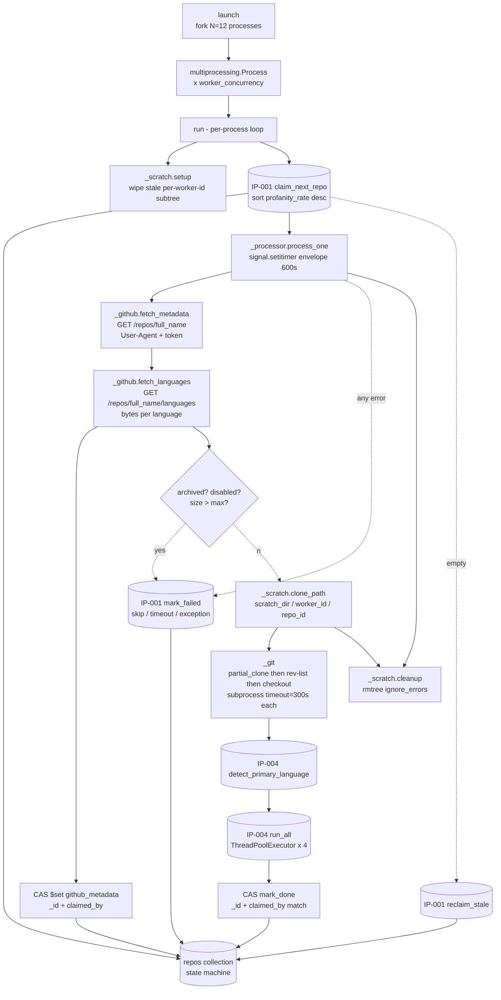

# IP-007: Repo worker — Stage 4 claim-clone-analyze loop + GitHub metadata enrichment

The main Stage 4 process loop: claim a `pending` repo, enrich it with two authenticated GitHub REST calls (`/repos/{full_name}` for stars / forks / topics / license / size / timestamps / archived+disabled flags plus `/repos/{full_name}/languages` for byte-counts per language), partial-clone it, check out the SHA just before 2020-07-01, hand it to [IP-004](ip-004-static-analyzers.md)'s `run_all`, write the `code_analysis` + `github_metadata` sub-documents, and clean up. Runs 12× per worker host across three VMs for a target Stage 4 parallelism of 36 concurrent repos. Signal-agnostic by design — the worker never knows there are two text signals.

<!-- more -->

## Status

**Status**: Implemented
**Last Updated**: 2026-04-24
**Implementation**: Complete

## Problem Statement

Stage 4 of the pipeline ([DRAFT §5.3](../../DRAFT.md)) is where every repo promoted by [IP-006](ip-006-cohort-sampling.md) gets deep-analysed. The worker is the only consumer of `status="pending"` documents and the only producer of the `code_analysis` sub-document; everything downstream ([IP-008](ip-008-aggregation-and-plots.md)) reads what it writes.

Six hard constraints shape the design:

- **Atomic work distribution across four hosts.** 36 worker processes across three VMs share one `repos` collection on `jd-profanity-mogo`. [IP-001](ip-001-foundations.md) gave us the `claim_next_repo` / `reclaim_stale` / `mark_failed` primitives; this module must use them correctly. Getting atomicity wrong means duplicate work (a repo processed twice overwrites its own results) or lost work (a claimed repo wedged forever because nobody reclaims it).
- **Hard wall-time budget per repo.** DRAFT §5.3 caps per-repo processing at 600 seconds. The cap is a backstop, not the expected behaviour — most repos finish in 30-120 s. But pathological cases (infinite clone on a stuck proxy, a runaway analyzer, `rmtree` blocked on an NFS lock) must not hold a worker slot open for hours and silently starve the 1500-repo cohort. The 10-minute envelope is the only thing standing between "one bad repo" and "one dead worker that nobody notices."
- **Per-subprocess timeouts alongside the envelope.** The 10-minute cap is the outermost boundary; each subprocess call (git clone, git rev-list, git checkout, and the five IP-004 tool runners) needs its own narrower timeout too. Without them, a single hang consumes the entire envelope and the worker has to resort to `SIGALRM` or process suicide to recover. IP-004's runners already carry their own 120–180 s timeouts; git calls need their own (PLAN.md says `timeout=300`).
- **Aggressive cleanup on 30 GB worker root disks.** Each clone lives in `/scratch`; root disks on `fei-16-16-30` are 30 GB. At 12 concurrent clones averaging 100–500 MB each, sustained ingest would saturate `/scratch` within hours if cleanup ever misses. Every failure path — timeout, SkipRepo, SIGKILL on the worker process, graceful SIGTERM — has to free the clone, and the worker has to tolerate stale clones left by a previous crashed instance without colliding with them.
- **Signal-agnostic.** [IP-004](ip-004-static-analyzers.md) established the contract that `analyzers.run_all` takes `repo_dir` + `primary_lang` and returns a `code_analysis` dict with both profanity and emoji fields populated in one pass. The worker must not care that there are two signals, or that a future IP might add a third — all it does is call the two public analyzer functions and persist the dict. A worker that inspects `code_analysis` fields breaks the layering.
- **GitHub API rate-limit discipline.** The worker makes two REST calls per claim (`/repos/{full_name}` + `/repos/{full_name}/languages`). At 36 concurrent workers × ~40 repos per worker over 5-7 h, that's ~2,880 calls over the run, ~80 calls/minute shared across the pool. Comfortably under GitHub's 5,000/hour primary limit *and* the 900/minute secondary limit — but only if we share a single token, include a descriptive User-Agent, honour `Retry-After`, and never burst. Missing any of those is how a one-shot research job gets a hostname banned.

Beyond those, the module has to contend with decisions DRAFT punted on or glossed over:

- **GitHub REST enrichment is near-free.** DRAFT/PLAN specifies a size pre-check: "GitHub API size pre-check — skip repos reported > 2 GB (saves clone time)." That's a single `GET /repos/{full_name}` call. The same response returns ~40 fields (stargazers_count, forks_count, watchers_count, subscribers_count, open_issues_count, size, topics, license, description, default_branch, GitHub's language guess, created_at / pushed_at / updated_at, archived, disabled, fork, parent). At zero incremental API cost, we can persist all of them into a new `github_metadata` sub-document. A *second* call to `/repos/{full_name}/languages` returns byte-counts per language — stronger than the file-count heuristic IP-004 uses and a cross-reference worth persisting. IP-008 then has a rich axis for correlation (profanity vs stars, emoji vs fork-count, quality vs repo age, within-license-family analysis, polyglot-vs-monolingual splits) that DRAFT didn't originally imagine but all good-faith reviewers will ask for.
- **Archived / disabled repos must be skipped.** Those flags aren't derivable from git alone. Archived repos refuse pushes but still clone; disabled ones return 403. The REST response tells us immediately, before we burn 60 s on a clone that might work but analytically shouldn't count.
- **GitHub Pro does not raise REST limits.** Pro raises Actions minutes and storage, not REST. Our effective ceiling is 5,000 REST calls per hour per token, same as free. At our usage (two calls per repo × 1,500 repos = 3,000 total) that's still ~9-12 % of the hourly budget — we're not running close to the line.
- **GitHub clone bandwidth.** 1500 cohort repos × ~100–500 MB average = 150-750 GB of git data moved over the two-day experiment, most of it in the 5-7 hour deep-analysis window. Partial clone with `--filter=blob:none --no-checkout` (DRAFT §5.3) cuts blob transfer by ~10× vs a full clone, at the cost of a fetch-on-demand penalty for files the analyzer reads later. Since the analyzers read checked-out files directly (not through `git show`), a blobless clone that is **then checked out at the target SHA** materializes only the blobs we need. That's the DRAFT pattern and the right one.
- **SHA resolution.** `git rev-list -1 --before="2020-07-01 00:00:00" HEAD` returns the last commit before the window close. Empty output → the repo has no commits before the cutoff (brand-new in July 2020) → `SkipRepo("no commits in window")`. PLAN.md calls this out explicitly.
- **Scratch collisions.** If the stale-claim reaper flips a repo back to `pending` while the previous worker's `finally: rmtree` is still running (slow NFS, multi-gig repo), a second worker can claim it and race on the same `/scratch/<repo_id>/` path. Solution: namespace the clone directory under the **worker ID** (`/scratch/<worker_id>/<repo_id>/`), making collisions impossible by construction. Worker ID already carries a random hex suffix from [IP-001's `make_worker_id`](ip-001-foundations.md).
- **Mark-done after potential re-claim.** The stale-claim TTL (20 min default) exceeds the per-repo hard cap (10 min), so under nominal operation a worker never encounters its own claim being stolen. But the gap can close if the host clock drifts or the worker process is paused (OOM-near-misses, VM snapshot). Defence: include `claimed_by` in the mark-done filter (compare-and-set) so a worker never writes results over a repo another worker has legitimately re-claimed.
- **Graceful shutdown.** A SIGTERM from systemd / Docker / operator must let the current repo finish and exit — not leave a half-written `code_analysis` or a stuck claim. The signal handler sets a cooperative flag checked at loop top; workers mid-repo finish and exit cleanly once the repo completes or times out.

**Who is affected:** [IP-006](ip-006-cohort-sampling.md) produces the `pending` queue; if worker consumption is too slow, the cohort under-finishes. [IP-008](ip-008-aggregation-and-plots.md) reads `code_analysis` + the new `github_metadata` on `status="done"` repos; if the worker writes inconsistent fields or mis-attributes cohort labels, the paired comparison breaks. [IP-009](ip-009-docker-test-harness.md) needs two worker replicas to reach `done` on ≥3 test repos for its green-gate.

**Consequences of not addressing this:** no Stage 4 output. Every correlation plot downstream is unrenderable. Every talk slide past "here is the ingest volume" is blank.

## Proposed Solution

An `oss_profanity/repo_worker/` subpackage with exactly two public names — `run` (the per-process main loop) and `launch` (the per-host launcher that spawns `config.worker_concurrency` copies of `run`). Eight internal modules decompose the responsibilities. A `python -m oss_profanity.repo_worker` entrypoint is what IP-009's Dockerfile and IP-010's systemd unit call.

### Overview

- **Subpackage with one public loop + one public launcher.** Scope is ~600-800 LOC across git subprocess handling, HTTP enrichment, timeout envelope, claim/mark logic, cleanup, pool launch. Crossing the same maintainability threshold that drove IP-004 and IP-005 to subpackages.
- **Two authenticated REST calls per claim, full-metadata capture.** Module `_github.py` exposes `fetch_metadata(full_name) -> GitHubMetadata | None` and `fetch_languages(full_name) -> dict[str, int] | None`. Both use a single module-level `httpx.Client(http2=False)` with the shared `GITHUB_TOKEN` from config, a descriptive User-Agent (contact email), and a defensive rate-limit discipline. On 200, the JSON is parsed; on any non-200 or network error the function returns `None` (best-effort — we proceed to clone and let `git` surface real problems). Rate-limit handling: respect `X-RateLimit-Remaining` (proactive pause under 100 remaining until `X-RateLimit-Reset`), `Retry-After` on 403/429 (single retry), hard-cap the retry wait so a misbehaving header never wedges a worker.
- **`github_metadata` becomes a first-class sub-document on `Repo`.** Formalized as a Pydantic `GitHubMetadata` model in [IP-001](ip-001-foundations.md)'s `db.py` (small schema amendment). Stored fields come from both REST endpoints:
  - **Popularity / activity:** `stargazers_count`, `forks_count`, `watchers_count`, `subscribers_count`, `open_issues_count`
  - **Classification:** `topics` (list), `license_spdx`, `language` (GitHub's guessed primary — useful cross-reference for IP-004's detection)
  - **Language breakdown:** `languages_bytes: dict[str, int]` (from `/languages` — bytes per language keyed by GitHub's `linguist` names)
  - **Size + branch:** `size_kb`, `default_branch`
  - **Fork relationship:** `fork`, `parent_full_name` (enables fork-dedup in IP-008)
  - **Status flags:** `archived`, `disabled` — both cause `SkipRepo`
  - **Timestamps:** `created_at`, `pushed_at`, `updated_at`
  - **Free text:** `description`
  - **Audit:** `fetched_at` (so IP-008 knows how fresh the data is)
- **Two-tiered timeout: per-subprocess + per-repo envelope.** Each git call has `timeout=git_subprocess_timeout` (300 s default), each analyzer carries its own 120–180 s timeout from IP-004. The outer 600 s envelope is enforced by `signal.setitimer(ITIMER_REAL, 600)` within the worker process and raises a module-local `RepoTimeout` exception on `SIGALRM`. Linux-only (matches the deploy target); falls back gracefully on macOS / Windows (timer silently no-ops; per-subprocess timeouts still apply) for dev parity.
- **Scratch namespaced per worker ID.** Clone directory is `config.scratch_dir / worker_id / str(repo_id)`. Worker ID includes a random hex suffix from [IP-001's `make_worker_id`](ip-001-foundations.md), so parallel workers on the same host never collide even if the stale-claim reaper races them. Cleanup uses `shutil.rmtree(..., ignore_errors=True)` in a `finally` so every exit path frees the disk. On worker startup, the per-worker-id subtree is wiped before the loop begins, defending against a previous same-id run.
- **Partial clone + SHA checkout, each with subprocess timeout.** Three subprocess calls per repo, each wrapped by a small `_git.run_git(...)` helper that delegates to IP-004's `_subprocess_util` pattern. `git clone --filter=blob:none --no-checkout <url> <dest>` → `git -C <dest> rev-list -1 --before="<cutoff>" HEAD` → `git -C <dest> checkout <sha>`. `GIT_TERMINAL_PROMPT=0` in the subprocess environment so credential prompts can't hang.
- **Compare-and-set mark-done.** `db.repos.update_one({"_id": id, "claimed_by": worker_id}, {"$set": {...}})`. If another worker has re-claimed (stale-reaper race), `matched_count == 0` and we log + discard.
- **Claim loop with three-state exit.** On `claim_next_repo() → None`: call `reclaim_stale()`; if it returned > 0, spin again. If zero reclaims AND `count_documents({"status": "claimed"}) == 0`, the cohort is fully drained → exit. Otherwise sleep 10 s and retry.
- **Cooperative SIGTERM handler.** Signal handler sets `_shutdown_requested = True`. Loop top checks before claiming. Workers mid-repo finish the current repo (or time out) and exit cleanly.
- **Launcher uses `multiprocessing.Process × N`, not `Pool`.** Workers self-serve from Mongo; `Pool`'s task model is the wrong shape.
- **Metadata persisted before clone.** As soon as the REST call returns, metadata is written to `repo.github_metadata` via a CAS `$set` keyed on `claimed_by`. This way, a repo skipped for `archived=true` or `oversize` still carries its metadata into IP-008; `cohort` labelling is preserved; only the `code_analysis` + `status=done` step waits for the full clone-analyse path.
- **Error classification with stable reason prefixes.** `SkipRepo("<reason>") → mark_failed(..., "skip: <reason>")`; `RepoTimeout → mark_failed(..., "timeout: <where>")`; `GitError → mark_failed(..., "git: <stderr tail>")`; anything else → `f"{type(e).__name__}: {e}"`. IP-008 histograms on these prefixes, so the vocabulary is a contract.

### Key Components

1. **`oss_profanity/repo_worker/__init__.py`** — public surface: re-exports `run` (per-process main loop) and `launch` (fork-join N copies). No logic.
2. **`_github.py`** — two public functions against the GitHub REST API, both best-effort (`None` on any error):
   - `fetch_metadata(full_name: str) -> GitHubMetadata | None` — authenticated `GET /repos/{full_name}`; parses the ~40-field response into a typed model.
   - `fetch_languages(full_name: str) -> dict[str, int] | None` — authenticated `GET /repos/{full_name}/languages`; returns the byte-counts-per-language dict verbatim (GitHub `linguist`'s output). Called right after `fetch_metadata` and merged into the same `github_metadata` sub-document via a single CAS `$set` to avoid a double round-trip to Mongo.
   - Both share one module-level `httpx.Client` opened lazily on first call, closed via `atexit`. Rate-limit discipline is implemented once in a `_request(url)` helper and reused by both public functions (see Technical Details).
3. **`_git.py`** — `partial_clone(url, dest)`, `resolve_sha_before(repo_dir, cutoff)`, `checkout(repo_dir, sha)`. Each wraps `subprocess.run` with `timeout=config.git_subprocess_timeout`, `check=False`, `env={**os.environ, "GIT_TERMINAL_PROMPT": "0"}`, captures stderr for error classification. Raises `GitError` / `SkipRepo` on non-zero exit or timeout.
4. **`_scratch.py`** — `clone_path(repo_id, worker_id) -> Path` (worker-namespaced); `setup(worker_id) -> None` (wipes the per-worker subtree at startup); `cleanup(path)` (`rmtree(ignore_errors=True)`).
5. **`_errors.py`** — `class SkipRepo(Exception)`, `class RepoTimeout(Exception)`, `class GitError(Exception)`. Tiny module, kept separate so other modules can import without pulling in subprocess / httpx dependencies.
6. **`_timeout.py`** — `@contextmanager def envelope(seconds: int)`: `signal.setitimer(ITIMER_REAL, seconds)` on enter, clears on exit, installs a SIGALRM handler that raises `RepoTimeout`. `seconds <= 0` or non-Linux → no-op.
7. **`_processor.py`** — `process_one(repo, worker_id)`: orchestrates `_github.fetch_metadata` → CAS write `github_metadata` → (skip if archived/disabled/oversize) → `_git.partial_clone` → `_git.resolve_sha_before` → `_git.checkout` → `detect_primary_language` → `run_all` → CAS mark-done, inside a `_timeout.envelope(config.per_repo_timeout)` block with `try/finally: cleanup(path)`. All failure modes map to `mark_failed` with classified reason.
8. **`_loop.py`** — `run()`: installs SIGTERM handler; calls `_scratch.setup()`; enters `while not _shutdown_requested:` claim loop; on empty queue, runs `reclaim_stale()` then checks terminal condition (`claimed` count == 0), else sleeps 10 s.
9. **`_launcher.py`** — `launch() -> int`: production-grade fork-join supervisor for `config.worker_concurrency` worker processes. Features:
   - Typed return — worst-case non-zero child exit code (0 on full success) so systemd / Docker / shell see accurate status via `sys.exit(launch())`.
   - Named children — `Process(name=f"repo-worker-{i}")` for clean `ps`/`htop` output.
   - SIGTERM / SIGINT forwarding — parent handler forwards signals to every child PID so systemd's shutdown reaches the cooperative shutdown flag in each `_loop.run`.
   - Bounded `join()` with SIGKILL escalation — `join(timeout=per_repo_timeout + 30 s)` per child; any child still alive gets `p.kill()` + a final `join(5)`. Escalation logged at ERROR for postmortem.
   - Fast-fail on startup — if any `Process.start()` raises, SIGTERM any already-started children, wait briefly, SIGKILL stragglers, return non-zero. No mixed-state launcher where N < worker_concurrency children are running.
   - Structured start / exit logs — one log line per child at start and exit with `worker_id`, `pid`, `event`, `exit_code`, `elapsed_sec`. Matches IP-005's observability pattern.
   - Follows the same lifecycle conventions mature Python supervisors (gunicorn, uvicorn `--workers`, celery multi) use for the same fork-join problem.
10. **`__main__.py`** — `python -m oss_profanity.repo_worker` wires `launch()` into `if __name__ == "__main__"` with `logging.basicConfig` and env-driven log level.

**Schema amendment (owned by this IP) in `oss_profanity/db.py`:**

- **`GitHubMetadata` Pydantic model** — the new sub-document shape; `extra="allow"` so future field additions don't fail validation.
- **`Repo.github_metadata: GitHubMetadata | None = None`** — optional top-level field on `Repo`.

### Architecture



The claim loop is the only coupling between workers; every other concern is process-local. Parallelism is at the process level (12 processes per host × 3 hosts = 36), not within a worker.

### Design principles applied

- **Single Responsibility.** `_github` owns the REST enrichment, `_git` owns the git subprocess layer, `_scratch` owns per-worker directory layout + cleanup, `_timeout` owns the SIGALRM envelope, `_errors` owns the exception vocabulary, `_processor` owns the per-repo pipeline, `_loop` owns the claim-exit state machine, `_launcher` owns the fork-join. Each module's one thing is obvious from its name.
- **Open/Closed.** Adding a new error class or a new subprocess tool doesn't perturb the loop or the launcher. Adding a per-repo step (e.g. a future license scan) is a new call site in `_processor.process_one` with a new line, not a redesign. Persisting additional REST fields means extending `GitHubMetadata` only — `_github.fetch_metadata` doesn't care which fields the model declares because `extra="allow"` absorbs the rest.
- **DRY.** Subprocess-with-timeout behaviour is factored into `_git.run_git` (which delegates to IP-004's `_subprocess_util.run_tool`). Error classification lives in one place (`_processor._classify`). The CAS condition for mark-done / metadata-write lives in a single `_cas_set` helper.
- **Interface Segregation.** External callers see `run` and `launch`. [IP-008](ip-008-aggregation-and-plots.md) reads the persisted document; it never imports from this package. [IP-009](ip-009-docker-test-harness.md) invokes the CLI; it never imports either.
- **Dependency Inversion.** `_processor` imports `analyzers.detect_primary_language` + `analyzers.run_all` by name (IP-004's public API) and `db.claim_next_repo` / `db.mark_failed` (IP-001's public API). Nothing inside this module inverts behind a Protocol.

## Implementation Plan

### Phase 1: scaffolding + pure helpers

- [ ] Create `oss_profanity/repo_worker/` with `__init__.py` exporting `run` and `launch`
- [ ] `_errors.py` — `SkipRepo`, `RepoTimeout`, `GitError`; no imports beyond stdlib
- [ ] `_scratch.clone_path(repo_id: int, worker_id: str) -> Path` — pure path arithmetic, no I/O
- [ ] `_scratch.setup(worker_id: str) -> None` — `rmtree(scratch_dir / worker_id, ignore_errors=True)`; called once on loop entry
- [ ] `_scratch.cleanup(path: Path) -> None` — `rmtree(path, ignore_errors=True)`; safe to call on non-existent paths
- [ ] Unit tests for `_scratch` using `tmp_path` fixtures

### Phase 2: timeout envelope

- [ ] `_timeout.envelope(seconds: int)` context manager — `signal.setitimer(ITIMER_REAL, seconds)` on enter; previous handler + timer state restored on exit; on SIGALRM raises `RepoTimeout`; on non-Linux (`hasattr(signal, "setitimer")` false) or `seconds <= 0` is a no-op
- [ ] Unit tests: enforce a 1 s cap on a `time.sleep(5)` call; nested enter/exit restores prior handler; passes through unchanged values on the happy path

### Phase 3: git subprocess layer

- [ ] `_git.partial_clone(url, dest, timeout)` — `git clone --filter=blob:none --no-checkout {url} {dest}`; `env={**os.environ, "GIT_TERMINAL_PROMPT": "0"}`; captures stdout + stderr; raises `GitError(stderr tail)` on non-zero
- [ ] `_git.resolve_sha_before(repo_dir, cutoff, timeout)` — `git -C {repo_dir} rev-list -1 --before="{cutoff}" HEAD`; empty stdout → `None`
- [ ] `_git.checkout(repo_dir, sha, timeout)` — `git -C {repo_dir} checkout {sha}`; raises `GitError` on non-zero
- [ ] Unit tests with `monkeypatch.setattr(subprocess, "run", fake_run)` — success, non-zero exit, `TimeoutExpired`, not-found git binary

### Phase 4: GitHub metadata enrichment

- [ ] Add `GitHubMetadata` Pydantic model to `oss_profanity/db.py` with all fields listed in "Data Model" below; `ConfigDict(extra="allow")`; includes `languages_bytes: dict[str, int] = Field(default_factory=dict)`
- [ ] Add `github_metadata: GitHubMetadata | None = None` field to `Repo`
- [ ] `_github._request(url: str) -> dict | list | None` — internal helper carrying all rate-limit discipline in one place; both public functions route through it
- [ ] `_github.fetch_metadata(full_name: str) -> GitHubMetadata | None` — authenticated `GET https://api.github.com/repos/{full_name}`; parses JSON into `GitHubMetadata`; returns `None` on any error
- [ ] `_github.fetch_languages(full_name: str) -> dict[str, int] | None` — authenticated `GET https://api.github.com/repos/{full_name}/languages`; returns the dict as-is (GitHub `linguist` byte counts keyed by capitalized language name); `None` on any error
- [ ] Module-level `httpx.Client(http2=False, timeout=10.0, headers={"User-Agent": config.github_user_agent, "Authorization": f"Bearer {config.github_token}" if config.github_token else "", "Accept": "application/vnd.github+json", "X-GitHub-Api-Version": "2022-11-28"})` — lazy-opened on first call, closed via `atexit.register`
- [ ] Rate-limit discipline inside `_request`:
  - On any response: read `X-RateLimit-Remaining` int; if < 100, sleep `max(0, X-RateLimit-Reset - time.time())` up to a hard cap of 60 s
  - `429` or `403` with `Retry-After`: sleep min(header-value, 60), retry once; second failure returns `None`
  - Any 5xx: single retry after 2 s; second failure returns `None`
  - Network error: log at WARNING, return `None`
- [ ] Missing-token behaviour: `config.github_token` is `None` → module logs a WARNING at first call only, proceeds with unauth request, and **accepts a 429 as a skip-this-repo metadata** (returns `None`)
- [ ] Unit tests with `httpx.MockTransport`: 200 full response for both endpoints (asserts every field mapped), 404, 403 rate-limit (with `Retry-After`), 5xx + retry success, network error, missing-token 401
- [ ] Contract test: a fixture of 10 fake `/repos/` JSON payloads and 10 `/languages/` payloads round-trips through the model without dropping fields

### Phase 5: processor

- [ ] `_cas_set(repo_id, worker_id, fields) -> bool` — `update_one({"_id": repo_id, "claimed_by": worker_id}, {"$set": fields})`; returns `matched_count > 0`
- [ ] `_processor.process_one(repo: Repo, worker_id: str) -> None` — orchestrates the full pipeline inside `_timeout.envelope(config.per_repo_timeout.total_seconds())`:
  - `metadata = _github.fetch_metadata(repo.full_name)`
  - If metadata: `languages = _github.fetch_languages(repo.full_name)`; attach via `metadata.languages_bytes = languages or {}`
  - If metadata: `_cas_set(repo.id, worker_id, {"github_metadata": metadata.model_dump(mode="json")})` — single write per repo for both endpoints
  - If metadata and (`metadata.archived` or `metadata.disabled`): `raise SkipRepo("archived")` / `"disabled"`
  - If metadata and `metadata.size_kb > config.max_repo_size_mb * 1024`: `raise SkipRepo(f"oversize: {metadata.size_kb // 1024} MiB")`
  - `_git.partial_clone(...)`, `_git.resolve_sha_before(...)`, `_git.checkout(...)`
  - `analyzers.detect_primary_language(...)` + `analyzers.run_all(...)`
  - `_cas_set(repo.id, worker_id, {"status": "done", "primary_language": ..., "code_analysis": ..., "processing_time_sec": ...})`
- [ ] `_processor._classify(exc) -> str` — returns a reason string with stable prefix
- [ ] Fixture-based tests: mock `analyzers.run_all` + `_git` + `_github.fetch_metadata` + `_github.fetch_languages`; drive each error branch; assert resulting `mark_failed` reason; assert `languages_bytes` is merged into the single CAS write

### Phase 6: main loop

- [ ] `_loop.run()` — installs SIGTERM handler; `_scratch.setup(worker_id)`; enters while loop per the state-machine spec
- [ ] Integration test (gated on `TEST_MONGO_URI`): seed 3 `pending` repos (mocked `analyzers.run_all`, mocked `_git`, mocked `_github.fetch_metadata`); run one `run()`; assert all three reach `done` with `github_metadata` populated

### Phase 7: launcher + CLI

- [ ] `_launcher.launch() -> int` — forks `config.worker_concurrency` `multiprocessing.Process` copies of `run`; returns worst-case non-zero child exit code
- [ ] Typed return + correct exit propagation: `__main__.py` does `sys.exit(launch())` so systemd / Docker see accurate status
- [ ] Named children: `Process(name=f"repo-worker-{i}")` for clean `ps` / `htop` output
- [ ] SIGTERM / SIGINT forwarding: parent's handler forwards the signal to every child PID, then proceeds to `join()`; children's own cooperative-shutdown handlers (`_loop.run`) trip on receipt
- [ ] Bounded `join(timeout=per_repo_timeout + 30)` per child; still-alive children get `p.kill()` + final `join(5.0)`; escalation logged at ERROR
- [ ] Fast-fail on startup: if any `Process.start()` raises, SIGTERM any already-started children, short wait, SIGKILL stragglers, return non-zero — no mixed-state launcher
- [ ] Structured start / exit logs: one line per child at start (`{"worker_id", "pid", "event": "start"}`) and exit (`{"worker_id", "pid", "exit_code", "elapsed_sec", "event": "exit"}`)
- [ ] `__main__.py` — `logging.basicConfig(level=os.getenv("LOG_LEVEL", "INFO"))`; `sys.exit(launch())`
- [ ] Launcher unit tests with `monkeypatch` on `multiprocessing.Process`: `start()` raises → fast-fail path; child hangs → bounded join + SIGKILL escalation; SIGTERM to parent → forwarded to all children
- [ ] Smoke test (`TEST_MONGO_URI` + live `GITHUB_TOKEN`): `python -m oss_profanity.repo_worker` with `WORKER_CONCURRENCY=2` against a seeded 5-repo cohort; assert all 5 reach terminal state with metadata populated

### Phase 8: config

- [ ] Add `github_token: str | None` to `Config` (env `GITHUB_TOKEN`, default `None` with a clear log warning at first fetch)
- [ ] Add `github_user_agent: str` to `Config` (env `GITHUB_USER_AGENT`, default `"oss-profanity/0.1 (jakub.dubec@stuba.sk)"`)
- [ ] Add `git_subprocess_timeout: timedelta` to `Config` (env `GIT_SUBPROCESS_TIMEOUT_SEC`, default 300)
- [ ] Extend `docs/CONFIGURATION.md` with a "GitHub token provisioning" subsection — fine-grained-PAT instructions (Public Repositories read-only, 30-day expiry, no extra scopes), classic-PAT fallback (zero scopes), `/rate_limit` verification command, security notes (rotation, log redaction, `.env` only)
- [ ] `mypy --strict oss_profanity/repo_worker/` passes

### Phase 9: schema documentation (SCHEMA.md)

- [ ] Create `docs/SCHEMA.md` — source-of-truth reference documenting every persisted field across `repos` and `ingest_runs` collections
- [ ] One table per sub-document (`Repo` top-level, `commit_stats`, `code_analysis`, `github_metadata`, `ingest_runs`) with columns: field name, BSON type, description, owning IP (writer), consuming IPs (readers), example value
- [ ] Cross-links each field to the IP that owns it (IP-005 `commit_stats.*`, IP-006 `cohort`, IP-007 `github_metadata.*` + `code_analysis.*` + `primary_language` + `processing_time_sec`, IP-005 `ingest_runs.*`)
- [ ] Pydantic models in `db.py` grow a one-line docstring pointing at the corresponding SCHEMA.md section
- [ ] Use the MongoDB MCP server to list collections + sample documents and verify every field documented in SCHEMA.md actually persists as described — catches the "docs lie" failure mode
- [ ] Cross-reference SCHEMA.md from CONFIGURATION.md and from IP-007's Data Model section

### Prerequisites

- [IP-001](ip-001-foundations.md) — `config`, `db.claim_next_repo`, `db.reclaim_stale`, `db.mark_failed`, `db.make_worker_id`, schema
- [IP-004](ip-004-static-analyzers.md) — `analyzers.detect_primary_language`, `analyzers.run_all`, `_subprocess_util.run_tool` pattern
- [IP-005](ip-005-gh-archive-ingest.md) — populates the `repos` documents the worker claims; `httpx` dependency already present
- [IP-006](ip-006-cohort-sampling.md) — flips `seen` → `pending` for the cohort this worker processes; stamps the `cohort` label the worker must preserve
- Linux host with `signal.setitimer` for the envelope; git ≥ 2.22 for `--filter=blob:none` partial clone
- `GITHUB_TOKEN` provisioned (personal access token; no scopes needed for public repo metadata)

## Technical Details

### Technology Stack

- **`multiprocessing.Process`** — per-host pool of 12 self-serving workers.
- **`subprocess.run(..., timeout=, check=False, capture_output=True, env=...)`** — every git call.
- **`signal.setitimer(signal.ITIMER_REAL)`** — 10-minute envelope, Linux-only with macOS/Windows no-op fallback.
- **`httpx.Client`** (already a project dep from IP-005) — GitHub REST enrichment. `http2=False` here because one-shot requests don't benefit from stream multiplexing; connection keep-alive is free from the underlying HTTP/1.1 pool.
- **Pydantic v2** — `GitHubMetadata` model, consistent with IP-001's `Repo`/`CommitStats`/`CodeAnalysis` style.
- **Stdlib `shutil.rmtree(..., ignore_errors=True)`** — cleanup.

### Rate-limit budget

GitHub REST API ceiling is **5,000 requests per hour per authenticated token**. GitHub Pro does **not** raise this — Pro affects Actions minutes and storage, not REST.

At our workload (two calls per repo — `/repos/{full_name}` and `/repos/{full_name}/languages`):

| Dimension | Value |
|---|---:|
| Cohort size (IP-006) | 1,500 repos |
| Calls per repo | 2 |
| Total calls per Stage 4 run | 3,000 |
| Duration (DRAFT §8 estimate) | 5-7 h |
| Average calls/hour | **~430-600** (9-12% of ceiling) |
| Average calls/minute shared across 36 workers | **~8-10** (~1% of 900/min secondary limit) |
| Concurrent in-flight (36 workers, ~10 ms per REST call) | **< 1** at any instant |

Headroom is ample. A ban would require a bug — bursty retries, missing User-Agent, running multiple tokens from the same IP during testing.

**Overnight capacity (if the study expanded):** 5,000 × 12 h = 60,000 calls/night per token = **30,000 repos/night** at two calls per repo. 20× more than the cohort target. Full-population enrichment (~1 M repos) would take ~34 nights at this scope and is explicitly out of scope.

### Rate-limit discipline (one-page spec)

```python
# _github.py (sketch)
_DEFAULT_TIMEOUT = httpx.Timeout(10.0, connect=5.0)
_HARD_CAP_SLEEP = 60.0  # never sleep longer than this on Retry-After


def fetch_metadata(full_name: str) -> GitHubMetadata | None:
    client = _get_client()
    url = f"https://api.github.com/repos/{full_name}"
    for attempt in range(2):
        try:
            resp = client.get(url)
        except httpx.HTTPError as e:
            logger.warning("github: network error for %s: %s", full_name, e)
            return None
        if resp.status_code == 200:
            _throttle_if_needed(resp.headers)
            return GitHubMetadata.model_validate(_to_model_dict(resp.json()))
        if resp.status_code == 404:
            logger.info("github: %s returned 404; skipping metadata", full_name)
            return None
        if resp.status_code in (403, 429):
            retry_after = min(
                float(resp.headers.get("retry-after", "10")),
                _HARD_CAP_SLEEP,
            )
            logger.info(
                "github: %s rate-limited (status %d); sleeping %.1fs",
                full_name, resp.status_code, retry_after,
            )
            time.sleep(retry_after)
            continue
        if 500 <= resp.status_code < 600:
            time.sleep(2.0)
            continue
        logger.warning(
            "github: %s returned unexpected status %d", full_name, resp.status_code
        )
        return None
    return None


def _throttle_if_needed(headers: httpx.Headers) -> None:
    try:
        remaining = int(headers.get("x-ratelimit-remaining", "5000"))
    except ValueError:
        return
    if remaining >= 100:
        return
    reset = float(headers.get("x-ratelimit-reset", "0"))
    now = time.time()
    sleep_for = max(0.0, min(_HARD_CAP_SLEEP, reset - now))
    if sleep_for > 0:
        logger.info(
            "github: %d remaining; throttling %.1fs", remaining, sleep_for
        )
        time.sleep(sleep_for)
```

The discipline is deliberately conservative: one retry on 403/429/5xx, hard cap on `Retry-After`, proactive back-off when remaining < 100. Never recurses, never retries more than once, never burns more than 60 s on any single call.

### Data Model

One schema amendment to [IP-001](ip-001-foundations.md)'s `db.py`:

```python
class GitHubMetadata(BaseModel):
    model_config = ConfigDict(extra="allow")

    fetched_at: datetime
    # Popularity / activity
    stargazers_count: int = 0
    forks_count: int = 0
    watchers_count: int = 0
    subscribers_count: int = 0
    open_issues_count: int = 0
    # Classification
    topics: list[str] = Field(default_factory=list)
    license_spdx: str | None = None
    language: str | None = None            # GitHub's guessed primary language
    languages_bytes: dict[str, int] = Field(default_factory=dict)
    # ^ from /repos/{full_name}/languages — bytes per language keyed by
    #   GitHub linguist names (capitalized: "Python", "JavaScript", ...)
    # Size + branch
    size_kb: int = 0
    default_branch: str | None = None
    # Fork relationship
    fork: bool = False
    parent_full_name: str | None = None
    # Status flags
    archived: bool = False
    disabled: bool = False
    # Timestamps
    created_at: datetime | None = None
    pushed_at: datetime | None = None
    updated_at: datetime | None = None
    # Free text
    description: str | None = None


class Repo(BaseModel):
    # ... existing fields ...
    github_metadata: GitHubMetadata | None = None
```

No new collections. No new indexes (metadata lookups in IP-008 are by `_id`, already covered).

### Per-repo pipeline idiom

```python
# _processor.py (sketch)
def process_one(repo: Repo, worker_id: str) -> None:
    t0 = time.monotonic()
    clone_path = _scratch.clone_path(repo.id, worker_id)
    try:
        with _timeout.envelope(config.per_repo_timeout.total_seconds()):
            metadata = _github.fetch_metadata(repo.full_name)
            if metadata is not None:
                languages = _github.fetch_languages(repo.full_name)
                metadata.languages_bytes = languages or {}
                # Single CAS write covers both REST endpoints.
                _cas_set(repo.id, worker_id, {
                    "github_metadata": metadata.model_dump(mode="json"),
                })
                if metadata.archived:
                    raise SkipRepo("archived")
                if metadata.disabled:
                    raise SkipRepo("disabled")
                if metadata.size_kb > config.max_repo_size_mb * 1024:
                    raise SkipRepo(f"oversize: {metadata.size_kb // 1024} MiB")

            url = f"https://github.com/{repo.full_name}.git"
            _git.partial_clone(url, clone_path, config.git_subprocess_timeout)
            sha = _git.resolve_sha_before(
                clone_path, "2020-07-01 00:00:00", config.git_subprocess_timeout
            )
            if not sha:
                raise SkipRepo("no commits in window")
            _git.checkout(clone_path, sha, config.git_subprocess_timeout)
            primary_lang = analyzers.detect_primary_language(clone_path)
            analysis = analyzers.run_all(clone_path, primary_lang)
            elapsed = time.monotonic() - t0
            _mark_done(repo.id, worker_id, primary_lang, analysis, elapsed)
    except RepoTimeout:
        mark_failed(repo.id, "timeout", elapsed_sec=time.monotonic() - t0)
    except SkipRepo as e:
        mark_failed(repo.id, f"skip: {e}", elapsed_sec=time.monotonic() - t0)
    except GitError as e:
        mark_failed(repo.id, f"git: {str(e)[:200]}", elapsed_sec=time.monotonic() - t0)
    except Exception as e:  # noqa: BLE001
        mark_failed(
            repo.id,
            f"{type(e).__name__}: {str(e)[:200]}",
            elapsed_sec=time.monotonic() - t0,
        )
    finally:
        _scratch.cleanup(clone_path)
```

Metadata is written **before** the skip check, so even skipped repos carry their metadata into the dataset — IP-008 can report on skip rates by license, stars, archived-fraction, etc. without a separate join.

### Compare-and-set mark-done

```python
def _mark_done(
    repo_id: int,
    worker_id: str,
    primary_lang: str | None,
    analysis: dict[str, Any],
    elapsed: float,
) -> bool:
    return _cas_set(repo_id, worker_id, {
        "status": "done",
        "primary_language": primary_lang,
        "code_analysis": analysis,
        "processing_time_sec": elapsed,
    })


def _cas_set(repo_id: int, worker_id: str, fields: dict[str, Any]) -> bool:
    result = get_db().repos.update_one(
        {"_id": repo_id, "claimed_by": worker_id},
        {"$set": fields},
    )
    if result.matched_count == 0:
        logger.warning(
            "CAS miss: repo %d no longer claimed by %s (fields=%s)",
            repo_id, worker_id, sorted(fields),
        )
        return False
    return True
```

### Launcher idiom

```python
# _launcher.py (sketch)
import logging
import multiprocessing as mp
import signal
from typing import Any

from ..config import config
from ..db import make_worker_id
from ._loop import run

logger = logging.getLogger(__name__)

_STARTUP_KILL_GRACE = 10.0
_FINAL_JOIN_GRACE = 5.0


def launch() -> int:
    """Fork-join supervisor. Returns worst-case non-zero child exit code."""
    children: list[mp.Process] = []
    for i in range(config.worker_concurrency):
        worker_id = make_worker_id()
        p = mp.Process(
            target=run,
            kwargs={"worker_id": worker_id},
            name=f"repo-worker-{i}",
        )
        try:
            p.start()
        except Exception:  # noqa: BLE001 — fast-fail any start failure
            logger.exception(
                "failed to start child %d; terminating started children", i
            )
            _terminate_all(children, grace=_STARTUP_KILL_GRACE)
            return 1
        logger.info(
            "child started",
            extra={"worker_id": worker_id, "pid": p.pid, "event": "start"},
        )
        children.append(p)

    signal.signal(signal.SIGTERM, lambda *_: _terminate_all(children))
    signal.signal(signal.SIGINT, lambda *_: _terminate_all(children))

    join_timeout = config.per_repo_timeout.total_seconds() + 30.0
    worst = 0
    for p in children:
        p.join(timeout=join_timeout)
        if p.is_alive():
            logger.error(
                "child did not exit; SIGKILL",
                extra={"name": p.name, "pid": p.pid},
            )
            p.kill()
            p.join(timeout=_FINAL_JOIN_GRACE)
        logger.info(
            "child exited",
            extra={
                "pid": p.pid,
                "exit_code": p.exitcode,
                "event": "exit",
            },
        )
        worst = max(worst, abs(p.exitcode or 0))
    return worst


def _terminate_all(children: list[mp.Process], grace: float = 5.0) -> None:
    for p in children:
        if p.is_alive():
            p.terminate()
    for p in children:
        p.join(timeout=grace)
        if p.is_alive():
            p.kill()
```

The launcher is ~70 LOC. That cost buys named children, SIGTERM forwarding, bounded join with SIGKILL escalation, fast-fail-on-start, and structured lifecycle logs — the same lifecycle story gunicorn / uvicorn `--workers` / celery-multi implement for the same fork-join problem.

### Configuration

Additions to [IP-001](ip-001-foundations.md)'s `Config`:

| Variable                     | Default                                              | Purpose                                      |
|------------------------------|------------------------------------------------------|----------------------------------------------|
| `GITHUB_TOKEN`               | *unset* (warn on missing)                            | Auth for REST enrichment; 5,000/h vs 60/h    |
| `GITHUB_USER_AGENT`          | `oss-profanity/0.1 (jakub.dubec@stuba.sk)`           | Identification for GitHub abuse team         |
| `GIT_SUBPROCESS_TIMEOUT_SEC` | `300`                                                | Per git call (clone / rev-list / checkout)   |

Existing fields used verbatim (no changes):

| Variable                | Default             | Use in IP-007                          |
|-------------------------|---------------------|----------------------------------------|
| `WORKER_CONCURRENCY`    | `12`                | Process count per host                 |
| `SCRATCH_DIR`           | `/scratch`          | Root for clones                        |
| `MAX_REPO_SIZE_MB`      | `2048`              | Metadata oversize skip threshold       |
| `PER_REPO_TIMEOUT_SEC`  | `600`               | Envelope for `process_one`             |
| `STALE_CLAIM_TTL_MIN`   | `20`                | IP-001 reclaim_stale                   |

Windows cutoff (`"2020-07-01 00:00:00"`) is hardcoded to the DRAFT value.

## Alternatives Considered

### Alternative 1: Size-only pre-check, no broader metadata

**Description**: Shrink `_github.fetch_metadata` back to `precheck_size(full_name) -> int | None` that returns only the `size` field.

**Pros**:
- Smaller surface area; nothing to keep in sync with GitHub's response shape
- `GitHubMetadata` model not needed

**Cons**:
- Same API cost (one call per repo), different storage size only
- Loses all the correlation axes IP-008 would benefit from: stars, forks, license, age, description, topics, archived/disabled
- Forces a second IP to add metadata enrichment later, duplicating the rate-limit + auth + User-Agent machinery

**Why not chosen**: the call is already being made. Persisting the full response is free bandwidth-wise and opens non-trivial analytical depth for IP-008.

### Alternative 2: GraphQL-batched enrichment as a separate stage

**Description**: A dedicated one-shot `oss_profanity/metadata_enrich.py` module that runs after IP-006 sampling and before IP-007 workers start. Uses the GraphQL API to fetch metadata for ~100 repos per query, amortizing HTTP overhead. Workers then read the pre-fetched metadata from Mongo rather than fetching inline.

**Pros**:
- Far fewer HTTP requests (~15 queries instead of 1,500)
- Lower risk of secondary rate limit tripping
- Workers become slightly simpler (no `_github.py`)

**Cons**:
- Adds a GraphQL dependency (another HTTP client configuration, another query language, another test surface)
- Adds a whole new stage to the pipeline; splits "enrichment" from "the rest of Stage 4" in a way that's slightly awkward for IP-009's smoke harness
- At our scale (1,500 calls / 5,000/h ceiling), REST is already well inside the budget. Optimization without a measured need.

**Why not chosen**: the REST budget is fine and the simplicity of "one call per claim inline" is worth more than the marginal efficiency. GraphQL stays on the table as an IP-008 follow-up if population-level enrichment ever lands.

### Alternative 3: Skip the GitHub API entirely

**Description**: No REST call; let `git clone` run up against `git_subprocess_timeout` for oversize repos. No metadata enrichment.

**Pros**:
- Zero additional config (no `GITHUB_TOKEN` needed)
- One fewer network dep

**Cons**:
- Oversize repos cost 300 s each in clone-timeout tail latency (~2-3 min total wall-time impact)
- No `github_metadata` at all → IP-008 has no popularity / age / license axes
- No `archived` / `disabled` detection → those repos consume a clone + analysis only to produce analytically-useless rows

**Why not chosen**: tail latency is small but the metadata is rich and the API budget is generous. The token is a one-line provisioning step.

### Alternative 4: flat `oss_profanity/repo_worker.py` module

**Description**: Everything in one file, as PLAN.md lists.

**Pros**:
- Matches the PLAN module name exactly
- Simpler imports

**Cons**:
- ~600-800 LOC with nine distinct concerns; testing friction; IP-004 / IP-005 precedent is against it

**Why not chosen**: subpackage is the right scale.

### Alternative 5: `multiprocessing.Pool` instead of `Process × N`

**Description**: `Pool(worker_concurrency)` managing worker processes.

**Pros**: familiar idiom.

**Cons**: `Pool`'s task model is a poor fit for self-serving workers.

**Why not chosen**: `Process × N + join()` is the minimal primitive.

### Alternative 6: threading for per-host concurrency

**Description**: Single Python process per host, `ThreadPoolExecutor(max_workers=12)` running 12 concurrent `process_one` calls.

**Cons**: `signal.setitimer` is process-wide, GIL contention during tree-sitter parse, one crash takes down 12 repos.

**Why not chosen**: per-process isolation matches DRAFT §5.3.

### Alternative 7: clone the full history

**Description**: Plain `git clone <url> <dest>`; no partial-clone filter.

**Cons**: 5-10× more bandwidth; disk pressure under 12-way concurrency.

**Why not chosen**: partial-clone is load-bearing for the disk + network budget.

### Alternative 8: Require `GITHUB_TOKEN`, fail fast on missing

**Description**: `Config.from_env` raises if `GITHUB_TOKEN` is unset.

**Cons**: breaks dev parity; doesn't match IP-005's best-effort-API discipline.

**Why not chosen**: warn at first fetch, proceed unauth (which will 429 almost immediately and return `None` via the same path as any other API error). The worker still works; it just loses metadata enrichment until a token is provisioned.

## Trade-offs and Risks

### Trade-offs

- **Per-repo REST call is inline with the claim, not batched.** Accepted — at 4-5 calls/minute shared across 36 workers, far under any GitHub limit; the simplicity gain over a separate GraphQL stage is worth more than the marginal efficiency.
- **GitHub metadata written before the skip check.** Accepted — even skipped repos keep their metadata, which is analytically useful for IP-008.
- **`size_kb` check happens after the REST call, not before.** Accepted — the REST call *is* how we know the size. No tighter path exists.
- **`GITHUB_TOKEN` is optional but strongly preferred.** Accepted — operator can opt in or out; unauth is a degraded-service mode, not broken.
- **Per-worker namespaced scratch.** Accepted — eliminates race conditions with the stale-claim reaper entirely. **Disk budget:** 12 concurrent × typical 100 MB working tree = 1.2 GB / 30 GB root; 12 × 500 MB stress = 6 GB / 30 GB (safe); 12 × 2 GB pathological = 24 GB / 30 GB (ruled out by Stage 3 bin histogram — <1% of cohort is in the `[1000+ commits)` bucket, and `max_repo_size_mb=2048` caps anything larger via the REST pre-check).
- **Signal-based envelope on Linux only.** Accepted — production deploy is Linux; dev parity preserved via no-op. **Main-thread delivery is satisfied by construction:** each worker process is single-threaded at the `_loop.run` level (IP-004's `ThreadPoolExecutor` inside `run_all` is created per-call and joined before returning, so the worker's main thread is the only signal recipient).
- **No `Pool` — `Process × N` with production-polish launcher.** Accepted — matches the topology; launcher includes SIGTERM forwarding, bounded join + SIGKILL escalation, fast-fail-on-start, named children, structured start/exit logs. ~70 LOC total, same lifecycle story as gunicorn / uvicorn / celery-multi.
- **CAS mark-done on `claimed_by`.** Accepted — defends against clock-drift edge case. Same CAS helper is used for the `github_metadata` write so a re-claimed repo can't get its metadata overwritten either.
- **`shutil.rmtree(ignore_errors=True)`.** Accepted — cleanup must never block exit.
- **SIGTERM grace via cooperative flag.** Accepted — clean shutdown within 10-11 min worst case.
- **Two REST calls per claim (`/repos` + `/languages`).** Accepted — 9-12% of 5,000/h ceiling is comfortable headroom; `/languages` byte-counts are strictly better language signal than file-count heuristics for IP-008's per-language breakdown, and merging both responses into a single CAS `$set` keeps the Mongo write amplification at one per repo.

### Risks

| Risk | Impact | Mitigation |
|---|---|---|
| Worker host saturates `/scratch` | High | Per-worker namespaced clone; `finally` cleanup; startup sweep of stale per-worker subtree |
| Two workers write to the same repo (stale-claim race) | High | CAS on both metadata and mark-done filters on `_id + claimed_by` |
| `SIGALRM` fires inside C extension that doesn't check Python signals | Medium | Inner subprocess timeouts bound each tool; envelope is a backstop |
| GitHub secondary rate limit (abuse detection) triggers | Medium | Conservative discipline: User-Agent set, `Retry-After` honoured, proactive back-off when remaining < 100, single retry only, hard cap on sleep |
| GitHub primary rate limit (5,000/h) exceeded | Low | 9-12% of ceiling at our workload (two calls per repo × 1,500); 429 handled best-effort; worker proceeds |
| GITHUB_TOKEN leaked in logs | High | Token read from `config.github_token` once at client construction; never logged; never included in error traceback (client error messages don't echo headers) |
| `git clone` authentication prompt hangs in subprocess | Medium | `GIT_TERMINAL_PROMPT=0` in every git subprocess environment |
| SIGKILL before cleanup runs | Low | Startup sweep of per-worker-id subtree catches stale clones on restart |
| Analyzer crashes take down the worker | Low | IP-004's `_runner._resolve` catches analyzer exceptions |
| Worker OOM mid-repo | Medium | 1.1 GB RAM budget per worker (DRAFT §3); envelope ensures the slot is reclaimed |
| `mark_failed` fails during a failure path (Mongo down) | Low | PyMongo auto-reconnects; on permanent failure the claim becomes stale and is reclaimed |
| Shutdown takes too long (current repo blocks for 10 min) | Medium | Cooperative flag; shutdown bounded at envelope + cleanup ≈ 10-11 min worst case |
| GitHub returns a response shape we don't expect | Low | `GitHubMetadata.model_config = ConfigDict(extra="allow")` absorbs unknown fields; missing known fields default to schema defaults |
| `github_metadata` sub-document bloats the repo doc | Low | ~500 bytes per doc × 1500 docs = 750 KB — negligible against collection size |
| Inline REST call serializes with git clone | Low | REST call is ~10 ms; git clone is 10-60 s. REST is rounding error in the critical path |

## Open Questions

All review questions were resolved before acceptance (Q1-Q8 — subpackage, SIGALRM envelope, full-metadata + `/languages` + SCHEMA.md, REST inline, per-worker scratch, CAS on both writes, `Process × N` with production polish, partial clone). See the changelog and file history for the original Q&A.

## Success Criteria

- [ ] `from oss_profanity.repo_worker import run, launch` — the only public names (verified by `test_public_surface`)
- [ ] Process-level parallelism: `launch()` spawns exactly `config.worker_concurrency` `Process` instances, joins them all
- [ ] CAS mark-done: a seeded race where two workers "claim" the same repo results in exactly one `status="done"`; the loser logs and discards
- [ ] **Metadata round-trip**: a fixture `/repos/` JSON payload round-trips through `GitHubMetadata` → `model_dump()` → Mongo `$set` → read back as `Repo.github_metadata` with all declared fields intact
- [ ] **Languages merged into same CAS write**: given mock responses for both `/repos/` and `/repos/.../languages`, exactly one `update_one` call is made against Mongo per repo and `languages_bytes` is populated in the persisted sub-document
- [ ] **SCHEMA.md parity**: every field that appears in at least one live `repos` document is described in `docs/SCHEMA.md` (enforced by a simple diff script run in CI, optional)
- [ ] **Rate-limit handling**: a `httpx.MockTransport` returning `403 Retry-After: 2` on first call and `200` on second produces a populated `GitHubMetadata` and sleeps approximately 2 s
- [ ] **X-RateLimit proactive back-off**: a `MockTransport` returning `200` with `X-RateLimit-Remaining: 50`, `X-RateLimit-Reset: now+3` triggers a ~3 s sleep before the next request
- [ ] **Archived / disabled skip**: a repo whose metadata reports `archived=true` never enters the clone path; `failure_reason == "skip: archived"`
- [ ] **Oversize skip uses metadata, not clone timeout**: a repo reporting `size_kb > max_repo_size_mb * 1024` never enters the clone path; `failure_reason == "skip: oversize: <N> MiB"`
- [ ] **Metadata persisted on skip too**: a skipped-archived repo has `github_metadata` populated even though `status="failed"`
- [ ] Envelope enforcement: a monkey-patched `analyzers.run_all` that sleeps 20 s is cut off at 2 s (test-level `per_repo_timeout` override) and the repo is marked `failed` with `reason="timeout"`
- [ ] Scratch hygiene: after processing 5 repos in sequence, `config.scratch_dir / worker_id` is empty
- [ ] Scratch isolation: two `run()` calls in parallel with the same mocked claim queue do not collide on disk
- [ ] Graceful SIGTERM: sending SIGTERM to a worker mid-repo lets the current repo finish (or time out) and exits with code 0
- [ ] Error classification: each of (`SkipRepo`, `RepoTimeout`, `GitError`, generic `Exception`) produces a distinct `failure_reason` prefix
- [ ] Cohort label preservation: a repo with `cohort="profane"` and `status="pending"` retains `cohort="profane"` after mark-done
- [ ] Token-missing degraded mode: with `GITHUB_TOKEN` unset, the worker logs a warning and completes the run (metadata may be `None` on many repos due to 429; worker keeps processing)
- [ ] `mypy --strict oss_profanity/repo_worker/` passes
- [ ] Integration smoke: 5 seeded pending repos (live or mocked GitHub) → all reach `done` with `github_metadata` populated within 30 s

## Future Considerations

- **Conditional requests with `ETag` / `If-None-Match`** — 304 responses don't count against rate limit. Useful only if we ever re-enrich; currently one-shot, so deferred.
- **GraphQL batch enrichment** as a separate pre-Stage-4 stage if we ever enrich the full ingested population (~1 M repos × 5,000/hour = ~17 nights REST, ~50× fewer HTTP calls via GraphQL).
- **Heartbeat-based lease** (seeded in [`IDEAS.md`](../../IDEAS.md)): shrink stale-claim TTL from 20 min to single-digit minutes.
- **Prometheus counters** (`worker_repos_done`, `worker_repos_failed{reason}`, `worker_github_calls_total`, `worker_github_rate_limit_remaining`, `worker_process_seconds`).
- **Adaptive concurrency** — throttle under `/scratch` pressure.
- **Per-language worker specialization** — group Python on one host, JS/TS on another, for analyzer warm-cache locality.
- **Failure re-queue policy** — re-pend repos that failed with `git:` reasons (network flaps) up to N attempts.
- **Fetch additional REST endpoints** — `/languages` (byte-counts by language, stronger than file-count heuristic), `/contributors` (top-N with commit counts), `/releases` (release cadence). Each adds API cost; not warranted for the current study.

## References

- [`DRAFT.md`](../../DRAFT.md) §5.3 — original worker loop spec
- [`PLAN.md`](../../PLAN.md) IP-007 row
- [IP-001 Foundations](ip-001-foundations.md) — `claim_next_repo`, `reclaim_stale`, `mark_failed`, `make_worker_id`, schema
- [IP-004 Static analyzers](ip-004-static-analyzers.md) — `detect_primary_language`, `run_all`, `_subprocess_util.run_tool` precedent
- [IP-005 GH Archive ingest](ip-005-gh-archive-ingest.md) — `httpx` precedent, best-effort API error handling
- [IP-006 Cohort sampling](ip-006-cohort-sampling.md) — produces the `pending` queue; `cohort` label
- [GitHub REST API — Get a repository](https://docs.github.com/en/rest/repos/repos#get-a-repository) — response schema, rate limits
- [GitHub REST API rate-limit docs](https://docs.github.com/en/rest/using-the-rest-api/rate-limits-for-the-rest-api) — primary + secondary limits
- [GitHub REST best practices — avoiding rate limits](https://docs.github.com/en/rest/guides/best-practices-for-using-the-rest-api) — User-Agent, Retry-After, pagination, caching
- [Git partial-clone docs](https://git-scm.com/docs/partial-clone) — `--filter=blob:none` semantics
- [Python `signal.setitimer`](https://docs.python.org/3/library/signal.html#signal.setitimer) — POSIX timer, SIGALRM delivery
- [`docs/IDEAS.md`](../../IDEAS.md) — heartbeat-lease entry spawned by IP-001


## Changelog

| Date       | Author | Changes       |
|------------|--------|---------------|
| 2026-04-24 | jdubec | Initial draft |
| 2026-04-24 | jdubec | Expanded `_github` from `precheck_size` to full `fetch_metadata` returning a typed `GitHubMetadata` sub-document; added `Repo.github_metadata` to IP-001's schema as a first-class field; documented GitHub REST rate-limit budget (1,500 calls / 5,000-per-hour ceiling = 3-6 % utilization) and secondary-limit discipline (User-Agent, `Retry-After`, proactive back-off under `X-RateLimit-Remaining < 100`). Metadata is persisted before the skip check so `archived`/`disabled`/oversize repos still carry their metadata into IP-008. Added Q3 (metadata scope) and Q4 (REST inline vs GraphQL batched) review questions. |
| 2026-04-24 | jdubec | Resolved review questions. Q1 confirmed subpackage layout (9 internal modules). Q2 confirmed `signal.setitimer` envelope with research notes on POSIX semantics, main-thread-only delivery (satisfied by worker topology), C-extension signal-check caveats (bounded by inner subprocess timeouts), and platform support. Q3 upgraded to option D — full `/repos/{full_name}` response **plus** `/repos/{full_name}/languages` endpoint; `GitHubMetadata` gains `languages_bytes: dict[str, int]`; rate-limit budget rises to 3,000 calls / 9-12% of hourly ceiling; new `docs/SCHEMA.md` artifact describing every persisted field (Phase 9); MCP server used for schema verification. Q4 confirmed REST inline with token-provisioning instructions to land in `docs/CONFIGURATION.md` (fine-grained PAT, public-repos-read-only, zero extra scopes; classic-PAT fallback; verification via `/rate_limit` endpoint; security guidance on rotation + log redaction). Q5 confirmed per-worker namespaced scratch with explicit disk-budget math (12 × typical 100 MB = 1.2 GB / 30 GB; 12 × 2 GB cap = 24 GB pathological but ruled out by Stage 3 bin histogram). Q6 confirmed CAS on both metadata-write and mark-done `$set` calls. Q7 confirmed `Process × N` with engineering-polish refinements: typed return, named children, SIGTERM forwarding from parent to children, bounded `join()` with SIGKILL escalation, fast-fail-on-start, structured start/exit logs — matches gunicorn/uvicorn/celery-multi conventions. Q8 confirmed partial-clone with explicit per-host disk budget; shallow-clone rejected for needing a prior SHA resolution (doubles REST cost or forces ls-remote). |
| 2026-04-24 | jdubec | Accepted. Applied all resolutions to the proposal body: frontmatter `draft: false`; Status → Accepted. Title and summary updated to cover both REST endpoints. Problem Statement: rate-limit discipline bullet reflects 2 calls/repo and 80 calls/minute. Proposed Solution Overview: `_github.py` now exposes `fetch_metadata` + `fetch_languages` sharing a `_request` helper for rate-limit discipline; `GitHubMetadata` fields list includes `languages_bytes`. Key Components: `_github.py` documents both public functions; `_launcher.py` expanded with the full production-polish spec (typed return, named children, SIGTERM forwarding, bounded join + SIGKILL escalation, fast-fail-on-start, structured logs). Architecture diagram chains `/repos` → `/languages` → single CAS write. Implementation Plan: Phase 4 gains `fetch_languages` + `_request` subtasks; Phase 5 merges both calls into one CAS write; Phase 7 elaborates launcher polish; Phase 8 grows the CONFIGURATION.md token-provisioning subtask; new Phase 9 for SCHEMA.md + MCP verification. Technical Details: rate-limit budget table updated to 3,000 calls / 9-12% ceiling; `GitHubMetadata` model shows `languages_bytes`; per-repo idiom calls both endpoints and merges; new "Launcher idiom" section with ~70-LOC code sketch. Trade-offs expanded with disk-budget math + SIGALRM main-thread note + merged-CAS-write rationale. Risks table reflects new rate-limit %. Success Criteria gains `languages_bytes` merged-write test + SCHEMA.md parity check. Review Questions section removed per template. |
| 2026-04-24 | jdubec | Implemented. `oss_profanity/repo_worker/` subpackage shipped with 10 modules (~800 LOC): `_errors`, `_scratch`, `_timeout`, `_git`, `_github`, `_processor`, `_loop`, `_launcher`, `__main__`, `__init__`. Schema amendment in `oss_profanity/db.py` — `GitHubMetadata` Pydantic model + `Repo.github_metadata: GitHubMetadata \| None` first-class field. Config additions in `oss_profanity/config.py`: `github_token`, `github_user_agent`, `git_subprocess_timeout` (with empty-string normalisation to `None`). 60 new tests across 7 files (errors, scratch, timeout, git, github, processor, loop, launcher) — 295/295 passing (was 235); `mypy --strict` clean on all IP-007 production modules. REST discipline implemented per spec: single shared `httpx.Client` with User-Agent + Authorization + `X-GitHub-Api-Version` headers, `_request` helper centralising `X-RateLimit-Remaining < 100` proactive back-off, `Retry-After` honouring on 403/429 with 60s hard cap, single retry on 5xx, best-effort `None` on network error. Launcher polish shipped verbatim: typed int return (`sys.exit(launch())` works), named children (`repo-worker-0..N-1`), SIGTERM/SIGINT forwarding, bounded `join(per_repo_timeout + 30)` + SIGKILL escalation, fast-fail-on-start tear-down of already-started siblings, structured start/exit log lines. Scratch namespaced per worker ID (`{scratch_dir}/{worker_id}/{repo_id}`), startup sweep on `_loop.run` entry, `shutil.rmtree(ignore_errors=True)` cleanup in `finally`. CAS (`_id + claimed_by` filter) guards both `github_metadata` write and `status=done` write. Git subprocess layer uses `GIT_TERMINAL_PROMPT=0` + `GIT_ASKPASS=/bin/true` so credential prompts can't hang. Docs: `docs/SCHEMA.md` created (MCP-verified against live `profanity` database); `docs/CONFIGURATION.md` extended with three new env vars and new "GitHub token provisioning" subsection (fine-grained PAT + classic-PAT fallback, `/rate_limit` verification, security notes, rate-limit budget reference); `.env.example` updated with commented GITHUB_TOKEN, GITHUB_USER_AGENT, GIT_SUBPROCESS_TIMEOUT_SEC placeholders. |
