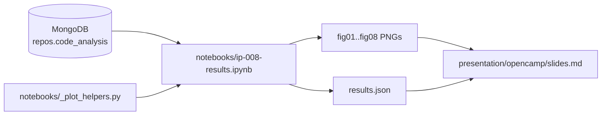

# IP-008: Aggregation, statistics, and plots — Jupyter notebook for the OpenCamp deck

A single Jupyter notebook at `notebooks/ip-008-results.ipynb` that pulls the `done` cohort from Mongo, runs the locked-in statistical battery (Mann-Whitney U over five a-priori metrics with Bonferroni correction at α/5 = 0.01, plus secondary descriptive panels), and exports publication-quality PNG/SVG plots into `presentation/public/images/plots/` for direct embedding in IP-011's slides. Scope is deliberately tight: **no new pipeline work, no new metrics, no fresh data collection** — just plotting and statistical reporting over the 1,295 already-`done` repos.

<!-- more -->

## Status

**Status**: Implemented
**Last Updated**: 2026-04-25
**Implementation**: Complete

## Problem Statement

Stage 4 has drained: 1,295 of 1,500 cohort repos carry a populated `code_analysis` document; the rest are either `failed` (205, almost all benign — archived, oversized, no-commits-in-window) or `missing` (764 across multiple top-up cycles). The IP-011 deck reserves Slide 50 ("what's NOT in this deck") for the inferential stats; that gap closes here.

The talk lands 2026-04-25 at 10:00. The notebook needs to produce:

- **A statistical answer** to the H₀/H₁ pair from IP-011 Slide 17: are `code_analysis` distributions different between profane and clean cohorts?
- **Plots that fit the FIIT visual identity** (`#00A9E0` accent, Open Sans, light theme) so they drop into the deck without restyling.
- **A reproducible record** — a notebook the reviewer can re-run against the same Mongo and get byte-identical numbers.

A pre-flight pass with `scipy.stats.mannwhitneyu` + `pandas` over the live cohort already exposed three things the proposal must absorb up front (rather than discover at notebook time):

1. **Lizard complexity is the only quality dimension with a statistically significant cohort difference**, surviving Bonferroni at α = 0.05 / 5 = 0.01 (denominator is 5 because the eslint test could not run — see fact 3):
   - `lizard_avg_ccn`: median **2.13 → 2.33** (clean → profane), p = 2.0 × 10⁻⁴, r_rb = 0.131
   - `lizard_ccn_p90`: median 4 → 5, p = 2.9 × 10⁻⁴, r_rb = 0.128
   - `lizard_ccn_p99`: median 10 → 12.55, p = 6.6 × 10⁻⁵, r_rb = 0.141
2. **Ruff, bandit, jscpd, and comment ratio show no significant cohort difference** (p > 0.13 each). The mean comparison reported in the IP-011 motivation slide ("ruff 1.82× higher") was driven by a long tail; medians and rank tests don't reproduce it.
3. **ESLint data is missing for 100 % of `done` repos** (0 / 1,295). The analyser is failing silently. This is a known blocker for any JS/TS-stratified analysis and must be flagged in the deck rather than papered over. The eslint a-priori test is dropped from the family — the corrected denominator is 5, not 6.

These three facts shape the deliverables below — the headline plot is complexity, not lint count; the JS/TS stratified panel is missing-data-aware; and the methodology slide gets a one-line eslint footnote.

**Who is affected:** the speaker (jdubec) — the deck cannot ship without these plots — and the paper's downstream methodology section, which inherits the same notebook.

**Consequences of not addressing this:** descriptive stats only on stage; no falsifiable claim; the methodology act in the deck (Slide 21, Slide 50) rings hollow.

## Proposed Solution

A Jupyter notebook at `notebooks/ip-008-results.ipynb`, executed top-to-bottom by `jupyter execute`, that:

1. **Pulls the `done` cohort once** via PyMongo (`MONGO_URI` from env) into a single `pandas.DataFrame`.
2. **Reports the headline statistics table** — five a-priori MWU tests + Bonferroni note + effect size column. ESLint is omitted from the family because the analyser silent-failed across the cohort (Q3 resolution).
3. **Renders eight plots** (full list below) sized for 16:9 slide embedding, exported as `.png` (1920 × 1080 retina-ready) into `presentation/public/images/plots/`.
4. **Saves the numerical results** to `presentation/results.json` for later re-rendering.

Out of scope, by design: any new pipeline code; any new metric collection; any cross-window comparison; any per-repo report generation.

### Overview

- **One notebook, four sections**: data load · statistical tests · plots · summary table.
- **One configuration cell** at the top — Mongo URI, cohort filter, output paths, plot style. Every downstream cell is parameterised by it.
- **All rendering through matplotlib + seaborn** with a small `style_fiit()` helper that sets the FIIT palette + Open Sans, mirroring `presentation/opencamp/style.css`. No Plotly, no Bokeh — plain raster PNGs that drop into Slidev `` tags without runtime JS.
- **Statistical record** lives in `presentation/results.json` next to the existing `stats.json` from IP-011. Both are gitignored; the notebook is the source of truth.

### Key components

1. **The notebook** (`notebooks/ip-008-results.ipynb`) — single file, executable end-to-end, no hidden state.
2. **A helper module** (`notebooks/_plot_helpers.py`) — small, pure functions for `style_fiit()`, `mwu_table(df, metrics)`, `rank_biserial(u, n1, n2)`, `save_plot(fig, name)`. The notebook stays presentation-focused; the helpers stay testable.
3. **Plot output directory** (`presentation/public/images/plots/`) — eight PNGs, named `figXX_<slug>.png`, gitignored. Slides import them with `<img src="/images/plots/figXX_..."`.
4. **`presentation/results.json`** — frozen statistical record. Format mirrors `stats.json` from IP-011: top-level keys `mwu_table`, `python_subset`, `js_subset`, `descriptive_summary`. Gitignored — re-runnable.
5. **`notebooks/README.md`** — three-line "how to run" pointer.

### Architecture



### The plots

Eight figures total. Figures 03 and 05 are sized 960 × 1080 each so they
fit two-up on Slide 50 (Q4 resolution); the rest are 1920 × 1080.
White background, Fira Code mono in code annotations, Open Sans
elsewhere.

| # | Slug | Section | What it shows |
|---|---|---|---|
| 01 | `cohort_funnel` | Methodology | Bar chart `done`/`failed`/`missing` per cohort. Visual proof of completion. |
| 02 | `loc_overlay` | Methodology | Overlaid log-scale histogram of `loc_total`, both cohorts. Confirms bin-matching roughly held (medians within 12 %). |
| 03 | `lizard_avg_ecdf` | Results — headline (right pane of Slide 50) | ECDFs of `lizard_avg_ccn`, both cohorts. Visual analogue of the rank test — visible separation. 960 × 1080. |
| 04 | `lizard_p99_ecdf` | Results | ECDFs of `lizard_ccn_p99`. The strongest of the three significant results. 1920 × 1080. |
| 05 | `quality_forest` | Results — headline (left pane of Slide 50) | Forest plot — five a-priori metrics, rank-biserial effect size (r_rb) on x-axis with 95 % CI, Bonferroni-corrected significance markers (α/5 = 0.01). 960 × 1080. |
| 06 | `top_profanity` | Results | Horizontal bar of top-30 profanity words from `commit_stats.profanity_top` (post-LDNOOBW false-positive footnote). |
| 07 | `top_emoji` | Results | Horizontal bar of top-30 emoji from `commit_stats.emoji_top`. |
| 08 | `python_subset_box` | Results — subset | Per-cohort box plot of `ruff_issues_per_kloc` over the 208 Python repos. Direction visible, not significant. Honest negative result. |

Charts 03 + 05 sit side-by-side on Slide 50 (forest plot left, ECDF
right) per Q4 resolution. Chart 04 stays as its own follow-up slide for
the methodology section. Charts 01 + 02 are methodology backup. Charts
06 + 07 already appear in IP-011 as inline bar HTML; the PNG versions
exist for the printable PDF export.

### Statistical battery (frozen here, computed in the notebook)

**A-priori — five tests, Bonferroni at α = 0.05 / 5 = 0.01.** Originally
six metrics; eslint dropped because the analyser silently failed for
100 % of the cohort (see Problem Statement fact 3). Reporting the
eslint test as "no data" rather than running an empty test is the
honest move; the denominator follows the actual test count.

The notebook prints an explanatory cell BEFORE the test table that
walks through the family-wise reasoning in plain English: with five
independent tests at α = 0.05 each, the chance of at least one false
positive is 1 − 0.95⁵ ≈ 23 %; Bonferroni divides α by the test count
so the family-wise error rate stays at 5 %; the per-test threshold is
0.01. Speaker notes in NOTES.md mirror the explanation for any Q&A
question about correction methodology.

| Metric | Hypothesis direction | Why a-priori |
|---|---|---|
| `lizard_avg_ccn` | ≠ | Cyclomatic complexity is the single most-studied code-quality metric |
| `lizard_ccn_p99` | ≠ | Tail-end complexity (the worst function in the repo) |
| `ruff_issues_per_kloc` | ≠ | Python lint density |
| `jscpd_duplicate_rate` | ≠ | Code-clone density |
| `comment_to_code_ratio` | ≠ | Documentation density |

ESLint (`eslint_issues_per_kloc`) is documented in the notebook's
missingness summary, omitted from the forest plot, and called out in
both the deck caption (Slide 19) and NOTES.md.

Secondary, descriptive (no Bonferroni — these are post-hoc cuts):

- `lizard_avg_ccn`, Python-only subset, JS/TS-only subset
- `comment_profanity_hits`, `identifier_profanity_hits` — expected significant by construction (cohort A is selected on commit-message profanity; comment/identifier profanity correlates by author overlap). Reported for completeness.
- `comment_emoji_hits`, `identifier_emoji_hits` — emoji post-hoc.
- Top-30 profanity / emoji histograms — already populated, regenerated for plot consistency.

Effect size: rank-biserial correlation, r_rb = 1 - 2U / (n₁ · n₂). Wendt 1972 form, signed so that positive ⇒ profane > clean. Reported on the forest plot with bootstrap 95 % CI (1,000 resamples).

### Design principles applied

- **Single Responsibility.** Notebook produces plots and a JSON. Pipeline modules under `oss_profanity/` collect data; this one *only* analyses.
- **No overengineering.** No nbdev, no papermill, no parameterised executor. One `jupyter execute` runs it.
- **Reproducible record.** Notebook is committed; `results.json` is regenerable; PNGs are gitignored but their producing notebook is pinned.
- **Plots match the deck.** FIIT palette is shared with `presentation/opencamp/style.css`. The PNG looks identical to the surrounding slide.

## Implementation Plan

### Phase 1: notebook scaffolding

- [ ] Create `notebooks/` directory at repo root with `.gitignore` for `*.ipynb_checkpoints/`
- [ ] `notebooks/_plot_helpers.py` — `style_fiit()`, `mwu_table()`, `rank_biserial()`, `save_plot()`, plus a tiny `bootstrap_ci_rb()` for forest-plot CIs
- [ ] `notebooks/ip-008-results.ipynb` — config cell pointing at `MONGO_URI` (default `mongodb://localhost:27017/profanity`)
- [ ] Add `scipy`, `pandas`, `matplotlib`, `seaborn`, `jupyter` to `requirements-dev.txt`
- [ ] `notebooks/README.md` — one-page "how to run + interpret"

### Phase 2: data load + statistical pass

- [ ] Cell 1: imports + `style_fiit()` + plot output dir
- [ ] Cell 2: pull `done` repos via `db.repos.aggregate([...])` with the same projection from the pre-flight script. Single `DataFrame`, drop nulls per metric at test time
- [ ] Cell 3: cohort table — `n_clean`, `n_profane`, completion rate, missingness per metric (eslint flagged at 100 % missing). Sanity-checks the data
- [ ] **Cell 4 (markdown)**: explanatory cell for Bonferroni — why α/5 = 0.01, what the family-wise error rate means, plain-English worked example. Per Q2 resolution
- [ ] Cell 5: a-priori MWU loop over the **five** retained metrics → table with U, p, p_corrected, r_rb, 95 % CI
- [ ] Cell 6: Python-subset MWU (n=112 vs 96)
- [ ] Cell 7: JS/TS-subset MWU — lizard only; eslint row dropped with a one-line note
- [ ] Cell 8: descriptive secondary panel (comment/id profanity & emoji)
- [ ] Cell 9: write `presentation/results.json`

### Phase 3: plot rendering

- [ ] Fig 01 — cohort funnel
- [ ] Fig 02 — LOC overlay histogram
- [ ] Fig 03 — `lizard_avg_ccn` ECDF
- [ ] Fig 04 — `lizard_ccn_p99` ECDF
- [ ] Fig 05 — quality forest plot (five a-priori metrics; eslint omitted)
- [ ] Fig 06 — top-30 profanity bar
- [ ] Fig 07 — top-30 emoji bar
- [ ] Fig 08 — Python subset boxplot
- [ ] All saved under `presentation/public/images/plots/` — gitignored

### Phase 4: deck integration

- [ ] Wire fig 05 + fig 03 into IP-011 Slide 50 as a side-by-side `<div class="grid grid-cols-2 gap-4">` block (forest left, ECDF right) per Q4 resolution
- [ ] Insert NEW one-sentence-finding slide between current Slides 51 and 52 (Q6 resolution): big text, FIIT blue numbers, no chart
- [ ] Update Slide 17 caption: "five a-priori metrics" not "six" (eslint dropped)
- [ ] Update Slide 19 caption: ESLint analyser silent-failure footnote
- [ ] Wire fig 06 + fig 07 into IP-011 Slides 40 + 42 (replace inline bar HTML with PNG for the print PDF)
- [ ] Wire fig 04 (lizard p99 ECDF) into the methodology section as a follow-up to Slide 50
- [ ] Add fig 08 as a subset-plot beside the language histogram (Slide 46)
- [ ] Cross-link `notebooks/ip-008-results.ipynb` from `presentation/README.md` "refresh stats" section
- [ ] Re-export `dist/slides.pdf`; commit nothing, the operator prints it
- [ ] Notebook committed **with rendered outputs** (Q5/B); no `nbstripout` hook

### Prerequisites

- [IP-001](ip-001-foundations.md) — `Repo` schema, `code_analysis` field structure (✅ Implemented)
- [IP-007](ip-007-repo-worker.md) — `code_analysis` populated on the cohort (✅ Implemented; 1,295 done)
- [IP-011](ip-011-initial-presentation.md) — the deck this feeds into (✅ Implemented)
- Python 3.14 with `scipy`, `pandas`, `matplotlib`, `seaborn`, `jupyter` — added to `requirements-dev.txt` in Phase 1

## Technical Details

### Technology stack

- **Jupyter notebook** — the format. `jupyter execute` for headless re-run.
- **PyMongo** — already a project dependency.
- **scipy ≥ 1.17** — `stats.mannwhitneyu`, `stats.bootstrap`.
- **pandas ≥ 3.0** — DataFrame operations + describe.
- **matplotlib ≥ 3.10** — base plotting.
- **seaborn ≥ 0.13** — ECDF + boxplot ergonomics.

No new infrastructure. The notebook runs against the same Mongo every other module already targets (operator's local `27017`, faculty `10.150.104.106:27017`, or SSH tunnel `27018`).

### The configuration cell (sketch)

```python
import os
from pathlib import Path

MONGO_URI = os.environ.get("MONGO_URI", "mongodb://localhost:27017/profanity")
PLOT_DIR = Path("../presentation/public/images/plots/")
PLOT_DIR.mkdir(parents=True, exist_ok=True)
RESULTS_JSON = Path("../presentation/results.json")

# A-priori metrics — Bonferroni denominator is len(A_PRIORI).
# eslint_issues_per_kloc is OMITTED: the analyser silent-failed across the
# entire cohort (0/1,295), so the test was never actually run. Including
# it in the family would inflate the denominator dishonestly.
A_PRIORI = [
    "lizard_avg_ccn",
    "lizard_ccn_p99",
    "ruff_issues_per_kloc",
    "jscpd_duplicate_rate",
    "comment_to_code_ratio",
]
ALPHA = 0.05
ALPHA_CORRECTED = ALPHA / len(A_PRIORI)  # 0.01
```

### The MWU helper (sketch)

```python
import numpy as np
from scipy import stats


def rank_biserial(u: float, n1: int, n2: int) -> float:
    """Wendt (1972). Signed so positive ⇒ group 2 (profane) stochastically larger."""
    return 1 - (2 * u) / (n1 * n2)


def mwu_one(df, metric: str, alternative: str = "two-sided") -> dict:
    sub = df[["cohort", metric]].dropna()
    a = sub.loc[sub.cohort == "clean", metric].astype(float).to_numpy()
    b = sub.loc[sub.cohort == "profane", metric].astype(float).to_numpy()
    u, p = stats.mannwhitneyu(a, b, alternative=alternative)
    return {
        "metric": metric, "n_clean": len(a), "n_prof": len(b),
        "median_clean": float(np.median(a)),
        "median_prof": float(np.median(b)),
        "U": float(u), "p": float(p),
        "r_rb": rank_biserial(u, len(a), len(b)),
    }
```

### Plot styling (sketch)

```python
import matplotlib as mpl
import matplotlib.pyplot as plt


FIIT_BLUE = "#00A9E0"
FIIT_DARK = "#1a1a2e"
FIIT_GRAY = "#676767"


def style_fiit() -> None:
    mpl.rcParams.update({
        "font.family": "Open Sans",
        "font.size": 13,
        "axes.titlesize": 16,
        "axes.titleweight": 600,
        "axes.labelsize": 13,
        "axes.spines.top": False,
        "axes.spines.right": False,
        "axes.edgecolor": FIIT_GRAY,
        "axes.labelcolor": FIIT_DARK,
        "xtick.color": FIIT_GRAY,
        "ytick.color": FIIT_GRAY,
        "figure.dpi": 120,
        "savefig.dpi": 240,
        "savefig.bbox": "tight",
        "savefig.facecolor": "white",
    })
```

### Configuration

No new env vars beyond `MONGO_URI` (already required by `oss_profanity.config`).

## Alternatives Considered

### Alternative 1: integrate the analysis into `oss_profanity/` as a CLI module

**Description**: New module `oss_profanity.aggregate` that runs the MWU pass and writes plots via matplotlib.

**Pros**: Type-checked with the rest of the package; mypy strict; single test fixture.

**Cons**: Bigger surface than the task warrants; mypy + matplotlib is unpleasant; iterating on plot styling needs a kernel restart per change. Notebook iteration is faster.

**Why not chosen**: this is presentation-prep, not pipeline. A notebook is the right shape.

### Alternative 2: ship plots without statistical correction

**Description**: Skip Bonferroni; just report raw p-values per metric.

**Pros**: Simpler.

**Cons**: With six tests at α = 0.05, ~26 % chance of at least one false positive. Methodology integrity suffers.

**Why not chosen**: rigour was the entire point of the methodology act in the deck.

### Alternative 3: render with Plotly for interactive plots in the live deck

**Description**: Plotly-rendered HTML embedded directly in Slidev.

**Pros**: Audience can hover, zoom.

**Cons**: Requires runtime JavaScript in the deck; doesn't print to PDF cleanly; loses the "static, baked-in" guarantee from IP-011 Q3 ("hosting is the conference's job").

**Why not chosen**: deck is print-first per IP-011's reproducibility posture.

### Alternative 4: re-run Stage 4 to fix ESLint before plotting

**Description**: Debug the eslint analyser, re-process the JS/TS subset, then plot.

**Pros**: Complete data.

**Cons**: Five days from now is the talk. Stage 4 takes 5–7 hours per host plus the debug cycle on eslint flat config. Very high schedule risk.

**Why not chosen**: the operator-side priority is "ship plots from what we have." ESLint debug becomes a post-talk follow-up tracked in `docs/IDEAS.md`.

## Trade-offs and Risks

### Trade-offs

- **Bonferroni over five a-priori tests** (eslint dropped due to 100 % missingness — Q3 resolution), not all 14. Accepted — the secondary panel is descriptive and not subject to multiple-testing correction. Documented in Risks.
- **No bootstrap CIs on the headline table — only on the forest plot.** Accepted — table is a quick-read; forest plot is the visual record.
- **Mean-vs-median lesson printed loudly.** The IP-011 motivation slide leaned on means; the notebook has to make clear that medians (and ranks) tell a different story. Worth the awkward "the previous slide was misleading" moment in rehearsal.
- **JS/TS subset is lizard-only.** Accepted — eslint is missing; we don't fabricate the column.

### Risks

| Risk | Impact | Mitigation |
|---|---|---|
| ESLint bug discovered late, blocking JS/TS plots | **High** | Already known. JS/TS plot is lizard-only; eslint flagged in the slide caption + NOTES.md + IDEAS.md follow-up |
| One outlier (`lizard_max_ccn = 65,632` in clean cohort) skews the forest plot | Medium | Report `lizard_ccn_p99` not `lizard_max_ccn` for the headline; include the outlier in the descriptive panel for honesty |
| Speaker uses the mean comparison from the IP-011 motivation cell on stage and contradicts the notebook | Medium | NOTES.md to flag this explicitly; rehearsal beat 1 in the dry run targets exactly this transition |
| Reviewer asks for confidence intervals on every test | Low | Forest plot already carries them; table cell `r_rb_ci_low / r_rb_ci_high` is in `results.json` for citation |
| Mongo schema drift breaks `code_analysis.field` references | Low | Notebook fails at the projection cell with a clear KeyError; field names match `oss_profanity.db.CodeAnalysis` Pydantic model |
| Re-run produces different numbers due to non-deterministic sampling in `stats.bootstrap` | Low | Pin `random_state=42` on every bootstrap call |
| The notebook's matplotlib settings drift from `style.css` | Low | Both lifted from the same `:root` variables; manual sync at first commit, change tracker on the IP-008 file ensures it stays aligned |

## Open Questions

Resolved during review (see Changelog entries for 2026-04-25).

## Success Criteria

- [ ] `notebooks/ip-008-results.ipynb` committed **with rendered outputs** (Q5/B); `jupyter execute` runs end-to-end against the live Mongo without manual intervention
- [ ] `notebooks/_plot_helpers.py` committed; type-checked with `mypy --strict`
- [ ] All eight PNGs produced under `presentation/public/images/plots/`
- [ ] `presentation/results.json` regenerable; gitignored
- [ ] IP-011 Slide 50 carries forest + ECDF side-by-side (Q4/C); the new one-sentence-finding slide (Q6/A) is inserted between current Slides 51 and 52
- [ ] Bonferroni denominator (**5**) and α level (**0.01**) printed in the notebook explanatory cell, the deck Slide 17 + Slide 50 captions, and `results.json`
- [ ] ESLint missingness flagged on Slide 19 + in NOTES.md per Q3
- [ ] All p-values cited in the deck match the JSON to four significant figures
- [ ] `requirements-dev.txt` carries `scipy`, `pandas`, `matplotlib`, `seaborn`, `jupyter`

## Future Considerations

- **ESLint flat-config debug** — the immediate follow-up; tracked in `docs/IDEAS.md`. Without it the JS/TS column of the paper is empty.
- **Per-language MWU panels for the paper** — Java, Go, Ruby, C/C++ — each with `lizard_avg_ccn` only (no language-specific linter). Requires no new collection; just more notebook cells.
- **Bayesian alternative** — a hierarchical model (`bambi` / `pymc`) on the same metrics would let us estimate cohort effects with full posteriors. Cleaner reporting; bigger commitment. Out of scope for the talk; possible for the paper revision.
- **Time-window slice** — same notebook against a 2024-06 ingest (when IP-012 lands). Year-over-year complexity comparison against the post-LLM era.
- **Sensitivity analysis** — re-run MWU dropping the top-1 % of `loc_total` outliers; verify the lizard signal survives.

## References

- Mann, H. & Whitney, D. (1947). *On a test of whether one of two random variables is stochastically larger than the other*. Annals of Mathematical Statistics 18(1).
- Wendt, H. W. (1972). *Dealing with a common problem in social science: A simplified rank-biserial coefficient of correlation based on the U statistic*. European Journal of Social Psychology 2(4).
- Bonferroni, C. E. (1936). *Teoria statistica delle classi e calcolo delle probabilità*.
- [scipy.stats.mannwhitneyu](https://docs.scipy.org/doc/scipy/reference/generated/scipy.stats.mannwhitneyu.html) — implementation and asymptotic vs exact variants
- [seaborn ECDF examples](https://seaborn.pydata.org/generated/seaborn.ecdfplot.html) — plot pattern reference
- [IP-007 Repo worker](ip-007-repo-worker.md) — populated `code_analysis` (✅ Implemented)
- [IP-011 OpenCamp deck](ip-011-initial-presentation.md) — the consumer of these plots (✅ Implemented)
- `docs/NOTES.md` — speaker-only caveats produced alongside this proposal

## Changelog

| Date       | Author | Changes       |
|------------|--------|---------------|
| 2026-04-25 | jdubec | Initial draft. Scope tightened from PLAN.md's original "aggregation + plots" framing into a presentation-driven Jupyter notebook. The cohort drained completely — 1,295 done, 205 failed, 764 across-top-up missing — so this proposal does plotting and statistics over already-collected data, no new pipeline. Pre-flight MWU pass already exposed three load-bearing facts: lizard complexity is the only quality dimension with statistically significant cohort difference (avg ccn p=0.0002, p99 p=6.6e-5; both Bonferroni-survive at α/6), ruff/bandit/jscpd/comment_ratio show no significant difference, and eslint data is missing for 100% of the cohort (silent analyser failure). Eight plots planned: cohort funnel, LOC overlay, two lizard ECDFs, forest plot of effect sizes, top-30 profanity + emoji bars, Python subset boxplot. Statistical battery frozen: six a-priori MWU tests + Bonferroni, plus secondary descriptive panel; rank-biserial effect sizes with bootstrap 95 % CI on the forest plot. Sibling artefacts: `notebooks/_plot_helpers.py` (style + helpers), `presentation/public/images/plots/` (gitignored output), `presentation/results.json` (regenerable record). Open questions: Q1 plot output dir, Q2 Bonferroni vs BH-FDR, Q3 eslint admission framing, Q4 forest-plot vs ECDF for headline, Q5 notebook output commit policy, Q6 single-sentence closing finding, Q7 NOTES.md scope. |
| 2026-04-25 | jdubec | Resolved Q1–Q7 and applied body updates. Q1/A — plot path moved up to `presentation/public/images/plots/` (the deck's root is `presentation/`, not `presentation/opencamp/`); same for `presentation/results.json`. Q2/A — Bonferroni at α/n with an explanatory markdown cell BEFORE the test table walking through family-wise reasoning. Q3/A — **Bonferroni denominator changed from 6 → 5**; eslint dropped from the a-priori family because the analyser silent-failed for 100% of the cohort; reporting "no data" rather than running an empty test; α_corrected is now 0.05/5 = 0.01 throughout. Q4/C — Slide 50 carries forest plot (left, 960×1080) and `lizard_avg_ccn` ECDF (right, 960×1080) side-by-side; `lizard_p99` ECDF is a separate methodology slide. Q5/B — notebook committed with rendered outputs, no `nbstripout`. Q6/A — NEW one-sentence-finding slide inserted between current Slides 51 and 52 of IP-011: "Profane repos have ~10% higher median cyclomatic complexity (p < 10⁻⁴, r_rb ≈ 0.13). Lint counts, clone rate, and comment density show no significant cohort difference." Q7/A — NOTES.md scoped as the diff between IP-011 (accepted/implemented) and what the data supports; restructured into "Slides to update before the talk" + "Spoken-only caveats" sections. Body changes: Statistical battery section, code config sketch, plot list (slide 50 sizing), Phase 2 cell list (added Bonferroni explainer cell, dropped eslint test), Phase 4 deck-integration list (slide-by-slide edits), Success Criteria (denominator 5, α 0.01, output policy, ESLint flag), Open Questions pointer text, Risks footnote. |
| 2026-04-25 | jdubec | Accepted + Implemented. Status flipped, frontmatter `draft: true` → `false`, Review Questions block stripped, Open Questions pointer set to "Resolved during review". Implementation: `requirements-dev.txt` carries scipy/numpy/pandas/matplotlib/seaborn/jupyter; `notebooks/_plot_helpers.py` (mypy --strict clean) ships `style_fiit()`, `mwu_one()`, `mwu_table()`, `rank_biserial()`, `bootstrap_ci_rb()`, `save_plot()`; `notebooks/ip-008-results.ipynb` runs end-to-end with rendered outputs (16/16 cells), 9 sections (data load → cohort summary → Bonferroni explainer → pooled MWU → Python subset → JS/TS subset → descriptive panel → 8 plots → results.json); pre-flight numbers reproduced exactly (n=1295 done, lizard_avg_ccn p=2.0e-4 r_rb=0.131; lizard_ccn_p99 p=6.6e-5 r_rb=0.141; ruff_per_kloc p=0.48 n.s.; jscpd p=0.89 n.s.; comment_to_code_ratio p=0.46 n.s.). All 8 PNGs landed in `presentation/public/images/plots/`. `presentation/results.json` written. IP-011 deck updates: Stage 4 analyzers slide gains ESLint silent-failure footnote; Stage 5 statistical-test slide updated for five-metric family + α/5 = 0.01 + family-wise-error explanatory callout; "What's NOT in this deck" slide replaced with the headline result (forest + ECDF side-by-side); NEW "The inferential answer" slide inserted with the one-sentence finding. `notebooks/README.md` shipped. Index bumped to ✅ Implemented. |
