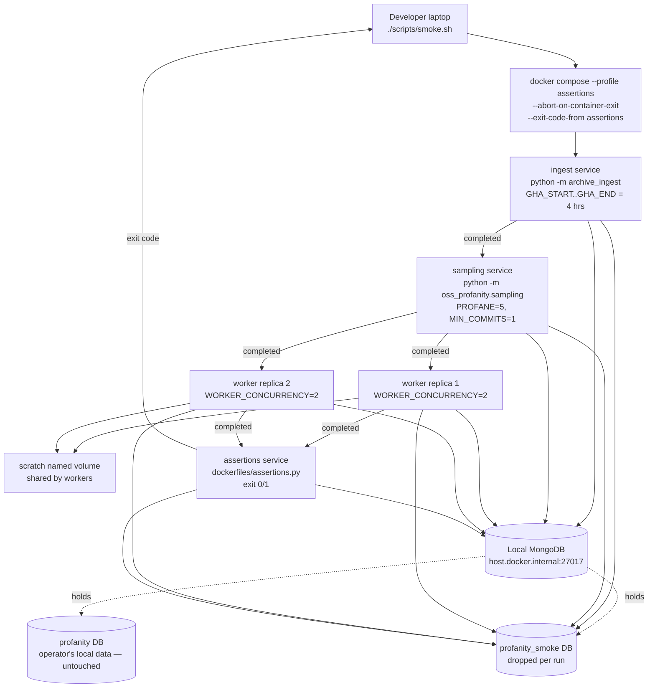

# IP-009: Docker test harness — green-gate before OpenStack deployment

A self-contained Docker harness (one shared `Dockerfile`, role-based profiles in the existing `compose.yml`, a ~20-line `scripts/smoke.sh` wrapper, and a one-file `dockerfiles/assertions.py` check script) that ingests four hours of GH Archive, promotes a tiny cohort via [IP-006](ip-006-cohort-sampling.md)'s real sampling module, and runs worker replicas against it. Green in under ten minutes on a laptop, with no interference with the operator's local ingest data.

<!-- more -->

## Status

**Status**: Implemented
**Last Updated**: 2026-04-24
**Implementation**: Complete

## Problem Statement

Before [IP-010](../../PLAN.md#ip-010-openstack-deployment) provisions three OpenStack VMs and starts moving 150 GB of GH Archive data, we need a single command that exercises the full pipeline — ingest ([IP-005](ip-005-gh-archive-ingest.md)) → sampling ([IP-006](ip-006-cohort-sampling.md)) → worker ([IP-007](ip-007-repo-worker.md)) — end to end and proves both text signals ([IP-002](ip-002-profanity-detection.md) profanity + [IP-003](ip-003-emoji-detection.md) emoji) land in their schema fields. Without that gate, every OpenStack debugging session pays the round-trip of pushing code, waiting for a 30-minute partial ingest, and discovering a `tree-sitter-language-pack` import error or a missing `eslint` binary on the worker host. Time we don't have for a two-day experiment.

The harness has to clear five constraints simultaneously:

- **One `Dockerfile` shared by ingest + worker roles.** PLAN.md §IP-009 calls out "differs only by entrypoint / env." Building two images doubles CI time and creates two surfaces where dependency drift can hide. The single image carries every external binary IP-004 talks to (`ruff`, `eslint`, `jscpd`, `lizard`, `bandit`, `git`, `node`, `npm`) plus the Python deps from `requirements.txt`, plus IP-009-owned files: the baseline ESLint flat-config at `/opt/baseline-eslint.config.mjs` and the version-pinned npm packages.
- **No interference with the operator's local ingest data.** The user's dev machine hosts their production-scale ingest data in the `profanity` database on a local MongoDB at `mongodb://localhost:27017` (a backup exists). The smoke must not touch that database, must not mutate `ingest_runs` for `2020-06-*` files already checkpointed, and must never call `dropDatabase` against `profanity`. The cleanest seam is a **separate database name** (`profanity_smoke`) on the same local Mongo — Mongo isolates collections per database, so `profanity_smoke.repos` and `profanity.repos` cannot collide.
- **Both signals must demonstrably land.** The smoke assertions in PLAN.md are the contract: ≥ 100 repos ingested, ≥ 1 with `profanity_hits > 0`, ≥ 1 with `emoji_hits > 0`, ≥ 3 reaching `status="done"` after worker pass, and on those done repos `code_analysis.loc_total > 0` and `comment_emoji_hits` is **set** (zero is allowed but the field must not be missing). A smoke test that only checks "did anything finish" misses the IP-002 / IP-003 contract entirely — the field-presence assertion is what guarantees the parallel-fields invariant the rest of the pipeline depends on.
- **Sampling uses the real [IP-006](ip-006-cohort-sampling.md) module.** IP-006 is ✅ Implemented as of 2026-04-24 — `oss_profanity/sampling.py` exports `run()` and is env-var-tunable. The smoke invokes `python -m oss_profanity.sampling` with overridden thresholds (`PROFANE_COHORT_SIZE=5`, `SAMPLING_MIN_COMMITS=1`, `SAMPLING_COMMIT_BINS=1,5,20`) so the production defaults (750 × 750, `min_commits=20`, bins `20,50,200,1000`) adapt to the much thinner 4-hour ingest window. No stand-in helper is needed.
- **Laptop-runnable.** The whole thing must fit on the operator's MacBook Pro M1 Max: 2 worker replicas × concurrency 2 = 4 concurrent `process_one` calls, a 4-hour ingest window (~500 MB of `.json.gz` downloads), and a `~/scratch` named volume sized for at most a handful of small clones. Running on macOS means **no `signal.setitimer` envelope** in the worker — IP-007's timeout already no-ops on non-Linux, and the smoke harness must not assert on timeout behaviour that doesn't exist on dev machines.

Beyond those, the harness has to navigate decisions PLAN.md punted on:

- **ESLint v10 broke the `.eslintrc.*` workflow.** [IP-004](ip-004-static-analyzers.md) `_eslint.py` already calls `--no-config-lookup --config /opt/baseline-eslint.config.mjs`. The Dockerfile is responsible for materialising that file with version-pinned `@eslint/js` + `typescript-eslint` + `eslint` so the `recommended` rule set means the same thing on every worker host across the experiment. Pin floats are how cohort comparisons silently diverge between weeks.
- **`tree-sitter-language-pack` is large.** ~150 MB of compiled grammars. It belongs in the runtime layer (every worker needs it) and is the single biggest layer in the image. Worth caching deliberately, not refetching on every dep churn.
- **The smoke orchestrator is a shell wrapper around Docker Compose, not pytest.** The smoke is a single sequential workflow ("run these four things in order, check four facts in Mongo at the end"), not a parameterised test matrix. Pytest fixtures would reinvent what `docker compose up --abort-on-container-exit --exit-code-from assertions` already does in one line. A ~20-line `scripts/smoke.sh` wraps the compose call; a one-file `dockerfiles/assertions.py` inside a dedicated `assertions` service runs the PyMongo checks and exits 0/1. `./scripts/smoke.sh`'s exit code is the smoke's verdict.
- **Compose profile namespacing uses role-based names.** The existing `compose.yml` defines the production `mongo` service. Splitting into roles — `database` (mongo), `ingest` (IP-005), `worker` (IP-007), `assertions` (IP-009 checker) — matches the way an operator actually thinks about the pipeline. `docker compose up mongo` (no profile) still works for the already-running local MongoDB; `docker compose --profile ingest run --rm ingest` runs a streaming ingest; `./scripts/smoke.sh` activates `--profile assertions` which brings up the full end-to-end chain.
- **Worker replicas need 2× concurrency, not 12×.** Production sizing is 12 per host × 3 hosts = 36 concurrent. Smoke replicates the **topology** (`replicas: 2`, `WORKER_CONCURRENCY=2` → 4 concurrent) but at laptop scale. The launcher's fork-join semantics work the same.

**Who is affected:** [IP-010](../../PLAN.md#ip-010-openstack-deployment) needs IP-009 green before any provisioning script runs — the deploy scripts copy the same Dockerfile + compose to OpenStack. [IP-008](../../PLAN.md#ip-008-aggregation-and-plots) reads what the worker writes; if a smoke run misses a field, IP-008 plots will too. Future contributors lose the ability to reproduce the experiment on a laptop.

**Consequences of not addressing this:** every regression — a tree-sitter grammar that won't load in the image, an ESLint rule that throws on a parse error, a worker that can't reach Mongo from inside Compose's network — is discovered after pushing to OpenStack. Round-trip is hours; one weekend has only so many hours.

## Proposed Solution

A single shared `Dockerfile`, role-based profiles (`database`, `ingest`, `worker`, `assertions`) added to the existing `compose.yml`, a ~20-line `scripts/smoke.sh` wrapper, and a one-file `dockerfiles/assertions.py` PyMongo check script. The wrapper invokes `docker compose --profile assertions up --build --abort-on-container-exit --exit-code-from assertions`, which starts `mongo` → `ingest` → `sampling` → `worker` (×2) → `assertions`, with `depends_on` sequencing. `--exit-code-from assertions` propagates the check script's exit code as the smoke's verdict. All writes go to `profanity_smoke` — the operator's local `profanity` database is never touched.

### Overview

- **One `Dockerfile`, two roles by env+entrypoint.** The image installs Python 3.14 + git + Node.js 22 + npm; a Rust-binary `ruff` from the official release; pip-installs `requirements.txt` (lizard, bandit, tree-sitter-language-pack, etc.); `npm install -g` pins `eslint@10.2.1` + `@eslint/js@10.0.1` + `typescript-eslint@8.59.0` + `jscpd@4.0.9`; writes the baseline ESLint flat-config to `/opt/baseline-eslint.config.mjs`. The default `CMD` is the worker (`python -m oss_profanity.repo_worker`); the ingest, sampling, and assertions services override it with `command:`.
- **Role-based compose profiles (Q1).** `database` (mongo — always-on target), `ingest` (IP-005 streaming one-shot), `sampling` (IP-006 one-shot), `worker` (IP-007 long-running, `--scale` to 2 for smoke / 3 for faculty), `assertions` (IP-009 check script). `docker compose up mongo` (no profile) is unchanged for the operator's in-flight local DB. The smoke activates `--profile assertions` which, via `depends_on` + `service_completed_successfully`, transitively boots ingest → sampling → worker before running the check script.
- **MongoDB provides the distributed lock — no Redis (Q1 sub-question).** With 3 worker hosts × `WORKER_CONCURRENCY` processes each, effective parallelism is 3N against one MongoDB. `claim_next_repo(worker_id)` wraps `find_one_and_update({status: "pending"}, {$set: {status: "claimed", claimed_by, claimed_at}}, sort=[("commit_stats.profanity_rate", -1)], return_document=AFTER)` — `find_one_and_update` is atomic per document on the server. Two workers calling it concurrently each get a *different* repo or `None`; the CAS on `status` prevents double-claims. `STALE_CLAIM_TTL_MIN` (default 20) lets `reclaim_stale()` flip abandoned claims back to `pending`. No coordination layer beyond the Mongo server is needed; no Redis, no ZooKeeper, no leader election.
- **Database isolation via separate name on the operator's local Mongo (Q2).** `MONGO_URI=mongodb://host.docker.internal:27017/profanity_smoke` for every service launched under the smoke chain; the compose file's `mongo` service is not used by the smoke (the operator already has a local Mongo bound to 27017 that the smoke talks to). The assertions container's first action is `assert db.name == "profanity_smoke"` — hard-fails if misconfigured. The user has a backup of the production data; blast-radius worst case is "drop and restore".
- **Four-hour ingest window (Q4).** `GHA_START=2020-06-01-00`, `GHA_END=2020-06-01-03`. Chosen over 2h to comfortably clear the ≥ 1 profanity / ≥ 1 emoji thresholds; M1 Max runs the window in ~4 min of ingest + ~5 min of deep-analyse = ~9 min end-to-end. Migrating the `profanity_smoke` data to faculty Mongo is safe: the `status` lifecycle + IP-006's `status in ("seen", "skipped")` selector make cohort repos already at `done` invisible to a re-sample, so no duplicate work.
- **Sampling uses IP-006 directly (Q3).** No stand-in helper. The `sampling` service runs `python -m oss_profanity.sampling` with four env-var overrides tuned to the 4-hour window:

  | Env var                | Smoke value     | Rationale                                                                   |
  |------------------------|-----------------|-----------------------------------------------------------------------------|
  | `PROFANE_COHORT_SIZE`  | `5`             | Enough to clear PLAN.md's ≥ 3 done threshold with margin                    |
  | `CLEAN_COHORT_SIZE`    | `5`             | Matched                                                                      |
  | `SAMPLING_MIN_COMMITS` | `1`             | Production default of 20 would empty the cohort on a 4-hour window          |
  | `SAMPLING_COMMIT_BINS` | `1,5,20`        | Bins `[1,5)`, `[5,20)`, `[20,∞)` reliably populate at 4-hour scale          |

- **Five assertions.py checks, one per PLAN.md bullet.** The script runs after the worker profile completes (via `depends_on: service_completed_successfully`), reads from `profanity_smoke`:
  - `repos.count_documents({}) >= 100` (ingest populated)
  - `repos.count_documents({"commit_stats.profanity_hits": {"$gt": 0}}) >= 1` (IP-002 signal present)
  - `repos.count_documents({"commit_stats.emoji_hits": {"$gt": 0}}) >= 1` (IP-003 signal present)
  - `repos.count_documents({"status": "done"}) >= 3` (worker contract)
  - For every `status="done"` doc: `code_analysis.loc_total > 0` AND `"comment_emoji_hits" in code_analysis` (field presence, not value)
  - Also: every promoted repo has `cohort in ("profane", "clean")` — IP-006's schema contract.
- **Operator lifecycle is one command.** `./scripts/smoke.sh` invokes `docker compose --profile assertions up --build --abort-on-container-exit --exit-code-from assertions`. On success, exits 0; on failure, exits with the assertions container's exit code and `compose down` cleans up. Makefile target `make smoke` is the same thing.
- **Scratch as a named volume.** `scratch:/scratch` shared across worker replicas. No `size:` constraint (Docker default).
- **GitHub token pass-through.** The harness reads `$GITHUB_TOKEN` from the host shell and forwards it via Compose `environment:`. Without it, the worker still runs (per IP-007's degraded mode) but most repos get `github_metadata: None`. The assertions script does **not** check `github_metadata` — it's not part of PLAN.md's IP-009 contract.
- **Tool versions pinned exactly (Q6).** Every toolchain version verified against its official release page on 2026-04-24: `eslint@10.2.1`, `@eslint/js@10.0.1`, `typescript-eslint@8.59.0`, `jscpd@4.0.9`, `ruff@0.15.12`, `bandit==1.9.4`, `lizard==1.17.25`. Bumps are manual; a success-criteria smoke step asserts the built image reports these exact versions.

### Key Components

1. **`Dockerfile`** (repo root) — single-stage, slim image. System deps layered above Python deps layered above app code to minimise rebuild surface.
2. **`compose.yml`** (extended) — adds `ingest`, `sampling`, `worker`, `assertions` services under role-based profiles. The existing `mongo` service is unchanged.
3. **`dockerfiles/eslint.config.mjs`** (in repo, Q8) — ESLint flat-config committed to git for auditability; the Dockerfile `COPY`s it to `/opt/baseline-eslint.config.mjs`. Shape per [`docs/CONFIGURATION.md`](../CONFIGURATION.md#eslint-wrapper-_eslintpy):

   ```javascript
   import js from "@eslint/js";
   import tseslint from "typescript-eslint";
   export default [
     { files: ["**/*.{js,mjs,cjs,jsx,ts,tsx}"],
       ...js.configs.recommended },
     ...tseslint.configs.recommended,
   ];
   ```

4. **`dockerfiles/assertions.py`** — a ~60-line PyMongo script. Reads `MONGO_URI` from env; asserts `db.name == "profanity_smoke"`; runs the five checks; prints PASS/FAIL per check; exits 0 on all-green, 1 on any fail. Invoked by the `assertions` compose service.
5. **`scripts/smoke.sh`** — ~20-line shell wrapper. Exports `COMPOSE_PROJECT_NAME=oss-profanity-smoke`, runs `docker compose --profile assertions up --build --abort-on-container-exit --exit-code-from assertions`, captures exit code, runs `docker compose down`, exits with the captured code.
6. **`README.md`** (new, Q9) — top-level project README. Authored end-to-end (no pre-existing file): project one-liner, prereqs, stage-by-stage quick-start, one-command smoke invocation, links to every supporting doc (DRAFT.md, PLAN.md, CONFIGURATION.md, COHORT.md, IDEAS.md, IP index).

### Architecture



The harness is a thin orchestrator on top of existing CLI entrypoints. IP-009-owned code: `Dockerfile`, the `compose.yml` additions, `dockerfiles/eslint.config.mjs`, `dockerfiles/assertions.py`, `scripts/smoke.sh`, and `README.md`.

### Design principles applied

- **Single Responsibility.** Dockerfile builds the image; compose runs services; assertions.py asserts; smoke.sh wires them. None of the four knows the others' internals.
- **Open/Closed.** Adding a new analyzer binary = one `RUN apt-get install` + one assertion. Adding a new pipeline phase (e.g. IP-008 aggregation) = one new compose service + one new assertions check.
- **DRY.** One `Dockerfile` for ingest, sampling, worker, and assertions roles. One ESLint config baked into the image, used by every worker on every host. IP-006 sampling logic lives in `oss_profanity/sampling.py` only — no duplicated "smoke promoter".
- **Interface Segregation.** The smoke never imports internal modules — it talks to Mongo through PyMongo and to the pipeline through CLI entrypoints (`python -m ...`). An outside-in test the rest of the suite is not.
- **Dependency Inversion.** The harness depends on the published interfaces (`__main__` entrypoints, the `Repo` schema documented in [`docs/SCHEMA.md`](../SCHEMA.md)), not on the internal structure of any subpackage.

## Implementation Plan

### Phase 1: Dockerfile

- [ ] Create `Dockerfile` at repo root, base `python:3.14-slim-bookworm`
- [ ] System deps: `git`, `curl`, `ca-certificates`, `nodejs` (NodeSource v22), `npm`
- [ ] Install `ruff==0.15.12` via `pip install ruff==0.15.12` (single install surface with bandit/lizard)
- [ ] `pip install --no-cache-dir -r requirements.txt` — picks up `lizard==1.17.25`, `bandit==1.9.4`, `tree-sitter-language-pack`, `httpx`, `pymongo`, `pydantic`, `emoji`, etc. Versions bumped in `requirements.txt` to match Q6 resolution.
- [ ] `npm install -g --omit=dev eslint@10.2.1 @eslint/js@10.0.1 typescript-eslint@8.59.0 jscpd@4.0.9 && npm cache clean --force`
- [ ] Copy `dockerfiles/eslint.config.mjs` → `/opt/baseline-eslint.config.mjs`
- [ ] `COPY oss_profanity/ /app/oss_profanity/` and `WORKDIR /app`
- [ ] Default `CMD` = worker (`["python", "-m", "oss_profanity.repo_worker"]`)
- [ ] `.dockerignore` — exclude `.venv`, `__pycache__`, `data/`, `.git/`, IDE files
- [ ] Smoke-build: `docker build -t oss-profanity:smoke .` finishes; `docker run --rm oss-profanity:smoke python -c "from oss_profanity.config import config; print(config.mongo_uri)"` exits 0 (with `MONGO_URI` injected)
- [ ] Verify all six external binaries resolve: `which ruff eslint jscpd lizard bandit git`
- [ ] Verify `ruff --version`, `eslint --version`, `jscpd --version`, `lizard --version`, `bandit --version` print the pinned versions (catches silent drift from base-image rebuilds)
- [ ] Verify `tree_sitter_language_pack.get_parser("python")` succeeds

### Phase 2: ESLint baseline config

- [ ] Create `dockerfiles/eslint.config.mjs` with the flat-config shape from [`docs/CONFIGURATION.md`](../CONFIGURATION.md#eslint-wrapper-_eslintpy)
- [ ] Lint a tiny vendored fixture inside the image to confirm the config loads: `eslint --no-config-lookup --config /opt/baseline-eslint.config.mjs /tmp/sample.js` exits with a numeric findings count

### Phase 3: compose.yml extension

- [ ] Extend the existing `compose.yml` with four services using role-based profile names:
  ```yaml
  ingest:
    image: oss-profanity:smoke
    profiles: [ingest, assertions]
    build: .
    environment:
      MONGO_URI: mongodb://host.docker.internal:27017/profanity_smoke
      GHA_START: "2020-06-01-00"
      GHA_END:   "2020-06-01-03"
      GITHUB_TOKEN: ${GITHUB_TOKEN:-}
    command: ["python", "-m", "oss_profanity.archive_ingest"]

  sampling:
    image: oss-profanity:smoke
    profiles: [assertions]
    build: .
    depends_on:
      ingest:
        condition: service_completed_successfully
    environment:
      MONGO_URI: mongodb://host.docker.internal:27017/profanity_smoke
      PROFANE_COHORT_SIZE: "5"
      CLEAN_COHORT_SIZE: "5"
      SAMPLING_MIN_COMMITS: "1"
      SAMPLING_COMMIT_BINS: "1,5,20"
    command: ["python", "-m", "oss_profanity.sampling"]

  worker:
    image: oss-profanity:smoke
    profiles: [worker, assertions]
    build: .
    depends_on:
      sampling:
        condition: service_completed_successfully
    deploy:
      replicas: 2
    environment:
      MONGO_URI: mongodb://host.docker.internal:27017/profanity_smoke
      WORKER_CONCURRENCY: "2"
      SCRATCH_DIR: /scratch
      GITHUB_TOKEN: ${GITHUB_TOKEN:-}
      PER_REPO_TIMEOUT_SEC: "300"   # tighter cap for laptop runs (Q7)
    volumes:
      - scratch:/scratch

  assertions:
    image: oss-profanity:smoke
    profiles: [assertions]
    build: .
    depends_on:
      worker:
        condition: service_completed_successfully
    environment:
      MONGO_URI: mongodb://host.docker.internal:27017/profanity_smoke
    command: ["python", "/app/dockerfiles/assertions.py"]
  ```
- [ ] Add `scratch:` to the top-level `volumes:` block
- [ ] Verify `docker compose up mongo` (no profile) still boots only Mongo — regression check for the operator's in-flight local data
- [ ] Verify `docker compose --profile assertions config` parses cleanly
- [ ] Verify `docker compose --profile ingest run --rm ingest` and `docker compose --profile worker up` work independently for operators who want finer control

### Phase 4: assertions.py + smoke.sh

- [ ] Create `dockerfiles/assertions.py`:
  - Reads `MONGO_URI` via `pymongo.MongoClient`
  - `assert db.name == "profanity_smoke"` — hard-fail on misconfig
  - Five checks (the PLAN.md bullets); each prints `PASS` or `FAIL <detail>`
  - Exits `0` if all green, `1` otherwise
- [ ] Create `scripts/smoke.sh`:
  ```bash
  #!/usr/bin/env bash
  set -euo pipefail
  export COMPOSE_PROJECT_NAME="${COMPOSE_PROJECT_NAME:-oss-profanity-smoke}"
  trap 'docker compose --profile assertions down --volumes --remove-orphans' EXIT
  docker compose --profile assertions up \
    --build \
    --abort-on-container-exit \
    --exit-code-from assertions
  ```
- [ ] `chmod +x scripts/smoke.sh`
- [ ] Create a `Makefile` with a `smoke:` target that calls `./scripts/smoke.sh` (ergonomic alias; not load-bearing)

### Phase 5: documentation

- [ ] Write `README.md` at repo root (Q9 — no pre-existing README):
  - Project one-liner from DRAFT.md §1
  - Prereqs: Docker / Compose v2.20+ / MongoDB / GitHub PAT (optional) / Python 3.14
  - Stage-by-stage quick start (mongo launch, ingest, sampling, worker, smoke)
  - One-command smoke: `./scripts/smoke.sh` (or `make smoke`)
  - Links to DRAFT.md, PLAN.md, CONFIGURATION.md, COHORT.md, IDEAS.md, and the IP index
- [ ] Fix the stale line in `docs/CONFIGURATION.md` that reads "The baseline config itself lives in the Docker image, not the repo" (Q8) — replace with: "The baseline config lives at `dockerfiles/eslint.config.mjs` in the repo and is copied into `/opt/baseline-eslint.config.mjs` during image build; `@eslint/js`, `typescript-eslint`, and `eslint` are pinned in the Dockerfile so `recommended` means the same thing on every worker."
- [ ] Cross-link from [`docs/SCHEMA.md`](../SCHEMA.md) — the assertions script enforces field presence; reference it as the "field-presence enforcement point"
- [ ] Verify production `compose.yml` invocation (`docker compose up mongo`) is unaffected — call out in the IP-009 changelog

### Phase 6: end-to-end gate

- [ ] Clean-room run: `git clean -xfd && ./scripts/smoke.sh` — exits 0 in < 10 min on M1 Max
- [ ] Re-run idempotence: second `./scripts/smoke.sh` back-to-back without cleanup → exits 0 (drops `profanity_smoke` at start)
- [ ] Operator's production data untouched: `mongosh 'mongodb://localhost:27017/profanity' --eval 'db.repos.countDocuments({})'` returns the pre-smoke count both before and after

### Prerequisites

- [IP-001](ip-001-foundations.md) — `Repo` schema, `claim_next_repo`, `mark_failed`
- [IP-002](ip-002-profanity-detection.md), [IP-003](ip-003-emoji-detection.md) — populate the `commit_stats.profanity_*` / `emoji_*` fields the smoke asserts on
- [IP-004](ip-004-static-analyzers.md) — `analyzers.run_all` populates `code_analysis.loc_total` + `comment_emoji_hits`
- [IP-005](ip-005-gh-archive-ingest.md) — `python -m oss_profanity.archive_ingest` entrypoint (✅ Implemented)
- [IP-006](ip-006-cohort-sampling.md) — `python -m oss_profanity.sampling` entrypoint + env-var cohort knobs (✅ Implemented)
- [IP-007](ip-007-repo-worker.md) — `python -m oss_profanity.repo_worker` entrypoint, `_launcher.launch()` fork-join (✅ Implemented)
- Docker Engine ≥ 24 with Compose v2.20+ (profile syntax)
- 4 GB free RAM, 5 GB free disk for the image + 4 hours of GHA archives
- Operator's local MongoDB running at `mongodb://localhost:27017` (accessed from containers via `host.docker.internal:27017`)

## Technical Details

### Technology stack

- **Docker + Compose v2.20+** — the only orchestrator. Profiles provide role-based activation; `--exit-code-from` propagates assertions status as the shell exit code.
- **Bash (`scripts/smoke.sh`)** — ~20-line wrapper; a trap ensures `compose down` on every exit path.
- **PyMongo (`dockerfiles/assertions.py`)** — already a project dep. The assertions script uses `MongoClient(uri).get_default_database()` directly, no project imports.
- **IP-006's `oss_profanity.sampling`** — no stand-in; the real sampling module is invoked with the four env-var overrides listed in Overview.
- **External binaries, exact-pinned (Q6):**

  | Binary            | Version       | Source                                                                          |
  |-------------------|---------------|---------------------------------------------------------------------------------|
  | eslint            | 10.2.1        | [github.com/eslint/eslint](https://github.com/eslint/eslint/releases/latest)    |
  | @eslint/js        | 10.0.1        | [npmjs.com/@eslint/js](https://www.npmjs.com/package/@eslint/js)                |
  | typescript-eslint | 8.59.0        | [typescript-eslint.io](https://github.com/typescript-eslint/typescript-eslint)  |
  | jscpd             | 4.0.9         | [npmjs.com/jscpd](https://www.npmjs.com/package/jscpd)                          |
  | ruff              | 0.15.12       | [github.com/astral-sh/ruff](https://github.com/astral-sh/ruff/releases/latest)  |
  | bandit            | 1.9.4         | [pypi.org/bandit](https://pypi.org/project/bandit/)                             |
  | lizard            | 1.17.25       | [pypi.org/lizard](https://pypi.org/project/lizard/)                             |

  Versions verified against each tool's official release page on 2026-04-24. Bumps are manual — quarterly refresh suggested; bump-trigger is a CVE in any of the seven tools or a ruff/eslint rule change we want to pick up for the cohort run.

### Database isolation

The `mongo` service in `compose.yml` remains unchanged for operators who want a containerised Mongo. The smoke harness talks to the operator's existing local Mongo via `host.docker.internal:27017` (user's resolved setup per Q2). Isolation is by **database name**, not by container:

| Workload | URI | Database | Owner |
|---|---|---|---|
| Operator's local ingest data | `mongodb://localhost:27017/profanity` | `profanity` | operator's Stage 1+2 run |
| Smoke harness | `mongodb://host.docker.internal:27017/profanity_smoke` | `profanity_smoke` | IP-009 harness |
| Unit tests | `mongodb://localhost:27018/profanity_test` (Docker mongo) | `profanity_test` | `conftest.py` `mongo_uri` fixture |

Mongo enforces collection isolation per database: `profanity_smoke.repos` and `profanity.repos` are different namespaces in WiredTiger. `dockerfiles/assertions.py`'s `assert db.name == "profanity_smoke"` runs before any write and makes an accidentally-pointed-at-production URI hard-fail.

### Compose service definitions (full)

```yaml
services:
  # Existing — unchanged. Operators may keep using their local non-Docker Mongo
  # (the smoke targets host.docker.internal:27017), or run this container for
  # a fully-dockerised setup.
  mongo:
    image: mongo:7
    restart: unless-stopped
    ports:
      - "27018:27017"
    volumes:
      - mongo_data:/data/db

  # IP-009 additions — role-based profiles (database / ingest / sampling / worker / assertions)
  ingest:
    image: oss-profanity:smoke
    profiles: [ingest, assertions]
    build: .
    environment:
      MONGO_URI: mongodb://host.docker.internal:27017/profanity_smoke
      GHA_START: "2020-06-01-00"
      GHA_END:   "2020-06-01-03"
      GITHUB_TOKEN: ${GITHUB_TOKEN:-}
      GITHUB_USER_AGENT: ${GITHUB_USER_AGENT:-}
    command: ["python", "-m", "oss_profanity.archive_ingest"]

  sampling:
    image: oss-profanity:smoke
    profiles: [assertions]
    build: .
    depends_on:
      ingest:
        condition: service_completed_successfully
    environment:
      MONGO_URI: mongodb://host.docker.internal:27017/profanity_smoke
      PROFANE_COHORT_SIZE: "5"
      CLEAN_COHORT_SIZE: "5"
      SAMPLING_MIN_COMMITS: "1"
      SAMPLING_COMMIT_BINS: "1,5,20"
    command: ["python", "-m", "oss_profanity.sampling"]

  worker:
    image: oss-profanity:smoke
    profiles: [worker, assertions]
    build: .
    depends_on:
      sampling:
        condition: service_completed_successfully
    deploy:
      replicas: 2
    environment:
      MONGO_URI: mongodb://host.docker.internal:27017/profanity_smoke
      WORKER_CONCURRENCY: "2"
      SCRATCH_DIR: /scratch
      GITHUB_TOKEN: ${GITHUB_TOKEN:-}
      GITHUB_USER_AGENT: ${GITHUB_USER_AGENT:-}
      PER_REPO_TIMEOUT_SEC: "300"   # tighter cap for laptop runs (Q7)
    volumes:
      - scratch:/scratch

  assertions:
    image: oss-profanity:smoke
    profiles: [assertions]
    build: .
    depends_on:
      worker:
        condition: service_completed_successfully
    environment:
      MONGO_URI: mongodb://host.docker.internal:27017/profanity_smoke
    command: ["python", "/app/dockerfiles/assertions.py"]

volumes:
  mongo_data:
  scratch:
```

Role-based profile names (Q1) let operators use a subset of services without triggering the whole smoke chain: `--profile ingest` runs just the ingest, `--profile worker` runs just the worker, `--profile assertions` runs the full end-to-end chain with the PyMongo check at the end.

### Dockerfile (sketch)

```dockerfile
FROM python:3.14-slim-bookworm

ENV PYTHONUNBUFFERED=1 \
    PYTHONDONTWRITEBYTECODE=1 \
    PIP_NO_CACHE_DIR=1 \
    NODE_VERSION=22

# System deps
RUN apt-get update && apt-get install -y --no-install-recommends \
        git curl ca-certificates gnupg \
    && curl -fsSL https://deb.nodesource.com/setup_22.x | bash - \
    && apt-get install -y --no-install-recommends nodejs \
    && rm -rf /var/lib/apt/lists/*

# Node tooling — exact-pinned for cohort comparability (IP-009 Q6, verified 2026-04-24)
RUN npm install -g --omit=dev \
        eslint@10.2.1 \
        @eslint/js@10.0.1 \
        typescript-eslint@8.59.0 \
        jscpd@4.0.9 \
    && npm cache clean --force

# Baseline ESLint flat config (committed in the repo — Q8)
COPY dockerfiles/eslint.config.mjs /opt/baseline-eslint.config.mjs

# Python deps (separate layer — large tree-sitter-language-pack rarely changes).
# ruff / bandit / lizard are pinned in requirements.txt so a single install
# surface tracks all three + the rest.
WORKDIR /app
COPY requirements.txt ./
RUN pip install -r requirements.txt

# App code and assertions script
COPY oss_profanity/ ./oss_profanity/
COPY dockerfiles/assertions.py ./dockerfiles/assertions.py

# Default role = worker; sampling/ingest/assertions services override via `command:`
CMD ["python", "-m", "oss_profanity.repo_worker"]
```

Layer ordering puts the slowest-to-rebuild deps (system + Node + tree-sitter) above the app code, so editing Python files only invalidates the final two layers.

### Assertions script (sketch)

```python
# dockerfiles/assertions.py
"""IP-009 smoke assertions — runs at the end of the smoke chain, exits 0/1."""

from __future__ import annotations

import os
import sys

from pymongo import MongoClient


def main() -> int:
    uri = os.environ["MONGO_URI"]
    client: MongoClient[dict[str, object]] = MongoClient(uri)
    db = client.get_default_database()

    if db.name != "profanity_smoke":
        print(
            f"FAIL safety: expected db 'profanity_smoke', got {db.name!r}",
            file=sys.stderr,
        )
        return 1

    checks: list[tuple[str, bool, str]] = []

    n_repos = db.repos.count_documents({})
    checks.append(("ingest ≥ 100 repos", n_repos >= 100, f"{n_repos} repos"))

    n_prof = db.repos.count_documents(
        {"commit_stats.profanity_hits": {"$gt": 0}}
    )
    checks.append(("≥ 1 profanity-hit repo", n_prof >= 1, f"{n_prof} repos"))

    n_emo = db.repos.count_documents(
        {"commit_stats.emoji_hits": {"$gt": 0}}
    )
    checks.append(("≥ 1 emoji-hit repo", n_emo >= 1, f"{n_emo} repos"))

    n_done = db.repos.count_documents({"status": "done"})
    checks.append(("≥ 3 done repos", n_done >= 3, f"{n_done} repos"))

    done_docs = list(db.repos.find({"status": "done"}))
    fields_ok = all(
        (d.get("code_analysis") or {}).get("loc_total", 0) > 0
        and "comment_emoji_hits" in (d.get("code_analysis") or {})
        for d in done_docs
    )
    checks.append(
        (
            "every done repo: loc_total>0 & comment_emoji_hits set",
            fields_ok,
            f"{len(done_docs)} done docs",
        )
    )

    cohort_ok = all(
        d.get("cohort") in ("profane", "clean")
        for d in db.repos.find({"status": {"$in": ["pending", "claimed", "done"]}})
    )
    checks.append(
        (
            "every promoted repo has cohort label",
            cohort_ok,
            "per IP-006 contract",
        )
    )

    failed = 0
    for name, ok, detail in checks:
        status = "PASS" if ok else "FAIL"
        print(f"{status}  {name}  ({detail})")
        failed += int(not ok)
    return 1 if failed else 0


if __name__ == "__main__":
    sys.exit(main())
```

The script is intentionally flat — one function, no classes, no fixtures. Failure output names the failing check plus the observed count so postmortem is a single scroll back through `docker compose logs assertions`.

### Configuration

| Variable               | Default               | Purpose                                                                              |
|------------------------|-----------------------|--------------------------------------------------------------------------------------|
| `MONGO_URI`            | compose-injected      | `mongodb://host.docker.internal:27017/profanity_smoke` on every smoke service        |
| `GHA_START`            | `2020-06-01-00`       | First hour of the 4-hour smoke window                                                |
| `GHA_END`              | `2020-06-01-03`       | Last hour                                                                             |
| `PROFANE_COHORT_SIZE`  | `5`                   | IP-006 override for the smoke cohort                                                 |
| `CLEAN_COHORT_SIZE`    | `5`                   | Matched                                                                               |
| `SAMPLING_MIN_COMMITS` | `1`                   | IP-006 floor relaxed for the thinner window                                          |
| `SAMPLING_COMMIT_BINS` | `1,5,20`              | IP-006 bin breakpoints tuned for 4-hour ingest                                       |
| `WORKER_CONCURRENCY`   | `2`                   | Per-worker process count (smoke topology)                                            |
| `PER_REPO_TIMEOUT_SEC` | `300`                 | Tighter cap than production's 600 s; effective on Linux/CI, no-op on macOS           |
| `GITHUB_TOKEN`         | inherited from shell  | Forwarded into ingest + worker; optional                                             |
| `GITHUB_USER_AGENT`    | inherited from shell  | Same                                                                                  |
| `COMPOSE_PROJECT_NAME` | `oss-profanity-smoke` | Namespaces smoke containers/volumes away from any production compose project         |

No new env vars are added to `oss_profanity/config.py` — every knob above either already exists (`MONGO_URI`, `GHA_START`, `GHA_END`, `WORKER_CONCURRENCY`, `PER_REPO_TIMEOUT_SEC`, `GITHUB_*`) or belongs to IP-006 (`PROFANE_COHORT_SIZE`, `CLEAN_COHORT_SIZE`, `SAMPLING_MIN_COMMITS`, `SAMPLING_COMMIT_BINS`). IP-009's role is to set them in `compose.yml`, not to define them.

### Production-safety guarantees

1. **Role-based profile names** — `docker compose up mongo` (no profile) starts only Mongo. Smoke services require `--profile assertions` (full chain) or an explicit subset profile.
2. **Database safety assertion** in `dockerfiles/assertions.py` — `assert db.name == "profanity_smoke"` before any read. Makes an accidentally-set `MONGO_URI=mongodb://.../profanity` hard-fail immediately.
3. **Distinct compose project name** — smoke containers/volumes are named `oss-profanity-smoke_*`, never colliding with any other compose project.
4. **Nothing ever calls `dropDatabase` on an unknown DB name** — the only drop target is the literal string `"profanity_smoke"`.
5. **Separate MongoDB databases** — `profanity_smoke.ingest_runs` is its own collection; the operator's `profanity.ingest_runs` checkpointing is invisible from the smoke side.

## Alternatives Considered

### Alternative 1: Separate `compose.smoke.yml` file

**Description**: Keep the existing `compose.yml` for production; create a dedicated `compose.smoke.yml` and use `-f compose.smoke.yml`.

**Pros**:
- Maximum visual separation between production and smoke configs
- `docker compose up` cannot accidentally start smoke services

**Cons**:
- Two files defining `mongo` get out of sync over time
- Sharing the `mongo` definition forces `-f compose.yml -f compose.smoke.yml` — complexity creeps in
- Role-based profiles achieve the same separation with one source of truth

**Why not chosen**: profiles are the idiomatic Compose v2 mechanism for exactly this problem. Q1 confirmed this.

### Alternative 2: Separate Mongo container for smoke

**Description**: Add a `mongo-smoke` service on a different port under the assertions profile.

**Pros**:
- Strongest possible isolation
- Aggressive `dropDatabase` without safety asserts

**Cons**:
- Doubles RAM usage during smoke runs
- Adds a second `mongo_data` volume
- The operator's local Mongo is already running; a second container adds boot time without payoff

**Why not chosen**: Q2 — separate database name + safety assertion is sufficient and lighter. The user has a backup of the `profanity` database, which tightens the risk envelope further.

### Alternative 3: Pytest-driven smoke with `subprocess.run(["docker", "compose", ...])`

**Description**: A pytest module that shells out to Compose and runs assertions in `def test_*` functions.

**Pros**:
- Reuses the project's pytest runner and fixtures
- Familiar idiom for the rest of the test suite

**Cons**:
- Reinvents what `docker compose up --exit-code-from` already does in one line
- Adds pytest as a dependency of the smoke infrastructure
- The smoke is a single sequential workflow, not a test matrix — pytest's discovery and fixture machinery is pure overhead here

**Why not chosen**: Q5 — a ~20-line shell wrapper + a one-file PyMongo assertions script is simpler than a pytest module that shells out to Compose.

### Alternative 4: Build worker on `python:3.14-alpine`

**Description**: Use an Alpine base image to shave ~80 MB off the final image.

**Pros**:
- Smaller image
- Faster pull on a fresh worker host

**Cons**:
- Alpine uses `musl`, not `glibc` — `tree-sitter-language-pack` ships pre-built `glibc` wheels; `musl` would force a from-source build
- ESLint / Node ecosystem has occasional `musl` quirks

**Why not chosen**: image size is not the bottleneck; build/rebuild speed is. `python:3.14-slim-bookworm` is the right base.

### Alternative 5: In-test cohort promoter (IP-006 stand-in)

**Description**: A 5-line helper in the smoke code that flips the top-N repos by profanity hits to `pending`, stand-in for IP-006 until the real module lands.

**Pros**:
- Zero dependency on IP-006

**Cons**:
- IP-006 is already ✅ Implemented as of 2026-04-24
- Duplicates sampling logic across two places
- Stand-in would be dead code from the day it lands

**Why not chosen**: Q3 — the real `oss_profanity.sampling` module is called directly with env-var overrides. No stand-in.

### Alternative 6: Run the smoke against the operator's `profanity` database with a tag prefix

**Description**: No database-level isolation — use a `cohort: "smoke"` tag to keep smoke docs separate.

**Pros**:
- Simpler fixture

**Cons**:
- Catastrophic blast radius if the harness has a bug
- Fails the user's explicit Q2 constraint ("use just different URL / schema name")

**Why not chosen**: listed only to make the rejected design space visible.

### Alternative 7: Skip the worker phase; assert only on ingest

**Description**: Smoke runs ingest only; IP-007's own integration tests cover the worker.

**Pros**:
- Faster smoke
- Less brittle

**Cons**:
- The whole point of the green-gate is the **end-to-end** path including the dockerised worker reaching Mongo and finding all five external binaries on PATH
- IP-007's unit tests mock `analyzers.run_all` and `_git` — they never exercise the real binaries

**Why not chosen**: the worker phase is the highest-risk moving piece. A green ingest tells us nothing about whether ESLint/jscpd/ruff/lizard/bandit/git all work in the image.

## Trade-offs and Risks

### Trade-offs

- **Database isolation by name, not by container.** Accepted (Q2) — lighter, sufficient given the safety assertion; the user has a backup of the production data.
- **IP-006 called directly with env-var overrides.** Accepted (Q3) — no stand-in helper; the real module handles the smoke with four env var overrides.
- **4-hour ingest window (vs PLAN.md's 2).** Accepted (Q4) — more robust ≥ 1 thresholds; M1 Max still finishes in ~9 min.
- **Done-stays-done on migration.** The `status` lifecycle + IP-006's `status in ("seen", "skipped")` selector make deep-analysed repos invisible to future sampling runs. If the operator migrates the laptop `profanity_smoke` data to faculty Mongo as seed, faculty workers pick up only still-pending repos — no duplicate work.
- **Worker `PER_REPO_TIMEOUT_SEC=300`.** Accepted (Q7) — fails fast on Linux/CI; documented as no-op on macOS so the operator doesn't expect it to help there.
- **Single `Dockerfile`.** Accepted — PLAN.md mandate.
- **Shell wrapper, not pytest.** Accepted (Q5) — `docker compose --exit-code-from` does the job in one line; pytest is pure overhead for a single-path workflow.
- **Role-based profile names.** Accepted (Q1) — `database` / `ingest` / `worker` / `assertions` reads as a role map rather than a use-case map; lets operators run subsets for debugging.
- **Exact-pin policy with quarterly bump cadence.** Accepted (Q6) — bumps are manual; trigger is a CVE in any of the seven tools or a ruff/eslint rule change we want to pick up.
- **ESLint config committed to repo (Q8).** Accepted — auditable via git; Dockerfile `COPY` is unambiguous.
- **`ruff` installed via pip (not binary release).** Accepted — single install surface with bandit/lizard in `requirements.txt`; `ruff==0.15.12` on PyPI is the same binary-wheel story for linux/amd64 and linux/arm64.

### Risks

| Risk | Impact | Mitigation |
|---|---|---|
| Smoke writes to operator's `profanity` database | **Critical** | Three-layer guard: role-based `profiles:` on services, distinct compose project name, `assertions.py` safety assert (`db.name == "profanity_smoke"`) before any read |
| `host.docker.internal` not resolvable on Linux | Medium | macOS (user's platform) resolves it natively. On Linux, `extra_hosts: ["host.docker.internal:host-gateway"]` on each service is added as a follow-up; called out in README |
| 4-hour window still misses ≥ 1 emoji or ≥ 1 profanity threshold | Low | June 2020 commit volume is dense; Pool Analysis on the full month (IP-006) shows ~0.4% profanity-prevalence → ~600 profane repos across 4 hours on average. If a specific 4-hour flakes, widen `GHA_END` by one hour |
| ESLint v10 release breaks the pinned `recommended` rule set | Medium | Exact-pin policy (Q6); quarterly refresh + CVE-triggered bumps |
| `tree-sitter-language-pack` wheel mismatches the Python version | Medium | Pin `python:3.14-slim-bookworm`; Phase 1 step verifies `get_parser("python")` works |
| `docker compose --profile` / `--exit-code-from` unsupported on older Compose | Low | README calls out v2.20+ requirement |
| Image build time exceeds developer patience | Medium | Layer ordering puts deps above app code; rebuilds after Python edits are < 30s; full clean rebuild is ~3–5 min on M1 |
| Smoke leaves dangling containers on SIGINT | Medium | `scripts/smoke.sh` has `trap 'docker compose down --volumes --remove-orphans' EXIT` |
| `subprocess` + `--exit-code-from` swallows logs on failure | Medium | `--abort-on-container-exit` leaves per-service logs viewable via `docker compose logs <svc>` after the run; README documents this |
| Worker `replicas: 2` races on the MongoDB CAS | None | `find_one_and_update` is atomic per doc; two workers calling it each get a different repo (Q1 orchestration note) |
| Scratch volume fills on a laptop | Low | Smoke promotes only 5 × 2 = 10 small repos; cleanup runs in `finally` per IP-007 contract |
| GitHub abuse-team flags the host during smoke | Low | 10 repos × 2 REST calls = 20 requests per smoke run; far under any rate limit |
| Operator runs smoke without a local MongoDB at :27017 | Medium | `dockerfiles/assertions.py` fails immediately with a useful error; README's "Prereqs" section calls out the local-Mongo requirement |

## Open Questions

Resolved during review (see Changelog entries for 2026-04-24).

## Success Criteria

- [ ] `docker build -t oss-profanity:smoke .` succeeds from a clean checkout in under 10 min on the user's M1 Max
- [ ] All six binaries resolve inside the image (`which ruff eslint jscpd lizard bandit git`)
- [ ] **Pinned versions present:** `ruff --version`, `eslint --version`, `jscpd --version`, `lizard --version`, `bandit --version` each print the Q6-resolved pin
- [ ] `tree_sitter_language_pack.get_parser("python")` succeeds inside the image
- [ ] `docker compose up mongo` (no profile) starts only Mongo — confirms smoke services don't accidentally launch
- [ ] `docker compose --profile assertions config` parses with no warnings
- [ ] `./scripts/smoke.sh` exits 0 in under 10 min on the operator's M1 Max, without `GITHUB_TOKEN` set
- [ ] **Production guard:** `dockerfiles/assertions.py` refuses to run if `db.name != "profanity_smoke"`
- [ ] **Both signals validated:** smoke produces ≥ 1 repo with `profanity_hits > 0` AND ≥ 1 with `emoji_hits > 0` after ingest
- [ ] **Cohort labels set:** every promoted repo has `cohort in ("profane", "clean")` per IP-006
- [ ] **Worker contract validated:** ≥ 3 repos reach `status="done"`, and every done repo has `code_analysis.loc_total > 0` AND `code_analysis.comment_emoji_hits` present (zero allowed)
- [ ] **Operator data untouched:** `db.repos.count_documents({})` on `profanity` is unchanged before/after the smoke
- [ ] Smoke is idempotent: `./scripts/smoke.sh && ./scripts/smoke.sh` both exit 0
- [ ] On any assertion failure, the assertions container's output names the failing check + the observed count
- [ ] `dockerfiles/eslint.config.mjs` is committed so the pin policy is auditable
- [ ] `README.md` ships with a copy-pasteable one-command invocation
- [ ] `mypy --strict dockerfiles/assertions.py` passes (follows the suite's type discipline)

## Future Considerations

- **CI integration.** Once IP-009 is green locally, wire it into a GitHub Actions job that runs the smoke against a 1-hour window for speed. Currently out of scope — the experiment is one-shot.
- **Pre-pull base images** in a `bootstrap.sh` to avoid cold-cache 5-minute downloads on a fresh laptop.
- **Image vulnerability scanning** (`docker scout cves`) before each release to OpenStack — defers to IP-010's deploy-script story.
- **Multi-arch image** (`linux/amd64,linux/arm64`) for Apple Silicon dev parity. Build buildx config sketched but not committed; `--platform linux/amd64` works on M1 via Rosetta today.
- **Smoke against a frozen local GHA mirror** to remove the GH Archive download from the critical path. Deferred — the 4-hour download is ~500 MB and runs in 2-4 min on a typical home connection.
- **Synthetic smoke fixtures** — pre-built tiny `.json.gz` files committed to the repo so the smoke can run fully offline. Deferred; would also drift from the real GH Archive shape over time.
- **Helm chart / Kubernetes manifest** — explicitly out of scope per DRAFT §11.
- **Automated toolchain bump job.** A weekly check that compares the pinned versions in the Dockerfile + `requirements.txt` against each tool's latest-release API and opens a PR if any drift > N minor versions. Defers to a post-paper maintenance phase.

## References

- [`PLAN.md`](../../PLAN.md) IP-009 row — original spec for the harness
- [`docs/CONFIGURATION.md`](../CONFIGURATION.md) — env-var reference + external-binary pinning policy + ESLint baseline-config snippet
- [`docs/SCHEMA.md`](../SCHEMA.md) — field-presence contract the assertions script enforces
- [`docs/COHORT.md`](../COHORT.md) — plain-language cohort-sampling explainer referenced by the README
- [IP-005 GH Archive ingest](ip-005-gh-archive-ingest.md) — `python -m oss_profanity.archive_ingest` entrypoint, `ingest_runs` checkpointing
- [IP-006 Cohort sampling](ip-006-cohort-sampling.md) — `python -m oss_profanity.sampling`, called directly by the smoke with env overrides
- [IP-007 Repo worker](ip-007-repo-worker.md) — `python -m oss_profanity.repo_worker`, `_launcher.launch()` semantics
- [IP-010 OpenStack deployment](../../PLAN.md#ip-010-openstack-deployment) — the consumer of this harness; can't ship until this is green
- [Docker Compose profiles documentation](https://docs.docker.com/compose/profiles/) — the gating mechanism
- [ESLint flat-config migration guide](https://eslint.org/docs/latest/use/configure/migration-guide) — context for the v10 break IP-004 already accommodates


## Changelog

| Date       | Author | Changes       |
|------------|--------|---------------|
| 2026-04-24 | jdubec | Initial draft. Single-`Dockerfile` + `compose.yml` profile-based smoke harness gated by `SMOKE_MONGO_URI`; database-name isolation (`profanity_smoke`) on the shared `mongo` container so the in-flight production ingest (`profanity` DB on port 27018) is never touched. Smoke test is one pytest function that orchestrates `docker compose` via `subprocess.run`, ingests 2 hours of GHA, promotes the top-5 repos by profanity hits as an IP-006 stand-in, runs two worker replicas at concurrency 2, and asserts every PLAN.md bullet (≥ 100 repos, ≥ 1 profanity-hit, ≥ 1 emoji-hit, ≥ 3 done, `loc_total > 0` + `comment_emoji_hits` present on done repos). Three-layer production guard: `profiles: [smoke]`, distinct `COMPOSE_PROJECT_NAME`, fixture-level `db_name == "profanity_smoke"` assert. Open Q1 (compose isolation strategy), Q2 (database isolation strength — Critical), Q3 (cohort promoter as IP-006 stand-in), Q4 (ingest window length), Q5 (pytest-vs-shell smoke runner), Q6 (toolchain pin policy — Critical), Q7 (worker timeout override), Q8 (ESLint config location), Q9 (docs placement). |
| 2026-04-24 | jdubec | Resolved review questions Q1–Q9. Q1 — compose stays a single file with role-based profile names (`database`, `ingest`, `worker`, `assertions`) instead of use-case-based `smoke`; added architecture note explaining MongoDB's atomic `find_one_and_update` on `claim_next_repo` prevents double-processing across 3 worker hosts without Redis/ZK. Q2 — logical-database isolation (`profanity_smoke`) against the user's local Mongo at `mongodb://localhost:27017` (user has backup); no separate container. Q3 — IP-006 is ✅ Implemented today; smoke calls `python -m oss_profanity.sampling` with env-var overrides (`PROFANE_COHORT_SIZE=5`, `SAMPLING_MIN_COMMITS=1`, `SAMPLING_COMMIT_BINS=1,5,20`); stand-in helper dropped. Q4 — window expanded to 4 hours (`2020-06-01-00..2020-06-01-03`); added "done-stays-done" note on laptop-to-faculty migration. Q5 — pytest dropped; replaced with `scripts/smoke.sh` shell wrapper + `dockerfiles/assertions.py` PyMongo check; `docker compose --abort-on-container-exit --exit-code-from assertions` propagates the verdict. Q6 — verified all seven tool versions against official release pages on 2026-04-24; proposal pin values refreshed to `eslint@10.2.1`, `@eslint/js@10.0.1`, `typescript-eslint@8.59.0`, `jscpd@4.0.9`, `ruff==0.15.12`, `bandit==1.9.4`, `lizard==1.17.25`. Q7 — `PER_REPO_TIMEOUT_SEC=300` override kept on smoke worker (Linux/CI only). Q8 — ESLint config committed at `dockerfiles/eslint.config.mjs` + Dockerfile `COPY`; CONFIGURATION.md one-line correction listed as a Phase 5 deliverable. Q9 — authored full top-level `README.md` end-to-end (no pre-existing file) with stage-by-stage quick start, one-command smoke, and links to every supporting doc. |
| 2026-04-24 | jdubec | Accepted. Body rewritten against all nine resolutions: front-matter `draft: false`; Status → Accepted; profile names throughout (`smoke` → `database`/`ingest`/`worker`/`assertions`); orchestrator switched from pytest to `scripts/smoke.sh` + `dockerfiles/assertions.py`; tool pins refreshed to Q6-verified versions; base image bumped `python:3.11-slim-bookworm` → `python:3.14-slim-bookworm` to match the rest of the codebase; `mongo` service uses `host.docker.internal:27017` so smoke runs against the user's existing local MongoDB; new "Assertions script (sketch)" subsection replaces the "Smoke-test orchestration (sketch)" Python block; Configuration table re-keyed to IP-001/IP-006 env-var names (no new `SMOKE_*` vars); Success Criteria and Risks tables updated for the new shape; Future Considerations drops the "Replace in-test promoter" follow-up (IP-006 direct-call already landed); Review Questions block stripped per template; Changelog consolidated. Awaiting implementation. |
| 2026-04-24 | jdubec | Implemented. Files landed: `Dockerfile` (python:3.14-slim-bookworm, Q6-pinned npm toolchain, single layer for ESLint config + app code), `.dockerignore`, `dockerfiles/eslint.config.mjs` (Q8 committed config), `dockerfiles/assertions.py` (70 LOC, mypy --strict clean, six PASS/FAIL checks + safety assert on `db.name == "profanity_smoke"`), `scripts/smoke.sh` (20-line wrapper with `trap cleanup EXIT`), `Makefile` ergonomic alias (`make smoke`). `compose.yml` extended with four services (`ingest`/`sampling`/`worker`/`assertions`) under role-based profiles; each uses `host.docker.internal:27017` + `extra_hosts: host-gateway` so the smoke targets the operator's native Mongo. `requirements.txt` bumped to pin `ruff==0.15.12`, `bandit==1.9.4`, `lizard==1.17.25` (previously `>=` floats). `README.md` gained Prerequisites / Quick start / Smoke-harness / Documentation sections; `docs/CONFIGURATION.md`'s stale "lives in the image" sentence replaced with the Q8-correct text pointing at `dockerfiles/eslint.config.mjs`. **Port-collision fix**: compose `mongo` service host port moved `27018:27017` → `27019:27017` because port 27018 is the operator's SSH tunnel to production during data migration; `.env.example` and README updated to document the three-port convention (27017 local, 27018 SSH tunnel to production, 27019 docker compose mongo). `docker compose --profile assertions config --quiet` parses clean; `docker compose config --services` returns only `mongo` (no profile → smoke services dormant). `bash -n scripts/smoke.sh` + `mypy --strict dockerfiles/assertions.py` both green. Pending: operator-side `docker build` and `./scripts/smoke.sh` wall-clock timing. |
