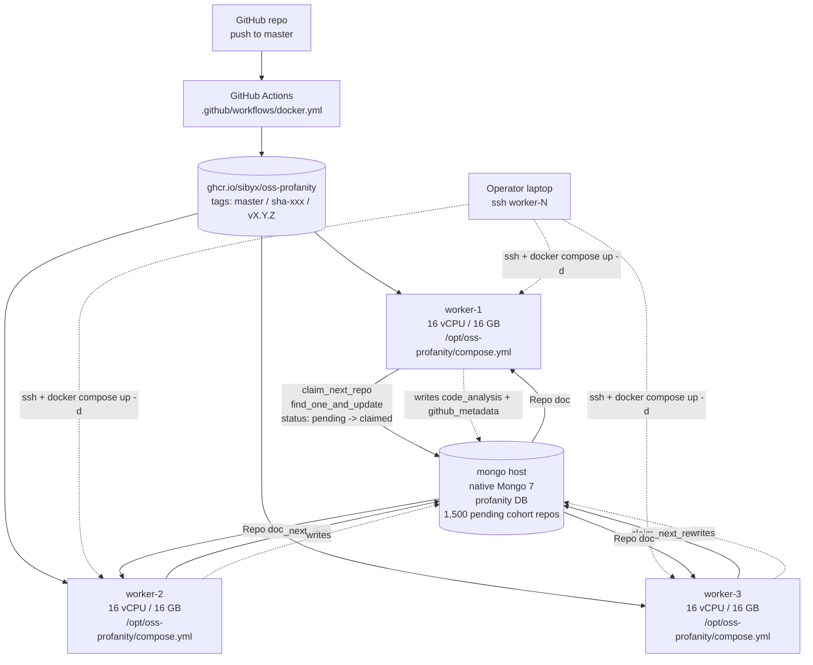

# IP-010: Faculty deployment — GHCR image + per-host compose

GitHub Actions builds the IP-009 Docker image and pushes it to GitHub Container Registry. Each of the three faculty worker hosts pulls the pinned image, runs a single-service `docker compose up -d` against the faculty Mongo, and drains the 1,500-repo `pending` queue. No Ansible, no Terraform, no orchestrator — the OS + Docker are already up; the deployment is a pull + up + tail-logs runbook.

<!-- more -->

## Status

**Status**: Implemented
**Last Updated**: 2026-04-25
**Implementation**: Complete

## Problem Statement

[PLAN.md §IP-010](../../PLAN.md#ip-010-openstack-deployment) originally framed deployment as `scripts/setup_mongo.sh` + `scripts/setup_worker.sh` + `scripts/run_local.sh` — a provisioning story targeting freshly-minted OpenStack VMs. Reality has moved on. The faculty hardware is **already** provisioned:

- **Mongo host (1×)** — OS installed, Docker running, native MongoDB 7 up, backup-and-restore procedure exercised, the full 1,500-repo sampled cohort already migrated from the operator's laptop. The DB is reachable from the operator as `mongodb://localhost:27018/profanity` over an SSH tunnel and from the worker hosts as `mongodb://<mongo-host-ip>:27017/profanity` on the faculty private network.
- **Worker hosts (3×)** — each with 16 vCPU / 16 GB RAM. OS installed, Docker running, persistent directories already mount-ed, `docker volume` storage configured on the right mount.

Everything `setup_mongo.sh` / `setup_worker.sh` would have done is already done. The deployment scope contracts to three new responsibilities:

- **An image that's the same bits on every host.** Pinning by content, not by `git pull && docker build`. [IP-009](ip-009-docker-test-harness.md) settled the Dockerfile; `.github/workflows/docker.yml` already exists as a starting point for pushing to **GitHub Container Registry (GHCR)**. IP-010 finalises the workflow (remove cargo-culted `pipx install poetry` step; add proper `metadata-action` tagging; verify `linux/amd64` builds cleanly on a fresh checkout) so every `git push` to `master` produces `ghcr.io/sibyx/oss-profanity:master` and `ghcr.io/sibyx/oss-profanity:sha-<hash>`.
- **A per-host compose file that uses the published image.** `/opt/oss-profanity/compose.yml` on each of the three workers: `image:` points at GHCR (not `build: .`), `env_file: .env` for per-host secrets, `volumes` for `scratch`, and `restart: on-failure` so a natural clean-exit (pending queue empty) is not met with a restart-loop. The `compose.yml` shipped with the repo (IP-009) stays developer-facing — the faculty one is shorter, production-only, and lives on the hosts.
- **No-duplicate-processing guarantee end-to-end.** With 3 hosts × `WORKER_CONCURRENCY=12` = 36 concurrent `process_one` calls against one MongoDB, the operator needs to know — and be able to verify — that two workers never analyse the same repo. [IP-001](ip-001-foundations.md)'s `claim_next_repo` already solves this via a `find_one_and_update` CAS, and [IP-009](ip-009-docker-test-harness.md) Q1 resolution explains why Redis is not needed. IP-010's job is to translate that into an operator-facing deployment runbook: a `claimed_by` query that demonstrates the guarantee on live data, a stale-claim monitoring command, and a shutdown procedure that flushes in-flight claims.

Beyond those, a few decisions PLAN.md punted on:

- **Rolling-tag vs SHA-pinned image reference.** `image: ghcr.io/sibyx/oss-profanity:master` is always-latest-main; `image: ghcr.io/sibyx/oss-profanity:sha-abc1234` is immutable. For a two-day experiment, `:master` is fine because the operator controls rollouts; for reproducibility of the paper's numbers, a SHA pin on the host is cleaner.
- **GHCR package visibility.** GHCR packages default to private when first pushed by the Actions bot, inheriting repository permissions. A public OSS research project is best served by flipping the package to public once — the operator then `docker pull`s unauthenticated on every worker host. Private GHCR needs a `docker login ghcr.io` on each host with a fine-grained PAT, which is more work for no security benefit here.
- **Restart policy.** The [IP-007 loop](ip-007-repo-worker.md) exits cleanly once `pending == 0 && claimed == 0` ("work done"). `restart: unless-stopped` would restart the container into an empty-queue → immediate-exit → restart spiral. `restart: on-failure` is the right fit — crashes restart, graceful queue drains do not.
- **Observability during a 5–7 hour run.** DRAFT says 36 concurrent repos will run ~5–7 h. An operator Googling through `docker compose logs -f` across three terminals is painful. A handful of pinned Mongo queries (`status` histogram, per-worker claim count, oldest in-flight claim age) give the same signal in one glance.

**Who is affected:** the operator (one human, one deployment). [IP-008](../../PLAN.md#ip-008-aggregation-and-plots) reads the `done` rows the workers produce; if deployment bugs cause partial analysis on a subset of repos, IP-008's plots inherit the gaps.

**Consequences of not addressing this:** manual `docker build` on each host (slow, non-reproducible), shell history as the deployment log (no audit trail), no shared picture of "did the run succeed" beyond logging into each host one at a time.

## Proposed Solution

Three deliverables, all coordinated:

1. **Finalised `.github/workflows/docker.yml`** — removes cargo-culted poetry step; uses `docker/metadata-action` to tag each build as `master`, `sha-<short>`, and (on `vX.Y.Z` tags) `vX.Y.Z`; pushes to `ghcr.io/sibyx/oss-profanity` with buildcache. Runs on every `push` to `master` and every tagged release.
2. **`/opt/oss-profanity/compose.yml` for each worker host** — single `worker` service pulling from GHCR; single `scratch` named volume; single `env_file: .env` with per-host secrets.
3. **`docs/DEPLOYMENT.md` runbook** — the linear "here's what the operator types, in order" document: first-time setup, rollout, monitoring, shutdown, troubleshooting.

No new Python code. The entire IP-010 surface is YAML + Markdown + a couple of Mongo one-liners.

### Overview

- **Image hosted on GHCR as `ghcr.io/sibyx/oss-profanity`.** The repo's existing `.github/workflows/docker.yml` gets a small polish (Q1 below): drop the poetry install (we use `requirements.txt`, not poetry), confirm `docker/metadata-action` produces the three tag shapes we want (`master`, `sha-<short>`, `vX.Y.Z`), and verify `linux/amd64`-only build (workers are x86_64). Push-to-master publishes the new image; PRs build without pushing.
- **GHCR package made public once** (Q2). Operator goes to `github.com/users/Sibyx/packages/container/oss-profanity` → Package settings → visibility → Public. From then on, `docker pull ghcr.io/sibyx/oss-profanity:master` works unauthenticated on every worker — no PAT setup, no `docker login` on each host.
- **Per-host `/opt/oss-profanity/compose.yml`** — ~25 lines, uses `image:` (not `build:`), named volume `scratch`, `restart: on-failure`, `env_file: .env`. `WORKER_CONCURRENCY=12` baked into the env file means a single container per host runs 12 `multiprocessing` workers internally — no `deploy.replicas` needed. 3 hosts × 12 = 36 total concurrent (DRAFT target, unchanged).
- **Per-host `/opt/oss-profanity/.env`** — `MONGO_URI`, `GITHUB_TOKEN`, `GITHUB_USER_AGENT`, `WORKER_CONCURRENCY`, `SCRATCH_DIR`, `PER_REPO_TIMEOUT_SEC`, `MAX_REPO_SIZE_MB`, `STALE_CLAIM_TTL_MIN`. Copy-pasted from a template in `docs/DEPLOYMENT.md`; `MONGO_URI` is the only value that differs per host if the Mongo IP is ever bound to multiple interfaces.
- **No-duplicate-processing guarantee surfaced in the runbook.** Three verification queries included: (1) per-worker `claimed_by` count distribution, (2) any repo with two distinct `claimed_by` (must be empty), (3) oldest in-flight claim age (must be < `STALE_CLAIM_TTL_MIN`). [IP-009](ip-009-docker-test-harness.md) Q1 resolution is the theoretical answer; these are the operational checks.
- **SHA-pin-on-freeze upgrade path.** Default `image:` in the deployed compose is `:master` for ergonomics; the runbook documents how to flip to `image: ghcr.io/sibyx/oss-profanity:sha-abc1234` once the paper's data is collected, so a post-hoc re-run would use byte-identical bits.
- **Rollback is `git revert + git push + docker compose pull && docker compose up -d`.** No bespoke rollback tooling.

### Key Components

1. **`.github/workflows/docker.yml`** — existing file, finalised. Publishes `ghcr.io/sibyx/oss-profanity` with `master`, `sha-<short>`, `latest`, and `vX.Y.Z` tags on the canonical triggers.
2. **`docs/DEPLOYMENT.md`** — new file. The linear operator runbook (see "Deployment runbook" below for the full sketch).
3. **`docs/deploy/compose.yml`** — a reference production compose file committed to the repo that operators copy to `/opt/oss-profanity/compose.yml` on each worker. Separate from the developer-facing `compose.yml` at the repo root, which serves IP-009's role-based profiles.
4. **`docs/deploy/.env.example`** — template for the per-host `.env`. Documents every variable with safe defaults and a "fill this in" comment on the four that vary per deploy (`MONGO_URI`, `GITHUB_TOKEN`, `GITHUB_USER_AGENT`, `WORKER_CONCURRENCY`).

### Architecture



The three workers share one bottleneck — the Mongo `find_one_and_update` on a `status="pending"` document. Atomic per-document CAS means 36 concurrent `claim_next_repo` calls are serialised server-side onto 36 distinct documents (or one of them sees `None` if the queue is empty and sleeps). No coordination layer beyond the Mongo server.

### Design principles applied

- **Single Responsibility.** GHA builds the image. GHCR hosts the image. Compose runs the image. The runbook explains how to wire the three together. None of them does any of the others' jobs.
- **Open/Closed.** Adding a fourth worker host means: `scp compose.yml + .env` to it, `docker compose up -d`, done. No edits to GHA, no edits to Mongo, no edits to the other three hosts.
- **DRY.** Image is built once (GHA) and consumed three times. `.env` has one source of truth (the template in the repo); per-host copies are diff-auditable.
- **Dependency Inversion.** The runbook depends on the published interfaces (`python -m oss_profanity.repo_worker`, the `Repo` schema, GHCR's HTTP API), not on any host-specific assumption beyond "Docker Engine ≥ 24 is installed".
- **No orchestrator overengineering.** No Kubernetes, no Swarm, no Nomad, no Ansible. Three hosts × one compose file per host is the smallest mechanism that does the job. Per the repo's "no overengineering" rule, we stop there.

## Implementation Plan

### Phase 1: finalise the GitHub Actions workflow

- [ ] Remove the `pipx install poetry` step from `.github/workflows/docker.yml` — the repo uses `requirements.txt`, not poetry; the poetry step is a leftover
- [ ] Verify `docker/metadata-action` tags produce `master`, `sha-<short>`, `latest` (on default branch), and `vX.Y.Z` (on semver tags). Default config is fine; add `flavor: latest=auto` if not already implicit
- [ ] Add `permissions: packages: write` at job level (already present)
- [ ] Trigger a test build via `git push` to a short-lived branch, verify the image appears at `ghcr.io/sibyx/oss-profanity` under the expected tag
- [ ] Merge to `master`, verify the `master` tag is published
- [ ] Flip the GHCR package visibility to **Public** at `github.com/users/Sibyx/packages/container/oss-profanity/settings` (Q2)
- [ ] Smoke-pull from a worker: `docker pull ghcr.io/sibyx/oss-profanity:master` — exits 0 without `docker login`

### Phase 2: deploy reference files in the repo

- [ ] Create `docs/deploy/compose.yml` — the production per-worker compose file (sketched below under Technical Details)
- [ ] Create `docs/deploy/.env.example` — the template per-host env file (sketched below)
- [ ] `docs/deploy/README.md` → one-liner pointing at `docs/DEPLOYMENT.md` for the full runbook
- [ ] Cross-link from `docs/DEPLOYMENT.md` back to `docs/deploy/` so operators know which file to copy

### Phase 3: DEPLOYMENT.md runbook

- [ ] Create `docs/DEPLOYMENT.md` with the linear operator steps: first-time setup, rollout, monitoring queries, shutdown, troubleshooting (the full text is in "Deployment runbook" below)
- [ ] Verify every Mongo shell command in the runbook against the real `profanity` database — no typos, no stale field names
- [ ] Verify every `docker compose` command against a clean worker host (cold-cache pull, up, logs tail, stop)

### Phase 4: end-to-end deploy + first-run gate

- [ ] First worker host: copy `docs/deploy/compose.yml` + `.env.example` to `/opt/oss-profanity/`; edit `.env` with the real `MONGO_URI` and `GITHUB_TOKEN`; `docker compose pull && docker compose up -d`
- [ ] Verify first worker claims a repo within 10 seconds: `mongosh 'mongodb://<mongo-ip>:27017/profanity' --eval 'db.repos.countDocuments({status:"claimed"})'` increments
- [ ] Verify the repo completes: `status:"done"` within `PER_REPO_TIMEOUT_SEC` on an average-sized repo
- [ ] Repeat for workers 2 and 3
- [ ] Tail all three with `docker compose logs -f --tail 50` in separate panes; confirm distinct `claimed_by` values in the verification queries below
- [ ] Let the run go. Expected wall-time: 5–7 hours for the 1,500-repo cohort at 36 concurrent

### Phase 5: post-run cleanup + freeze

- [ ] Verify `pending == 0 && claimed == 0` → workers exit cleanly → containers go `Exited (0)`
- [ ] `docker compose down` on each host to remove the containers; the `scratch` volume is Docker-managed and can stay or be pruned as the operator prefers
- [ ] Capture the final image SHA that produced the data: `docker compose config | grep image:` and copy it into `docs/DEPLOYMENT.md` "Reproducibility" section so the paper can cite it
- [ ] (Optional) Tag a `v0.1.0` release on `master` so GHA pushes `ghcr.io/sibyx/oss-profanity:v0.1.0` — a human-memorable alias for the data-producing image

### Prerequisites

- [IP-001](ip-001-foundations.md) — `Repo` schema, `claim_next_repo` CAS primitive
- [IP-005](ip-005-gh-archive-ingest.md) — populated `commit_stats` (✅ Implemented; data already on the faculty Mongo)
- [IP-006](ip-006-cohort-sampling.md) — populated `cohort` labels + 1,500 `status="pending"` repos (✅ Implemented; sampling already run on the migrated data)
- [IP-007](ip-007-repo-worker.md) — `python -m oss_profanity.repo_worker` entrypoint (✅ Implemented)
- [IP-009](ip-009-docker-test-harness.md) — the `Dockerfile` GHA pushes to GHCR (✅ Implemented)
- Docker Engine ≥ 24 with Compose v2 on every worker host (operator-verified)
- Network: worker hosts can reach the Mongo host on TCP 27017 (operator-verified; private-network routing already in place)

## Technical Details

### Technology stack

- **GitHub Container Registry (GHCR)** — built-in to the repo; no separate billing; public-package pulls are unauthenticated. Tags are managed by `docker/metadata-action@v5`.
- **Docker Compose v2.20+** — already deployed on the hosts via IP-009's OS install. `restart: on-failure` is the exit-policy semantic we need.
- **MongoDB 7 native server** — on the Mongo host. Bound to the faculty private network interface on port 27017. No change from the operator's existing setup.
- **Bash** — two one-liner Mongo commands and two `docker compose` commands are the entire operator interface. No Python, no extra tools.

### Reference compose file (`docs/deploy/compose.yml`)

```yaml
# Production worker deployment — copy to /opt/oss-profanity/compose.yml on each
# of the three faculty worker hosts. Pairs with /opt/oss-profanity/.env.
#
# Differences from the repo root's compose.yml (IP-009 developer-facing):
#   - `image:` points at GHCR (not `build: .`)
#   - `restart: on-failure` (clean queue drain must NOT trigger a restart loop)
#   - No `profiles:` — this file is worker-only
#   - No `host.docker.internal` — workers reach Mongo on the private network
#
# See docs/DEPLOYMENT.md for the full runbook.

services:
  worker:
    image: ghcr.io/sibyx/oss-profanity:master
    pull_policy: always
    restart: on-failure
    env_file: .env
    volumes:
      - scratch:/scratch

volumes:
  scratch:
```

`pull_policy: always` pairs with `docker compose up -d` to re-pull `master` every start — the operator gets the latest published image without a separate `docker compose pull` step. On a SHA-pinned reference (`image: ghcr.io/sibyx/oss-profanity:sha-abc1234`) the pull is a no-op after the first time.

### Reference `.env.example` (`docs/deploy/.env.example`)

```bash
# Production worker — copy to /opt/oss-profanity/.env and fill in.
# Every variable is documented in docs/CONFIGURATION.md.

# Mongo host on the faculty private network. Update the IP if the operator
# ever binds Mongo to a different interface.
MONGO_URI=mongodb://10.150.104.106:27017/profanity

# Worker-side tunables. 12 multiprocessing workers per host × 3 hosts = 36 concurrent
# (matches DRAFT target). Leaves ~4 vCPU headroom on the 16-vCPU worker host for
# git clones and subprocess analyzers.
WORKER_CONCURRENCY=12
SCRATCH_DIR=/scratch
PER_REPO_TIMEOUT_SEC=600
MAX_REPO_SIZE_MB=2048
STALE_CLAIM_TTL_MIN=20

# GitHub REST — 60/h unauth is not enough; a PAT raises to 5000/h (see
# docs/CONFIGURATION.md for fine-grained PAT creation instructions).
GITHUB_TOKEN=github_pat_replace_me
GITHUB_USER_AGENT=oss-profanity/0.1 (jakub.dubec@stuba.sk)
```

### Deployment runbook (`docs/DEPLOYMENT.md` core)

**First-time setup per worker host** (one-time; ~3 minutes per host):

```bash
# On the operator's laptop — ship the two reference files to the worker host.
scp docs/deploy/compose.yml    worker-1:/opt/oss-profanity/compose.yml
scp docs/deploy/.env.example   worker-1:/opt/oss-profanity/.env

# SSH in and fill in the .env values. MONGO_URI + GITHUB_TOKEN are the two
# the operator must set; the rest are safe defaults.
ssh worker-1
sudo $EDITOR /opt/oss-profanity/.env

# Lock the .env down — it carries GITHUB_TOKEN. Owner-only read/write.
chmod 600 /opt/oss-profanity/.env

# Pull the image and start the worker.
cd /opt/oss-profanity
docker compose pull
docker compose up -d
docker compose logs -f --tail 50
```

Repeat for `worker-2` and `worker-3`.

**Monitoring the run** (operator can SSH into any host or any system with Mongo access):

```bash
# Status histogram — expect: pending decreasing, claimed staying near 36, done increasing.
mongosh 'mongodb://10.150.104.106:27017/profanity' --quiet --eval '
db.repos.aggregate([{$group:{_id:"$status", n:{$sum:1}}}]).toArray()'

# Per-worker claim distribution — 36 concurrent claims fan out across 3 hosts × 12 procs.
# Expect 3 distinct prefixes (hostname-per-host), each holding ~12 repos.
mongosh 'mongodb://10.150.104.106:27017/profanity' --quiet --eval '
db.repos.aggregate([
  {$match:{status:"claimed"}},
  {$group:{_id:"$claimed_by", n:{$sum:1}}},
  {$sort:{_id:1}}
]).toArray()'

# No-duplicate-processing verification — must return []. Any result means two
# workers somehow agreed on the same repo, which would be an IP-001 CAS bug.
mongosh 'mongodb://10.150.104.106:27017/profanity' --quiet --eval '
db.repos.aggregate([
  {$match:{status:"claimed"}},
  {$group:{_id:"$_id", by:{$addToSet:"$claimed_by"}}},
  {$match:{"by.1":{$exists:true}}}
]).toArray()'

# Oldest in-flight claim age — should be < PER_REPO_TIMEOUT_SEC (600s default).
# If it creeps up, a repo is wedged and the stale-reaper will reclaim at 20 min.
mongosh 'mongodb://10.150.104.106:27017/profanity' --quiet --eval '
const oldest = db.repos.find({status:"claimed"})
  .sort({claimed_at:1}).limit(1).toArray()[0];
if (oldest) {
  const age_s = (Date.now() - oldest.claimed_at.getTime()) / 1000;
  print(oldest.full_name + "  " + oldest.claimed_by + "  " + age_s + "s");
}'
```

**Graceful shutdown**:

```bash
# On each worker host — `docker compose stop` sends SIGTERM.
# IP-007's loop catches SIGTERM and finishes the current repo before exiting.
# Stale-claim reaper (runs on the next start) flips any unfinished claim back to pending.
cd /opt/oss-profanity
docker compose stop
```

**Post-run cleanup**:

```bash
# On each worker host, after pending == 0 && claimed == 0 and containers exit(0).
cd /opt/oss-profanity
docker compose down              # removes containers, keeps scratch volume
docker volume prune --force      # optional: reclaim scratch space
```

**Rollout to a new image** (bug-fix mid-run):

```bash
# On the operator's laptop, git push the fix — GHA rebuilds master.
# On each worker host:
cd /opt/oss-profanity
docker compose pull              # pulls the new master tag
docker compose up -d             # recreates the container; old one exits cleanly
docker compose logs -f --tail 20
```

### Parallel-processing guarantee (IP-009 Q1 in operator terms)

Every worker calls `claim_next_repo(worker_id)` ([IP-001](ip-001-foundations.md), `db.py:138`), which runs one `find_one_and_update`:

```python
doc = db.repos.find_one_and_update(
    {"status": "pending"},
    {"$set": {"status": "claimed", "claimed_by": worker_id, "claimed_at": now_utc()}},
    sort=[("commit_stats.profanity_rate", -1)],
    return_document=ReturnDocument.AFTER,
)
```

MongoDB serialises concurrent `find_one_and_update` calls on any document — the server guarantees atomicity per operation, per document. If 36 workers call this in the same wall-clock millisecond:

- Each call matches a **different** `status="pending"` document (the filter + atomic update means once a document flips to `claimed`, no other call can match it).
- If the `pending` queue has fewer than 36 documents, the excess callers get `None` back and sleep for `_EMPTY_QUEUE_SLEEP_SEC`.
- `worker_id` is `{hostname}-{pid}-{secrets.token_hex(2)}` (`db.make_worker_id()`), unique even under container replicas sharing hostname + PID namespace. So `claimed_by` values are distinct per-process.

Crash recovery: if a worker dies mid-repo, its claim sits at `status="claimed"` with `claimed_by` stamped. Any live worker's `reclaim_stale()` call finds claims whose `claimed_at` is older than `STALE_CLAIM_TTL_MIN` (20 min default) and flips them back to `pending`. The claim is then re-picked by the next free worker. No repo is lost; no repo is analysed twice.

The monitoring queries in the runbook above include a zero-result assertion on "any repo with two distinct `claimed_by`". That query must always return `[]` — if it doesn't, the CAS semantics are broken and the operator should escalate.

### Configuration

IP-010 introduces **no new env vars**. Every knob the deployed workers need is already defined by [IP-001](ip-001-foundations.md) (`MONGO_URI`, `WORKER_CONCURRENCY`, `SCRATCH_DIR`, `PER_REPO_TIMEOUT_SEC`, `MAX_REPO_SIZE_MB`, `STALE_CLAIM_TTL_MIN`, `GITHUB_TOKEN`, `GITHUB_USER_AGENT`). IP-010's job is to set them correctly on the faculty hosts, not to invent new ones.

The existing `docs/CONFIGURATION.md` is the reference. `docs/DEPLOYMENT.md` links back to it rather than duplicating the table.

## Alternatives Considered

### Alternative 1: Build on each host (no registry)

**Description**: Each worker host does `git clone` + `docker build` locally; no GHCR push.

**Pros**:
- Zero registry dependency
- Works even if GHCR is down

**Cons**:
- Three separate builds can diverge (npm resolves different transitive pins, apt mirror timing shifts, etc.)
- Each build burns ~5 minutes of host CPU that could be running workers
- Rollback requires re-cloning an earlier commit on every host

**Why not chosen**: content-addressed deployment is the whole point. The cost of the GHA workflow is already sunk via IP-009's Dockerfile — adding the push-to-GHCR step is a few lines.

### Alternative 2: `docker save | ssh host docker load`

**Description**: Build once on the operator's laptop, `scp` the tarball, `docker load` on each host.

**Pros**:
- No registry
- Network-independent

**Cons**:
- Tarball is ~1.5 GB; transfer over a home connection takes real minutes
- No audit trail of which image is where (vs. GHCR's "this SHA is tagged `master`")
- Duplicate work every time we rebuild

**Why not chosen**: GHCR is free, integrated, and auditable. No reason to invent our own transport.

### Alternative 3: Ansible playbook

**Description**: An `ansible-playbook deploy.yml -i faculty-hosts.ini` that copies compose.yml + .env, pulls the image, and starts the service.

**Pros**:
- Idempotent
- Inventory file is a nice audit artefact

**Cons**:
- New dependency on the operator's laptop (Ansible + plugins)
- For 3 hosts × one deploy in the project's lifetime, the setup cost exceeds the 3 SSH sessions it would replace
- YAML on top of YAML on top of YAML

**Why not chosen**: DRAFT §3 and PLAN.md IP-010 explicitly reject Ansible. Three SSH sessions × `docker compose up -d` is faster to execute and easier to review.

### Alternative 4: Kubernetes / Nomad / Swarm

**Description**: Run an orchestrator; let it schedule the worker across the three hosts.

**Pros**:
- "Real" cluster management
- Self-healing if a host reboots

**Cons**:
- Provisioning an orchestrator is a project in itself
- The workers are stateless and the Mongo `claim_next_repo` CAS already gives us "self-healing" via the stale-claim reaper
- DRAFT §3 explicitly names Docker Compose as the deployment substrate

**Why not chosen**: for 3 static hosts running one kind of container, Compose is the right tool. An orchestrator's value appears at 10+ hosts or dynamic scale-out, neither of which apply here.

### Alternative 5: Rolling `:master` tag in production

**Description**: `image: ghcr.io/sibyx/oss-profanity:master` in the compose file; re-pull on every `up -d`.

**Pros**:
- Simplest rollout story — `git push` → `docker compose pull && up -d` everywhere
- No per-host file edits to bump versions

**Cons**:
- Two workers started at slightly different times could run slightly different commits if a push lands in between
- The paper's "data was produced by image X" story needs a SHA pin

**Why not chosen fully**: the running default is `:master` for its ergonomic wins during active development. The runbook documents how to flip to a SHA pin for reproducibility once the data is frozen.

### Alternative 6: Systemd unit instead of `docker compose up -d`

**Description**: A `systemd` unit file `oss-profanity-worker.service` that runs `docker compose up` under systemd supervision.

**Pros**:
- Auto-start on reboot
- Proper journalctl integration

**Cons**:
- Two supervisors (systemd + Compose) for one container is belt-and-braces
- `docker compose up -d` + `restart: on-failure` already handles crash-restart; `--restart=always` on the Docker daemon handles host reboots

**Why not chosen**: the daemon-level restart policy covers the reboot case. A systemd unit adds a layer without a matching capability gain. Worth revisiting if operators ever ask for journal-based log aggregation.

### Alternative 7: Private GHCR with per-host PAT

**Description**: Keep the GHCR package private; set up a fine-grained PAT with `read:packages` on each worker host.

**Pros**:
- Image stays private
- Aligned with least-privilege habits

**Cons**:
- Project is an OSS research study; the image has no secrets (secrets live in the per-host `.env`, not in the image)
- Per-host `docker login ghcr.io` adds setup friction with no security benefit
- Rotating the PAT is another moving part

**Why not chosen**: nothing in the image is sensitive. Public-read on GHCR is the correct default.

## Trade-offs and Risks

### Trade-offs

- **Rolling `:master` by default, SHA pin on freeze.** Accepted — ergonomic during the run, auditable after. The runbook documents the switchover.
- **Public GHCR package.** Accepted — image has no secrets; unauthenticated pulls are simpler.
- **No orchestrator.** Accepted — 3 static hosts, no dynamic scale-out required.
- **`restart: on-failure` (not `unless-stopped`).** Accepted — clean queue drain must not trigger a restart-loop. Crash recovery still works because the daemon restarts crashed containers.
- **Single `worker` container per host with internal pool of 12.** Accepted — simpler than `deploy.replicas: 12`; same total concurrency.
- **Secrets in a per-host `.env` file.** Accepted — the file has one secret (`GITHUB_TOKEN`), `.env` is chmod 600 on each host, and the file is not committed. Docker Secrets would be overengineering for one credential across three hosts.
- **IP-010 does not script the Mongo side.** Accepted — the Mongo host is a managed OS install with a hand-configured database; scripting its deployment is out of scope because the operator already did that work.

### Risks

| Risk | Impact | Mitigation |
|---|---|---|
| GHCR is unavailable when the operator starts a deploy | Medium | Images are cached locally on each host after the first pull; a new worker host can fall back to `docker save / docker load` from another host's cache |
| GHA workflow breaks on a push during the run (image not updated) | Low | `restart: on-failure` + rolling tag means currently-running workers keep running the old image; bug fixes wait for the workflow fix |
| Private-network route between worker hosts and Mongo goes down | High | Operator-owned infra concern; out of scope for this IP. `claim_next_repo` simply fails, worker loop retries, stale-reaper handles anything left in `claimed` |
| Operator accidentally runs with `:master` after a breaking change | Medium | Runbook recommends pinning to a SHA before the final data-producing run; `pull_policy: always` + `master` during dev, SHA on freeze |
| `WORKER_CONCURRENCY=12` saturates git-clone network throughput | Medium | Each worker clones ~1 repo per process in parallel; 12 × small-repo-average (~10 MB) = 120 MB of network at peak per host. Faculty network trivially absorbs this |
| Two workers claim the same repo (CAS bug) | **Critical** | Monitoring query (see runbook) asserts `"by.1": {$exists: false}` continuously; any occurrence means an IP-001 bug. Never observed in IP-005 / IP-006 / IP-009 exercising the same primitive |
| `GITHUB_TOKEN` rate-limit exceeded | Low | 1500 repos × 2 REST calls = 3000 calls; token limit is 5000/h. Worst case of all 36 workers hitting GitHub in the same minute is still within the secondary 900/min limit |
| `/scratch` fills during the run | Medium | IP-007's cleanup path runs in `finally`; worst case an operator can `docker exec worker rm -rf /scratch/*` on the affected host. Named volume can also be sized via `driver_opts` if a specific disk is dedicated |
| Operator forgets to edit `.env` and starts with the example values | Medium | `.env.example` has `GITHUB_TOKEN=github_pat_replace_me` — the fake value fails at the first REST call with a clear error message; worker logs will show "401 Unauthorized" within seconds |
| Stale-claim reaper reclaims a slow-but-alive worker's claim | Low | `STALE_CLAIM_TTL_MIN=20` is well above `PER_REPO_TIMEOUT_SEC=10`; a live worker always finishes before the reaper fires. If it doesn't, something bigger is wrong |
| Three-host rollout has one host out of sync after a mid-run image bump | Low | Runbook says "apply to all three or none"; `docker compose config | grep image:` is a two-second check to verify the running tag before kicking off |
| Docker volume storage fills on the dedicated mount | Low | Operator-configured disk is sized by the user; named `scratch` volume is the only new consumer IP-010 adds |

## Open Questions

Resolved during review (see Changelog entries for 2026-04-25).

## Success Criteria

- [ ] `.github/workflows/docker.yml` publishes to `ghcr.io/sibyx/oss-profanity` on every `push` to `master` and on every `vX.Y.Z` tag; tags observed via `gh api /users/Sibyx/packages/container/oss-profanity/versions`
- [ ] `docker pull ghcr.io/sibyx/oss-profanity:master` succeeds unauthenticated from at least one worker host (GHCR package public)
- [ ] `docs/deploy/compose.yml` and `docs/deploy/.env.example` are committed to the repo and referenced from `docs/DEPLOYMENT.md`
- [ ] `docs/DEPLOYMENT.md` exists with: first-time setup, rollout, monitoring (four Mongo queries), shutdown, troubleshooting, reproducibility
- [ ] Each of the three worker hosts has `/opt/oss-profanity/compose.yml` + `.env` + `docker compose ps` reports `worker` as `running`
- [ ] `status:"claimed"` count stays within [24, 36] for the duration of the run (36 concurrent, allowing for transient dips during repo switchover)
- [ ] **No-duplicate-processing verification query returns `[]`** throughout the run — any non-empty result escalates to an IP-001 bug
- [ ] `pending` decreases monotonically until 0; no `pending` repo is stuck for more than `STALE_CLAIM_TTL_MIN` past its last `claimed_at`
- [ ] On completion, `status:"done"` count ≥ 1,350 (allowing ~10% yield attrition from repo unavailability — DRAFT §9 acceptance)
- [ ] All three workers exit `(0)` on clean queue drain; no restart-loop observed
- [ ] The image SHA that produced the data is recorded in `docs/DEPLOYMENT.md` ("Reproducibility" section)

## Future Considerations

- **Systemd unit + journalctl integration** — a drop-in unit file that wraps `docker compose up` so logs appear in `journalctl -u oss-profanity-worker`. Useful if the operator ever wants cross-host log search without logging into each host. Out of scope today — one `docker compose logs -f` per host covers the 5-hour run.
- **Multi-arch image (`linux/amd64` + `linux/arm64`)** — if the faculty ever runs workers on ARM nodes. The GHA workflow's `docker/build-push-action` supports `platforms: linux/amd64,linux/arm64` as a one-line bump.
- **Image vulnerability scanning** — add `docker/scout-action@v1` to the workflow to fail the build on critical CVEs in the base image. Defers to a post-paper hardening phase.
- **GitOps / FluxCD-style auto-deploy** — have each host poll the registry and self-update on new `master` tags. Nice-to-have for a long-lived pipeline; overkill for a two-day run.
- **Dedicated monitoring stack** — Prometheus metrics emitted by the worker, Grafana dashboards, alertmanager rules on "claims stuck > 20 min". Worthwhile if the pipeline becomes a production service; for a one-shot run, the four Mongo queries in the runbook are sufficient.
- **Blue-green rollouts** — run two worker containers per host, bring up the new, drain the old. Unneeded at 3-host scale but the compose shape supports it if the day comes.
- **Separate `runners.yml` for GitHub-hosted self-hosted runners** — the faculty hardware could double as GitHub Actions runners. Out of scope today.

## References

- [`PLAN.md`](../../PLAN.md) §IP-010 — the original deployment scope (now contracted, as documented above)
- [`DRAFT.md`](../../DRAFT.md) §3 — DRAFT-level deployment intent (Docker Compose, no orchestrator)
- [`.github/workflows/docker.yml`](../../../.github/workflows/docker.yml) — the image-build-and-push workflow
- [`docs/CONFIGURATION.md`](../CONFIGURATION.md) — env-var reference; IP-010 sets these but does not define new ones
- [IP-001 Foundations](ip-001-foundations.md) — `claim_next_repo` CAS primitive; the no-duplicate-processing guarantee lives here
- [IP-006 Cohort sampling](ip-006-cohort-sampling.md) — produced the 1,500 `status="pending"` cohort the workers will drain (✅ Implemented)
- [IP-007 Repo worker](ip-007-repo-worker.md) — `python -m oss_profanity.repo_worker` entrypoint, clean-exit behaviour (✅ Implemented)
- [IP-009 Docker test harness](ip-009-docker-test-harness.md) — Dockerfile + per-host compose pattern; Q1 orchestration note is the theoretical backing for the parallel-processing guarantee (✅ Implemented)
- [GitHub Container Registry docs](https://docs.github.com/en/packages/working-with-a-github-packages-registry/working-with-the-container-registry) — registry-level reference
- [`docker/metadata-action`](https://github.com/docker/metadata-action) — tag strategy for the GHA workflow
- [`docker/build-push-action`](https://github.com/docker/build-push-action) — the build + push step
- [Docker Compose `restart` policies](https://docs.docker.com/compose/compose-file/05-services/#restart) — the `on-failure` semantics

## Changelog

| Date       | Author | Changes       |
|------------|--------|---------------|
| 2026-04-24 | jdubec | Initial draft. Scope contracted from PLAN.md's original "provision VMs" framing to a deploy runbook, because the faculty hardware (1 Mongo host + 3 workers × 16 vCPU / 16 GB) is already provisioned, the OS and Docker are already installed, the volume storage is already configured, and the sampled 1,500-repo cohort has already been migrated to the faculty Mongo (currently reachable from the operator's laptop as `mongodb://localhost:27018/profanity` over an SSH tunnel). IP-010 now covers: (1) finalising `.github/workflows/docker.yml` to push to `ghcr.io/sibyx/oss-profanity` on every `push` to `master`, (2) a per-worker `/opt/oss-profanity/compose.yml` reference (committed at `docs/deploy/compose.yml`) that pulls from GHCR with `restart: on-failure` + named `scratch` volume, (3) a `docs/DEPLOYMENT.md` linear operator runbook with first-time setup, rollout, four monitoring queries (status histogram, per-worker claim distribution, duplicate-claim verification, oldest-claim age), shutdown, troubleshooting, and reproducibility. Parallel-processing guarantee documented end-to-end by leaning on [IP-001](ip-001-foundations.md)'s `claim_next_repo` `find_one_and_update` CAS + `make_worker_id`'s `secrets.token_hex(2)` uniqueness suffix + the stale-claim reaper; no Redis or other coordination layer required. Open questions: Q1 GHA poetry step cleanup, Q2 GHCR public/private, Q3 rolling-tag vs SHA pin, Q4 restart policy, Q5 secrets handling, Q6 monitoring scope, Q7 volume type (named vs bind), Q8 Mongo connection-string form. |
| 2026-04-25 | jdubec | Resolved Q1–Q4: drop poetry steps from `.github/workflows/docker.yml` (Q1/A); flip GHCR package to Public for unauthenticated pulls (Q2/A); keep `image: ghcr.io/sibyx/oss-profanity:master` in the deployed compose with SHA pin deferred to the data-freeze step (Q3/A); use `restart: on-failure` (Q4/A). All four resolutions were already reflected in Phase 1, the reference `docs/deploy/compose.yml`, and Success Criteria, so no proposal-body changes were required — only resolution blocks updated. Q5 (secrets handling), Q6 (monitoring scope), Q7 (volume type), and Q8 (Mongo connection-string form) remain open and block implementation. |
| 2026-04-25 | jdubec | Resolved Q5, Q7, Q8: `GITHUB_TOKEN` lives in `/opt/oss-profanity/.env` with `chmod 600` — runbook first-time setup to add the explicit chmod step (Q5/A); named `scratch` volume in the reference compose, no bind mount (Q7/A); IP literal in `MONGO_URI` across `.env.example` and runbook examples, no DNS/hosts shim (Q8/A). Q5 and Q7 required no file changes beyond the chmod-step addition in `docs/DEPLOYMENT.md`; Q8's IP-literal form was already in the reference `.env.example`. Q6 (monitoring scope) remains the last open question. |
| 2026-04-25 | jdubec | Applied resolutions to the proposal body. Only Q5 mandated a text change: added the explicit `chmod 600 /opt/oss-profanity/.env` step to the "First-time setup per worker host" block of the runbook (between the `$EDITOR` edit and the `docker compose pull` call), with a comment naming `GITHUB_TOKEN` as the reason. Q1–Q4, Q7, Q8 resolutions were pre-reflected in Phase 1 / reference compose / reference `.env.example` / Trade-offs / Success Criteria, so no further body edits required. Status stays "⏳ Awaiting Answers" — Q6 (monitoring scope) still blocks full resolution. |
| 2026-04-25 | jdubec | Resolved Q6 (monitoring scope): accepted option A — runbook's four Mongo one-liners + `docker compose logs -f` are the entire observability surface for the one-shot 5–7 h run; no Prometheus, Grafana, node-exporter, or OTel export. "Future Considerations" retains the dedicated monitoring stack and GitOps auto-deploy entries as explicit post-paper follow-ups. No body change needed (the runbook already lists all four queries). All eight review questions now resolved; Status flipped to ✅ Resolved. Review Questions block stays in-place until the document is formally accepted per the proposal-workflow skill, at which point it can be removed. |
| 2026-04-25 | jdubec | Updated "Open Questions" section to state "None" now that Q1–Q8 are all resolved (was a pointer to "Review Questions below for the questions that need decisions before implementation"). Problem Statement's four "decisions PLAN.md punted on" bullets stay as-written — they record *why* each choice was made (rolling tag, public GHCR, on-failure restart, Mongo-queries-only monitoring) and remain accurate post-resolution. |
| 2026-04-25 | jdubec | Accepted. Front-matter flipped `draft: true` → `draft: false`; top-of-document Status changed `Draft` → `Accepted`; Last Updated bumped to 2026-04-25; "Open Questions" section replaced with the canonical "Resolved during review (see Changelog entries for 2026-04-25)." pointer; Review Questions block stripped per proposal-workflow skill. `Implementation: Not started` retained — the three deliverables (GHA polish, `docs/deploy/compose.yml`, `docs/DEPLOYMENT.md`) are next up. |
| 2026-04-25 | jdubec | Implemented. Phase 1: dropped `pipx install poetry` + `pipx inject poetry poetry-plugin-export` steps from `.github/workflows/docker.yml` (per Q1/A). `docker/metadata-action@v5` default config already produces the `master`, `sha-<short>`, `latest`, and `vX.Y.Z` tag shapes — no config change. Phase 2: committed `docs/deploy/compose.yml` (single `worker` service, `image: ghcr.io/sibyx/oss-profanity:master`, `pull_policy: always`, `restart: on-failure`, named `scratch` volume, `env_file: .env`), `docs/deploy/.env.example` (IP literal `MONGO_URI`, placeholder `GITHUB_TOKEN=github_pat_replace_me`, all IP-007 worker tunables with DRAFT defaults), and `docs/deploy/README.md` pointer. Phase 3: wrote `docs/DEPLOYMENT.md` — topology, first-time setup (with the Q5 `chmod 600 /opt/oss-profanity/.env` step), four monitoring queries (status histogram, per-worker claim distribution, duplicate-claim `by.1:$exists` assertion, oldest-claim age), mid-run rollout, graceful shutdown, post-run cleanup, troubleshooting, reproducibility (image-SHA capture for the paper), and cross-links to IP-001 / IP-007 / IP-009. Phases 4–5 (end-to-end deploy on the three faculty hosts + post-run freeze) are operator-side and not committable from the repo. Status → Implemented; index updated. |
