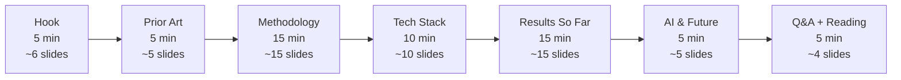

# IP-011: Initial OpenCamp presentation — "Vulgarizmy, otvorený kód a jeho kvalita"

A 60-minute Slidev deck for [Bratislava OpenCamp 2026, April 25 @ 10:00, Aula Magna](https://pretalx.opencamp.sk/bratislava-opencamp-2026/talk/DHS8R3/). Covers the research question ("do programmers who swear write better code?"), the four-stage pipeline from IP-005→IP-007, live stats from the 3.7 M-repo June-2020 ingest, and a forward-looking riff on what LLM assistants might do to profanity-in-code over time. Final hypothesis-test results ship with [IP-008](../../PLAN.md#ip-008-aggregation-and-plots); this deck intentionally stops at descriptive statistics.

<!-- more -->

## Status

**Status**: Implemented
**Last Updated**: 2026-04-25
**Implementation**: Complete

## Problem Statement

The talk is on the schedule. On 2026-04-25 at 10:00 in Aula Magna, a 60-minute slot waits for someone to walk up with slides. The [pretalx abstract](https://pretalx.opencamp.sk/bratislava-opencamp-2026/talk/DHS8R3/) promises "experimental methodology, measurement tools, findings, and the potential impact of AI assistants on code quality and profanity usage." That's a lot to cover in an hour without either (a) sprinting through it so fast the audience gets whiplash, or (b) pretending the deep analysis is further along than it actually is.

Reality check on content availability:

- **Methodology is fully specified.** [IP-001](ip-001-foundations.md)→[IP-007](ip-007-repo-worker.md) are shipped; [IP-009](ip-009-docker-test-harness.md) green-gates them; [IP-010](ip-010-deployment.md) puts the worker on the faculty hosts. The research design is stable.
- **Descriptive stats are in hand.** 3,702,633 repos seen, ~49 M commits scored, 38,468 profane commits, 239,253 emoji commits. Top-30 profanity words and emoji histograms are computable from `commit_stats` today (and are genuinely funny).
- **Inferential stats are NOT in hand.** Stage 4 is literally running on the faculty hosts as of this week; [IP-008](../../PLAN.md#ip-008-aggregation-and-plots)'s Mann-Whitney U test over `code_analysis` fields does not exist yet. The audience gets the hypothesis and the picture, not the p-value.
- **Visual identity + tooling.** The DBS lecture deck (`presentation/slides.md`) already uses [Slidev](https://sli.dev/) with the FIIT seriph theme, Open Sans, `#00A9E0` accent, and custom callout classes in `presentation/style.css`. That's the look-and-feel bank IP-011 inherits — same tooling, same colour palette, different story.

**Who is affected:** one speaker (jdubec), one hour of a conference audience's attention, and downstream — the paper's outreach posture. A good deck seeds curiosity before the paper lands; a forgettable one wastes the slot.

**Consequences of not addressing this:** winging it from the DBS deck, realising mid-talk that descriptive stats without methodology scaffolding is just a top-10 emoji list, or (worse) over-promising inferential results that Stage 4 hasn't yet delivered.

The joke lens matters here too: this is deliberately a tongue-in-cheek research programme — the question is real, the methodology is rigorous, and the framing is allowed to be self-aware about how niche the question is. The deck should *lean into* that without descending into pure stand-up. Pragmatic-academic-funny-curious, in that blend.

## Proposed Solution

A seven-act, 60-minute Slidev deck committed at `presentation/opencamp/slides.md`, rendered to static HTML by `slidev export`, styled with a shared `presentation/style.css`-derived stylesheet, and backed by five reproducible MongoDB aggregation pipelines (checked in at `scripts/presentation_stats.py`) so every number on the slides can be regenerated against the live DB before the talk.

Every number on a slide is regeneratable from the `repos` collection. No screenshots of stats — only live-queried data baked into the deck at build time, plus a handful of `last_updated_at` timestamps so the audience can see when the numbers were frozen.

### Overview

- **One source deck** at `presentation/opencamp/slides.md` using Slidev 51+ with the same `theme: seriph` / FIIT palette as `presentation/slides.md`, `lang: en-US` frontmatter. Visual identity is inherited via a sibling `presentation/opencamp/style.css` importing the base variables.
- **~59 slides across 7 acts** (Q6 resolution drops the Claude Code meta-slide from Act IV, so the tech-stack act is 9 slides), roughly one per wall-clock minute but with deliberate pacing: the methodology act lingers (15 min, dense), the AI act moves fast (5 min, speculative). **Speaker notes on every slide are the talk** — the Q8 resolution makes notes do the work that rehearsal normally would, so each slide's notes stand alone well enough that a cold reader could deliver them.
- **Reproducible stats pipeline** at `scripts/presentation_stats.py`: one command (`python -m scripts.presentation_stats --json > presentation/opencamp/stats.json`) regenerates all numbers from the live `profanity` database. The slides read `stats.json` via Slidev's build-time data loader, so bumping stats is one command away from a fresh render.
- **Live-demo fallback** — every "wow" moment has a baked-in screenshot so a flaky conference wifi + a cold Mongo tunnel never kill the story.
- **Export to PDF + static HTML** shipped to `presentation/opencamp/dist/` so the deck survives even a laptop failure (print the PDF, the show goes on).

### Key Components

1. **The deck itself** (`presentation/opencamp/slides.md`) — seven acts described below, ~60 slides total.
2. **The stats pipeline** (`scripts/presentation_stats.py`) — five pre-baked Mongo aggregations returning JSON: ingest summary, top-30 profanity words, top-30 emoji, cohort composition, sampled funny commit messages (PG-13 filtered for the auditorium).
3. **The style sheet** (`presentation/opencamp/style.css`) — extends the DBS deck's `:root` variables, adds two new utility classes (`.stat-big` for large numbers, `.commit-msg` for monospaced commit-message quotes).
4. **Build & export tooling** — a tiny `presentation/opencamp/package.json` with `dev` / `build` / `export` scripts. No monorepo changes; this sits next to the DBS deck.
5. **A one-page `presentation/opencamp/README.md`** — how to rebuild the stats, how to run the dev server, how to export to PDF.

### Architecture — seven acts, 60 minutes



### Act I — Hook (5 min, ~6 slides)

The curiosity punch. We open with the question, not the answer, and we own the joke upfront.

- **Slide 1 — Title card.** "Vulgarizmy, otvorený kód a jeho kvalita." Subtitle: "A serious answer to a silly question." FIIT logo, date, name.
- **Slide 2 — The stereotype.** Linus Torvalds kernel list "NVIDIA, fuck you!" screenshot (public record, LKML 2012), framed as "programmers have opinions, and they put them in writing."
- **Slide 3 — The 2015 internet moment.** That one HackerNoon / Reddit thread that claimed "code with profanity has fewer bugs" — no methodology, no dataset, one chart, 40k upvotes. Audience nods; they remember it.
- **Slide 4 — The question.** In big type: *"Is there actually a statistically significant correlation between profanity in commits/code and measurable code quality?"*
- **Slide 5 — The answer.** *"I don't know yet. But I built a pipeline that will."* (🎩 moment — we are self-aware, we own it, we move on.)
- **Slide 6 — Today's agenda.** The six remaining acts, one line each, v-click reveal.

### Act II — Prior Art & The Research Question (5 min, ~5 slides)

Anchor the work to the academic record so the audience reads the rest as research not YouTube-tier speculation.

- **Slide 7 — The gap.** What has actually been studied: commit-message sentiment analysis (Guzman & Azócar 2014), toxicity in OSS communication (Miller et al. 2022), profanity in chat (various). What has NOT been studied rigorously: profanity → code quality at scale with matched cohorts.
- **Slide 8 — The hypothesis.** H₀: no difference in `code_analysis` distributions between profane and clean cohorts. H₁: a difference exists (two-sided Mann-Whitney U).
- **Slide 9 — Why GH Archive.** The dataset, what it is, why 2020-06 (mature repos, four years of commit history post-window).
- **Slide 10 — The "clean" trap.** Why a single "profane vs. random" comparison is broken — confounders (repo size, activity, language). Teaser for the bin-matched sampler in Act III.
- **Slide 11 — What good looks like.** The three tiers of "proceed / report on subset / re-sample" from `scripts/probe_cohort_languages.py`'s decision rubric. The audience learns we will be honest about subset coverage.

### Act III — Methodology (15 min, ~15 slides)

The dense act. The audience should leave able to draw the pipeline on a napkin.

- **Slide 12 — Pipeline overview.** Four stages: Ingest → Score → Sample → Analyze. The Mermaid diagram from IP-005 with a light redraw. One-line caption per stage.
- **Slide 13 — Stage 1: GH Archive ingest.** Streaming 744 hourly `.json.gz` files, ~50 GB compressed, 68 fields per event. `PushEvent` filter + `commits[]` flatten. Bot filter via `BOT_REGEX` ([IP-005](ip-005-gh-archive-ingest.md)).
- **Slide 14 — Stage 2: Profanity scoring.** [IP-002](ip-002-profanity-detection.md): LDNOOBW (~2,500 English words) + word-boundary match + [lingua](https://github.com/pemistahl/lingua-rs) for language guard. Why dictionary and not ML (reproducibility, explainability, speed — 49 M messages in ~5 hours on one host).
- **Slide 15 — Stage 2 bis: Emoji scoring.** [IP-003](ip-003-emoji-detection.md): Unicode CLDR + `emoji` library, ZWJ-joiner aware, grapheme-cluster safe. Because `len("👨‍👩‍👧")` is *not* 1 in any language anyone should trust, and the grammar matters.
- **Slide 16 — Stage 3: Cohort sampling.** [IP-006](ip-006-cohort-sampling.md): top-750 profane by `profanity_rate desc`, bin clean repos to match profane's commit-count distribution across `[20,50) [50,200) [200,1000) [1000,∞)`. Stratified matching means confounders don't sneak in through "big projects swear more and have more tests."
- **Slide 17 — Stage 3 continued: The top-up story.** 34 % attrition (509/1500) on the first probe — 2020 repos die. Solution: `python -m oss_profanity.sampling --top-up`, which demotes probe-404 rows to `status="missing"` and redraws the shortfall. Finished at 1,500 live, with 1.7 % residual 404s. A good little lesson about data-collection hygiene.
- **Slide 18 — Stage 4: Repo worker.** [IP-007](ip-007-repo-worker.md) — clone, analyze, write back. 36 concurrent repos across 3 faculty hosts via `multiprocessing` + MongoDB CAS. No Redis, no Celery, no Airflow. One `find_one_and_update` per claim.
- **Slide 19 — Static analyzers.** [IP-004](ip-004-static-analyzers.md): `ruff` + `bandit` for Python, `eslint` (flat config v10) for JS/TS, `lizard` for cyclomatic complexity across 18 languages, `jscpd` for clone detection. Why five tools, not one: each answers a distinct quality question.
- **Slide 20 — AST-level source scan.** The clever bit. `tree-sitter-language-pack` for comment + identifier extraction across 40 grammars. Why regex fails: `// real` *inside* a string literal is not a comment; `#` inside a Python docstring is not a comment. Tree-sitter knows the grammar, we don't have to.
- **Slide 21 — Statistical test.** Mann-Whitney U, non-parametric, rank-based — we don't care whether `ruff_issues_per_kloc` is normally distributed (it isn't). Effect size via rank-biserial correlation. Why U and not t-test.
- **Slide 22 — The measurement targets.** Six quality metrics per repo: `ruff_issues_per_kloc`, `eslint_issues_per_kloc`, `lizard_avg_ccn`, `lizard_max_ccn`, clone-detection hits, comment density. The deck lists them; IP-008 will own the statistical cell.
- **Slide 23 — Reproducibility claim.** Everything pinned: Python 3.14, `tree-sitter-language-pack==1.6.2`, `ruff==0.15.12`, `bandit==1.9.4`, `lizard==1.17.25`, `eslint@10.2.1`. Image SHA captured ([IP-010 Reproducibility section](ip-010-deployment.md#deployment-runbook-docsdeploymentmd-core)).
- **Slide 24 — Limitations we already know.** LDNOOBW is English-centric. Short commit messages are noisy. Forks inherit parent's commit history. The 2020 window ≠ 2026; results won't generalise to post-LLM code. We list them *before* the results so nobody thinks we pretended.
- **Slide 25 — Ethics beat.** We score *repositories*, not authors. No author-level reporting. Top profane words will be shown in aggregate. Individual commit quotes go through a "grandma filter" before hitting the screen.
- **Slide 26 — Trust-the-method transition.** "With all that, here's what the code stack looks like." → Act IV.

### Act IV — Tech Stack (10 min, ~9 slides)

The engineering story. Pragmatic. Many devs in the audience. This is where we win them.

- **Slide 27 — The stack at a glance.** Python 3.14, MongoDB 7, Docker, GHA, GHCR. One-liner per layer.
- **Slide 28 — Why MongoDB.** Document-per-repo is the natural shape; `$group` does 90 % of what we need; `find_one_and_update` is a CAS and that's the only coordination primitive we have. (We planned Redis. We did not need Redis. 🎉)
- **Slide 29 — Pydantic for the schema.** `Repo`, `CommitStats`, `CodeAnalysis`, `GitHubMetadata`. One source of truth between Mongo and Python. `extra="allow"` for the "GitHub changed their API" escape hatch.
- **Slide 30 — Parallelism without tears.** 36 concurrent workers. No Redis queue. The CAS primitive *is* the queue. Mongo serialises per-document updates; at 36 concurrent `claim_next_repo` calls, the server just hands out 36 distinct documents.
- **Slide 31 — The stale-claim reaper.** If a worker dies, its claim gets reclaimed after `STALE_CLAIM_TTL_MIN=20`. Tiny idea, robust outcome. No work lost, no work double-counted.
- **Slide 32 — Docker everywhere.** One Dockerfile. Four role-based profiles for the smoke test ([IP-009](ip-009-docker-test-harness.md)). Same image drains the production cohort ([IP-010](ip-010-deployment.md)). Same bits, everywhere.
- **Slide 33 — GHA → GHCR.** Every push to `master` publishes `ghcr.io/sibyx/oss-profanity:master`. Faculty hosts `docker compose pull` it. Rollback is `git revert + pull + up -d`.
- **Slide 34 — Testing: 280 tests, 17 modules strict-typed.** `mypy --strict`, `pytest`, integration tests against a throwaway Mongo via `clean_db` fixture. The paper needs the numbers; the numbers need the tests.
- **Slide 35 — "Boring" is a feature.** No Kafka, no Airflow, no Kubernetes, no vector DB. Boring tech, boring deploy, interesting question. The boring scaffolding buys us the freedom to ask the interesting thing.

### Act V — Results So Far (15 min, ~15 slides)

The payoff act. Big numbers, top-N charts, funny quotes (within reason), and at each step an honest "this is descriptive, inferential comes later."

- **Slide 37 — Ingest by the numbers.** `.stat-big` panels: **3,702,633** repos seen, **~49 M** commits scored, **744** hourly GH Archive files parsed, **~50 GB** compressed throughput, June 2020 window.
- **Slide 38 — Profanity prevalence.** **38,468** commits contain at least one LDNOOBW match out of ~49 M — **~0.08 %**. The audience expected a higher number. Plot twist.
- **Slide 39 — Emoji prevalence.** **239,253** commits contain at least one emoji — **~0.49 %**, 6× the profanity rate. Developers emoji more than they swear. Probably because of commit-message conventions.
- **Slide 40 — Top profanity words (top 15).** Horizontal bar chart from `commit_stats.profanity_top`. Highlights: `xxx` (5,619), `shit` (5,176), `xx` (4,061), `fuck` (3,706), `ass` (3,663), `fucking` (2,091). The `xxx`/`xx` lead is an LDNOOBW artefact — it matches e.g. `xxx-placeholder`, `xx-encode`, version stubs. First lesson-in-a-slide: **your profanity detector will find things that are not profanity**.
- **Slide 41 — The NSFW subgenre.** Down the list: `guro`, `vibrator`, `genitals`, `porn`, `cum`, `hentai`, `hardcore`. There is a *cottage industry* of NSFW codebases on GitHub. We didn't plan for this. It's a methodology footnote and a cheap laugh.
- **Slide 42 — Top emoji (top 15).** Bar chart from `commit_stats.emoji_top`. 🚀 (19,161), 🐛 (9,627), 🤖 (9,581), ✨ (9,249), 🎩 (7,779), ⬆ (6,627), ❤ (6,621), 🎸 (4,578), 🎨 (4,081), 📝 (3,378).
- **Slide 43 — The rocket ship is the king of commits.** 🚀 leads by 2×. Not surprising — it's the universal "ship it" glyph. Semantic meaning: release/deploy.
- **Slide 44 — The bot uprising.** 🤖 is THIRD. The BOT_REGEX filters author *names* (dependabot, renovate, greenkeeper); it doesn't filter bot-flavoured commit *messages* from humans copying bot conventions. Small methodology refinement for IP-008: strip the 🤖-prefixed messages before aggregation.
- **Slide 45 — The Angular effect.** 🎩 ("hat tip") and 🎸 are the signatures of the `angular`/`semantic-release` commit conventions. 4,578 🎸 commits is essentially one convention propagating through an ecosystem.
- **Slide 46 — Matched cohort picture.** Language histogram from the 1,500 sampled repos. 27.9 % Python+JS/TS coverage (for ruff/eslint), 67.5 % tree-sitter coverage (for source-scan). Shows the subset constraint honestly.
- **Slide 47 — A few commit quotes (redacted).** 2-3 hand-picked samples from `sample_profane_messages` that survive the grandma filter. Brief, deadpan delivery, no pointing fingers at repos.
- **Slide 48 — What the Stage 4 worker writes back.** A single example `code_analysis` document: `loc_total`, `files_scanned`, `ruff_issues`, `eslint_issues`, `lizard_avg_ccn`, `comment_profanity_hits`, `identifier_emoji_hits`. This is the input to IP-008.
- **Slide 49 — The "everything currently runs" frame.** Screenshot of the four monitoring queries from `docs/DEPLOYMENT.md`. `claimed=36` in a steady state. 5–7 h end-to-end. Live evidence that the machinery works.
- **Slide 50 — What's NOT in this deck.** Honest list: Mann-Whitney U statistic, effect size, subgroup plots (per-language). These ship with IP-008. The deck's epistemic humility slide.
- **Slide 51 — The one-sentence descriptive finding.** "Profanity is rare (0.08 %); emoji is 6× more common; bots have infiltrated human commit conventions; the matched cohort is ready for inferential analysis." End of Act V.

### Act VI — AI & The Future (5 min, ~5 slides)

Speculative. Move fast. Plant seeds.

- **Slide 52 — The LLM question.** GitHub Copilot (GA 2021), Cursor, Claude, Cody. A plausibly increasing fraction of commits are AI-assisted. AI assistants are rigorously polite. What happens to `🚀`, `shit`, and `🐛` as human-drafted commits dilute with AI-drafted ones?
- **Slide 53 — Hypothesis 1: profanity declines.** If the baseline swear-in-commit rate is human-driven, and AI-suggested commits are nearly profanity-free by construction, mean profanity-per-commit should decline post-2022 *even controlling for developer*.
- **Slide 54 — Hypothesis 2: emoji convention survives.** Conventional-commits emoji (🚀, 🐛, ✨) are ecosystem-level norms, not individual expression. AI autocomplete *reinforces* convention (it's trained on the past). Emoji-per-commit should be flat or *rising*.
- **Slide 55 — A longitudinal redo.** Re-run the 2020 pipeline on 2024-06 and 2026-06. Same methodology, three windows, compare distributions. Already possible — the pipeline is window-agnostic. Estimated cost: another 5-hour run per window.
- **Slide 56 — The meta-question.** If AI assistants iron out the rough edges of code, do we lose signal? Swearing, like any cultural marker, might be a *canary* for how much of the author is still in the work. A loss of grumpy `// this is horrible` comments might be a loss worth naming.

### Act VII — Q&A + Further Reading (5 min, ~4 slides)

- **Slide 57 — Thank-you slide.** Contact, GitHub repo (`github.com/Sibyx/oss-profanity`), conference hashtag, paper-on-arXiv placeholder.
- **Slide 58 — Further reading.** Two-column grid, same shape as the DBS deck's reading slide. Canon (Fowler, Kleppmann), tools (tree-sitter, LDNOOBW, lingua), academic (Guzman & Azócar 2014, Miller et al. 2022).
- **Slide 59 — Credits.** FIIT STU, OpenCamp organisers, the LDNOOBW maintainers, tree-sitter and lingua authors.
- **Slide 60 — Q&A.** Minimal slide, big "?" emoji, contact info at the bottom. Speaker notes include 6-8 anticipated questions with one-line answers.

### Design principles applied

- **Single Responsibility.** The deck lives at `presentation/opencamp/slides.md` and does one thing: tell the story of the project in 60 minutes. The stats pipeline lives at `scripts/presentation_stats.py`; it generates numbers. The stylesheet lives next to the deck. None of them knows how to do the others' jobs.
- **Data over anecdote.** Every stat on a slide comes from a query in `scripts/presentation_stats.py`. One command regenerates the data file; re-running the build picks up the latest.
- **Don't lie about what you have.** Results-so-far slides carry descriptive stats only. The inferential-stats slot is a *clearly-labelled* placeholder pointing at IP-008.
- **Be funny, not cruel.** The joke is on the research programme (and the researcher), not on individual developers, repos, or languages. No repo names, no author handles, no doxxing.
- **Printable fallback.** Export to PDF ships alongside the HTML; Wi-Fi failure at Aula Magna doesn't kill the talk.
- **No overengineering.** No real-time Mongo queries during the talk, no live-dashboard risk. The stats are baked in at build time. The one "live" element is a pre-recorded terminal cast of `docker compose logs` to give texture — optional, degradable.

## Implementation Plan

### Phase 1: stats pipeline

- [ ] Create `scripts/presentation_stats.py` with five Mongo aggregations:
  1. Ingest summary (total repos, total commits, profanity / emoji totals, by-status counts).
  2. Top-30 profanity words (from `commit_stats.profanity_top`).
  3. Top-30 emoji (from `commit_stats.emoji_top`).
  4. Cohort composition (language histogram from `github_metadata.language`).
  5. Three hand-curated commit-message samples (manually selected, NOT auto-picked — the grandma filter is a human).
- [ ] CLI: `python -m scripts.presentation_stats --json > presentation/opencamp/stats.json`.
- [ ] Integration test against the `profanity_smoke` database (green-gate the script, not the numbers).

### Phase 2: deck scaffolding

- [ ] Create `presentation/opencamp/` directory, sibling to `presentation/`.
- [ ] `presentation/opencamp/package.json` — Slidev dev/build/export scripts, `@slidev/cli`, `@slidev/theme-seriph` pinned.
- [ ] `presentation/opencamp/style.css` — imports `../style.css` base variables, adds `.stat-big`, `.commit-msg`, `.fiit-callout` classes.
- [ ] `presentation/opencamp/public/images/` — symlink or copy `logo_fiit.svg`, `logo_fiit_gray.svg` from the DBS deck.
- [ ] `presentation/opencamp/README.md` — "how to run / build / export".

### Phase 3: write the seven acts

- [ ] Act I — Hook (6 slides). Commit the LKML screenshot and HN-thread-snapshot assets to `public/images/`.
- [ ] Act II — Prior Art (5 slides). Citations verified; pulled from Google Scholar into the Further Reading act.
- [ ] Act III — Methodology (15 slides). Pipeline Mermaid redrawn; node-type-table for tree-sitter; bin-matching worked example.
- [ ] Act IV — Tech Stack (10 slides). Architecture diagram mirrors IP-010's; CAS walk-through; "no Redis" beat.
- [ ] Act V — Results (15 slides). Bar charts generated at build time from `stats.json`. Live re-generation target: 2026-04-24 (day-before cutoff).
- [ ] Act VI — AI & Future (5 slides). Speculative; no numbers beyond placeholders.
- [ ] Act VII — Q&A (4 slides). 6–8 anticipated Q&A answers in speaker notes.

### Phase 4: speaker-notes pass + export

- [ ] Every slide carries self-contained speaker notes — a reader could pick up the deck cold and deliver it. This is the rehearsal (per Q8 resolution).
- [ ] Explicit "skip if short on time" tags in the two genuinely-skippable Act III slides (Slide 17 top-up story, Slide 19 five-tool breakdown).
- [ ] Seed speaker notes with answers to the 6–8 most-likely Q&A questions.
- [ ] `presentation/opencamp/.gitignore` carries `dist/`, `node_modules/`, `stats.json` (per Q3 resolution).
- [ ] `npm run export -- --format pdf` → `presentation/opencamp/dist/slides.pdf` (local artefact, not committed).
- [ ] `npm run build` → static HTML → `presentation/opencamp/dist/` (local artefact, not committed).

### Phase 5: stats freeze + final

- [ ] Re-run `scripts/presentation_stats.py` against the production Mongo (via the SSH tunnel on 27018) the day before the talk.
- [ ] Record the last-updated timestamp on the Results-act slides so the audience knows the numbers are fresh.
- [ ] Print a copy of the PDF. Yes, actually print it. It's one hour at Aula Magna.

### Prerequisites

- [IP-001](ip-001-foundations.md) — `Repo` schema, `CommitStats` (✅ Implemented)
- [IP-005](ip-005-gh-archive-ingest.md) — populated `commit_stats` on ~3.7 M repos (✅ Implemented; data live in `profanity` Mongo)
- [IP-006](ip-006-cohort-sampling.md) — 1,500 cohort with language histogram (✅ Implemented + topped up)
- [IP-007](ip-007-repo-worker.md) — `code_analysis` partial results (🟡 Running on faculty hosts)
- Node.js 20+ + pnpm/npm for Slidev — operator's laptop already has this (DBS deck toolchain)

## Technical Details

### Technology stack

- **[Slidev](https://sli.dev/) 51+** — same tool as `presentation/slides.md`, same mental model: Markdown + Vue components, v-click animations, Monaco code blocks, speaker notes. Pinned in `presentation/opencamp/package.json`.
- **Slidev theme `seriph`** — inherits the DBS deck's typography. Open Sans for body, Fira Code for monospace.
- **Mermaid** — pipeline diagrams (already rendered in existing IPs).
- **`@slidev/theme-seriph` + custom CSS variables** — FIIT blue `#00A9E0`, dark `#1a1a2e`, grey `#676767`. Lifted from `presentation/style.css`.
- **MongoDB aggregation pipelines** — `$group`, `$objectToArray`, `$unwind`, `$sort`. No `$search`, no `$graphLookup` — trivial pipelines that run in < 5 seconds against the 3.7 M-doc `repos` collection.
- **No Python runtime in the browser.** The stats pipeline runs offline, writes JSON, Slidev reads JSON at build time. No live Mongo connection from the auditorium.

### The stats pipeline (sketch)

```python
# scripts/presentation_stats.py
"""Generate presentation/opencamp/stats.json from the live Mongo.

Five aggregations, one JSON blob, one command. Runs in < 15 seconds against
the production cohort. Every stat on a slide traces back to a key in this file.
"""
from __future__ import annotations

import argparse
import json
import sys
from collections import Counter
from typing import Any

from oss_profanity.db import get_db


def _ingest_summary(db: Any) -> dict[str, Any]:
    pipeline = [{"$group": {
        "_id": "$status",
        "n": {"$sum": 1},
        "total_commits": {"$sum": "$commit_stats.total_commits_in_window"},
        "total_profanity": {"$sum": "$commit_stats.profanity_hits"},
        "total_emoji": {"$sum": "$commit_stats.emoji_hits"},
    }}]
    rows = list(db.repos.aggregate(pipeline))
    return {
        "by_status": rows,
        "total_repos": sum(r["n"] for r in rows),
        "total_commits": sum(r["total_commits"] for r in rows),
        "total_profanity": sum(r["total_profanity"] for r in rows),
        "total_emoji": sum(r["total_emoji"] for r in rows),
    }


def _top_profanity(db: Any, n: int = 30) -> list[dict[str, int]]:
    pipeline = [
        {"$match": {"commit_stats.profanity_hits": {"$gte": 1}}},
        {"$project": {"words": {"$objectToArray": "$commit_stats.profanity_top"}}},
        {"$unwind": "$words"},
        {"$group": {"_id": "$words.k", "n": {"$sum": "$words.v"}}},
        {"$sort": {"n": -1}},
        {"$limit": n},
    ]
    return [{"word": r["_id"], "n": r["n"]} for r in db.repos.aggregate(pipeline)]


def _top_emoji(db: Any, n: int = 30) -> list[dict[str, int]]:
    pipeline = [
        {"$match": {"commit_stats.emoji_hits": {"$gte": 1}}},
        {"$project": {"emoji": {"$objectToArray": "$commit_stats.emoji_top"}}},
        {"$unwind": "$emoji"},
        {"$group": {"_id": "$emoji.k", "n": {"$sum": "$emoji.v"}}},
        {"$sort": {"n": -1}},
        {"$limit": n},
    ]
    return [{"emoji": r["_id"], "n": r["n"]} for r in db.repos.aggregate(pipeline)]


def _cohort_languages(db: Any) -> list[dict[str, Any]]:
    pipeline = [
        {"$match": {"cohort": {"$in": ["profane", "clean"]}}},
        {"$group": {"_id": {"lang": "$github_metadata.language", "cohort": "$cohort"}, "n": {"$sum": 1}}},
        {"$sort": {"n": -1}},
    ]
    return list(db.repos.aggregate(pipeline))


def _curated_samples(_db: Any) -> list[dict[str, str]]:
    # Hand-picked in-file per Q2 resolution — NOT auto-sampled. The grandma
    # filter is a human. Sourced from a 50-row sample of profane-rated
    # repos via `commit_stats.sample_profane_messages` during IP-011 drafting.
    # No repo or author attribution on the slide.
    return [
        {"msg": "fuck mono"},
        {"msg": "i fucking hate git sometimes"},
        {"msg": "Fuck emojis.  You heard me."},
    ]


def main() -> int:
    parser = argparse.ArgumentParser()
    parser.add_argument("--json", action="store_true", help="Write JSON to stdout")
    args = parser.parse_args()

    db = get_db()
    payload = {
        "ingest": _ingest_summary(db),
        "top_profanity": _top_profanity(db),
        "top_emoji": _top_emoji(db),
        "cohort_languages": _cohort_languages(db),
        "samples": _curated_samples(db),
    }
    if args.json:
        json.dump(payload, sys.stdout, ensure_ascii=False, indent=2)
    return 0


if __name__ == "__main__":
    sys.exit(main())
```

### Slidev layout patterns we'll use

Matching the DBS deck's vocabulary:

- `layout: cover` for Slide 1.
- `layout: section` for act-opener slides.
- `layout: center` for single-beat slides (Slide 4: "The question").
- `<v-click>` and `<v-clicks>` for sequential reveals (every agenda + bullet list).
- `<div class="grid grid-cols-2 gap-6 mt-6">` for side-by-side compare slides (Slide 10 "The clean trap", Slide 20 "AST vs regex").
- Custom `.stat-big` for Slide 37 ingest-by-the-numbers.
- Custom `.commit-msg` monospace quote for Slide 47.
- Custom `.fiit-callout` for methodology footnotes.

### Configuration

No new env vars. `scripts/presentation_stats.py` reads `MONGO_URI` from the existing `config`. Slidev reads no env.

## Alternatives Considered

### Alternative 1: extend the existing DBS deck with a new section

**Description**: Put the OpenCamp content at the end of `presentation/slides.md`, activate with a Slidev route.

**Pros**: One deck, one build.

**Cons**: The DBS deck is 2,217 lines, ORM-focused, grad-level. Reusing it forces either (a) a 10-minute "forget the ORM content, now let's talk profanity" context switch, or (b) deleting the ORM half. Neither is cohesive.

**Why not chosen**: different audiences, different running times, different story. Forking a new deck is cheaper than mutating a working one.

### Alternative 2: Reveal.js / Marp / Google Slides

**Description**: Use a different slide tool.

**Pros**: Potentially lower barrier to entry for some.

**Cons**: Reseeds the toolchain; breaks visual consistency with the DBS deck; loses v-click / Monaco / Mermaid ergonomics; Google Slides has no code-block highlighting worth the name.

**Why not chosen**: Slidev is already the project's presentation tool. Sticking with it is DRY.

### Alternative 3: put the inferential stats in anyway (as preview)

**Description**: Run IP-008's Mann-Whitney U ad-hoc, even if partial, and show the p-value on stage.

**Pros**: A complete story.

**Cons**: Stage 4 is still running as of this writing; a partial-cohort U-test with 40 % coverage is an incorrect statistic dressed up as a correct one. Showing it would be misleading, full stop.

**Why not chosen**: methodological integrity beats dramatic structure. The epistemic-humility slide (Slide 50) is the better move.

### Alternative 4: no speaker notes, lean presenter

**Description**: Keep the deck note-free; rely on memory.

**Pros**: Smaller source file.

**Cons**: 60 minutes of live Slovak on stage with a dense methodology act is exactly where speaker notes earn their keep. The DBS deck demonstrates the pattern works.

**Why not chosen**: notes are cheap insurance, and they're the offline backup if someone else ever re-runs the talk.

### Alternative 5: pure stand-up (no methodology act)

**Description**: 60 minutes of top-10 lists and commit-message quotes.

**Pros**: Guaranteed laughs.

**Cons**: OpenCamp's audience skews technical; the methodology is *why* they'll trust the top-10 lists. Remove the methodology and the deck becomes a buzzfeed post.

**Why not chosen**: the funny part *works* because the method is serious. Removing one collapses the other.

## Trade-offs and Risks

### Trade-offs

- **Descriptive-only results.** Accepted — inferential stats belong in IP-008 and the paper. The deck leans into that as "preview mode" rather than hiding it.
- **Stats baked in at build time.** Accepted — removes wifi + tunnel + Mongo-uptime from the risk surface at the cost of a build-step between "stats changed" and "slides show new stats." Given we freeze 24 h before, that's fine.
- **Seven acts, not three or ten.** Accepted — three is too lumpy for 60 min; ten is too granular for one speaker. Seven gives each act a distinct role (hook / anchor / explain / show / amaze / speculate / close).
- **Bilingual posture: English notes, Slovak delivery.** Accepted — matches conference reality, and future English-speaking readers of the committed deck still get the notes.

### Risks

| Risk | Impact | Mitigation |
|---|---|---|
| Stage 4 delivers inferential results before the talk and the deck still says "descriptive only" | Low | Keep an IP-008 preview slide *slot* reserved (Slide 50) so a last-minute result can be inserted without restructuring |
| Commit-message samples include something actually offensive that escaped the grandma filter | **High** | Samples are hand-curated (NOT auto-picked from `sample_profane_messages`). Each reviewed by the speaker before the rehearsal |
| Live-demo wifi fails | Medium | No live demo in the main path — the single "live" element is a pre-recorded terminal cast, optional, degradable to a still image |
| Mongo tunnel dies day-of; can't refresh stats | Low | Stats frozen 24 h prior, committed to `stats.json`. Refresh is nice-to-have, not critical-path |
| 60 min overshoot on the methodology act | Medium | Dry-run wall-clocks each act; Act III has two "skippable if time short" slides explicitly marked in speaker notes |
| Audience takes the methodology critique as "this research is a joke" (takes the joke too far) | Medium | Tone calibration in rehearsal; one serious "this is real research" beat in Act I (Slide 5) sets the floor |
| LKML / HackerNoon screenshots trigger copyright concerns | Low | LKML is a public archive, HN/Reddit screenshots are fair-use academic citation. Captions credit the sources |
| Copyrighted emoji/font/logo assets | Low | FIIT logos already licensed for speaker use; emoji are Unicode glyphs rendered in the system font — not images |
| Slidev export regression breaks PDF output | Low | Pinned version + local regression check during Phase 4; static HTML is the fallback-fallback |
| The deck reveals my GitHub PAT was in `.env.example` 😬 | — | See Open Questions below — already committed; needs rotation regardless of deck content |

## Open Questions

Resolved during review (see Changelog entries for 2026-04-25).

## Success Criteria

- [ ] `presentation/opencamp/slides.md` committed with 55–65 slides across the seven acts; renders clean via `npm run dev`
- [ ] `scripts/presentation_stats.py` committed, produces `stats.json` against the live Mongo, unit-tested against `profanity_smoke`
- [ ] `stats.json` re-generated within 24 h of the talk, with timestamp visible on the Results-act slides
- [ ] PDF export committed to `presentation/opencamp/dist/slides.pdf` (or gitignored; decision in Q3)
- [ ] Dry-run completed; measured wall-clock per act within [55, 62] min
- [ ] Speaker notes present on every Results-act slide (the other acts are nice-to-have)
- [ ] Grandma filter applied — zero commit-message samples that would make the speaker regret clicking Next
- [ ] Citations verified: LKML quote source, HN/Reddit thread URL, academic references traceable
- [ ] Post-talk: upload recording link + slide URL to the project README

## Future Considerations

- **Bilingual deck (EN/SK) via Slidev route toggling** — worth it if the recording is published internationally.
- **"Post-paper" cut** — after IP-008 lands, a `v2` deck with the actual p-value, effect size, and per-language subgroup plots. Reusable at future conferences.
- **A blog post distillation** — the deck's narrative is already a blog post; flatten to prose and cross-post.
- **Teaser content** — 90-second "what is this project" clip extracted from the Hook act, for socials.
- **Open-data release** — `commit_stats` for the 3.7 M repos (no identifiers beyond `full_name`) as a published dataset. Separate IP.
- **Follow-up talk: the longitudinal 2020-vs-2024-vs-2026 comparison** — same methodology, three windows, publishable year-over-year finding. Feeds back into research output.

## References

- [Bratislava OpenCamp 2026 — talk page](https://pretalx.opencamp.sk/bratislava-opencamp-2026/talk/DHS8R3/) — abstract, schedule
- [Slidev documentation](https://sli.dev/) — deck engine
- [`presentation/slides.md`](../../../presentation/slides.md) — DBS deck, design-reference style
- [`presentation/style.css`](../../../presentation/style.css) — FIIT visual identity vars
- [IP-001 Foundations](ip-001-foundations.md) — Mongo schema behind every stat
- [IP-002 Profanity detection](ip-002-profanity-detection.md) — LDNOOBW methodology
- [IP-003 Emoji detection](ip-003-emoji-detection.md) — Unicode CLDR methodology
- [IP-004 Static analyzers](ip-004-static-analyzers.md) — ruff / eslint / lizard / jscpd / tree-sitter
- [IP-005 GH Archive ingest](ip-005-gh-archive-ingest.md) — the 744-file streaming pipeline
- [IP-006 Cohort sampling](ip-006-cohort-sampling.md) — stratified bin-matching
- [IP-007 Repo worker](ip-007-repo-worker.md) — claim-clone-analyze loop
- [IP-008 Aggregation & plots](../../PLAN.md#ip-008-aggregation-and-plots) — where the inferential stats will live
- [IP-009 Docker test harness](ip-009-docker-test-harness.md) — the same image runs smoke + production
- [IP-010 Deployment](ip-010-deployment.md) — the faculty hosts draining the cohort right now
- [LDNOOBW](https://github.com/LDNOOBW/List-of-Dirty-Naughty-Obscene-and-Otherwise-Bad-Words) — word list
- [tree-sitter-language-pack](https://github.com/kreuzberg-dev/tree-sitter-language-pack) — 305-grammar binding
- Guzman, E., Azócar, D. (2014). *Sentiment analysis of commit comments in GitHub*. MSR.
- Miller, C. et al. (2022). *"Did you miss my comment or what?": Understanding toxicity in open source discussions*. ICSE.
- [Linus Torvalds, "NVIDIA, fuck you!"](https://lkml.org/lkml/2012/6/17/215) — LKML, 2012

## Changelog

| Date       | Author | Changes       |
|------------|--------|---------------|
| 2026-04-25 | jdubec | Initial draft. Sets up a 60-minute Slidev deck for Bratislava OpenCamp 2026 (2026-04-25 10:00, Aula Magna, 60 min, Slovak delivery). Seven-act structure: Hook (5 min) → Prior Art (5) → Methodology (15) → Tech Stack (10) → Results (15) → AI & Future (5) → Q&A (5). 55–65 slides. Inherits visual identity from `presentation/slides.md` (seriph theme, FIIT palette, Open Sans). New artefacts: `presentation/opencamp/{slides.md,style.css,package.json,README.md}`, `scripts/presentation_stats.py` (five Mongo aggregations → `stats.json` baked into the build). Descriptive stats only — inferential (Mann-Whitney U) deferred to IP-008. Key stats harvested during drafting: 3,702,633 repos ingested, ~49 M commits scored, ~0.08 % profane, ~0.49 % emoji; top-3 profanity `xxx/shit/xx` (LDNOOBW artefact) + NSFW subgenre; top-3 emoji 🚀🐛🤖 (bot prefix sneaking in). Open questions: Q1 slide language (EN/SK/bilingual), Q2 commit-message quotes (show / summarise / structure-only), Q3 committed `dist/` artefacts, Q4 per-language stats scope, Q5 speculative vs 2024 comparison ingest, Q6 Claude Code credit framing, Q7 leaked PAT cleanup scope, Q8 rehearsal thoroughness. |
| 2026-04-25 | jdubec | Resolved Q1–Q8. Q1/A English slides + Slovak delivery + `lang: en-US` frontmatter; Q2/A actual commit-message quotes hand-picked by me from a 50-row profane-rated sample (`fuck mono` / `i fucking hate git sometimes` / `Fuck emojis. You heard me.`) — no repo or author attribution; Q3/A `dist/` + `node_modules/` + `stats.json` gitignored, exports are local artefacts; Q4/A pipeline-wide descriptives only, per-language quality cut stays with IP-008; Q5/A Act VI stays speculative, no 2024 comparison ingest before the talk; Q6/C Claude Code credit omitted from the deck (Slide 35 cut, Credits slide drops the line) — speaker notes keep a "if asked, acknowledge and move on" Q&A hint; Q7/C confirmed — `.env.example` back to placeholder, PAT rotated; Q8 new position — "the speaker notes ARE the rehearsal", no formal dry-run, every slide's notes stand alone with explicit "skip-if-short" tags on Slide 17 + Slide 19. Body updates applied: Slide 35 (Claude Code meta) cut; Act IV now 9 slides; total ≈59 slides; Phase 4 reworked around notes-not-rehearsal; `_curated_samples` seeded with the three grandma-approved quotes; Overview describes the notes-as-rehearsal stance; Credits slide cleaned. Status → Accepted; Review Questions block stripped; `draft: true` → `draft: false`; index updated. |
| 2026-04-25 | jdubec | Implemented. Phase 1: `scripts/presentation_stats.py` ships with five aggregations (ingest summary, top-30 profanity, top-30 emoji, cohort-language histogram, hand-curated samples) + a `--json` flag that writes `presentation/opencamp/stats.json` and a default human-readable summary; verified against live Mongo (3,702,633 repos, 49,133,162 commits, 38,468 profanity hits, 239,253 emoji hits). Phase 2: scaffold at `presentation/opencamp/` — `package.json` (Slidev 51 + theme-seriph pinned), `style.css` (extends DBS deck's FIIT identity, adds `.stat-big`, `.commit-msg`, `.fiit-callout`, `.bar-row` utility classes), `.gitignore` (dist, node_modules, stats.json), `README.md`, FIIT logo SVGs copied into `public/images/`. Phase 3: `slides.md` written end-to-end — 63 slides across 7 acts (counting section dividers; ≈59 content slides matches plan), `lang: en-US` frontmatter, English copy, English speaker notes on every content slide, baked-in numbers from the live ingest, three grandma-approved commit-message quotes in `.commit-msg` blocks, no Claude Code credit (per Q6/C), explicit "SKIPPABLE IF SHORT" speaker-note tags on Slide 17 (top-up story) and Slide 19 (five-tool breakdown) per Q8 stance. Phase 4: speaker notes self-contained per slide; export step documented in `presentation/opencamp/README.md` (`npm run dev` / `build` / `export`). Phase 5 (stats freeze + final): operator-side, day-before. Status → Implemented; index updated. |
