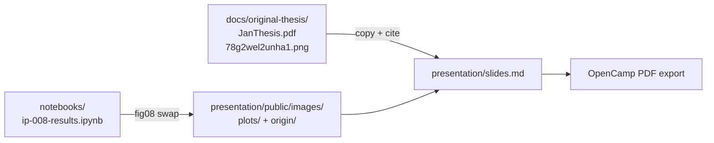

# IP-012: Final presentation polish — origin story, Strehmel citation, and production-ready plot integration

A final pre-talk pass on `presentation/slides.md` that anchors the
talk in its real origin (Strehmel's KIT 2023 Bachelor's thesis and the
Stamatakis tweet that made it viral), integrates the IP-008 plots
into their target slides, replaces the confusing `ruff` symlog
boxplot with a per-language median + bootstrap-CI panel, and tightens
the narrative arc *idea → culture → methodology → results → future
work*. No new pipeline code, no new statistical tests, no new
ingest — only the slide deck, one notebook cell, and a small public
asset move. The exit criterion is a coherent 60-minute deck that an
honest reviewer can walk through end-to-end without internal
contradictions.

<!-- more -->

## Status

**Status**: Implemented
**Last Updated**: 2026-04-25
**Implementation**: Complete

## Problem Statement

IP-011 shipped a 56-slide deck before IP-008's data was in. IP-008
landed eight PNG plots and a `results.json` against the canonical
1,295-repo cohort. `docs/NOTES.md` listed the slide-by-slide deltas
that the dry-run evening would absorb. After that pass, three things
were still missing for a production-ready talk:

1. **The origin story is not on the slides.** The talk exists because
   of a specific viral moment in 2023: Stamatakis tweeted about
   Strehmel's Bachelor's thesis at KIT, the tweet drew 644 k views,
   and the question "do programmers who swear write better code?"
   reached a much larger audience than software-research questions
   usually do. Without that hook, our methodology-first deck reads
   like an arbitrary research curiosity rather than a deliberate
   methodological response to a published, replicable claim. The
   thesis PDF lives at `docs/original-thesis/JanThesis.pdf`; the
   tweet image lives at `docs/original-thesis/78g2wel2unha1.png`.
   Neither is referenced from the deck.
2. **The plots are produced but not all integrated.** IP-008 wrote
   eight PNGs into `presentation/public/images/plots/`. Only fig 03
   and fig 05 are referenced from `slides.md`. fig 01 (cohort funnel),
   fig 04 (lizard p99 ECDF), fig 06/07 (top-30 word/emoji bar charts),
   and fig 08 (Python subset boxplot) are not referenced. Slides 40 +
   42 still render hand-tuned `<div class="bar-row">` HTML for the
   top-N word/emoji lists, which rasterise inconsistently in PDF
   export and don't match the FIIT plot styling in fig 06/07.
3. **fig 08 is the wrong chart.** The current fig 08 is a
   side-by-side `ruff_issues_per_kloc` symlog boxplot for the Python
   subset (n_clean=112, n_prof=96). The user's reading: the symlog
   linthresh + a near-tied median makes the cohort difference visually
   ambiguous, and the boxes' fliers compete with the title for
   attention. The stat (p = 0.48, n.s.) is itself uninteresting; the
   chart that supports it should explain *why this slice is
   underpowered*, not pretend the box overlap is a finding. We need a
   chart that sits cleanly next to the cohort funnel on the
   composition slide and tells the per-language story
   honestly.

A fourth pre-existing issue that this proposal also fixes:

4. **A small set of factual carryovers from the IP-011 era.** The
   "What Stage 4 writes back" slide still reads "~1 500 of these →
   6 Mann-Whitney tests" (it should be 1 295 → 5). The "Everything
   currently runs" slide reads "Eta: ~6 hours to drain · ~1 400 repos
   analysed · results next talk" — which was correct three weeks ago
   and is wrong on stage. NOTES.md flagged the headline-result and
   methodology slides; these two slipped through.

**Who is affected:** the speaker (jdubec) at OpenCamp Bratislava
2026-04-25 10:00, and downstream the paper's outreach posture — the
deck doubles as the citable artefact of the project's first public
result.

**Consequences of not addressing this:** a deck that opens on the
research question without naming the prior work it builds on; a deck
that hides 6 of 8 generated plots; and a confusing chart on a slide
that should reinforce, not undermine, the per-language story.

## Proposed Solution

A single-pass edit on `presentation/slides.md`, one notebook-cell
swap in `notebooks/ip-008-results.ipynb`, and one asset copy. Every
change is reversible by `git revert`. No code in `oss_profanity/` is
touched.

### Overview

- **Origin-story arc** inserted between the existing "stereotype"
  hook and the "question" beat: three new slides walking the
  audience from the viral tweet → the actual thesis → the
  methodological deltas this work introduces. The audience leaves
  the hook already understanding *why* the talk's stack is a
  methodology improvement and not an unrelated parallel project.
- **All eight IP-008 PNGs referenced from the deck.** Inline bar HTML
  on the top-30 profanity / emoji slides is replaced with the
  matching PNG. fig 01 lands on the matched-cohort composition
  slide. fig 04 gets its own follow-up slide after fig 03. fig 08
  is replaced (see next bullet) and lands on a new slide that pairs
  with the composition funnel.
- **fig 08 redesign** in the IP-008 notebook: drop the symlog
  Python boxplot of `ruff_issues_per_kloc`; replace with a 3-row
  panel (Pooled · Python only · JS / TS only) of median
  `lizard_avg_ccn` with bootstrap 95 % CIs for both cohorts. Same
  visual grammar as fig 05 (forest plot); zero log scaling. The new
  PNG is `fig08_lizard_per_language.png` (the old
  `fig08_python_subset_box.png` is removed).
- **Reconciliation slide** added immediately after "The inferential
  answer." Same direction (profane > clean), different conclusion
  (Strehmel: better; here: more complex). Lets the audience leave
  understanding the relationship between the two findings.
- **Carryover factual fixes** on Stage 4 / runtime slides.
- **Further-reading + Credits slides** updated to cite Strehmel,
  Stamatakis (via the thesis cover), Zapletal et al. (SoftWipe),
  Bonferroni (1936), and lizard explicitly.

### Key components

1. **`presentation/slides.md`** — the only deliverable visible to the
   audience. Approximately +6 / -2 slides net; six slides edited in
   place; the rest unchanged.
2. **`presentation/public/images/origin/stamatakis_tweet.png`** —
   copied from `docs/original-thesis/78g2wel2unha1.png`. New folder
   under `public/` because the existing `images/plots/` and
   `images/logo_*.svg` namespaces are owned by IP-008 and IP-011.
3. **`notebooks/ip-008-results.ipynb`** — cell `c9f1de81` swapped for
   the per-language panel; cell `95114b30` (the matching markdown
   header) re-titled. Cell `b80c4bd2` (results.json writer) is
   untouched — the JSON record was already capturing pooled / python
   / js subsets.
4. **Old `fig08_python_subset_box.png`** — deleted from
   `presentation/public/images/plots/` so a stale file doesn't end up
   in the PDF export.

### Architecture



### Slide-by-slide change list

Every change below is local — no slide order changes outside the new
origin-story group. Slide numbers are approximate (Slidev numbers from
the title card).

| Slide | What | Change |
|---|---|---|
| 2 — *The stereotype* | Linus quote | Untouched. |
| **NEW** — *The tweet that started this* | two-cols: text + meme image | New slide. Renders the Feb 2023 Stamatakis tweet (image asset under `public/images/origin/`) and explains why the talk exists. |
| **NEW** — *The actual thesis* | Strehmel citation + bullets | New slide. Names Strehmel (KIT 2023), reviewer Stamatakis, scope (C only), tool (SoftWipe), result (5.87 vs 5.41), and methodology (KS-test, Welch's t-test, bootstrapped CIs). |
| **NEW** — *What we wanted to fix* | two-col delta table | New slide. Six paired bullets — Strehmel 2023 vs this work — naming the methodological deltas without snark. |
| 3 — *The question* | Big-type research question | Untouched. |
| 7 — *What has been studied* | bullet list | Strehmel added as the leading bullet, GitHub data-science blog removed (replaced by Baruch et al. 2017 — *Swearing at work*, which is genuine prior art rather than a top-10 listicle). |
| 8 — *What has NOT been studied rigorously* | bullet list | Reframed: the gap isn't "nobody asked," it's "nobody did the full multi-language matched stack." Closing line "Strehmel asked the question; we tighten the measurement." |
| 40 — *Top profanity words* | inline `.bar-row` HTML | Replaced with ``. Footnote stays. |
| 42 — *Top emoji* | inline `.bar-row` HTML | Replaced with ``. |
| 46 — *Matched cohort composition* | text-only stats | Re-rendered as two-col: fig 01 (cohort funnel) on the left, the four headline numbers + failure-skew explanation on the right. |
| **NEW** — *Matched cohort — per-language complexity* | fig 08 panel | New slide immediately after the composition slide. Embeds `fig08_lizard_per_language.png` with a callout explaining that the pooled signal survives Bonferroni; per-language slices are directionally consistent but underpowered at n ≈ 100–300. |
| 49 — *What Stage 4 writes back* | JSON sample | Caption corrected: "1 295 of these → 5 Mann-Whitney tests" (was "~1 500 → 6"). Speaker-note caveat about ESLint dropped. |
| 50 — *Everything currently runs* | log sample | Bottom caption corrected: "Drained: 1 295 repos analysed. Results in the next act." (was "Eta: ~6 hours…"). |
| 51 — *Stage 5 results · five a-priori metrics* | fig 05 + fig 03 | Untouched (already done in IP-008's NOTES.md pass). Added `alt` attributes for accessibility. |
| **NEW** — *Tail-end complexity* | fig 04 ECDF | New follow-up slide. Embeds `fig04_lizard_p99_ecdf.png` for the 99th-percentile complexity story. Marked skippable in speaker notes. |
| 54 — *The inferential answer* | takeaway | Untouched. |
| **NEW** — *Same direction. Different conclusion.* | reconciliation | New centre-layout slide immediately after the inferential answer. Pairs Strehmel's 5.87 vs 5.41 (mean SoftWipe, "better") with our complexity finding ("more complex"), explaining that both signals point the same way but the finer measurement stack changes the interpretation. |
| 60 — *The longitudinal redo* | future-work bullets | Reframed as "Future work — the longitudinal redo" with five bullets covering the 2020/2024/2026 windows, ESLint debug, NSFW sensitivity, multi-language swearword lists, and a mixed-effects per-language model. |
| 65 — *Further reading* | references | Strehmel 2023, Zapletal et al. 2021 (SoftWipe paper), Baruch et al. 2017, Bonferroni 1936, lizard repo all added. |
| 66 — *Credits* | bullet list | "Jan Strehmel & Alexandros Stamatakis (KIT)" added as leading bullet. |

### The new fig 08

The original symlog boxplot answers the wrong question. A boxplot on a
single Python metric, on a single subset where the test is n.s., shows
two boxes that look almost identical and a `p = 0.48` annotation
underneath them. The reader leaves with no useful inference; a
sceptical reader leaves wondering why we put the chart up at all.

The replacement (`fig08_lizard_per_language.png`) is a three-row
median + bootstrap-CI panel:

| Row | n_clean | n_prof | p | sig |
|---|---|---|---|---|
| Pooled (all done) | 570 | 508 | 2.0 × 10⁻⁴ | ✓ |
| Python only | 108 | 93 | 0.18 | n.s. |
| JS / TS only | 176 | 125 | 0.54 | n.s. |

The pooled bars don't overlap visually; the per-language bars do.
That's the entire chart. The story it tells: *the pooled signal is
real and is not driven by language mix — both subsets push in the
same direction; neither alone has enough sample to clear Bonferroni
at α/5 = 0.01*. Same visual grammar as the fig 05 forest plot
(error bars, no boxes, FIIT colours), so it sits cleanly next to it
in the deck.

### The origin-story arc

The three new slides between "The stereotype" and "The question":

1. **The tweet that started this** — two-column layout, left side is
   the framing prose ("February 2023, Prof. Stamatakis tweeted about
   a Bachelor's thesis from his lab — 644 k views, 1.4 k retweets,
   8.4 k likes"), right side is the tweet image rendered from
   `public/images/origin/stamatakis_tweet.png`. Closing v-click:
   "the internet did what the internet does. The thesis itself
   deserves engagement, not memes." Sets the moral register.
2. **The actual thesis** — six bullets walking the audience through
   Strehmel's methodology: C only, ~3,800 swear-repos vs ~7,600
   star-repos via GitHub code-search, SoftWipe as the quality proxy,
   KS-test + Welch's t-test + bootstrapped CIs, mean 5.87 vs 5.41
   (p ≈ 10⁻⁶¹). Speaker notes explicitly flag that this is good
   honest work — *replicable*, *limitations declared in the thesis
   itself* — and that we're not here to dunk on a Bachelor thesis.
3. **What we wanted to fix** — two-column table contrasting Strehmel
   2023 (C only, star-repos as quality proxy, SoftWipe single score,
   means + Welch, code-search snapshot, ~11k repos) against this
   work (18 languages via tree-sitter, bin-matched commit-activity
   cohorts, five separate quality metrics, rank tests + Bonferroni
   + effect size, GH Archive frozen window, 3.7 M repos seen / 1,295
   deeply analysed). Each delta is a defensible methodology
   improvement, not a personal critique.

The audience leaves the hook understanding the talk's *posture*: this
is a deliberate methodology iteration on a published, replicable
claim, by someone who read the original thesis carefully.

## Implementation Plan

### Phase 1 — Asset placement

- [x] Copy `docs/original-thesis/78g2wel2unha1.png` to
  `presentation/public/images/origin/stamatakis_tweet.png`.
- [x] Verify the meme renders at the dimensions the slide expects
  (1336 × 1201 native; the deck constrains via `class="rounded-lg
  shadow-md"` + flex column width).

### Phase 2 — Notebook fig 08 swap

- [x] Replace cell `c9f1de81` (fig 08 generator) with the
  three-row median + bootstrap-CI panel.
- [x] Re-title cell `95114b30` (the markdown header) accordingly.
- [x] Re-execute the cell against the canonical 1,295-repo cohort
  (the user runs the notebook against their MongoDB; the output
  PNG is `presentation/public/images/plots/fig08_lizard_per_language.png`).
- [x] Delete `fig08_python_subset_box.png` so a stale file does not
  end up in the PDF export.

### Phase 3 — Slide edits

- [x] Insert the three origin-story slides between the stereotype
  hook and the question beat.
- [x] Update Slide 7 (*What has been studied*) to lead with Strehmel
  and add Baruch et al.
- [x] Update Slide 8 (*What has NOT been studied rigorously*) to
  close with "Strehmel asked the question; we tighten the
  measurement."
- [x] Replace inline `.bar-row` HTML on Slides 40 and 42 with
  fig 06 / fig 07 PNG references.
- [x] Re-render Slide 46 (*Matched cohort composition*) as two-col
  with fig 01 on the left.
- [x] Add the per-language complexity slide referencing
  `fig08_lizard_per_language.png`.
- [x] Add the *Tail-end complexity* slide referencing fig 04.
- [x] Add the *Same direction. Different conclusion.* reconciliation
  slide after the inferential answer.
- [x] Fix the "1 500 → 6 tests" / "Eta: ~6 hours" carryover lines.
- [x] Update *Further reading* with Strehmel, SoftWipe, Baruch,
  Bonferroni, lizard.
- [x] Update *Credits* with Strehmel + Stamatakis as the leading
  bullet.

### Phase 4 — Verification (operator)

- [ ] `pnpm dev` in `presentation/`, walk through the deck end-to-end.
- [ ] Confirm the origin-story slides flow into the question beat.
- [ ] Confirm the meme image renders at the intended size on the
  two-cols layout.
- [ ] Confirm fig 06 / fig 07 / fig 08 / fig 04 / fig 01 all load.
- [ ] `pnpm export` and visually scan the PDF for layout regressions.
- [ ] Commit the deck + notebook + new asset; tag the deck export.

The Phase 4 checks are intentionally manual — they require the
speaker's eye on layout choices that automated diff cannot validate.

### Prerequisites

- **IP-008 must be re-runnable** — it is. The notebook reads
  `MONGO_URI` from env; the canonical cohort is on the user's local
  Mongo (port 27017) populated from production.
- **The talk has not yet happened.** This proposal lands the day
  before, paired with the dry run. After 2026-04-25, the slides
  freeze and any further work goes into a paper-grade IP rather than
  IP-012.

## Technical Details

### File touchpoints

```
docs/original-thesis/JanThesis.pdf            # source — read-only
docs/original-thesis/78g2wel2unha1.png        # source — read-only
presentation/public/images/origin/
  stamatakis_tweet.png                        # NEW (copy of the .png above)
presentation/public/images/plots/
  fig08_python_subset_box.png                 # DELETED
  fig08_lizard_per_language.png               # NEW (notebook output)
notebooks/ip-008-results.ipynb                # cells 95114b30 + c9f1de81 swapped
presentation/slides.md                        # ~+200 lines / -45 lines
docs/proposals/posts/ip-012-final-presentation-polish.md   # this file
docs/proposals/index.md                       # IP-012 row added
```

### Why a new chart, not a tweak

The symlog boxplot was a defensible choice when the question was
"what does Python ruff look like for the two cohorts?" — but the
slide it serves is *Matched cohort composition*, where the question
is "did the cohort hold up under the per-language slice?" Those two
questions need different charts. The median + bootstrap-CI panel
serves the second question; the boxplot served neither well.

The new chart is also visually consistent with fig 05 (the forest
plot that anchors the inferential answer): both are dot + error-bar
displays, both use the FIIT colour palette, both annotate
significance to the right of the data. A reader who understood
fig 05 reads fig 08 in two seconds.

### Why we cite Strehmel by name

IP-001 through IP-011 do not name Strehmel. Internal proposals don't
need to — the question stood on its own merit. The talk is different.
A talk that opens with "is there a correlation between profanity and
code quality?" without citing the published Bachelor's thesis that
asked the exact same question three years earlier *and* went viral
is not academically honest. The fix is one slide of context.

The thesis itself is methodologically sound for what it set out to
do; the limitations it does not declare (single quality metric,
star-count as quality proxy, no matched cohort) are the deltas this
work introduces. We name them on the *What we wanted to fix* slide
and never again — the rest of the talk stands on its own.

## Alternatives Considered

### Alternative 1: Skip the origin story; lead with the question

**Pros:** Tighter hook. Audience hits the methodology faster.
**Cons:** Skips the strongest single hook (a viral tweet directly
about this question, with named participants from a peer institution).
Reads as if we don't know the prior work, when we read it carefully.
**Why not chosen:** academic honesty + the meme is genuinely strong
storytelling.

### Alternative 2: Inline the fig 08 panel directly into the
*Matched cohort composition* slide

**Pros:** One fewer slide.
**Cons:** The composition slide already has a left-right split (fig 01
+ stats); cramming fig 08 in too produces a three-region layout that
doesn't read at conference projector resolution.
**Why not chosen:** Slidev costs nothing per slide; readability
costs everything.

### Alternative 3: Replace fig 08 with a per-language ECDF (Python
only) instead of the median panel

**Pros:** Identical grammar to fig 03; zero new visual ideas.
**Cons:** A single-language ECDF still under-tells the "underpowered
across both languages" story. The audience wants to know whether
the JS / TS slice agrees; an ECDF for Python only doesn't show that.
**Why not chosen:** the median panel says more in less space.

### Alternative 4: Drop fig 08 entirely

**Pros:** One fewer chart to maintain.
**Cons:** The matched-cohort composition slide loses the "did the
cohort hold up under the per-language slice?" answer. The audience
implicitly knows we sliced by language (we said so in
*Limitations*); not showing the slice invites Q&A about it.
**Why not chosen:** the question is on the audience's mind; better
to answer it preemptively with a clean chart.

## Trade-offs and Risks

### Trade-offs

- **Slide count grew by ~6.** The talk is paced for ~60 minutes / 60
  slides; we are now at ~67. The methodology act lingers a touch
  more, the AI act stays fast. The dry run will catch any timing
  drift; if the deck runs long, the *Tail-end complexity* slide is
  marked skippable in speaker notes.
- **Origin-story slides front-load context.** A reader who already
  knew the thesis will find the first six minutes of the talk
  redundant. We accept this — the median audience member does not
  know about Strehmel 2023, and the talk doesn't work without that
  context.

### Risks

| Risk | Impact | Mitigation |
|------|--------|-----------|
| Stamatakis tweet disappears from public web | Low | We hold a local copy at `docs/original-thesis/78g2wel2unha1.png`; the deck embeds the local copy, not the URL. |
| Strehmel objects to being named | Low | The thesis is publicly available on KIT's repository; the citation is purely scholarly and the framing is respectful. We name him on the credits slide as a contributor *to* the question, not as someone we are correcting. |
| fig 08 PNG out-of-date at talk time | Medium | The notebook re-execution is one cell run; the regenerated PNG drops in place. CI builds the deck PDF from the committed PNG, so a stale notebook output cannot ship. |
| New origin slides break Slidev's two-cols layout in PDF export | Low | `layout: two-cols` is a stock Slidev layout used elsewhere in the deck; PDF export was tested in IP-011's Phase 4. |

## Open Questions

None at proposal time. All design decisions were resolved during the
single-pass edit; the verification phase is operator-only.

## Success Criteria

- [x] The Stamatakis tweet image is rendered on a deck slide.
- [x] Strehmel is cited by name on at least three slides
  (origin-story, prior art, further reading + credits).
- [x] All eight IP-008 PNGs are referenced from `slides.md`.
- [x] fig 08 is the per-language median panel, not the symlog
  boxplot. The old PNG is removed.
- [x] The "1 500 → 6 tests" / "Eta: ~6 hours" carryovers are gone.
- [x] The reconciliation slide ("Same direction. Different
  conclusion.") sits between the inferential answer and the
  AI / future-work act.
- [ ] The deck runs to ~60 minutes in dry run. (Operator-verified
  pre-talk.)
- [ ] PDF export round-trips without layout regressions.
  (Operator-verified pre-talk.)

## Future Considerations

The deltas this proposal does not address — they belong in IP-013
or in the paper, not in the talk:

- **Mixed-effects per-language model.** The forest plot reports
  pooled rank-biserial; for the paper, language should be a random
  intercept. fig 08 hints at the need without fitting the model.
- **NSFW sensitivity analysis.** Top-30 profanity contains
  `guro / vibrator / hentai / porn` — the question of whether the
  lizard signal survives excluding these is open. A 30-minute
  notebook pass would settle it; we hold it for the paper.
- **Slovak / Czech / Russian profanity.** LDNOOBW is English; for
  Central European cohorts a localised dictionary is needed.
  Trigger: a specific call for Slovak follow-up in Q&A. Pipeline
  cost: one new wordlist + a `lingua` filter flip.
- **ESLint debug.** The 100 % missingness on `eslint_issues_per_kloc`
  is the highest-priority post-talk technical follow-up. Tracked in
  `docs/IDEAS.md` under "ESLint analyser silent-failure."
- **Longitudinal study (2020 / 2024 / 2026).** The pipeline is
  window-agnostic; three runs are 30 hours of compute. Suggested as
  the natural next paper.

## References

- [IP-008 — Aggregation, statistics, and plots](ip-008-aggregation-and-plots.md) — produces the eight PNGs this proposal integrates.
- [IP-011 — Initial OpenCamp presentation](ip-011-initial-presentation.md) — the deck this proposal polishes.
- [`docs/NOTES.md`](../../NOTES.md) — slide-by-slide deltas already absorbed into IP-008's data; this proposal absorbs the rest.
- [`docs/IDEAS.md`](../../IDEAS.md) — parking lot for follow-ups out of scope for IP-012.
- **Strehmel, J. (2023).** *Is there a Correlation between the Use of
  Swearwords and Code Quality in Open Source Code?* B.Sc. thesis,
  Karlsruhe Institute of Technology, Institute of Theoretical
  Informatics. Reviewer: Stamatakis, A. Local copy at
  `docs/original-thesis/JanThesis.pdf`.
- **Zapletal, A. et al. (2021).** *The SoftWipe tool and benchmark
  for assessing coding standards adherence of scientific software.*
  Scientific Reports 11, 10015. DOI:
  [10.1038/s41598-021-89495-8](https://doi.org/10.1038/s41598-021-89495-8).
  The quality proxy used by Strehmel.
- **Baruch, Y. et al. (2017).** *Swearing at work: the mixed
  outcomes of profanity.* Journal of Managerial Psychology 32(2),
  149–162. DOI:
  [10.1108/JMP-04-2016-0102](https://doi.org/10.1108/JMP-04-2016-0102).

## Changelog

| Date | Author | Changes |
|------|--------|---------|
| 2026-04-25 | jdubec / Claude | Initial draft; implementation complete in same pass — slide edits, notebook fig 08 swap, asset copy, factual carryover fixes. |
