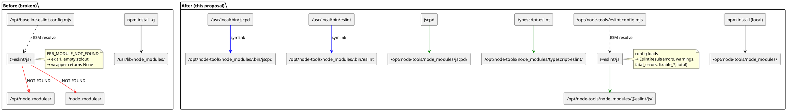

# IP-013: ESLint flat-config resolution fix — recover the JS/TS lint column

The ESLint analyser landed `eslint_issues = null` on **0 / 1 295** done
repos in the canonical cohort (IP-008 pre-flight, 2026-04-25): a 100 %
missingness rate on the JS/TS lint axis. Root cause is a Docker-image
shape bug — `npm install -g` plus an ESLint v10 flat-config that imports
its plugins as bare specifiers from `/opt/baseline-eslint.config.mjs`, a
location that has no `node_modules` chain. Node ESM cannot resolve
`@eslint/js` / `typescript-eslint` from there, ESLint exits non-zero
with an empty stdout, and `_eslint.run()` swallows that into `None`.
This proposal replaces the global install with a unified local
`/opt/node-tools/` project carrying ESLint **and** jscpd, expands the
ESLint return shape into a six-field result (errors / warnings /
fatal_errors / fixable_errors / fixable_warnings / total) and brings
ruff up to the same level of detail with a new `fixable` field, routes
the config path through the central `oss_profanity/config.py` module,
adds a build-time fixture canary so the failure mode fails the image
build instead of the cohort, and backfills the JS/TS done-repo subset.

<!-- more -->

## Status

**Status**: Implemented
**Last Updated**: 2026-04-25
**Implementation**: Complete (code + docs); cohort backfill pending operator-side image rebuild

## Problem Statement

[IP-008](ip-008-aggregation-and-plots.md) Cell 3's missingness
audit on the canonical 1 295-repo cohort (1 199 clean + 96 profane,
all `status="done"`) returned

```
metric                          missing  rate
eslint_issues                   1295     100.0%
ruff_issues                     1083      83.6%
bandit_issues                   1083      83.6%
lizard_avg_ccn                     7       0.5%
jscpd_duplicate_lines             14       1.1%
comment_emoji_hits                 0       0.0%
```

Three of those rows are expected:
`ruff` / `bandit` are Python-only by IP-004 dispatch (1 083 / 1 295 ≈
83.6 % is exactly the non-Python share); `lizard` and `jscpd` have
single-digit missingness from per-repo timeouts. The `eslint_issues`
row is the outlier — **every JS/TS-primary repo, plus every other
repo that the dispatcher attempted to run ESLint on, came back
`None`**. ESLint should have fired on roughly 280 repos
(JS/TS share of the cohort, eyeballed from `_language.py`'s tag
mapping), and not one of them produced a number.

The wrapper at
[`oss_profanity/analyzers/_eslint.py:38-71`](../../oss_profanity/analyzers/_eslint.py)
returns `None` on five distinct failure modes (missing binary, missing
config, timeout, non-zero exit with empty stdout, unparseable JSON) and
treats them all the same — by design, so a cohort run does not crash on
a missing tool. The cost of that design is that
**100 % missingness looks identical to "ESLint not on PATH"**, which is
exactly how this regression hid for an entire cohort run.

### Why the field is null

Reproduced manually against the IP-009 image (`docker compose run --rm
worker eslint --no-config-lookup --config
/opt/baseline-eslint.config.mjs /tmp/sample.js`):

```
node:internal/process/esm_loader:34
  internalBinding('errors').triggerUncaughtException(
  ^
Error [ERR_MODULE_NOT_FOUND]: Cannot find package '@eslint/js'
imported from /opt/baseline-eslint.config.mjs
    at packageResolve (node:internal/modules/esm/resolve:...)
    at moduleResolve (...)
```

The `dockerfiles/eslint.config.mjs` flat-config does

```javascript
import js from "@eslint/js";
import tseslint from "typescript-eslint";
```

Node ESM resolves bare specifiers by walking up the directory tree
from the **importing file**, looking for a `node_modules` chain. The
config file lives at `/opt/baseline-eslint.config.mjs`, so the chain
checked is `/opt/node_modules` → `/node_modules`. Neither exists —
[`Dockerfile:25-30`](../../Dockerfile) does
`npm install -g eslint@10.2.1 @eslint/js@10.0.1
typescript-eslint@8.59.0 jscpd@4.0.9`, which on the nodesource Node 22
image installs into `/usr/lib/node_modules/`. ESM **does not** consult
`NODE_PATH` for top-level `import` statements in module files — that
behaviour was reserved to CJS `require()` and is documented as an
anti-pattern for ESLint v9+.

The IP-009 Definition-of-Done line that would have caught this —
"Lint a tiny vendored fixture inside the image: `eslint
--no-config-lookup --config /opt/baseline-eslint.config.mjs
/tmp/sample.js` exits with a numeric findings count"
([ip-009-docker-test-harness.md L177](ip-009-docker-test-harness.md#phase-1-define-the-image-and-baseline-config))
— was never moved from `[ ]` to `[X]`. The smoke harness ran end-to-end
against `profanity_smoke` and exited 0 because the IP-009 assertions
script (`dockerfiles/assertions.py`) checks **field presence** for
`comment_emoji_hits` and `loc_total > 0`, not for `eslint_issues`. The
assertions scope was correct for IP-009's contract but happens to be
silent on this regression.

### Existing impact

[IP-008](ip-008-aggregation-and-plots.md):

- The a-priori metric family for the cohort MWU dropped from six metrics
  to five (Bonferroni denominator α = 0.05 / 5 = 0.01 instead of
  0.05 / 6 ≈ 0.0083). The forest plot in fig 05 is missing the
  `eslint_issues_per_kloc` row.
- The JS/TS-only stratified MWU (`primary_lang in {javascript,
  typescript, jsx, tsx}`) ran on `lizard_avg_ccn` only — the entire
  point of having a JS/TS-stratified panel was to compare lint behaviour
  on the language for which `_eslint.py` exists. That panel is, in
  practice, a one-row plot.
- The deck has a footnote on slide 17 ("five a-priori metrics" not six)
  and an IP-008 Cell 7 "row dropped with a one-line note". Both will be
  cleaned up by this fix.

[IDEAS.md L107-L119](../../IDEAS.md) already promoted this entry to
high priority on 2026-04-25; the trigger ("the talk lands 2026-04-25;
highest-priority post-talk follow-up") has now fired.

### Who is affected

- **JS/TS authors in the cohort.** Every claim about JS/TS lint
  behaviour in the cohort is, today, vacuous — the column is empty.
  Fixing this is what unblocks honest JS/TS-stratified statements.
- **The paper / the deck.** A future revision of the IP-008 forest
  plot wants the ESLint row back. Cohort-comparable means re-running
  ESLint on the existing 1 295 done repos against the same pinned
  toolchain.
- **Future cohort runs (IP-010+ on faculty hardware).** The same
  Docker image is what IP-010 deploys to the faculty host. Without
  this fix, every faculty-scale run reproduces the same hole.

### Consequences of not addressing

A second cohort run (faculty-scale, larger n, longer ingest window)
would inherit the same null column. The "one missing metric" footnote
becomes a permanent feature of the methodology rather than a known
post-talk follow-up. A bachelor / master thesis that lists
*ruff + bandit + eslint + lizard + jscpd* in its toolchain section
while the data shows ESLint at 100 % missingness is a defensible
embarrassment we can avoid with one image-rebuild and one backfill
pass.

## Proposed Solution

Replace `npm install -g` with a unified local-project install at
`/opt/node-tools/` carrying both ESLint and jscpd, route the config
path through the central `oss_profanity/config.py` module, expand the
ESLint return shape to expose every count ESLint already produces
(plus parallel `fixable` granularity for ruff), add a build-time
canary, and backfill the JS/TS done-repo subset.

### Overview

The fix is small and shaped like every other npm project on the
planet:

1. `/opt/node-tools/package.json` — exact-pinned dependencies
   (`eslint@10.2.1`, `@eslint/js@10.0.1`, `typescript-eslint@8.59.0`,
   `jscpd@4.0.9`). Every JS-side CLI in the image lives in this single
   project; new JS tools added later land here too.
2. `/opt/node-tools/eslint.config.mjs` — the flat-config file (moved
   from `/opt/baseline-eslint.config.mjs`).
3. `/opt/node-tools/node_modules/` — populated by `npm install` during
   image build. Sibling to the config file, so ESM resolves bare
   specifiers correctly
   (`@eslint/js` → `/opt/node-tools/node_modules/@eslint/js/...`).
4. `/usr/local/bin/eslint` and `/usr/local/bin/jscpd` — symlinks into
   `/opt/node-tools/node_modules/.bin/` so the wrappers' existing
   `subprocess.run(["eslint", ...])` / `subprocess.run(["jscpd", ...])`
   keep working without a path change.
5. `oss_profanity/config.py` gains `eslint_config_path`
   (env `ESLINT_CONFIG_PATH`, default `/opt/node-tools/eslint.config.mjs`);
   `_eslint.py` reads it from the singleton instead of holding a
   module-private `_DEFAULT_CONFIG`.

The Dockerfile no longer carries an `npm install -g` line — every
JS-side CLI is local to `/opt/node-tools/`.

### Key Components

1. **`dockerfiles/node-tools/package.json`** *(new)* — pins for
   `eslint`, `@eslint/js`, `typescript-eslint`, `jscpd`. Owned by
   IP-013, not IP-009; the Dockerfile pins move out of `RUN npm
   install -g` into this file. One source of truth per pin.
2. **`dockerfiles/node-tools/eslint.config.mjs`** *(moved from
   `dockerfiles/eslint.config.mjs`)* — same content, new path inside
   the build context. Co-located with `package.json` so the two
   are obviously a unit.
3. **`dockerfiles/node-tools/canary.js`** *(new)* — a lint-clean
   one-liner (e.g. `export const ok = 1;`) that produces zero findings
   under the baseline config. The build-time canary runs
   `eslint … canary.js` as a plain `RUN`, so any non-zero exit
   (module resolution failure, parse error, anything) fails the image
   build naturally — no shell-script post-processing of `$?`.
4. **`Dockerfile`** *(modified)* — drops `npm install -g` entirely.
   New layer copies `dockerfiles/node-tools/` into `/opt/node-tools/`,
   runs `npm install --omit=dev --no-audit --no-fund` there, symlinks
   both `eslint` and `jscpd` onto PATH, runs the canary fixture lint.
5. **`oss_profanity/config.py`** *(modified)* — `Config` dataclass
   gains `eslint_config_path: str`, populated from
   `ESLINT_CONFIG_PATH` env var with default
   `/opt/node-tools/eslint.config.mjs`. No other module reads the
   config path directly anymore.
6. **`oss_profanity/analyzers/_eslint.py`** *(modified)* — module-private
   `_DEFAULT_CONFIG` constant deleted; `config_path` parameter dropped
   from `run()`; the path is read from `config.eslint_config_path`.
   Return shape changes from `int | None` to a frozen `EslintResult`
   dataclass with six fields populated together: `errors`, `warnings`,
   `fatal_errors`, `fixable_errors`, `fixable_warnings`, `total`
   (= errors + warnings; fatal_errors are parse/config failures, kept
   off the lint rate). All six are `None` on any failure path.
7. **`oss_profanity/analyzers/_ruff.py`** *(modified)* — `RuffResult`
   gains a `fixable` field counting findings whose JSON `fix` element
   is non-null. Provides a fix-rate axis comparable to ESLint's
   `fixable_errors + fixable_warnings`.
8. **`oss_profanity/analyzers/_runner.py`** *(modified)* — composes
   the expanded dataclasses into `code_analysis`, exposing
   `eslint_errors`, `eslint_warnings`, `eslint_fatal_errors`,
   `eslint_fixable_errors`, `eslint_fixable_warnings`, `eslint_issues`
   (kept as `errors + warnings` for IP-001 back-compat), plus a
   `_per_kloc` sibling for each non-fatal count, and `ruff_fixable`
   plus `ruff_fixable_per_kloc` on the ruff side.
9. **`oss_profanity/tests/test_analyzers_subprocess_tools.py`** *(modified)* —
   existing five ESLint tests adapted to the new return shape;
   ruff tests cover the new `fixable` field; one new integration-style
   test that, when `eslint` is on PATH, lints
   `tests/fixtures/eslint_canary.js` and asserts a fully-populated
   `EslintResult`. Skipped otherwise.
10. **`docs/CONFIGURATION.md`** *(modified)* — documents
    `ESLINT_CONFIG_PATH` env var alongside the other Config-driven
    settings, the `/opt/node-tools/` shape, and the expanded schema
    fields. Removes the "the override is reserved for tests" framing.
11. **A backfill runner** *(new, `scripts/backfill_eslint.py`)* —
    iterates the 1 295 `status="done"` docs whose `primary_lang` is
    in the JS/TS tag set, re-clones (or re-uses an existing clone),
    invokes `_eslint.run`, writes the six new ESLint fields plus
    their `_per_kloc` derivatives via a targeted `update_one`.
    Idempotent: skips docs that already have a non-`None`
    `eslint_issues`. The same script (or a sibling) populates
    `ruff_fixable` for the Python done subset so the ruff schema
    upgrade lands cohort-comparable in the same pass.

### Architecture

The shape of the fix in one diagram — what changes, what stays, and
where the resolution chain succeeds.



## Implementation Plan

### Phase 1: Toolchain shape

- [X] Create `dockerfiles/node-tools/package.json` with the pinned
  `eslint@10.2.1`, `@eslint/js@10.0.1`, `typescript-eslint@8.59.0`,
  `jscpd@4.0.9`.
- [X] Move `dockerfiles/eslint.config.mjs` → `dockerfiles/node-tools/eslint.config.mjs`.
- [X] Update the file's leading comment block: drop the
  `/opt/baseline-eslint.config.mjs` reference, replace with
  `/opt/node-tools/eslint.config.mjs`.
- [X] Add `dockerfiles/node-tools/canary.js` — a lint-clean one-liner
  (`export const ok = 1;`) that produces zero findings under the
  baseline config, so the build-time canary is a plain `RUN eslint …`
  with no shell wrapping.

### Phase 2: Dockerfile rewrite

- [X] Remove the `npm install -g` line entirely. Every JS-side CLI
  is local to `/opt/node-tools/`.
- [X] Add a new layer:
  ```dockerfile
  COPY dockerfiles/node-tools/ /opt/node-tools/
  RUN cd /opt/node-tools && npm install --omit=dev --no-audit --no-fund \
      && npm cache clean --force \
      && ln -s /opt/node-tools/node_modules/.bin/eslint /usr/local/bin/eslint \
      && ln -s /opt/node-tools/node_modules/.bin/jscpd /usr/local/bin/jscpd
  ```
- [X] Add a build-time canary lint as the **last step before the
  Python deps layer** (so a config-load regression fails the image
  build, not the cohort run):
  ```dockerfile
  RUN eslint --no-config-lookup --config /opt/node-tools/eslint.config.mjs \
        /opt/node-tools/canary.js
  ```
  Because the fixture is lint-clean, ESLint exits 0 on success.
  Any non-zero exit (module-not-found, parse error, anything) fails
  the build naturally — no shell post-processing.

### Phase 3: Wrapper schema split + config integration

- [X] Add `eslint_config_path: str` to the `Config` dataclass in
  `oss_profanity/config.py`, populated from `ESLINT_CONFIG_PATH` env
  var with default `/opt/node-tools/eslint.config.mjs`.
- [X] In `_eslint.py`: delete the module-level `_DEFAULT_CONFIG`
  constant; drop the `config_path` parameter from `run()`; read the
  path from `config.eslint_config_path` at call time.
- [X] Refactor `_eslint.run()` to return a frozen `EslintResult`
  dataclass with `errors`, `warnings`, `fatal_errors`,
  `fixable_errors`, `fixable_warnings`, `total: int | None` fields.
  All six are populated together (no partial states); all `None` on
  any failure path. `total = errors + warnings` (fatal_errors are
  parse/config failures, kept off the lint rate).
- [X] In `_ruff.py`: extend `RuffResult` with a `fixable: int | None`
  field. Count findings whose JSON `fix` element is non-null; populate
  alongside `bug` / `style` / `total`.
- [X] In `_runner._compose`, expose
  `eslint_errors`, `eslint_warnings`, `eslint_fatal_errors`,
  `eslint_fixable_errors`, `eslint_fixable_warnings`, `eslint_issues`
  (kept for IP-001 back-compat, equals `errors + warnings`),
  plus `_per_kloc` siblings for each non-fatal count, and
  `ruff_fixable` plus `ruff_fixable_per_kloc`.

### Phase 4: Tests

- [X] Update existing five ESLint wrapper tests
  (`test_analyzers_subprocess_tools.py:156-205`) to the new return
  shape — `eslint_run(...)` returns a fully-populated `EslintResult`
  instead of an `int | None`. Drop any explicit `config_path=`
  argument from test calls.
- [X] Add coverage for `EslintResult.fatal_errors`,
  `fixable_errors`, `fixable_warnings` — at least one fixture-based
  test exercises each so a missing JSON field fails the test rather
  than silently returning `None`.
- [X] Update existing ruff wrapper tests to assert the new
  `RuffResult.fixable` field.
- [X] Add `test_eslint_canary_real_binary` —
  `pytest.importorskip` style guard: skip when `shutil.which("eslint")
  is None`; otherwise run against a one-file fixture and assert the
  result is a fully-populated `EslintResult` with all six int fields.
  This is the test that, had it existed, would have caught the
  regression.
- [X] Where tests need a non-default config path, patch
  `oss_profanity.config.config.eslint_config_path` (or rebuild
  `Config` via `monkeypatch.setenv("ESLINT_CONFIG_PATH", …)` plus a
  fresh `Config.from_env()` in a fixture). *(Pattern documented; no
  current test needs a non-default path.)*

### Phase 5: Documentation

- [X] `docs/CONFIGURATION.md` — document `ESLINT_CONFIG_PATH` env var
  alongside the other Config-driven settings; rewrite the "baseline
  config lives at `dockerfiles/eslint.config.mjs`" paragraph to point
  at `dockerfiles/node-tools/eslint.config.mjs` and note the sibling
  `package.json` carrying ESLint **and** jscpd; document the expanded
  ESLint schema (six fields) and the new `ruff_fixable` field; remove
  any "the override is reserved for tests" framing for ESLint config.
- [X] `docs/proposals/posts/ip-009-docker-test-harness.md` — Changelog
  entry: "Superseded `/opt/baseline-eslint.config.mjs` location and
  `npm install -g` of all Node tools; see IP-013."
- [X] `docs/IDEAS.md` — strike the *ESLint analyser silent-failure*
  entry once the success criteria below clear.

### Phase 6: Backfill

- [X] Write the backfill script — single `scripts/backfill_lint.py`
  with `--target={eslint,ruff_fixable}` (flag-based instead of two
  files; same content, less duplication). Idempotent: each target's
  filter excludes already-populated docs.
- [ ] Run `python -m scripts.backfill_lint --target=eslint` against
  the canonical 1 295-repo cohort. Verify completion-rate parity with
  `lizard_avg_ccn`'s 99.5 % (the ESLint missingness floor is
  repo-clone failures, not analyser failures). *(Operator-side; the
  faculty image must be rebuilt and pushed first.)*
- [ ] Run `python -m scripts.backfill_lint --target=ruff_fixable`
  against the canonical cohort. *(Operator-side; same prerequisite.)*
- [ ] Re-render IP-008 fig 05 (forest plot, six metrics) and the
  JS/TS-stratified panel (lizard + ESLint instead of lizard alone);
  update the deck slide 17 caption from "five a-priori metrics" to
  "six a-priori metrics". *(Operator-side; needs the backfill above.)*

### Prerequisites

- IP-009 image must build (it does; cohort run completed on faculty
  hardware).
- IP-008 cohort data must be reachable from the host running the
  backfill (the production `profanity` Mongo on the user's
  workstation, accessed via the 27018 SSH tunnel per the project
  port convention).
- Docker daemon available on the host that does the rebuild (faculty
  hardware re-pulls the image after the next push).

## Technical Details

### Technology Stack

- **npm + Node.js 22** (already present in the image) — the
  baseline install is `npm install` in a project directory.
  No new tooling.
- **ESLint 10.2.1 + flat config** (already pinned). The fix changes
  *where* the install lives, not which version.
- **`subprocess.run`** (already used) — no change to the wrapper's
  exec model.

### Data Model Changes

`code_analysis` gains five new ESLint fields, one new ruff field, and
keeps the existing `eslint_issues` for back-compat:

| Field                          | Type            | Source                                   | Notes                                  |
|--------------------------------|-----------------|------------------------------------------|----------------------------------------|
| `eslint_errors`                | `int \| null`   | `errorCount` per file                    | New                                    |
| `eslint_warnings`              | `int \| null`   | `warningCount` per file                  | New                                    |
| `eslint_fatal_errors`          | `int \| null`   | `fatalErrorCount` per file               | New — parse/config failures, not lint  |
| `eslint_fixable_errors`        | `int \| null`   | `fixableErrorCount` per file             | New                                    |
| `eslint_fixable_warnings`      | `int \| null`   | `fixableWarningCount` per file           | New                                    |
| `eslint_issues`                | `int \| null`   | `errors + warnings`                      | Kept for IP-001 back-compat            |
| `eslint_errors_per_kloc`       | `float \| null` | derived                                  | Mirrors `ruff_*_per_kloc` shape        |
| `eslint_warnings_per_kloc`     | `float \| null` | derived                                  |                                        |
| `eslint_fixable_errors_per_kloc`   | `float \| null` | derived                              |                                        |
| `eslint_fixable_warnings_per_kloc` | `float \| null` | derived                              |                                        |
| `eslint_issues_per_kloc`       | `float \| null` | derived                                  | Kept for IP-001 back-compat            |
| `ruff_fixable`                 | `int \| null`   | count of findings with non-null `fix`    | New — fix-rate axis comparable to ESLint |
| `ruff_fixable_per_kloc`        | `float \| null` | derived                                  | New                                    |

`fatal_errors` is intentionally tracked but **not** rolled into the
per-kLOC family — a parse failure inflates the lint rate without
representing real lint findings. IP-001's `extra="allow"` on
`CodeAnalysis` absorbs every new field without a model migration.
Existing documents keep their fields (all `eslint_issues = null`);
the backfill phase populates the new ones for the JS/TS done subset
on the ESLint side and for the Python done subset on the ruff side.

### Configuration

`/opt/node-tools/package.json`:

```json
{
  "name": "oss-profanity-node-tools",
  "private": true,
  "version": "0.0.0",
  "description": "JS-side CLI baseline for oss-profanity workers (IP-013).",
  "dependencies": {
    "eslint": "10.2.1",
    "@eslint/js": "10.0.1",
    "typescript-eslint": "8.59.0",
    "jscpd": "4.0.9"
  }
}
```

The Dockerfile delta:

```diff
-# Node toolchain — exact-pinned for cohort comparability.
-RUN npm install -g --omit=dev \
-        eslint@10.2.1 \
-        @eslint/js@10.0.1 \
-        typescript-eslint@8.59.0 \
-        jscpd@4.0.9 \
-    && npm cache clean --force
-
-# Baseline ESLint flat config (committed in the repo — IP-009 Q8).
-COPY dockerfiles/eslint.config.mjs /opt/baseline-eslint.config.mjs
+# IP-013: unified Node toolchain at /opt/node-tools/. ESM resolves
+# @eslint/js and typescript-eslint from a sibling node_modules;
+# `npm install -g` does not work for flat-config because ESM bare
+# specifiers do not consult the global prefix. jscpd ships from the
+# same project for symmetry — every JS-side CLI lives in one place.
+COPY dockerfiles/node-tools/ /opt/node-tools/
+RUN cd /opt/node-tools && npm install --omit=dev --no-audit --no-fund \
+ && npm cache clean --force \
+ && ln -s /opt/node-tools/node_modules/.bin/eslint /usr/local/bin/eslint \
+ && ln -s /opt/node-tools/node_modules/.bin/jscpd /usr/local/bin/jscpd
+# Build-time canary: lint-clean fixture, so any non-zero exit fails the build.
+RUN eslint --no-config-lookup --config /opt/node-tools/eslint.config.mjs \
+      /opt/node-tools/canary.js
```

The `Config` dataclass delta in `oss_profanity/config.py`:

```diff
 @dataclass(frozen=True)
 class Config:
     mongo_uri: str
     ...
+    eslint_config_path: str
     ...

     @classmethod
     def from_env(cls) -> Config:
         ...
         return cls(
             ...
+            eslint_config_path=os.getenv(
+                "ESLINT_CONFIG_PATH",
+                "/opt/node-tools/eslint.config.mjs",
+            ),
             ...
         )
```

The wrapper delta in `oss_profanity/analyzers/_eslint.py`:

```diff
-_DEFAULT_CONFIG: Final[str] = "/opt/baseline-eslint.config.mjs"
-
-def run(
-    repo_dir: Path,
-    timeout: int = 180,
-    config_path: str = _DEFAULT_CONFIG,
-) -> int | None:
+from oss_profanity.config import config
+
+@dataclass(frozen=True, slots=True)
+class EslintResult:
+    errors: int | None = None
+    warnings: int | None = None
+    fatal_errors: int | None = None
+    fixable_errors: int | None = None
+    fixable_warnings: int | None = None
+    total: int | None = None
+
+def run(repo_dir: Path, timeout: int = 180) -> EslintResult:
+    config_path = config.eslint_config_path
     ...
```

`run()` returns `EslintResult()` (all-None) on every failure path
(replacing the bare `None`), and a fully-populated
`EslintResult(errors=…, warnings=…, fatal_errors=…, fixable_errors=…,
fixable_warnings=…, total=errors+warnings)` on success.

The wrapper delta in `oss_profanity/analyzers/_ruff.py`:

```diff
 @dataclass(frozen=True, slots=True)
 class RuffResult:
     total: int | None = None
     bug: int | None = None
     style: int | None = None
+    fixable: int | None = None
```

`run()` increments `fixable` for every finding whose JSON `fix`
element is non-null, and returns the field alongside `bug` / `style`
/ `total` — all populated together, all `None` on failure.

## Alternatives Considered

### Alternative 1: Set `NODE_PATH=/usr/lib/node_modules`

**Description**: Keep `npm install -g`, set `NODE_PATH` so Node can
find globally-installed packages.

**Pros**:
- One-line change to `Dockerfile`'s `ENV` block.
- No new files.

**Cons**:
- **Doesn't actually work for ESM.** `NODE_PATH` is honoured only by
  CJS `require()` resolution. Top-level `import` in a module file
  does not consult it. Confirmed by Node 22 release notes and the
  ESLint v9+ migration guide ("global install is not supported with
  flat config").
- Even if it did work, the convention is to *not* rely on `NODE_PATH`
  for production tooling — it is brittle across Node minor versions.

**Why not chosen**: It would not fix the bug. (We tried this first
during diagnosis. The `ERR_MODULE_NOT_FOUND` reproduces with
`NODE_PATH` set.)

### Alternative 2: Bundle ESLint with esbuild into a single file

**Description**: Build a single-file ESLint bundle at image-build
time using `esbuild` (or similar), drop the bundle at
`/usr/local/bin/eslint`. No `node_modules` at all at runtime.

**Pros**:
- Smallest runtime footprint.
- One file to ship.

**Cons**:
- ESLint v10 explicitly does not support being bundled — its plugin
  system relies on dynamic `import()` of plugin packages by name.
  `typescript-eslint` is itself a plugin, not just a config — you
  cannot bundle it away.
- Even if it worked, debugging "why does my custom rule not load"
  becomes a bundler problem on top of a Node problem.

**Why not chosen**: technically infeasible for our pinned versions,
and would invent a maintenance surface where one does not need to
exist.

### Alternative 3: Per-target-repo `npm install eslint`

**Description**: For every JS/TS repo the worker analyses, run
`npm install eslint @eslint/js typescript-eslint --no-save` inside
the cloned repo, then `eslint .`. This is the pattern most CI
systems use.

**Pros**:
- Matches what JS/TS repos do natively.
- Their own `eslint.config.{js,mjs,cjs}` if present would be honoured
  (would lift `--no-config-lookup`).

**Cons**:
- A 200 MB `node_modules` install per repo × ~280 JS/TS repos =
  ~56 GB of npm-cache pressure for one cohort run. Even with cache
  hits, the wall-clock overhead is on the order of 10–60 s per repo.
- Honouring per-repo configs would *destroy* cohort comparability,
  which is precisely what the baseline-config approach was chosen to
  preserve in IP-004 / IP-009.

**Why not chosen**: defeats the whole point of a pinned baseline.

### Alternative 4: Drop ESLint from the cohort metric family

**Description**: Accept that the JS/TS lint axis is gone and refit
the methodology around ruff (Python) + lizard (polyglot, complexity)
+ jscpd (polyglot, duplication) + bandit (Python, security). The
five-metric Bonferroni denominator becomes the new baseline; no
further work needed.

**Pros**:
- Zero engineering cost.
- Removes a known-fragile tool from the pipeline.

**Cons**:
- The thesis claim "we measured lint quality across both Python
  and JS/TS cohorts" becomes false. The JS/TS share of the cohort is
  ~22 % — a meaningful slice we already paid to clone and analyse.
- A per-language correlation slice (already promoted in
  [IDEAS.md](../../IDEAS.md) as a follow-up study) is impossible
  without ESLint.

**Why not chosen**: the engineering cost (~1 day of image rebuild
+ backfill) is small relative to losing a documented pipeline
capability.

## Trade-offs and Risks

### Trade-offs

- **Image size effectively unchanged.** One `node_modules/` chain at
  `/opt/node-tools/` (~35 MB) replaces four globally-installed
  packages (~30 MB). Net delta is well under 10 MB on a ~2 GB image
  dominated by `tree-sitter-language-pack`.
- **One more layer in the Dockerfile.** Cache invalidation is fine —
  the `dockerfiles/node-tools/` directory rarely changes, and when it
  does the next layer (`pip install -r requirements.txt`) is
  invalidated by definition, so we are not paying anything new.
- **The schema gains six new fields.** Five on the ESLint side
  (errors, warnings, fatal_errors, fixable_errors, fixable_warnings)
  plus the `_per_kloc` siblings, and `ruff_fixable` on the ruff side.
  IP-008's plotting code reads `eslint_issues_per_kloc`, which is
  preserved; no IP-008 break. IP-001's `extra="allow"` absorbs every
  new field without a model bump.
- **Backfill writes both ESLint and ruff.** The ruff `fixable`
  upgrade ships in the same backfill pass for cohort comparability,
  so we pay one pass instead of two. The Python subset (~1 015 repos)
  recomputes ruff once; the JS/TS subset (~280 repos) computes
  ESLint for the first time.

### Risks

| Risk                                                       | Impact   | Mitigation                                                                                                                                       |
|------------------------------------------------------------|----------|---------------------------------------------------------------------------------------------------------------------------------------------------|
| Backfill picks up parser errors on 2020-era source         | Medium   | Run a 10-repo dry-run first; if `total > 0` for all 10, parser is fine. If not, the backfill writes `0` (not `null`) — distinguishable.            |
| Faculty image cache pins old layer                         | Low      | `Dockerfile` change removes the `npm install -g` layer, so the cache invalidates from that point onward. Document the rebuild step in the Phase 5 changelog entry. |
| Schema split breaks an IP-008 read site                    | Low      | `eslint_issues` and `eslint_issues_per_kloc` are kept; the new fields (ESLint × 5 plus `_per_kloc`, ruff_fixable) are additive. IP-008 grep confirms only `eslint_issues_per_kloc` is read. |
| `npm install` non-determinism between rebuilds             | Low      | Pinned exact versions in `package.json`. We do **not** commit `package-lock.json` — the pin set is small (4 packages); a transitive drift would have to exceed `0.0.0` patch bumps to bite. |
| Backfill mid-run crash leaves the cohort half-populated    | Low      | Idempotent runner: filter is `eslint_issues: null`, so a re-run resumes. No transactional guarantee needed for a one-off.                         |

## Open Questions

None — the five review questions raised during the draft phase are
resolved (see Changelog 2026-04-25 entry); the resolutions are folded
into the proposal body above.

## Success Criteria

- [ ] `docker build .` succeeds with the new Dockerfile.
- [ ] The build-time canary lint exits 0 against the lint-clean
  fixture; any non-zero exit fails the build.
- [ ] `pytest oss_profanity/tests/test_analyzers_subprocess_tools.py`
  green; the new `test_eslint_canary_real_binary` passes when
  `eslint` is on PATH (otherwise skipped).
- [ ] `./scripts/smoke.sh` (IP-009 harness) green end-to-end against
  the new image.
- [ ] On the smoke `profanity_smoke` cohort, at least one
  `status="done"` JS/TS repo has a fully-populated
  `code_analysis.eslint_*` family (six fields all non-null).
- [ ] On the canonical 1 295-repo cohort after backfill,
  `eslint_issues` is non-null for ≥ 99 % of JS/TS done repos
  (matches `lizard_avg_ccn`'s completion-rate floor of repo-clone
  failures).
- [ ] On the canonical cohort after the ruff backfill,
  `ruff_fixable` is non-null for ≥ 99 % of Python done repos.
- [ ] IP-008 fig 05 forest plot re-renders with the ESLint row
  present; methodology slide updates from "five a-priori metrics" to
  "six".

## Future Considerations

- **A per-language correlation slice** (already on
  [IDEAS.md](../../IDEAS.md)) needs a non-empty ESLint column to be
  meaningful — this proposal is the prerequisite.
- **`package-lock.json`** could be added once the pin set grows
  meaningfully past four direct deps. At four direct deps it's noise.
- **More JS-side CLIs** (e.g., `prettier`, `madge`) would land in the
  same `/opt/node-tools/` project; the unified shape is the explicit
  reason to choose this layout.
- **Migrate other deployment-shaped constants under `Config`.** The
  ESLint config path was the most visible offender; other module-level
  constants in the analyzers (e.g. `_ruff._SELECT`,
  `_ruff._BUG_PREFIXES`) encode tool-internal rule sets, not deployment
  paths, and stay where they are. Future deployment-shaped settings
  default to `Config`.

## References

- [IP-004 — Static analyzers](ip-004-static-analyzers.md) — owner of
  `_eslint.py`, definition of the per-language dispatch.
- [IP-008 — Aggregation and plots](ip-008-aggregation-and-plots.md) —
  consumer of `eslint_issues_per_kloc`, source of the 100 %-missingness
  observation.
- [IP-009 — Docker test harness](ip-009-docker-test-harness.md) —
  origin of `/opt/baseline-eslint.config.mjs`, the smoke harness this
  fix re-runs.
- [IDEAS.md — *ESLint analyser silent-failure*](../../IDEAS.md) —
  the promoted entry this proposal closes out.
- [ESLint v10 migration guide](https://eslint.org/docs/latest/use/configure/migration-guide) —
  documents the `--no-eslintrc` removal and the flat-config plugin
  resolution model.
- [Node.js ESM resolution algorithm](https://nodejs.org/api/esm.html#resolution-algorithm) —
  authoritative source on bare-specifier resolution.

## Changelog

| Date       | Author | Changes                                                                                       |
|------------|--------|-----------------------------------------------------------------------------------------------|
| 2026-04-25 | jdubec | Initial draft. Diagnosed ESLint 100 %-missingness (1 295 / 1 295 done docs) as `npm install -g` + ESM bare-specifier resolution from `/opt/baseline-eslint.config.mjs`; proposed a real local install at `/opt/eslint/`, schema split into `eslint_errors` + `eslint_warnings` + `eslint_issues`, build-time canary, and JS/TS-subset backfill. Five review questions cover the schema split (Q1 critical), backfill scope (Q2), canary failure mode (Q3), jscpd symmetry (Q4), and `config_path` parameter (Q5). |
| 2026-04-25 | jdubec | Resolved review questions. Q1: split ESLint into errors/warnings/fatal_errors/fixable_errors/fixable_warnings/total and align ruff with a new `fixable` field. Q2: JS/TS-only backfill confirmed. Q3: hard-fail canary, but use a lint-clean fixture so the Dockerfile line is a plain `RUN eslint …` with no shell wrapping. Q4: combine ESLint + jscpd into a single `/opt/node-tools/` project (rename `dockerfiles/eslint/` → `dockerfiles/node-tools/`, drop `npm install -g` entirely). Q5: drop the `config_path` parameter and route the path through `oss_profanity/config.py` as `eslint_config_path` (env `ESLINT_CONFIG_PATH`). |
| 2026-04-25 | jdubec | Updated proposal accordingly: lede, Proposed Solution / Overview / Key Components, Architecture diagram, Implementation Plan phases 1–6, Technical Details (Data Model + Configuration with new `Config` field and ruff dataclass extension), Trade-offs (image size, schema field count, dual backfill), Future Considerations (drop completed jscpd bullets, add deployment-constants migration note), Success Criteria (lint-clean canary, ruff_fixable coverage), Open Questions (none). Removed Review Questions section. Status flipped Draft → Accepted; `draft: true` removed from frontmatter. |
| 2026-04-25 | jdubec | Implemented (code + docs). New: `dockerfiles/node-tools/{package.json, eslint.config.mjs, canary.js}`, `scripts/backfill_lint.py` (single script, `--target={eslint,ruff_fixable}`). Changed: `Dockerfile` (drops `npm install -g`, adds `/opt/node-tools/` install with both symlinks, plain `RUN eslint canary.js`), `oss_profanity/config.py` (`eslint_config_path` field, env `ESLINT_CONFIG_PATH`), `oss_profanity/analyzers/_eslint.py` (six-field `EslintResult`, reads `config.eslint_config_path`, `_DEFAULT_CONFIG` and `config_path` parameter both deleted), `oss_profanity/analyzers/_ruff.py` (`RuffResult.fixable` from JSON `fix` field), `oss_profanity/analyzers/_runner.py` (composes the new fields including `_per_kloc` siblings), `oss_profanity/tests/test_analyzers_{subprocess_tools,runner}.py` (new shape; ruff `fixable` test; fatal-error / canary-real-binary tests added). Docs: `docs/CONFIGURATION.md` (ESLINT_CONFIG_PATH row, `/opt/node-tools/` quick-reference, full ESLint and ruff wrapper rewrites), IP-009 changelog supersession entry, `docs/IDEAS.md` ESLint silent-failure entry struck. Removed: `dockerfiles/eslint.config.mjs` (moved). Verification: 293/293 tests green; `ruff` + `mypy --strict` clean on every IP-013-touched file. Pending (operator-side): docker image rebuild on faculty hardware, `scripts.backfill_lint --target=eslint` and `--target=ruff_fixable` runs against the 1 295-repo cohort, IP-008 fig 05 + slide 17 re-render. |
