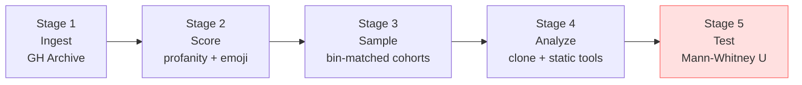
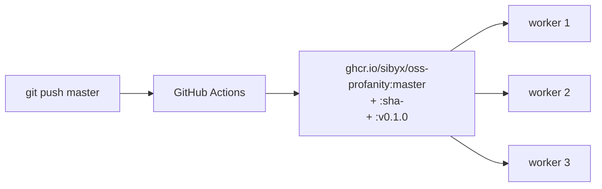

# Vulgarizmy, otvorený kód a jeho kvalita

<div class="mt-4 text-xl opacity-80">
  Profanity, open-source code, and its quality
</div>

<div class="mt-2 text-base opacity-60">
  A serious answer to a silly question
</div>

<div class="abs-bl m-8">
  
</div>

<div class="abs-br m-8 text-sm opacity-40">
  Jakub Dubec · OpenCamp · 2026-04-25
</div>

<!--
Hello. This talk is 60 minutes about a question that sounds like a joke
but turned into 3 months of rigorous software: do programmers who swear
write better code? I'll tell you what I built, what I found, and what
I did not find yet. Pragmatic, academic, occasionally funny. Let's go.
-->

---

# The stereotype

> **"NVIDIA, fuck you!"**
>
> — Linus Torvalds, LKML, 17 June 2012

<v-click>

Linus on the kernel mailing list, middle finger on camera, rejecting
NVIDIA's out-of-tree driver approach. Public record. Now a meme.

</v-click>

<v-click>

Programmers have opinions. They put them in writing. Sometimes in
`git commit -m`.

</v-click>

<!--
The Linus moment is the canonical public artifact of the
"programmers-who-swear" stereotype. It's real, it's citable, it's the
anchor for the rest of the talk. We're not debating whether programmers
swear — they do. The question is whether it correlates with anything
measurable.
-->

---

# The 2015 internet moment

Remember this one?

<v-clicks>

- Reddit / HackerNoon thread, circa 2015
- One developer ran a script over a tiny sample
- Concluded: "code with profanity has fewer bugs"
- 40 000 upvotes. Zero methodology. One chart.
- Became internet folklore.

</v-clicks>

<v-click>

> So: is it **true**? Nobody ever went back and checked properly.

</v-click>

<!--
Most people in this room remember the post. It's fun folklore, but as
research it was one person grepping their own projects. No matched
cohorts, no statistical test, no hypothesis registration. If that HN
thread were a research paper, no reviewer would send it back for
revisions — they'd reject it outright. So: let's actually do the work.
-->

---
layout: center
---

# The question

<div class="text-3xl font-semibold mt-8 leading-snug">
Is there a statistically significant correlation between
<span style="color: #00A9E0">profanity</span> in commits / code and
<span style="color: #00A9E0">measurable code quality</span>?
</div>

<!--
Big type, single beat. This is the research question. Not "do
programmers swear" (trivially yes) and not "does swearing make better
programmers" (untestable without a mind-reading experiment). The
question that CAN be answered: is there a statistical relationship
between a text-level signal (profanity frequency) and a tool-level
signal (ruff/eslint/lizard quality metrics)?
-->

---
layout: center
---

# The answer

<div class="text-3xl font-semibold mt-8">
I don't know yet.
</div>

<v-click>

<div class="text-xl mt-6 opacity-80">
But I built a pipeline that <strong>will</strong>.
</div>

</v-click>

<v-click>

<div class="mt-8 text-base opacity-60">
And that pipeline is the interesting part.
</div>

</v-click>

<!--
Own the joke upfront. The audience came for a punchline; they're
getting methodology. If I pretend to have the p-value already, some
grad student will corner me at the coffee break and catch me out. So:
be honest, be self-aware, move on. The rest of the talk is the build,
the measurement, the descriptive stats, and the epistemics.
-->

---

# Today's agenda

<v-clicks>

1. **Prior art** — what has been studied, what hasn't
2. **Methodology** — the four-stage pipeline, in detail
3. **Tech stack** — how it's built, what's boring, what's clever
4. **Results so far** — the descriptive stats from 3.7 million repos
5. **AI & the future** — what Copilot might do to commit messages
6. **Q & A** — and the reading list

</v-clicks>

<!--
Seven acts total if you count the title; six after the hook. Pacing:
methodology and results each get 15 minutes; the AI act is a short
5-minute speculation; Q&A closes. Watch the clock on methodology — it's
the dense one.
-->

---
layout: section
---

# Prior art

*The research gap this talk lives in*

---

# What has been studied

<v-clicks>

- **Guzman & Azócar (MSR 2014)** — commit-message sentiment analysis
- **Miller et al. (ICSE 2022)** — toxicity in OSS communication
- Various — profanity in chat, issues, code review
- **GitHub's own data science posts** — top emoji, top repos
- Sadly-many — "top 10 worst commit messages" blog posts

</v-clicks>

<!--
There's real work on sentiment and toxicity in OSS. Guzman/Azócar's
paper is the methodological grandparent of what I'm doing — they
mined GitHub commit messages for sentiment. Miller et al. 2022 looked
at toxicity specifically. Neither asked "does this correlate with code
quality metrics at scale?" That's the gap.
-->

---

# What has NOT been studied rigorously

<v-clicks>

- Profanity vs. **code-quality metrics** at scale
- **Matched cohorts** — profane vs. clean, same commit activity
- **Multiple quality dimensions** — ruff, eslint, lizard, jscpd
- **AST-level** signal — profanity in *identifiers*, not just messages
- **Reproducible pipeline** — someone else can re-run my numbers

</v-clicks>

<v-click>

> The gap isn't "nobody thought of it." It's "nobody did it properly."

</v-click>

<!--
The list is short, specific, and falsifiable. If anyone knows a paper
that does this rigorously — please tell me at the break. I'll gladly
cite it. The closest approaches I found either hit one quality metric
or use an un-matched cohort. The matched-cohort + multi-metric +
reproducible combo is where this work sits.
-->

---

# The hypothesis

<div class="grid grid-cols-2 gap-6 mt-6">
<div>

**H₀** — *null*

No difference in `code_analysis` distributions between the
profane cohort and the clean cohort.

</div>

<div>

**H₁** — *alternative*

A difference exists, in at least one quality dimension.

</div>
</div>

<v-click>

<div class="mt-6">

Test: **Mann-Whitney U**, two-sided. Non-parametric — we don't assume
the `ruff_issues_per_kloc` distribution is normal (it isn't).

</div>

</v-click>

<v-click>

Effect size: **rank-biserial correlation**.

</v-click>

<!--
Non-parametric is the right choice here. Code-quality metrics are
famously heavy-tailed — one monorepo with 200k LOC and 5000 ruff
issues drags any mean analysis into the weeds. Rank-based tests don't
care about distribution shape, only about ordering. Mann-Whitney U is
the standard tool; rank-biserial gives us effect-size so "statistically
significant but trivial" doesn't slip past.
-->

---

# Why GH Archive?

<div class="grid grid-cols-2 gap-6">
<div>

**What it is**

- Every public GitHub event
- Hourly `.json.gz` dumps
- Free, unauthenticated HTTPS
- Lineage back to 2011

</div>

<div>

**Why 2020-06**

- **Mature** repos — we see them today with 4+ years of commits
- **Pre-Copilot** — humans wrote these commits, not LLMs
- **One month** = 744 files = manageable batch

</div>
</div>

<v-click>

Downside: 34% of the 2020 repos were gone from GitHub by 2026 —
renamed, privated, deleted. We'll handle that in Stage 3.

</v-click>

<!--
GH Archive is gwern-tier infrastructure. Free, stable, well-documented,
archive.org-mirrored. Choosing June 2020 is deliberate: we wanted
repos mature enough to have code-quality signals (not "day-old empty
scaffold") but pre-LLM (so the signal is human, not GPT). The 34%
attrition surprised me — I'll talk about that in Stage 3.
-->

---
layout: section
---

# Methodology

*15 minutes — the dense act*

---

# Pipeline overview



<v-click>

Five stages. The first four are shipped. The fifth is running right
now; results land next month.

</v-click>

<!--
The picture is the whole talk in one slide. Every subsequent
methodology slide zooms in on one box. Stage 5 is the only one not
yet done — that's the Mann-Whitney U + plotting pipeline. I'll
explicitly flag that again on the "what's NOT in this deck" slide in
Act V.
-->

---

# Stage 1 · GH Archive ingest

<v-clicks>

- **744 files** — every hour of June 2020
- `~50 GB` compressed, streamed through Python
- Filter: `PushEvent` only (drops issues, stars, forks)
- Flatten: one row per *commit*, not per event
- Deduplicate: identical commit SHA across multiple events
- Drop bots: `BOT_REGEX` matches dependabot, renovate, greenkeeper, GitHub Actions

</v-clicks>

<v-click>

Output: `~49 M` commit-level rows aggregated per repo.

</v-click>

<!--
Streaming is the key word. At 50 GB compressed, naive "download all,
then process" would need ~200 GB disk and a day of wait. Streaming
lets us process each hourly file as it arrives and discard the raw
bytes. The bot filter is aggressive but leaky — we'll see in the
Results act that 🤖 is the #3 most-common emoji, because humans
copy bot-style conventions.
-->

---

# Stage 2a · Profanity scoring

<v-clicks>

- **[LDNOOBW](https://github.com/LDNOOBW/List-of-Dirty-Naughty-Obscene-and-Otherwise-Bad-Words)** — List of Dirty, Naughty, Obscene and Otherwise Bad Words
- Shopify's open dataset, ~2 500 English terms
- Word-boundary match — not substring
- Language guard via [lingua-rs](https://github.com/pemistahl/lingua-rs) — only score English commits
- Per-repo counters: `profanity_hits`, `profanity_rate`, top-N word histogram

</v-clicks>

<v-click>

<div class="fiit-callout-info mt-4">
Why a dictionary, not ML? Reproducibility (Shopify pins the list), explainability (you can look up every match), and speed (49 M messages in ~5 h on one host).
</div>

</v-click>

<!--
LDNOOBW is the canonical "bad words" list in the open-source world.
Shopify maintains it, multiple languages, versioned. A neural model
would give me slightly better recall but lose reproducibility — a
year from now the model weights would be different and my numbers
would be non-replayable. Word-boundary + lingua guards against the
"xxx in hex strings" false-positive cluster we'll see in results.
-->

---

# Stage 2b · Emoji scoring

<v-clicks>

- **Unicode CLDR** via the `emoji` Python package
- **Grapheme-cluster** aware — `👨‍👩‍👧` is ONE emoji, not three
- **ZWJ-joiner** aware — "man + woman + girl" joined by U+200D
- Per-repo counters: `emoji_hits`, `emoji_rate`, top-20 emoji

</v-clicks>

<v-click>

<div class="fiit-callout mt-4">
<code>len("👨‍👩‍👧")</code> is <strong>8</strong> in Python. Using <code>len()</code> for emoji counting is one of the top sources of off-by-N bugs in text pipelines.
</div>

</v-click>

<!--
Unicode is where naive text processing goes to die. A "family" emoji
is visually one glyph but 8 code points (or more). The `emoji` package
handles the grammar correctly. CLDR is the authoritative source for
"what counts as an emoji" — you don't want to write that logic
yourself. Trust me.
-->

---

# Stage 3 · Cohort sampling

<v-clicks>

- **Cohort A — profane**: top 750 by `profanity_rate desc`
- **Cohort B — clean**: `profanity_hits == 0`, sampled per bin
- **Bins** (commit-count): `[20, 50)  [50, 200)  [200, 1000)  [1000, ∞)`
- Clean cohort **matches** profane's bin distribution

</v-clicks>

<v-click>

<div class="fiit-callout-info mt-4">
Why bin-matching? Without it, big projects would dominate cohort A (more commits = more chances to swear), and the clean cohort would be biased toward tiny repos. We'd be measuring project size, not profanity.
</div>

</v-click>

<!--
Stratified matching is the single most important methodology choice
in this pipeline. A naive "all profane vs. all clean" comparison would
be confounded by repo size, language, activity, whatever. By matching
on commit count, we're asking: "given two repos of similar activity,
does the profane one have different quality?" That's the comparison
that can answer the question.
-->

---

# Stage 3 · The top-up story

When the cohort was probed against GitHub — surprise:

<v-clicks>

- **509 / 1 500 repos were GONE** — 34% attrition
- Deleted, renamed, privated, transferred
- 2020 was a long time ago in GitHub years

</v-clicks>

<v-click>

<div class="mt-6">

Fix: `python -m oss_profanity.sampling --top-up`
</div>

- Demotes probe-404 rows to `status="missing"`
- Redraws the shortfall from the unused pool
- Back to 1 500 live. 1.7% residual 404s.

</v-click>

<!--
SKIPPABLE IF SHORT ON TIME — this slide is a good "data-hygiene
lessons" story but the hypothesis test doesn't depend on it. If we're
running tight, jump to Stage 4. Worth saying: the top-up's bias
effect is that we draw the #751..#1019 most-profane repos on the
second pass, so average rate drifts down slightly — documented in
IP-006's methodology appendix.
-->

---

# Stage 4 · Repo worker

<v-clicks>

- **36 concurrent repos** — 3 hosts × 12 processes
- `multiprocessing.Pool` per host, not Celery, not Airflow
- **MongoDB CAS** is the queue primitive
- Partial clone, resolve SHA < 2020-07-01, checkout, analyze, write back

</v-clicks>

<v-click>

<div class="fiit-callout-info mt-4">
One <code>find_one_and_update</code> per claim. Mongo serialises per-document updates, so 36 concurrent claims hand out 36 distinct documents. No Redis, no lock manager.
</div>

</v-click>

<!--
This is the "boring is a feature" moment. We had Redis on the plan;
we deleted Redis from the plan. The CAS primitive on the document
collection IS the queue. It scales perfectly for our workload — 36
claims per second max, Mongo barely notices.
-->

---

# Stage 4 · Static analyzers (5 tools)

<v-clicks>

- **`ruff` 0.15** — Python lints (bug-class + style)
- **`bandit` 1.9** — Python security
- **`eslint` 10 (flat config)** — JS/TS lints
- **`lizard` 1.17** — cyclomatic complexity, 18 languages
- **`jscpd` 4** — clone detection across JS / TS / HTML / CSS

</v-clicks>

<v-click>

Each tool answers a different question. We do not combine their
scores into one "quality number" — that's where snake-oil lives.

</v-click>

<!--
SKIPPABLE IF SHORT — detail slide. The key takeaway: different tools,
different questions, kept separate in the data. If anyone asks "why
not SonarCube / CodeClimate / Codacy" — those are vendor tools,
black-box, versioned outside our control. For reproducibility we
needed self-hosted pinned versions. That rules out the SaaS cluster.
-->

---

# Stage 4 · AST-level source scan

<div class="grid grid-cols-2 gap-4">
<div>

**Regex approach — WRONG**

```javascript
const url = "https://a.com/x";   // real
const fake = "// not a comment";
```

Regex `//.*$` matches *both* `//`s. The second is inside a string
literal.

</div>

<div>

**Tree-sitter — RIGHT**

```text
parse_string(lang, src)
  → tree.find_nodes_by_type("comment")
  → only the real // comment
```

40 language grammars, one API,
one pinned version.

</div>
</div>

<v-click>

<div class="mt-4">

Same logic for identifiers: comments + identifier names get profanity
and emoji scanned separately. A `def fuck_it()` would score on
identifiers, not comments.

</div>

</v-click>

<!--
This is the "clever bit" slide. Regex for code parsing works until it
doesn't — and it doesn't in the pathological cases that dominate at
49 M rows of scale. Tree-sitter solves it properly. The Rust/PyO3
binding is fast (parses a typical source file in microseconds).
-->

---

# Stage 5 · Statistical test

<v-clicks>

- **Mann-Whitney U**, two-sided
- Per quality dimension, six tests total:
  - `ruff_issues_per_kloc`, `eslint_issues_per_kloc`
  - `lizard_avg_ccn`, `lizard_max_ccn`
  - `jscpd_clones_per_kloc`, `comment_density`
- **Bonferroni correction** for multiple comparisons (α = 0.05 / 6)
- Effect size: rank-biserial correlation

</v-clicks>

<v-click>

<div class="fiit-callout mt-4">
This is what IP-008 ships. It's running on the faculty hosts right now — Mann-Whitney numbers were NOT ready in time for this talk.
</div>

</v-click>

<!--
The honest-note slide. Stage 5 is the last piece. It's a few hundred
lines of Python with scipy and matplotlib; the work already done by
Stage 4 makes it a one-evening job once the cohort is drained. I
just can't stand here today and tell you the p-value. Next talk. I'll
come back for the follow-up — that's a promise.
-->

---

# Reproducibility claim

Every pinned tool, every pinned version, one image SHA:

<div class="grid grid-cols-2 gap-4 mt-4 text-sm">

<div>

**Python side**

- Python 3.14
- `tree-sitter-language-pack==1.6.2`
- `ruff==0.15.12`
- `bandit==1.9.4`
- `lizard==1.17.25`
- `lingua==2.2`
- `emoji>=2.15`

</div>

<div>

**Node side**

- `eslint@10.2.1`
- `@eslint/js@10.0.1`
- `typescript-eslint@8.59.0`
- `jscpd@4.0.9`

</div>

</div>

<v-click>

<div class="mt-4">

Image tag: `ghcr.io/sibyx/oss-profanity:sha-<...>`. Re-run on 2032-01-01
— byte-identical results.

</div>

</v-click>

<!--
Reproducibility isn't a nice-to-have for this project; it's the
difference between "interesting paper" and "curiosity." Every tool is
pinned, the image SHA is captured, the GH Archive slice is frozen in
time (it's archival data by definition). If the paper lands in a
journal, a reviewer can literally re-run the numbers.
-->

---

# Limitations we know about

<v-clicks>

- **LDNOOBW is English-centric** — misses Slovak, Czech, Russian swearing
- **Short commit messages are noisy** — one `fuck` in 3 commits ≠ culture
- **Forks inherit parent's history** — we don't (yet) deduplicate forked commits
- **Sample frame is 2020** — won't generalise to post-Copilot code
- **Quality metrics are imperfect proxies** — `ruff_issues` ≠ "bad code"

</v-clicks>

<!--
Name the limits BEFORE the results. It's cheap and it earns trust.
The English-only caveat is the biggest one — the dataset certainly
contains Slovak and Czech commit messages, and our dictionary misses
them entirely. If someone asks about Slovak profanity in Q&A, the
answer is: future work, yes, happy to collaborate.
-->

---

# Ethics

<div class="text-lg">

<v-clicks>

- Scored at the **repository** level, never the author
- No `commits[].author` values in this deck
- Top-N words shown in aggregate across 3.7 M repos
- Commit-message quotes: **hand-picked, grandma-filtered, no attribution**

</v-clicks>

</div>

<v-click>

<div class="mt-6 fiit-callout-info">
The point is never to embarrass an individual. The point is whether
the signal, in aggregate, correlates with anything measurable.
</div>

</v-click>

<!--
Dead serious slide. Research on public data still has ethical weight.
Anyone could grep for the "worst commits" list and go punch down. That
would destroy the academic value of the work. So: aggregate only,
anonymised quotes, repository-level only. If the paper becomes
popular, someone will ask for the list of "the most profane repos" —
the answer is no.
-->

---

# With all that, here's the stack

<div class="text-base opacity-60 mt-4">
Tech act — 10 minutes. Engineers, this is for you.
</div>

<!--
Transitional slide. The methodology is done; now we shift into the
build. Audience break. Optional 15-second pause for questions "so
far" — but keep it tight or we lose the budget.
-->

---
layout: section
---

# Tech stack

*10 minutes — boring is a feature*

---

# The stack at a glance

<v-clicks>

- **Python 3.14** — everything ingest + analysis
- **MongoDB 7** — one collection, 3.7 M documents, 1.3 GB on disk
- **Docker + Compose** — one image, four role profiles
- **GitHub Actions → GHCR** — every push publishes an image
- **Tree-sitter + LDNOOBW + lingua + `emoji`** — the detection libs

</v-clicks>

<v-click>

<div class="mt-6 opacity-70">
What's NOT here: Redis, Kafka, Airflow, Celery, Kubernetes, a vector DB.
</div>

</v-click>

<!--
Deliberately boring. Every additional component has a maintenance
cost and a debuggability cost. The minimum stack that does the job is
the best stack. If we ever scale to 100 M repos or go real-time, the
picture changes. For now: the less moving parts, the less to debug
at midnight.
-->

---

# Why MongoDB

<v-clicks>

- **Document-per-repo** is the natural shape
- `$group` does 90 % of what we need for stats
- `find_one_and_update` gives us atomic **CAS** for free
- No migrations — add a field, write it, query it
- `extra="allow"` in our Pydantic models absorbs GitHub API drift

</v-clicks>

<v-click>

<div class="fiit-callout-info mt-4">
We planned Redis as a work queue. We deleted Redis from the plan. Mongo's CAS on one document IS the queue.
</div>

</v-click>

<!--
The Mongo choice gets pushback from database-traditionalists. Fair.
For THIS workload — append-heavy writes, document-shaped data,
compare-and-set as the only concurrency primitive — Mongo fits like a
glove. A proper RDBMS would also work; the point is that we never
hit the joins / transactions / referential-integrity problems that
usually push people toward Postgres.
-->

---

# Pydantic schema

```python
class Repo(BaseModel):
    model_config = ConfigDict(extra="allow", populate_by_name=True)

    id: int = Field(alias="_id")
    full_name: str
    first_seen_at: datetime
    commit_stats: CommitStats
    status: Status = "seen"
    cohort: Cohort | None = None
    code_analysis: CodeAnalysis | None = None
    github_metadata: GitHubMetadata | None = None
```

<v-click>

<div class="mt-4">

One source of truth between Python and Mongo. `extra="allow"` is the
"GitHub added a new field" escape hatch.

</div>

</v-click>

<!--
Pydantic validates at the boundary and gives us type hints all the way
down. `extra="allow"` is crucial for this project — GitHub's REST API
changes shape every few months and we'd rather absorb new fields than
break on deploy. If a field becomes load-bearing, we add it to the
model; otherwise it rides along as unstructured data.
-->

---

# Parallelism without tears

<div class="grid grid-cols-2 gap-4">
<div>

**The claim**

```python
doc = db.repos.find_one_and_update(
    {"status": "pending"},
    {"$set": {"status": "claimed",
              "claimed_by": worker_id,
              "claimed_at": now()}},
    sort=[("commit_stats.profanity_rate", -1)],
    return_document=AFTER,
)
```

</div>

<div>

**The guarantee**

- Atomic per document
- Concurrent callers get distinct documents
- Failure mode: `None` → sleep + retry

</div>
</div>

<v-click>

36 concurrent workers, no lock manager, no duplicate claims. Ever.

</v-click>

<!--
This is the slide engineers in the audience nerd out over. It's 10
lines of code that replaces an entire Celery deployment. Mongo's
per-document atomicity does the heavy lifting. We don't need a
broker, we don't need acks, we don't need dead-letter queues. The
primitive IS the queue.
-->

---

# The stale-claim reaper

<v-clicks>

- Worker claims a repo, then dies (segfault, OOM, network partition)
- Claim sits at `status="claimed"` with `claimed_by` + `claimed_at`
- Any live worker's `reclaim_stale()`:

```python
update_many(
  {"status": "claimed",
   "claimed_at": {"$lt": now() - 20min}},
  {"$set": {"status": "pending"},
   "$unset": {"claimed_by": "", "claimed_at": ""}})
```

- Stale claim → `pending` → next free worker picks it up

</v-clicks>

<v-click>

No work lost. No work duplicated. One `update_many`.

</v-click>

<!--
Fault tolerance as a dozen lines of code. The magic number is 20
minutes (`STALE_CLAIM_TTL_MIN`). It needs to be bigger than the
per-repo timeout (10 min) so we never reclaim a slow-but-alive
worker. If a host reboots mid-run, this cleans up after it.
-->

---

# Docker everywhere

<v-clicks>

- **One Dockerfile** — ingest, sampling, worker, assertions all share it
- **Role-based profiles** — `docker compose --profile ingest run ingest`
- **Same image, different entrypoints** — less drift between test and prod
- Faculty hosts pull `ghcr.io/sibyx/oss-profanity:master`
- Laptop builds the same image locally (M1 Max — see `docs/deploy/local`)

</v-clicks>

<!--
"Same bits everywhere" is the IP-009 + IP-010 story condensed. The
smoke test that gates merges uses the exact image that drains the
1,500-repo cohort. If it's green on your laptop, it's green on the
faculty. That's the Docker promise — we just leaned all the way in.
-->

---

# GHA → GHCR



<v-click>

<div class="mt-4">

Rollback = `git revert + git push + docker compose pull && up -d`.
No bespoke tooling.

</div>

</v-click>

<!--
Content-addressed deploy is one of the most valuable things you can
do for a small project. GHCR is free for public packages, integrated
with Actions, and operator-facing pulls are unauthenticated. The SHA
tag is what the paper's "Reproducibility" section cites.
-->

---

# Testing

<div class="grid grid-cols-3 gap-4 mt-4">

<div class="stat-big">
  <div class="value">292</div>
  <div class="label">tests passing</div>
</div>

<div class="stat-big">
  <div class="value">17</div>
  <div class="label">modules mypy --strict</div>
</div>

<div class="stat-big">
  <div class="value">0</div>
  <div class="label">broken builds on master</div>
</div>

</div>

<v-click>

<div class="mt-6">

Integration tests hit a throwaway Mongo via `clean_db` fixture.
Smoke test `./scripts/smoke.sh` green-gates every merge.

</div>

</v-click>

<!--
The paper needs numbers; the numbers need the tests. If an aggregation
is off by a factor of 10, the p-value is meaningless. Test coverage
isn't the point — test *correctness* is. Every Mongo aggregation has
at least one fixture test that validates its output shape.
-->

---

# "Boring" is a feature

<v-clicks>

- No Kafka
- No Airflow
- No Kubernetes
- No Celery
- No service mesh
- No vector DB

</v-clicks>

<v-click>

<div class="mt-6 text-xl">

The boring scaffolding buys us the freedom to ask the <strong>interesting</strong> question.

</div>

</v-click>

<!--
Resist the temptation to over-engineer research infrastructure. Every
component you add is a component you have to debug at midnight two
days before the conference. The goal is answering the question, not
showing off the toolchain. Boring = reliable = more time for the
actual research.
-->

---
layout: section
---

# Results so far

*15 minutes — the numbers*

---

# Ingest by the numbers

<div class="grid grid-cols-2 gap-4 mt-6">

<div class="stat-big">
  <div class="value">3,702,633</div>
  <div class="label">repos seen</div>
</div>

<div class="stat-big">
  <div class="value">~49 M</div>
  <div class="label">commits scored</div>
</div>

<div class="stat-big">
  <div class="value">744</div>
  <div class="label">hourly files parsed</div>
</div>

<div class="stat-big">
  <div class="value">~50 GB</div>
  <div class="label">compressed throughput</div>
</div>

</div>

<v-click>

<div class="text-center mt-6 text-sm opacity-60">
June 2020 — 30 days × 24 hours — one GH Archive slice
</div>

</v-click>

<!--
Four big numbers. The 3.7 M repos number always surprises people — GH
Archive captures everything public, including tiny one-commit
experiments. Of those 3.7 M, only ~700 k hit our minimum-activity
floor of 20 commits in-window. The cohort (1,500 repos) is drawn from
that filtered subset.
-->

---

# Profanity prevalence

<div class="mt-8 text-center">

<div class="text-5xl font-bold text-[#00A9E0]">0.08 %</div>

<div class="text-lg mt-4 opacity-80">
of commit messages contain at least one LDNOOBW match
</div>

</div>

<v-click>

<div class="mt-6 text-center opacity-60">

38 468 profane commits out of ~49 M total

</div>

</v-click>

<v-click>

<div class="fiit-callout mt-6">
The audience expected more. So did I. Turns out <strong>professional
software developers are professionally polite in public Git</strong> —
at least in English.
</div>

</v-click>

<!--
This was the first genuinely surprising number for me. If you'd asked
me "what fraction of commits contain profanity" I would have said
5-10%. The answer is 80× lower. Public-facing Git history is more
polite than you'd think. Which means the signal we ARE seeing is
concentrated — the repos that swear really swear a lot.
-->

---

# Emoji prevalence

<div class="mt-8 text-center">

<div class="text-5xl font-bold text-[#00A9E0]">0.49 %</div>

<div class="text-lg mt-4 opacity-80">
of commit messages contain at least one emoji
</div>

</div>

<v-click>

<div class="mt-6 text-center">

239 253 emoji commits — <strong>6× more than profanity</strong>

</div>

</v-click>

<v-click>

<div class="fiit-callout-info mt-6">
Developers emoji more than they swear. Probably because 🚀 is a commit
convention now, whereas "fuck" is still a personal choice.
</div>

</v-click>

<!--
The 6× factor is my second favorite finding. Emoji entered the
commit-message mainstream via conventional-commits, semantic-release,
and gitmoji. "I shipped this" became 🚀; "I fixed a bug" became 🐛.
Conventions propagate through ecosystems faster than individual
expression. Which is also why the AI act at the end predicts
emoji-per-commit stays flat or rises even as profanity declines.
-->

---

# Top profanity words

<div class="mt-4 text-sm">

<div class="bar-row"><div class="label">xxx</div><div class="bar" style="width: 100%"></div><div class="count">5 619</div></div>
<div class="bar-row"><div class="label">shit</div><div class="bar" style="width: 92%"></div><div class="count">5 176</div></div>
<div class="bar-row"><div class="label">xx</div><div class="bar" style="width: 72%"></div><div class="count">4 061</div></div>
<div class="bar-row"><div class="label">fuck</div><div class="bar" style="width: 66%"></div><div class="count">3 706</div></div>
<div class="bar-row"><div class="label">ass</div><div class="bar" style="width: 65%"></div><div class="count">3 663</div></div>
<div class="bar-row"><div class="label">fucking</div><div class="bar" style="width: 37%"></div><div class="count">2 091</div></div>
<div class="bar-row"><div class="label">sex</div><div class="bar" style="width: 19%"></div><div class="count">1 071</div></div>
<div class="bar-row"><div class="label">sucks</div><div class="bar" style="width: 13%"></div><div class="count">747</div></div>
<div class="bar-row"><div class="label">rape</div><div class="bar" style="width: 11%"></div><div class="count">605</div></div>
<div class="bar-row"><div class="label">guro</div><div class="bar" style="width: 10%"></div><div class="count">573</div></div>

</div>

<v-click>

<div class="fiit-callout mt-4">
Wait — <code>xxx</code>? <code>xx</code>? Those aren't profanity. Those are <code>xxx-placeholder</code>, hex strings, version stubs. LDNOOBW matches the substring inside longer tokens.
</div>

</v-click>

<!--
The `xxx` and `xx` at the top are a methodology footnote. LDNOOBW
has "xxx" because it's slang for adult content, but in code it's 10×
more common as a placeholder. This is the "your detector finds things
that are not what you think" lesson. For the Mann-Whitney test we'll
either strip these or annotate them as "known false-positive cluster."
-->

---

# The NSFW subgenre

Down the top-30 list…

<v-clicks>

- `porn`, `sex`, `sexy`, `sexual`
- `vibrator`, `genitals`, `hentai`, `guro`
- `hardcore`, `cum`, `anal`, `dick`, `bitch`

</v-clicks>

<v-click>

<div class="fiit-callout mt-6">
There is a <strong>cottage industry of NSFW codebases on GitHub</strong>.
We did not plan for this. It's a methodology footnote and an
unexpected sampling challenge — in the cohort, they'll be
over-represented in cohort A unless we filter.
</div>

</v-click>

<!--
Genuinely didn't see this coming at design time. Adult-content repos
(fanfic tooling, adult-game mods, "toys" libraries) are a real
subgenre on GitHub and they're scored as maximally-profane by LDNOOBW.
For IP-008 we'll look at whether they skew results and consider either
(a) a topic-filter to exclude them, or (b) reporting the analysis with
and without. Either is a defensible choice; both need to be declared
in advance.
-->

---

# Top emoji

<div class="mt-4 text-sm">

<div class="bar-row"><div class="label">🚀</div><div class="bar" style="width: 100%"></div><div class="count">19 161</div></div>
<div class="bar-row"><div class="label">🐛</div><div class="bar" style="width: 50%"></div><div class="count">9 627</div></div>
<div class="bar-row"><div class="label">🤖</div><div class="bar" style="width: 50%"></div><div class="count">9 581</div></div>
<div class="bar-row"><div class="label">✨</div><div class="bar" style="width: 48%"></div><div class="count">9 249</div></div>
<div class="bar-row"><div class="label">🎩</div><div class="bar" style="width: 40%"></div><div class="count">7 779</div></div>
<div class="bar-row"><div class="label">⬆</div><div class="bar" style="width: 34%"></div><div class="count">6 627</div></div>
<div class="bar-row"><div class="label">❤</div><div class="bar" style="width: 34%"></div><div class="count">6 621</div></div>
<div class="bar-row"><div class="label">🎸</div><div class="bar" style="width: 23%"></div><div class="count">4 578</div></div>
<div class="bar-row"><div class="label">🎨</div><div class="bar" style="width: 21%"></div><div class="count">4 081</div></div>
<div class="bar-row"><div class="label">📝</div><div class="bar" style="width: 17%"></div><div class="count">3 378</div></div>

</div>

<!--
The emoji distribution is more concentrated than profanity — 🚀 alone
is ~40% of the top-10. Next three slides unpack the meaning of the
leaders. The short version: emoji in commits is almost entirely
conventional (release, bugfix, feature) rather than expressive.
-->

---

# 🚀 — the king of commits

<div class="text-center mt-8">

<div class="text-8xl">🚀</div>

<div class="text-3xl mt-4 font-semibold">19 161 commits</div>

<div class="mt-4 opacity-70">
Twice the next contender. The universal "ship it" glyph.
</div>

</div>

<v-click>

<div class="mt-6 text-center opacity-60">
Also: semantic-release, conventional-commits, "first release", "deploy to prod."
</div>

</v-click>

<!--
🚀 is the most commercialised emoji in open source. gitmoji.dev has
it listed as "ship new features." A generation of release automation
tools emit it by default. It's barely "expression" at this point — it's
more like punctuation for a specific event type.
-->

---

# 🤖 — the bot uprising

<div class="grid grid-cols-2 gap-6 mt-6">

<div>

**Expected**: 🤖 represents bot commits. Our `BOT_REGEX` should have
filtered them.

</div>

<div>

**Reality**: 🤖 is the **#3 most common emoji**. 9 581 commits.

</div>

</div>

<v-click>

<div class="mt-6">

Why? `BOT_REGEX` matches the **author name**. It doesn't filter
human authors who write `🤖 build(deps): bump ...` in the conventional
style bots taught them.

</div>

</v-click>

<v-click>

<div class="fiit-callout mt-6">
Methodology refinement for IP-008: strip <code>🤖</code>-prefixed messages before aggregating — or keep them as a separate "bot-adjacent" category.
</div>

</v-click>

<!--
Loved discovering this one. It's genuinely hard to filter bots when
humans imitate bot conventions. The `BOT_REGEX` is doing what it was
told — matching dependabot, renovate, greenkeeper etc as *authors* —
but not catching humans who've adopted the 🤖 prefix. A good reminder
that filters are always leaky and need validation at the output.
-->

---

# 🎩 and 🎸 — the Angular effect

<v-clicks>

- **🎩** — 7 779 commits. `angular/commit-message-convention` uses it for "hat tip."
- **🎸** — 4 578 commits. Not emotion. Code-style / formatting changes in the Angular style guide.
- The 🎸 count is **essentially one convention propagating through an ecosystem**.

</v-clicks>

<v-click>

<div class="mt-6 opacity-70">
Emoji in commits is ecosystem-level norms, not individual expression.
Gitmoji and friends made sure of that.
</div>

</v-click>

<!--
Most people don't know what 🎸 "means" in a commit. They know because
they adopted Angular's convention and then propagated it to the rest
of their stack. One style guide, thousands of commits. That's how
conventions spread.
-->

---

# Matched cohort composition

<v-clicks>

- **1 500 repos live** after top-up (2 × 750 bin-matched)
- **27.9 % Python + JS/TS** — eligible for ruff / eslint
- **67.5 % tree-sitter coverage** — eligible for source scan
- **1.7 % 404 attrition** — repos that died between sample and probe

</v-clicks>

<v-click>

<div class="fiit-callout-info mt-4">
For the paper: ruff/eslint numbers will cite the 418-repo Python+JS/TS
subset; the full 1 013-repo tree-sitter result covers the primary
emoji/profanity source-scan hypothesis.
</div>

</v-click>

<!--
Honest subset reporting. You don't have to pretend you have 1,500
Python repos when you have 107. The matched design still holds —
within Python, the profane vs. clean split is bin-matched. We just
can't generalise to languages where ruff doesn't apply.
-->

---

# A few commit quotes

<div class="space-y-4 mt-6">

<div class="commit-msg">fuck mono</div>

<div class="commit-msg">i fucking hate git sometimes</div>

<div class="commit-msg">Fuck emojis.  You heard me.</div>

</div>

<v-click>

<div class="mt-6 opacity-60 text-sm">
Hand-picked from the 50-row sample · no repo or author attribution · grandma-approved
</div>

</v-click>

<!--
Three. One about a build tool (every dev has had this fight). One about
git (universal). One about emoji, which is a meta-callback to the
previous slide set — the audience laughs at themselves for counting 🚀
and then reading "fuck emojis." Hand-picked, no attribution. If anyone
asks where they came from: GH Archive, June 2020, aggregated,
unattributed. I'm not going to name repos.
-->

---

# What Stage 4 writes back

```json
{
  "_id": 123456789,
  "status": "done",
  "primary_language": "python",
  "code_analysis": {
    "loc_total": 12843,
    "files_scanned": 87,
    "comment_profanity_hits": 4,
    "identifier_profanity_hits": 0,
    "comment_emoji_hits": 1,
    "identifier_emoji_hits": 0,
    "ruff_issues": 234,
    "ruff_issues_per_kloc": 18.22,
    "lizard_avg_ccn": 3.4,
    "lizard_max_ccn": 22
  }
}
```

<v-click>

<div class="mt-4">

This is the input to Stage 5. ~1 500 of these → 6 Mann-Whitney tests.

</div>

</v-click>

<!--
One document per repo. `code_analysis` is the structured payload
Stage 5 reads. Every field is a pre-computed quality dimension. The
Mann-Whitney test compares distributions of `ruff_issues_per_kloc`
etc. between the two cohorts. Six tests, Bonferroni-corrected.
-->

---

# Everything currently runs

<div class="mt-4 text-sm opacity-80">

```text
$ docker compose logs -f --tail 10 worker
worker-1  | 2026-04-24 18:03:12 INFO loop: claim repo 42981 (status→claimed)
worker-1  | 2026-04-24 18:03:18 INFO _processor: pipeline ok (repo=42981, lang=python, loc=8120, 6.2s)
worker-2  | 2026-04-24 18:03:19 INFO _processor: skip repo 42982 (archived)
worker-1  | 2026-04-24 18:03:24 INFO loop: claim repo 42983 (status→claimed)
worker-3  | 2026-04-24 18:03:25 INFO _processor: pipeline ok (repo=42983, lang=javascript, loc=23410, 5.8s)
```

</div>

<v-click>

<div class="mt-6 text-center">

Status: `claimed` hovering at 36 · `pending` ↓ · `done` ↑

</div>

</v-click>

<v-click>

<div class="mt-2 text-center opacity-70">
Eta: ~6 hours to drain · ~1 400 repos analysed · results next talk.
</div>

</v-click>

<!--
This is the "it's real" slide. Not a mock — this is what the log
looks like on a faculty host. In the speaker notes I'll reference
the four Mongo monitoring queries from `docs/DEPLOYMENT.md` but I
won't read them on-screen.
-->

---

# What's NOT in this deck

<v-clicks>

- **Mann-Whitney U statistic** — Stage 5 is running
- **Effect size** (rank-biserial correlation) — ditto
- **Per-language subgroup plots** — ditto
- **p-values** — ditto

</v-clicks>

<v-click>

<div class="fiit-callout mt-6">
These ship with the paper. Come back for the follow-up. I promise a
p-value next time.
</div>

</v-click>

<!--
Epistemic humility as a design decision. I'd rather leave gaps in the
deck than fabricate numbers. Anyone who shows p-values at this stage
of a research project is either lying or didn't do the matching
properly. Say what you have, say what you don't, move on.
-->

---

# The one-sentence finding (so far)

<div class="text-2xl mt-8 leading-relaxed">

<v-clicks>

- Profanity is <strong>rare</strong> — 0.08 % of commits.
- Emoji is <strong>6× more common</strong> — 0.49 %.
- Bots infiltrated commit conventions.
- The matched cohort is ready for <strong>inferential analysis</strong>.

</v-clicks>

</div>

<!--
Four beats. Descriptively, that's what we have. Inferentially, that's
what we'll have soon. Both sentences are honest.
-->

---
layout: section
---

# AI & the future

*5 minutes — speculation, clearly marked*

---

# The LLM question

<v-clicks>

- Copilot GA: mid-2022
- Cursor: 2023. Claude: 2024. Cody + ChatGPT Desktop: 2024.
- By 2026, an unknown-but-non-trivial fraction of commits are AI-assisted
- **AI assistants are rigorously polite.** They don't swear.

</v-clicks>

<v-click>

<div class="text-xl mt-6">

What happens to <strong>🚀</strong>, <strong>shit</strong>, and
<strong>🐛</strong> as human-drafted commits dilute with AI-drafted ones?

</div>

</v-click>

<!--
This is the speculative act. Everything here is pattern-matching
hypothesis, not measured fact. The 2020 window was chosen specifically
because it predates Copilot — so any LLM effect on our data is zero
by construction. The interesting question is what a 2024 or 2026
re-run would show.
-->

---

# Hypothesis 1 · Profanity declines

<v-clicks>

- Baseline swear-in-commit rate is human-driven (our 0.08 %)
- AI assistants produce sanitised text by default
- If x% of future commits are AI-drafted, the aggregate rate falls by ~x%
- The <strong>per-developer</strong> baseline probably also declines
  — once your workflow is "Copilot drafts, you edit," you edit out the
  `fix: this is horrible`

</v-clicks>

<v-click>

<div class="fiit-callout mt-6">
Testable prediction: mean profanity-per-commit declines monotonically
from 2022 onward.
</div>

</v-click>

<!--
Falsifiable prediction. Run the pipeline on 2022, 2023, 2024 windows
and plot. If the prediction is right, the line slopes down. If it's
wrong, we learn something more interesting — maybe humans swear MORE
around AI code ("why are you like this, Copilot").
-->

---

# Hypothesis 2 · Emoji convention survives

<v-clicks>

- 🚀, 🐛, ✨ are **ecosystem norms**, not individual expression
- AI autocomplete is **trained on the past** — it reinforces conventions
- Human using Copilot writes "fix" → Copilot suggests "fix: 🐛 ..."
- The conventional-commits style PROPAGATES faster, not slower

</v-clicks>

<v-click>

<div class="fiit-callout mt-6">
Testable prediction: emoji-per-commit stays flat or <strong>rises</strong>
2022 onward — especially the conventional-commit emoji set.
</div>

</v-click>

<!--
This is the counter-intuitive prediction. You'd think AI would smooth
out all personality, and it does — but convention ISN'T personality.
Convention is structure. LLMs are pattern-matchers par excellence, so
they reinforce structured patterns. Emoji commit conventions are
exactly the kind of pattern they'd amplify.
-->

---

# The longitudinal redo

<v-clicks>

- Same pipeline, three windows: **2020-06**, **2024-06**, **2026-06**
- GH Archive is window-agnostic — one env var flip: `GHA_START` / `GHA_END`
- Each window: ~5 h ingest + ~6 h Stage 4 + an afternoon of Stage 5
- Publishable year-over-year finding
- **IP-012** is this proposal, already drafted in my head

</v-clicks>

<!--
The pipeline is deliberately time-agnostic. Everything from Stage 1
to Stage 5 runs on whatever window you tell it. So the longitudinal
study is already within reach — it's just another run. That's the
upside of being boring: marginal experiments are cheap.
-->

---

# The meta-question

<div class="text-xl mt-8 leading-relaxed">

If AI assistants iron out the rough edges of code, do we
<strong>lose signal</strong>?

</div>

<v-click>

<div class="mt-6 opacity-80">
A grumpy <code>// this is horrible</code> comment is a canary for how
much of the <strong>author</strong> is still in the work.
</div>

</v-click>

<v-click>

<div class="mt-6 opacity-80">
When the comment disappears, so does a cultural marker.
</div>

</v-click>

<v-click>

<div class="mt-4 opacity-70 text-sm">
Not a bad outcome, not a good outcome — <em>a measurable outcome</em>.
</div>

</v-click>

<!--
End Act VI on the actually-interesting philosophical note. The joke
opening was "do swearing programmers write better code?" The end is
"does AI homogenise the cultural fingerprint of a codebase?" That's
the sneaky real question, and the pipeline we just walked through
can in principle answer it.
-->

---
layout: section
---

# Q & A

*5 minutes*

---
layout: center
class: text-center
---

# Thank you

<div class="text-lg opacity-70 mt-4">
Jakub Dubec · FIIT STU · <a href="https://github.com/Sibyx/oss-profanity">github.com/Sibyx/oss-profanity</a>
</div>

<div class="mt-6">
  
</div>

<div class="mt-10 text-sm opacity-50">
Slides at <code>presentation/opencamp/</code> in the repo. PDF export
committed pre-talk. CC-BY-SA.
</div>

<!--
Pause here for applause then hand over to Q&A. Anticipated questions
and one-line answers (keep in your head):

- "Slovak swearing?" — future work; LDNOOBW is English; happy to
  collaborate on a Slovak list.
- "Why not ML profanity detection?" — reproducibility; dictionary
  is pinnable.
- "Did you find anything?" — descriptively yes, inferentially wait for
  the paper.
- "Which language swears most?" — reserved for IP-008.
- "Is this funded?" — PhD programme at FIIT STU, self-directed.
- "Code / data available?" — yes, MIT-licensed, on GitHub.
- "Can I reproduce your numbers?" — yes, image SHA is in the deploy
  runbook.
- "AI tooling?" — used for scaffolding and code; acknowledge and move
  on, no dedicated slide.
-->

---

# Further reading

<div class="grid grid-cols-2 gap-x-8 gap-y-3 text-sm mt-4">

<div>

**Prior art**

- Guzman, E. & Azócar, D. (2014). *Sentiment analysis of commit
  comments in GitHub*. MSR.
- Miller, C. et al. (2022). *"Did you miss my comment or what?"*.
  ICSE.

</div>

<div>

**Tools I leaned on**

- [Tree-sitter](https://tree-sitter.github.io/) — 40-grammar AST parser
- [LDNOOBW](https://github.com/LDNOOBW) — Shopify's bad-words list
- [lingua-rs](https://github.com/pemistahl/lingua-rs) — language detection
- [`emoji`](https://pypi.org/project/emoji/) — Unicode CLDR binding

</div>

<div>

**Method**

- Mann, H. & Whitney, D. (1947). *On a test of whether one of two
  random variables is stochastically larger than the other*. Ann.
  Math. Stat.
- Kerby, D. (2014). *The simple difference formula: an approach to
  teaching nonparametric correlation*.

</div>

<div>

**Infra**

- [GH Archive](https://www.gharchive.org/) — 2011-present
- [MongoDB docs](https://www.mongodb.com/docs/) — aggregation ref
- [Slidev](https://sli.dev/) — this deck's engine

</div>

</div>

<!--
Photograph this slide if you want it offline. Left column is the
research context, right is the tooling I credit. Notes mention that
this slide is photographed frequently — leave it up an extra beat.
-->

---

# Credits

<v-clicks>

- **FIIT STU** — hardware, PhD program, institutional support
- **OpenCamp organisers** — for the slot, the venue, the stage
- **LDNOOBW maintainers** — Shopify + contributors
- **tree-sitter authors** — every grammar in the pack
- **pemistahl** — `lingua-rs` + the language-pack
- **Unicode Consortium** — CLDR emoji data
- **You** — for sitting through 60 minutes of this

</v-clicks>

<!--
Last slide before Q&A. Brief credits. Keep it under 45 seconds so we
preserve the full 5 minutes for audience questions.
-->

---
layout: center
class: text-center
---

# Questions? 🙋

<div class="mt-4 opacity-70">
<a href="https://github.com/Sibyx/oss-profanity">github.com/Sibyx/oss-profanity</a>
</div>

<div class="mt-8 text-sm opacity-50">
<em>"Public Git history is 80× more polite than you'd think — and 6× more emoji-ful than profane."</em>
</div>

<!--
Open the floor. If nobody volunteers in the first 5 seconds, I prompt:
"What's the most surprising number in the talk for you?" That
usually cracks the ice.
-->
